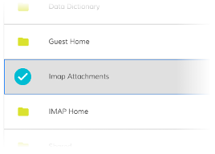
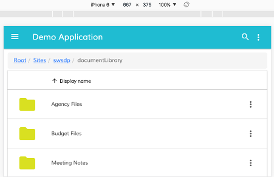

# DataColumn Component

Defines column properties for DataTable, Tasklist, Document List and other components.

<!-- markdown-toc start - Don't edit this section.  npm run toc to generate it-->

<!-- toc -->

- [Basic Usage](#basic-usage)
  * [Properties and events](#properties-and-events)
- [Details](#details)
  * [Automatic column header translation](#automatic-column-header-translation)
  * [Custom tooltips](#custom-tooltips)
  * [Column Template](#column-template)
  * [Styling Techniques](#styling-techniques)
    + [Custom icons for selected rows](#custom-icons-for-selected-rows)
    + [Hiding columns on small screens](#hiding-columns-on-small-screens)
- [See also](#see-also)

<!-- tocstop -->

<!-- markdown-toc end -->

## Basic Usage

```html
<adf-datatable [data]="data">
    <data-columns>
        <data-column key="icon" type="image" [sortable]="false"></data-column>
        <data-column key="id" title="Id"></data-column>
        <data-column key="createdOn" title="Created"></data-column>
        <data-column key="name" title="Name" class="full-width name-column"></data-column>
        <data-column key="createdBy.name" title="Created By"></data-column>
    </data-columns>
</adf-datatable>
```

### Properties and events

<!-- propsection start -->
See the documentation comments in the
[source file](../lib/core/data-column/data-column.component.ts)
for full descriptions of properties and events.
<!-- propsection end -->

## Details

### Automatic column header translation

You can use i18n resource keys with DataColumn `title` property.
The component will automatically check the corresponding i18n resources and fetch corresponding value.

```html
<data-column
    key="name"
    title="MY.RESOURCE.KEY">
</data-column>
```

This feature is optional. Regular text either plain or converted via the `translate` pipe will still be working as it was before.

### Custom tooltips

You can create custom tooltips for the table cells by providing a `formatTooltip` property with a tooltip formatter function when declaring a data column.

```html
<data-column
    title="Name"
    key="name"
    [formatTooltip]="getNodeNameTooltip"
    class="full-width ellipsis-cell">
</data-column>
```

And the code in this case will be similar to the following:

```ts
import { DataColumn, DataRow } from '@alfresco/adf-core';

@Component({...})
export class MyComponent {
    ...

    getNodeNameTooltip(row: DataRow, col: DataColumn): string {
        if (row) {
            return row.getValue('name');
        }
        return null;
    }
}
```

To disable the tooltip your function can return `null` or an empty string.

### Column Template

You can provide custom column/cell templates that may contain other Angular components or HTML elements:

Every cell in the DataTable component is bound to the dynamic data context containing the following properties:

| Name | Type | Description |
| --- | --- | --- |
| data | [DataTableAdapter](DataTableAdapter.md) | Data adapter instance. |
| row | [DataRow](DataTableAdapter.md) | Current data row instance.  |
| col | [DataColumn](DataTableAdapter.md) | Current data column instance. |

You can use all three properties to gain full access to underlying data from within your custom templates. 
In order to wire HTML templates with the data context you will need defining a variable that is bound to `$implicit` like shown below:

```html
<ng-template let-context="$implicit">
    <!-- template body -->
</ng-template>
```

The format of naming is `let-VARIABLE_NAME="$implicit"` where `VARIABLE_NAME` is the name of the variable you want to bind template data context to.

Getting a cell value from the underlying DataTableAdapter:

```ts
context.data.getValue(entry.row, entry.col);
```

You can retrieve all property values for underlying node, including nested properties (via property paths):

```ts
context.row.getValue('name')
context.row.getValue('createdByUser.displayName')
```

You may want using **row** api to get raw value access.

```html
<data-column title="Name" key="name" sortable="true" class="full-width ellipsis-cell">
    <ng-template let-context="$implicit">
        <span>Hi! {{context.row.getValue('createdByUser.displayName')}}</span>
        <span>Hi! {{context.row.getValue('name')}}</span>
    </ng-template>
</data-column>
```

Use **data** api to get values with post-processing, like datetime/icon conversion._

In the Example below we will prepend `Hi!` to each file and folder name in the list: 

```html
<data-column title="Name" key="name" sortable="true" class="full-width ellipsis-cell">
    <ng-template let-entry="$implicit">
        <span>Hi! {{entry.data.getValue(entry.row, entry.col)}}</span>
    </ng-template>
</data-column>
```

In the Example below we will integrate the [adf-tag-node-list](tag-node-list.component.md) component
with the document list.

```html
<data-column
    title="{{'DOCUMENT_LIST.COLUMNS.TAG' | translate}}"
    key="id"
    sortable="true"
    class="full-width ellipsis-cell">
    <ng-template let-entry="$implicit">
        <adf-tag-node-list  [nodeId]="entry.data.getValue(entry.row, entry.col)"></adf-tag-node-list>
    </ng-template>
</data-column>
```


### Styling Techniques

You can add a custom CSS class to a column using its `class` property. This is useful for
many purposes - some examples are given below.

#### Custom icons for selected rows
 
Custom styling can be used to change the look and feel of the icon for the selected rows.

Let's start by assigning an "image-table-cell" class to the thumbnail column:

```html
<adf-document-list ...>
    <data-columns>
        
        <data-column
            key="$thumbnail"
            type="image"
            [sortable]="false"
            class="image-table-cell">
        </data-column>
        
        ...
    </data-columns>
</adf-document-list>
```

Now your application can define styles to change the content of the column based on conditions such as the selection state:

```css
adf-document-list ::ng-deep adf-datatable > table > tbody > tr.is-selected > td.adf-data-table-cell.adf-data-table-cell--image.image-table-cell > div > div > mat-icon > svg {
    fill: #00bcd4;
}
```

Once your application starts you should see the following icon for each selected row:



#### Hiding columns on small screens

You can hide columns on small screens using custom CSS rules:

```css
@media all and (max-width: 768px) {

    alfresco-document-list ::ng-deep th.desktop-only .cell-value {
        display: none;
    }

    alfresco-document-list ::ng-deep td.desktop-only .cell-value {
        display: none;
    }
}
```

Now you can declare columns and assign `desktop-only` class where needed:

```html
<adf-document-list ...>
    <data-columns>
        
        <!-- always visible columns -->
        
        <data-column key="$thumbnail" type="image"></data-column>
        <data-column 
                title="Name" 
                key="name" 
                class="full-width ellipsis-cell">
        </data-column>
        
        <!-- desktop-only columns -->
        
        <data-column
                title="Created by"
                key="createdByUser.displayName"
                class="desktop-only">
        </data-column>
        <data-column
                title="Created on"
                key="createdAt"
                type="date"
                format="medium"
                class="desktop-only">
        </data-column>
    </data-columns>
</adf-document-list>
```

**Desktop View**


**Mobile View**



<!-- Don't edit the See also section. Edit seeAlsoGraph.json and run config/generateSeeAlso.js -->
<!-- seealso start -->
## See also

- [Document list component](document-list.component.md)
- [Datatable component](datatable.component.md)
- [Task list component](task-list.component.md)
<!-- seealso end -->