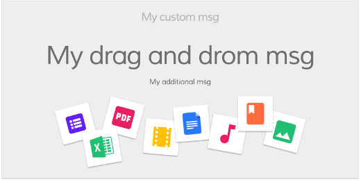

# DataTable component

Displays data as a table with customizable columns and presentation.


See it live: [DataTable Quickstart](https://embed.plnkr.co/80qr4YFBeHjLMdAV0F6l/)

<!-- markdown-toc start - Don't edit this section.  npm run toc to generate it-->

<!-- toc -->

- [Basic usage](#basic-usage)
  * [Properties](#properties)
  * [Events](#events)
- [Details](#details)
  * [Supplying data for the table](#supplying-data-for-the-table)
  * [Customizing columns](#customizing-columns)
  * [DataTable DOM Events](#datatable-dom-events)
  * [Custom Empty content template](#custom-empty-content-template)
  * [Loading content template](#loading-content-template)
  * [Events](#events-1)
    + [row-keyup DOM event](#row-keyup-dom-event)
    + [rowClick event](#rowclick-event)
    + [rowDblClick event](#rowdblclick-event)
    + [showRowContextMenu event](#showrowcontextmenu-event)
    + [showRowActionsMenu event](#showrowactionsmenu-event)
    + [executeRowAction event](#executerowaction-event)
- [See also](#see-also)

<!-- tocstop -->

<!-- markdown-toc end -->

## Basic usage

**app.component.html**

```html
<adf-datatable 
    [data]="data">
</adf-datatable>
```

**app.component.ts**

```ts
import { ObjectDataTableAdapter }  from '@alfresco/adf-core';

@Component({...})
export class DataTableDemo {
    data: ObjectDataTableAdapter;

    constructor() {
        this.data = new ObjectDataTableAdapter(
            // data
            [
                {id: 1, name: 'Name 1'},
                {id: 2, name: 'Name 2'}
            ],
            // schema
            [
                {
                    type: 'text',
                    key: 'id',
                    title: 'Id',
                    sortable: true
                },
                {
                    type: 'text',
                    key: 'name',
                    title: 'Name',
                    cssClass: 'full-width',
                    sortable: true
                }
            ]
        );
    }
}
```

You can also use HTML-based schema declaration like shown below:

```html
<adf-datatable [data]="data">
    <data-columns>
        <data-column key="icon" type="image" [sortable]="false"></data-column>
        <data-column key="id" title="Id"></data-column>
        <data-column key="createdOn" title="Created"></data-column>
        <data-column key="name" title="Name" class="full-width name-column"></data-column>
        <data-column key="createdBy.name" title="Created By"></data-column>
    </data-columns>
</adf-datatable>
```

```ts
import { ObjectDataTableAdapter } from '@alfresco/adf-core';

@Component({...})
export class DataTableDemo {
    data: ObjectDataTableAdapter;

    constructor() {
        this.data = new ObjectDataTableAdapter(
            // data
            [
                {
                    id: 1, 
                    name: 'Name 1', 
                    createdBy : { name: 'user'}, 
                    createdOn: 123, 
                    icon: 'http://example.com/img.png'
                },
                {
                    id: 2, 
                    name: 'Name 2', 
                    createdBy : { name: 'user 2'}, 
                    createdOn: 123, 
                    icon: 'http://example.com/img.png'
                }
            ]
        );
    }
}
```

### Properties

| Name | Type | Default | Description |
| --- | --- | --- | --- |
| selectionMode | string | 'single' | Row selection mode. Can be none, `single` or `multiple`. For `multiple` mode you can use Cmd (macOS) or Ctrl (Win) modifier key to toggle selection for multiple rows.  |
| rowStyle | string | | The inline style to apply to every row, see [NgStyle](https://angular.io/docs/ts/latest/api/common/index/NgStyle-directive.html) docs for more details and usage examples |
| rowStyleClass | string | | The CSS class to apply to every row |
| data | DataTableAdapter | instance of **ObjectDataTableAdapter** | data source |
| rows | Object[] | [] | The rows that the datatable should show |
| multiselect | boolean | false | Toggles multiple row selection, renders checkboxes at the beginning of each row |
| actions | boolean | false | Toggles data actions column |
| actionsPosition | string (left\|right) | right | Position of the actions dropdown menu. | 
| fallbackThumbnail | string |  | Fallback image for row where thumbnail is missing|
| contextMenu | boolean | false | Toggles custom context menu for the component |
| allowDropFiles | boolean | false | Toggle file drop support for rows (see **ng2-alfresco-core/UploadDirective** for more details) |
| loading | boolean | false | Flag that indicates if the datatable is in loading state and needs to show the loading template. Read the documentation above to see how to configure a loading template  |
| showHeader | boolean | true | Toggles header visibility |
| selection | DataRow[] | [] | Contains selected rows |

### Events

| Name | Description
| --- | --- |
| [rowClick](#rowclick-event) | Emitted when user clicks the row |
| [rowDblClick](#rowdblclick-event) | Emitted when user double-clicks the row |
| [showRowContextMenu](#showrowcontextmenu-event) | Emitted before context menu is displayed for a row |
| [showRowActionsMenu](#showrowactionsmenu-event) | Emitted before actions menu is displayed for a row |
| [executeRowAction](#executerowaction-event) | Emitted when row action is executed by user |

## Details

### Supplying data for the table

The column layout and row data are supplied to the table using an object that implements the
DataTableAdapter interface. This interface hides the internal details of the class that provides
the data, which gives a lot of flexibility in how the data can be stored and accessed. The DataTable
library includes a standard adapter class called ObjectDataTableAdapter that is useful for many
common uses. See the [DataTableAdapter](DataTableAdapter.md) for full details about the interface and
the ObjectDataTableAdapter class.

### Customizing columns

You can define custom HTML templates for columns and also add tooltips, automatic column title translation and other features. See the DataColumn component page for more information.

### DataTable DOM Events

Below are the DOM events raised by DataTable component.
These events bubble up the component tree and can be handled by any parent component.

| Name | Description |
| --- | --- |
| row-click | Raised when user clicks a row |
| row-dblclick | Raised when user double-clicks a row |
| row-select | Raised after user selects a row |
| row-unselect | Raised after user unselects a row |
| row-keyup | Raised on the 'keyup' event for the focused row.  |

For example:

```html
<root-component (row-click)="onRowClick($event)">
    <child-component>
        <adf-datatable></adf-datatable>
    </child-component>
</root-component>
```

```ts
onRowClick(event) {
    console.log(event);
}
```


### Custom Empty content template

You can add a template that will be shown when there are no results in your datatable:

```html
<adf-datatable
    [data]="data"
    [actions]="contentActions"
    [multiselect]="multiselect"
    (showRowContextMenu)="onShowRowContextMenu($event)"
    (showRowActionsMenu)="onShowRowActionsMenu($event)"
    (executeRowAction)="onExecuteRowAction($event)"
    (rowClick)="onRowClick($event)"
    (rowDblClick)="onRowDblClick($event)">
    
    
        <no-content-template>
            <!--Add your custom empty template here-->
            <ng-template>
                <h1>Sorry, no content</h1>
            </ng-template>
        </no-content-template>
        
</adf-datatable>
```

You can use the empty list component if you want to show the default ADF empty template.

You can use any HTML layout or Angular component as a content of the empty template section by using the special `<adf-empty-list-header>, <adf-empty-list-body>, <adf-empty-list-footer>` elements:

```html
<adf-datatable
    [data]="data"
    [actions]="contentActions"
    [multiselect]="multiselect"
    (showRowContextMenu)="onShowRowContextMenu($event)"
    (showRowActionsMenu)="onShowRowActionsMenu($event)"
    (executeRowAction)="onExecuteRowAction($event)"
    (rowClick)="onRowClick($event)"
    (rowDblClick)="onRowDblClick($event)">
        
        <adf-empty-list>
            <adf-empty-list-header>"'My custom Header'"</adf-empty-list-header>
            <adf-empty-list-body>"'My custom body'"</adf-empty-list-body>
            <adf-empty-list-footer>"'My custom footer'"</adf-empty-list-footer>
            <ng-content>"'HTML Layout'"</ng-content>
        </adf-empty-list>
        
</adf-datatable>
```

| Name | Type | Default | Description
| --- | --- | --- | --- |
| emptyListImageUrl | String | empty_doc_lib.svg | The default image used as background |
| emptyMsg | String | This list is empty | The default title message |
| dragDropMsg | String | Drag and drop | The default drag and drop message |
| additionalMsg | String | Drag and drop | The default additional message |



### Loading content template

You can add a template that will be shown during the loading of your data:

```html
<adf-datatable
    [data]="data"
    [actions]="contentActions"
    [multiselect]="multiselect"
    [loading]=isLoading()"
    (showRowContextMenu)="onShowRowContextMenu($event)"
    (showRowActionsMenu)="onShowRowActionsMenu($event)"
    (executeRowAction)="onExecuteRowAction($event)"
    (rowClick)="onRowClick($event)"
    (rowDblClick)="onRowDblClick($event)">
    
        <loading-content-template>
            <ng-template>
               <!--Add your custom loading template here-->
                <mat-progress-spinner
                    class="adf-document-list-loading-margin"
                    [color]="'primary'"
                    [mode]="'indeterminate'">
                </mat-progress-spinner>
            </ng-template>
        </loading-content-template>
        
</adf-datatable>
```

```js
    isLoading(): boolean {
        //your custom logic to identify if you are in a loading state 
    }
```

Note: the `<loading-content-template>` and `<no-content-template>` can be used together

### Events

#### row-keyup DOM event

Raised on the 'keyup' event for the focused row. 

This is an instance of the `CustomEvent` with the `details` property containing the following object:

```ts
row: DataRow,
keyboardEvent: KeyboardEvent,
sender: any
```

#### rowClick event

Emitted when user clicks a row.

Event properties:

```ts
sender: any     // DataTable instance 
value: DataRow, // row clicked
event: Event    // original HTML DOM event
```

Handler example:

```ts
onRowClicked(event: DataRowEvent) {
    console.log(event.value);
}
```

This event is cancellable, you can use `event.preventDefault()` to prevent default behaviour.

#### rowDblClick event

Emitted when user double-clicks a row.

Event properties:

```ts
sender: any     // DataTable instance 
value: DataRow, // row clicked
event: Event    // original HTML DOM event
```

Handler example:

```ts
onRowDblClicked(event: DataRowEvent) {
    console.log(event.value);
}
```

This event is cancellable, you can use `event.preventDefault()` to prevent default behaviour.

#### showRowContextMenu event

Emitted before context menu is displayed for a row.

Note that DataTable itself does not populate context menu items,
you can provide all necessary content via handler.

Event properties:

```ts
value: {
    row: DataRow,
    col: DataColumn,
    actions: []
}
```

Handler example:

```ts
onShowRowContextMenu(event: DataCellEvent) {
    event.value.actions = [
        { ... },
        { ... }
    ]
}
```

This event is cancellable, you can use `event.preventDefault()` to prevent default behaviour.

DataTable will automatically render provided menu items.

See the [ContextMenu](https://www.npmjs.com/package/ng2-alfresco-core)
documentation for more details on context actions format and behaviour.

#### showRowActionsMenu event

Emitted before actions menu is displayed for a row.
Requires `actions` property to be set to `true`.

Event properties:

```ts
value: {
    row: DataRow,
    action: any
}
```

Note that DataTable itself does not populate action menu items,
you can provide all necessary content via handler.

This event is cancellable, you can use `event.preventDefault()` to prevent default behaviour.

#### executeRowAction event

Emitted when a row action is executed by the user.

Usually accompanies `showRowActionsMenu` event. 
DataTable itself does not execute actions but provides support for external
integration. If there were actions provided with `showRowActionsMenu` event
then `executeRowAction` will be automatically executed when user clicks 
corresponding menu item.

```html
<adf-datatable
    [data]="data"
    [multiselect]="multiselect"
    [actions]="true"
    (showRowActionsMenu)="onShowRowActionsMenu($event)"
    (executeRowAction)="onExecuteRowAction($event)">
</adf-datatable>
```

```ts
import { DataCellEvent, DataRowActionEvent } from '@alfresco/adf-core';

onShowRowActionsMenu(event: DataCellEvent) {
    let myAction = {
        title: 'Hello'
        // your custom metadata needed for onExecuteRowAction
    };
    event.value.actions = [
        myAction
    ];
}

onExecuteRowAction(event: DataRowActionEvent) {
    let args = event.value;
    console.log(args.row);
    console.log(args.action);
    window.alert(`My custom action: ${args.action.title}`);
}
```


Developers are allowed to use any payloads as row actions.
The only requirement for the objects is having `title` property.

Once corresponding action is clicked in the dropdown menu DataTable invokes `executeRowAction` event
where you can handle the process, inspect the action payload and all custom properties defined earlier,
and do corresponding actions.

<!-- Don't edit the See also section. Edit seeAlsoGraph.json and run config/generateSeeAlso.js -->
<!-- seealso start -->
## See also

- [Data column component](data-column.component.md)
- [Pagination component](pagination.component.md)
- [DataTableAdapter](DataTableAdapter.md)
- [Document list component](document-list.component.md)
<!-- seealso end -->