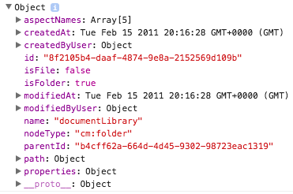
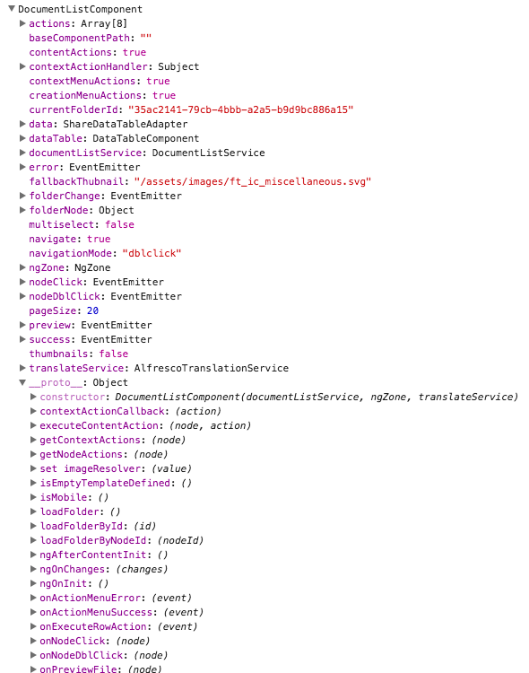
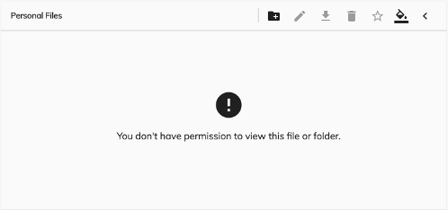

# Document List component

Displays the documents from a repository.

<!-- markdown-toc start - Don't edit this section.  npm run toc to generate it-->

<!-- toc -->

- [Basic Usage](#basic-usage)
  * [Properties](#properties)
  * [Events](#events)
- [Details](#details)
  * [DOM Events](#dom-events)
  * [Pagination strategy](#pagination-strategy)
  * [Data Sources](#data-sources)
    + [Node ID](#node-id)
    + [Repository aliases](#repository-aliases)
    + [DocumentList aliases](#documentlist-aliases)
  * [Setting default folder](#setting-default-folder)
  * [Calling DocumentList api directly](#calling-documentlist-api-directly)
  * [Underlying node object](#underlying-node-object)
  * [Custom columns](#custom-columns)
  * [Date Column](#date-column)
  * [Location Column](#location-column)
  * [Actions](#actions)
  * [Navigation mode](#navigation-mode)
- [Advanced usage and customization](#advanced-usage-and-customization)
  * [Custom row filter](#custom-row-filter)
  * [Custom image resolver](#custom-image-resolver)
  * [Custom 'empty folder' template](#custom-empty-folder-template)
- [See also](#see-also)

<!-- tocstop -->

<!-- markdown-toc end -->

## Basic Usage

```html
<adf-document-list
    #documentList
    [currentFolderId]="'-my-'"
    [contextMenuActions]="true"
    [contentActions]="true">
</adf-document-list>
```

### Properties

The properties currentFolderId, folderNode and node are the entry initialization properties of the document list. They cannot be used together, choose the one that suites more your use case.

| Name | Type | Default | Description |
| --- | --- | --- | --- |
| permissionsStyle | [PermissionStyleModel[]](permissions-style.model.md) | null | Define a set of CSS styles styles to apply depending on the permission of the user on that node. See the [Permission Style model](permissions-style.model.md) page for further details and examples. | 
| locationFormat | string | '/' | The default route for all the location-based columns (if declared). |
| navigate | boolean | true | Toggles navigation to folder content or file preview |
| navigationMode | string (click,dblclick) | dblclick | User interaction for folder navigation or file preview |
| thumbnails | boolean | false | Show document thumbnails rather than icons |
| selectionMode | string | 'single' | Row selection mode. Can be none, `single` or `multiple`. For `multiple` mode you can use Cmd (macOS) or Ctrl (Win) modifier key to toggle selection for multiple rows.  |
| multiselect | boolean | false | Toggles multiselect mode |
| contentActions | boolean | false | Toggles content actions for each row |
| contentActionsPosition | string (left\|right) | right | Position of the content actions dropdown menu. |
| contextMenuActions | boolean | false | Toggles context menus for each row |
| emptyFolderImageUrl | string | assets/images/empty_doc_lib.svg | Custom image for empty folder |
| allowDropFiles | boolean | false | Toggle file drop support for rows (see **ng2-alfresco-core/UploadDirective** for more details) |
| sorting | string[] | | Defines default sorting. The format is an array of 2 strings `[key, direction]` i.e. `['name', 'desc']` or `['name', 'asc']`. Set this value only if you want to override default sorting detected by the component based on columns. |
| rowStyle | string | | The inline style to apply to every row, see [NgStyle](https://angular.io/docs/ts/latest/api/common/index/NgStyle-directive.html) docs for more details and usage examples |
| rowStyleClass | string | | The CSS class to apply to every row |
| loading | boolean | false | Toggles the loading state and animated spinners for the component. Used in combination with `navigate=false` to perform custom navigation and loading state indication. |
| rowFilter | `RowFilter` | | Custom row filter, [see more](#custom-row-filter). |
| imageResolver | `ImageResolver` | | Custom image resolver, [see more](#custom-image-resolver). |
| currentFolderId | string | null | The ID of the folder node to display or a reserved string alias for special sources (see **Data Sources**) |
| folderNode | [MinimalNodeEntryEntity](https://github.com/Alfresco/alfresco-js-api/blob/master/src/alfresco-core-rest-api/docs/NodeMinimalEntry.md) | null | Currently displayed folder node | 
| node | [NodePaging](https://github.com/Alfresco/alfresco-js-api/blob/master/src/alfresco-core-rest-api/docs/NodePaging.md) | null | Document list will show all the nodes contained in the NodePaging entity  | 
| maxItems | number | Default value is stored into user preference settings | determine the size of the page for the element into document list |
| skipCount | number | 0 | element to skip over for pagination purpose |
| enableInfiniteScrolling | boolean | true | Enable documentlist to work into infinite scrolling mode |

### Events

| Name | Description |
| --- | --- |
| nodeClick | emitted when user clicks a list node |
| nodeDblClick | emitted when user double-clicks list node |
| folderChange | emitted once current display folder has changed |
| preview | emitted when user acts upon files with either single or double click (depends on `navigation-mode`), recommended for Viewer components integration  |
| permissionError | emitted when user is attempting to create a folder via action menu without having the permission to do it |
| ready | emitted when the documentList is ready and loads all the elements|
| error | emitted when API fails to get documentList data|

## Details

### DOM Events

Below are the DOM events the DocumentList component emits.
All of them are `bubbling`, meaning you can handle them in any component up the parent hierarchy, even if DocumentList is wrapped by another component(s).

| Name | Description |
| --- | --- |
| node-click | Raised when user clicks the node |
| node-dblclick | Raised when user double-clicks the node |
| node-select | Raised when user selects a node |
| node-unselect | Raised when user unselects a node |

Every event is represented by a [CustomEvent](https://developer.mozilla.org/en/docs/Web/API/CustomEvent) instance, having at least the following properties as part of the `Event.detail` property value:

```ts
{
    sender: DocumentListComponent,
    node: MinimalNodeEntity
}
```

Please refer to the [DataTable](datatable.component.md) documentation to find details about additional DOM events the DocumentList component bubbles up from the DataTable.

Below is a basic example of handling DOM events in the parent elements.

```html
<div (node-click)="onNodeClicked($event)" 
(node-dblclick)="onNodeDblClicked($event)">
    <div>
        <adf-upload-drag-area ...>
             <adf-document-list ...>
                ...
             </adf-document-list>
        </adf-upload-drag-area>
    </div>
</div>
```

### Data Sources

For the Document List data sources you can use one of the following options:

#### Node ID

The unique identifier of the Node. Gets automatically updated when you perform navigation to other folders.

#### Repository aliases

You can use one of the well-known reserved aliases:

- `-root-`
- `-shared-`
- `-my-`

#### DocumentList aliases

The DocumentList component also provides support for the following reserved aliases you can use:

- `-trashcan-`,
- `-sharedlinks-`
- `-sites-`
- `-mysites-`
- `-favorites-`
- `-recent-`

Note that due to specific origin of the data the sources above do not support navigation.
You may want handling single and double clicks yourself to perform navigation to other sources.

DocumentList component supports default presets for all the custom sources mentioned earlier.
If you don't provide any custom column definition utilizing "data-columns" component,
then a default preset will be automatically used at runtime.

Some of the presets use the Location columns that allow you to navigate to the parent folder of the node,
for instance navigating from the "Favorite" node to the folder containing it.
There's a possibility to set the default location format using "locationFormat" property, to avoid re-defining entire columns layout.

The default column layout for non-reserved views is:

- Icon
- Name
- Size
- Modified (date)
- Modified by

__Trashcan__

```html
<adf-document-list
    currentFolderId="-trashcan-"
    locationFormat="/files">
</adf-document-list>
```

Default layout:

- Icon
- Name
- Location
- Size
- Deleted
- Deleted by

__Shared Links__

```html
<adf-document-list
    currentFolderId="-sharedlinks-"
    locationFormat="/files">
</adf-document-list>
```

Default layout:

- Icon
- Name
- Location
- Size
- Modified
- Modified by
- Shared by

__Sites__

```html
<adf-document-list
    currentFolderId="-sites-">
</adf-document-list>
```

Default layout:

- Icon
- Title
- Status

__My Sites__

```html
<adf-document-list
    currentFolderId="-mysites-">
</adf-document-list>
```

Default layout:

- Icon
- Title
- Status

__Favorites__

```html
<adf-document-list
    currentFolderId="-favorites-"
    locationFormat="/files">
</adf-document-list>
```

Default layout:

- Icon
- Name
- Location
- Size
- Modified
- Modified by

__Recent Files__

```html
<adf-document-list
    currentFolderId="-recent-"
    locationFormat="/files">
</adf-document-list>
```

Default layout:

- Icon
- Name
- Location

### Setting default folder

You can set current folder path by assigning a value for `currentFolderId` property. 
It can be either one of the well-known locations as **-root-**, **-shared-** or **-my-** or a node ID (guid).

There may be scenarios when it is needed to set default path based on relative string value rather than node ID.
For example when folder name or path is static but its underlying ID is not (i.e. created manually by admin).
In this case you can use `alfresco-js-api` to get node details based on its relative path.

Let's try setting default folder to `/Sites/swsdp/documentLibrary` without knowing it's ID beforehand.
For the sake of simplicity example below shows only main points you may need to pay attention to:

```ts
import { ChangeDetectorRef } from '@angular/core';
import { AlfrescoApiService } from 'ng2-alfresco-core';

export class FilesComponent implements OnInit {

    currentFolderId: string = '-my-';

    constructor(private apiService: AlfrescoApiService,
                private changeDetector: ChangeDetectorRef) {
        // ...
    }

    ngOnInit() {
        let nodes: any = this.apiService.getInstance().nodes;
        nodes.getNodeInfo('-root-', {
            includeSource: true,
            include: ['path', 'properties'],
            relativePath: '/Sites/swsdp/documentLibrary'
        })
        .then(node => {
            console.log(node);
            this.currentFolderId = node.id;
            this.changeDetector.detectChanges();
        });
    }
}
```

We've added `console.log(node)` for the `getNodeInfo` callback just for study and debug purposes. 
It helps examining other valuable information you can have access to if needed:



**Important note**: for this particular scenario you must also trigger `changeDetector.detectChanges()` as in the example above. 

### Calling DocumentList api directly

Typically you will be binding DocumentList properties to your application/component class properties:

```html
<adf-document-list 
    [currentFolderId]="myStartFolder">
</adf-document-list>
```

with the underlying class being implemented similar to the following one:

```ts
@Component(...)
export class MyAppComponent {

    myStartFolder: string = '-my-';
    
}
```

However there may be scenarios that require you direct access to DocumentList apis. 
You can get reference to the DocumentList instance by means of Angular **Component Interaction** API.
See more details in [Parent calls a ViewChild](https://angular.io/docs/ts/latest/cookbook/component-communication.html#!#parent-to-view-child) 
section of the official docs.

Here's an example of getting reference:

```html
<adf-document-list 
    #documentList
    [currentFolderId]="myStartFolder">
</adf-document-list>
```

Note the `#documentList` ID we've just added to be able referencing this component later on.

```ts
import { ViewChild, AfterViewInit } from '@angular/core';
import { DocumentListComponent } from 'ng2-alfresco-documentlist';

@Component({...})
export class MyAppComponent implements AfterViewInit {

    myStartFolder: string = '-my-';
    
    @ViewChild(DocumentListComponent)
    documentList: DocumentListComponent;

    ngAfterViewInit() {
        console.log(this.documentList);
    }
}
```

Example above should produce the following browser console output:



Now you are able to access DocumentList properties or to call methods directly.

```ts
// print currently displayed folder node object to console
console.log(documentList.folderNode);
```

**Important note**:  
It is important accessing child components at least at the `AfterViewInit` state. 
Any UI click (buttons, links, etc.) event handlers are absolutely fine. This cannot be `ngOnInit` event though.
You can get more details in [Component lifecycle hooks](https://angular.io/docs/ts/latest/guide/lifecycle-hooks.html) article.

### Underlying node object

DocumentList component assigns an instance of `MinimalNode` type (`alfresco-js-api`) as a data context of each row.

```js
export interface MinimalNode {
    id: string;
    parentId: string;
    name: string;
    nodeType: string;
    isFolder: boolean;
    isFile: boolean;
    modifiedAt: Date;
    modifiedByUser: UserInfo;
    createdAt: Date;
    createdByUser: UserInfo;
    content: ContentInfo;
    path: PathInfoEntity;
    properties: NodeProperties;
}
```

_See more details in [alfresco-js-api](https://github.com/Alfresco/alfresco-js-api/blob/master/index.d.ts) repository._

Binding to nested properties is also supported. You can define a column key as a property path similar to the following:

```text
createdByUser.displayName
```

Here's a short example:

```html
<adf-document-list ...>
    <data-columns>
        <data-column key="$thumbnail" type="image"></data-column>
        <data-column title="Name" key="name" class="full-width ellipsis-cell"></data-column>
        <data-column
            title="Created By" 
            key="createdByUser.displayName">
        </data-column>
    </data-columns>
</adf-document-list>
```

### Custom columns

It is possible to reorder, extend or completely redefine data columns displayed by the component.
By default, special `$thumbnail` and `displayName` columns are rendered.

A custom set of columns can look like the following:

```html
<adf-document-list ...>
    <data-columns>
        <data-column key="$thumbnail" type="image"></data-column>
        <data-column
            title="Name" 
            key="name" 
            sortable="true"
            class="full-width ellipsis-cell">
        </data-column>
        <data-column
            title="Created By" 
            key="createdByUser.displayName"
            sortable="true"
            class="desktop-only">
        </data-column>
        <data-column
            title="Created On" 
            key="createdAt" 
            type="date" 
            format="medium"
            sortable="true"
            class="desktop-only">
        </data-column>
    </data-columns>
</adf-document-list>
```


You can also use HTML-based schema declaration used by DataTable, TaskList and other components:

```html
<adf-datatable [data]="data" ...>
    <data-columns>
        <data-column type="image" key="icon" [sortable]="false"></data-column>
        <data-column key="id" title="Id"></data-column>
        <data-column key="createdOn" title="Created"></data-column>
        <data-column key="name" title="Name" class="full-width name-column"></data-column>
        <data-column key="createdBy.name" title="Created By"></data-column>
    </data-columns>
</adf-datatable>
```

You can also add tooltips, styling, automatic column title translation and other features. See the [DataColumn component page](data-column.component.md) for more information about specifying and customizing columns.

### Date Column

For `date` column type the [DatePipe](https://angular.io/docs/ts/latest/api/common/DatePipe-class.html) formatting is used.
For a full list of available `format` values please refer to [DatePipe](https://angular.io/docs/ts/latest/api/common/DatePipe-class.html) documentation.

ADF also supports additional `timeAgo` value for the `format` property.
That triggers the date values to be rendered using popular ["Time from now"](https://momentjs.com/docs/#/displaying/fromnow/) format.

### Location Column

This column is used to display a clickable location link pointing to the parent path of the node.

**Important note**:

_For granular permissions, the Location Column may or may not render link location_

You are going to use it with custom navigation or when displaying content from the sources like:

- Sites
- My Sites
- Shared Links
- Recent Files
- Favorites
- Trashcan

or any other location that needs nagivating to the node parent folder easily.

Note that the parent node is evaluated automatically,
the generated link will be pointing to URL based on the `format` property value with the node `id` value appended:

```text
/<format>/:id
```

For example:

```html
<data-column
    key="path"
    type="location"
    format="/files"
    title="Location">
</data-column>
```

All links rendered in the column above will have an address mapped to `/files`:

```text
/files/node-1-id
/files/node-2-id
...
```

### Actions

You can add actions to a dropdown menu for each item shown in a Document List. Several
built-in actions are available (**delete**, **download**, **copy** and **move**) but
you can also define your own actions. See the [Content Action component](content-action.component.md)
for more information and examples.

You can also use the [Context Menu directive](context-menu.directive.md) from the 
[ADF Core](https://www.npmjs.com/package/ng2-alfresco-core) library to show the
actions you have defined in a context menu:

```ts
@Component({
    selector: 'my-view',
    template: `
        <adf-document-list>...</adf-document-list>
        <context-menu-holder></context-menu-holder>
    `
})
export class MyView {
}
```


This single extra line in the template enables context menu items for documents and folders.

### Navigation mode

By default DocumentList component uses 'double-click' mode for navigation.
That means user will see the contents of the folder by double-clicking its name
or icon (similar to Google Drive behaviour). However it is possible switching to 
other modes, like single-click navigation for example.
 
The following navigation modes are supported:

- **click**
- **dblclick**

The following example switches navigation to single clicks:

```html
<adf-document-list 
    [navigationMode]="'click'">
</adf-document-list>
```

## Advanced usage and customization

### Custom row filter

You can create a custom row filter implementation that returns `true` if row should be displayed or `false` to hide it.
Typical row filter implementation is a function that receives `ShareDataRow` as parameter:

```ts
myFilter(row: ShareDataRow): boolean {
    return true;
}
```

_Note that for the sake of simplicity the example code below was reduced to the main points of interest only._

**View1.component.html**

```html
<adf-document-list 
    [rowFilter]="folderFilter">
</adf-document-list>
```

**View1.component.ts**

```ts
import { RowFilter, ShareDataRow } from 'ng2-alfresco-documentlist';

export class View1 {

    folderFilter: RowFilter;

    constructor() {
    
        // This filter will make document list show only folders
        
        this.folderFilter = (row: ShareDataRow) => {
            let node = row.node.entry;
            
            if (node && node.isFolder) {
                return true;
            }
            
            return false;
        };
    }
}
```

### Custom image resolver

You can create a custom image resolver implementation and take full control over how folder/file icons and thumbnails 
are resolved and what document list should display. 

**Image resolvers are executed only for columns of the `image` type.**

Typical image resolver implementation is a function that receives `DataRow` and `DataColumn` as parameters:

```ts
myImageResolver(row: DataRow, col: DataColumn): string {
    return '/path/to/image';
}
```

Your function can return `null` or `false` values to fallback to default image resolving behavior.

_Note that for the sake of simplicity the example code below was reduced to the main points of interest only._

**View1.component.html**

```html
<adf-document-list 
    [imageResolver]="folderImageResolver">
    
    <data-columns>
        <data-column key="name" type="image"></data-column>
    </data-columns>
    
</adf-document-list>
```

**View1.component.ts**

```ts
import { DataColumn, DataRow } from 'ng2-alfresco-datatable';
import { ImageResolver } from 'ng2-alfresco-documentlist';

export class View1 {

    folderImageResolver: ImageResolver;
    
    constructor() {
        
        // Customize folder icons, leave file icons untouched
        
        this.folderImageResolver = (row: DataRow, col: DataColumn) => {
            let isFolder = <boolean> row.getValue('isFolder');
            if (isFolder) {
                
                // (optional) You may want dynamically getting the column value
                let name = row.getValue(col.key);
                
                // Format image url
                return `http://<my custom path to folder icon>/${name}`;
            }
            
            // For the rest of the cases just fallback to default behaviour.
            return null;
        };
        
    }

}
```

### Custom 'empty folder' template

By default DocumentList provides the following content for the empty folder:


This can be changed by means of the custom html template:

```html
<adf-document-list ...>
    <empty-folder-content>
        <ng-template>
            <h1>Sorry, no content here</h1>
        </ng-template>
    </empty-folder-content>
</adf-document-list>
```

That will give the following output:


### Custom 'permission denied' template

By default DocumentList provides the following content for permission denied:



This can be changed by means of the custom html template:

```html
<adf-document-list ...>
    <no-permission-content>
        <ng-template>
            <h1>You don't have permissions</h1>
        </ng-template>
    </no-permission-content>
</adf-document-list>
```

That will give the following output:


<!-- Don't edit the See also section. Edit seeAlsoGraph.json and run config/generateSeeAlso.js -->
<!-- seealso start -->
## See also

- [Datatable component](datatable.component.md)
- [Data column component](data-column.component.md)
- [Pagination component](pagination.component.md)
- [Sites dropdown component](sites-dropdown.component.md)
- [Metadata indicators](metadata-indicators.md)
- [Document library model](document-library.model.md)
- [Nodes api service](nodes-api.service.md)
- [Breadcrumb component](breadcrumb.component.md)
- [Content action component](content-action.component.md)
- [Dropdown breadcrumb component](dropdown-breadcrumb.component.md)
- [Permissions style model](permissions-style.model.md)
- [Version manager component](version-manager.component.md)
<!-- seealso end -->