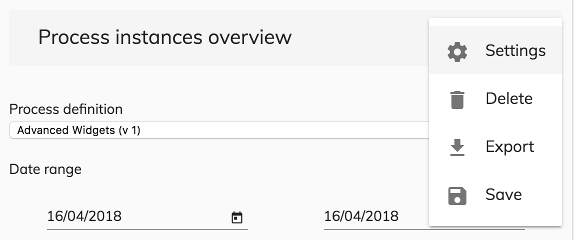

# Buttons Menu Component

Displays buttons on a responsive menu.

## Basic Usage

This component shows buttons on a responsive menu that changes depending on the device's screen.

```html
<adf-buttons-action-menu
    [buttons]="buttons">
</adf-buttons-action-menu>  
```
You will need to declare all the buttons that you want to have inside your menu in the parent component. 

```ts
buttons: MenuButton[] = [];

 setButtons() {
        this.buttons = [
            new MenuButton({
                label: 'Settings',
                icon: 'settings',
                handler: this.settings.bind(this)
            }),
            new MenuButton({
                label: 'Delete',
                icon: 'delete',
                handler: this.deleteItem.bind(this, this.reportId),
                id: 'delete-button'
            }),
            new MenuButton({
                label: 'Export',
                icon: 'file_download',
                handler: this.exportItem.bind(this),
                id: 'export-button',
                isVisible: this.isItemValid.bind(this)
            }),
            new MenuButton({
                label: 'Save',
                icon: 'save',
                handler: this.saveItem.bind(this),
                id: 'save-button',
                isVisible: this.isItemValid.bind(this)
            })
        ];
```

### Properties

| Name | Type | Description |
| --- | --- | -- |
| buttons | `MenuButton []` | The array that contains all the buttons for the menu |

## Details

This component uses [Angular Material](https://material.angular.io/) to style the menu.

Notice the usage of `isVisible` in the Export and Save buttons. You can automatically show/hide a button using the the `isVisible` property in the MenuButton model. In this case, these buttons are using a function in the parent component to decide when our buttons must be visible/hiden.

Desktop view of the menu


Mobile view of the menu


## See also

-   [MenuButton Model](./menu-button.model.md)
