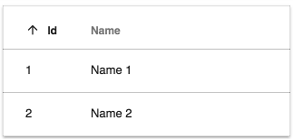
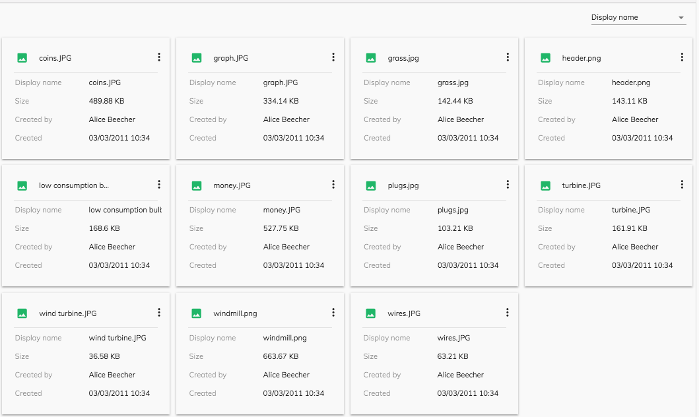
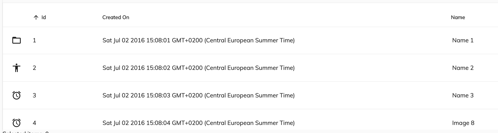
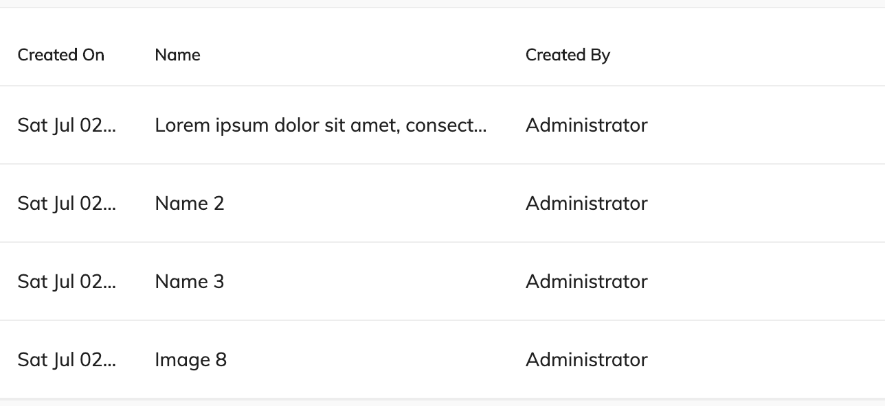
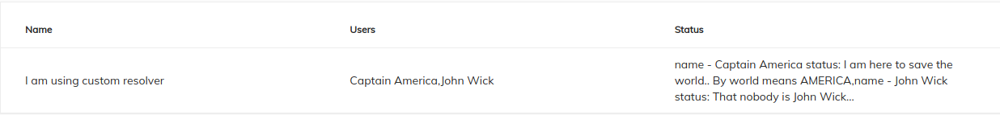

# [DataTable コンポーネント](../../../lib/core/datatable/components/datatable/datatable.component.ts "Defined in datatable.component.ts")

カスタマイズ可能な列とプレゼンテーションを含むテーブルとしてデータを表示します。



ライブで見る: [DataTable クイックスタート](https://embed.plnkr.co/80qr4YFBeHjLMdAV0F6l/)

## Contents

-   [基本的な使い方](#basic-usage)
    -   [行と列のスキーマの設定](#setting-the-rows-and-column-schema)
    -   [トランスクルージョン](#transclusions)
-   [クラスのメンバー](#class-members)
    -   [プロパティ](#properties)
    -   [イベント](#events)
-   [詳細](#details)
    -   [テーブルにデータを提供する](#supplying-data-for-the-table)
    -   [列のカスタマイズ](#customizing-columns)
    -   [DataTable DOM イベント](#datatable-dom-events)
    -   [カードビュー](#card-view)
    -   [イベントの使用](#using-events)
    -   [コンポーネントのスタイルをカスタマイズする](#customizing-the-components-styles)
-   [リゾルバ関数](#resolver-function)
-   [あわせて参照](#see-also)

## Basic usage

**app.component.html**

```html
<adf-datatable
 [data]="data">
</adf-datatable>
```

**app.component.ts**

```ts
import { ObjectDataTableAdapter }  from '@alfresco/adf-core';

@Component({...})
export class DataTableDemo {
    data: ObjectDataTableAdapter;

    constructor() {
        this.data = new ObjectDataTableAdapter(
            // data
            [
                {id: 1, name: 'Name 1'},
                {id: 2, name: 'Name 2'}
            ],
            // schema
            [
                {
                    type: 'text',
                    key: 'id',
                    title: 'Id',
                    sortable: true
                },
                {
                    type: 'text',
                    key: 'name',
                    title: 'Name',
                    cssClass: 'full-width',
                    sortable: true
                }
            ]
        );
    }
}
```

### Setting the rows and column schema

以下に示すように、[`ObjectDataTableAdapter`](../../../lib/core/datatable/data/object-datatable-adapter.ts) で行と列を設定できます。

```ts
import { ObjectDataTableAdapter }  from '@alfresco/adf-core';

@Component({...})
export class DataTableDemo {
    data: ObjectDataTableAdapter;

    constructor() {
        this.data = new ObjectDataTableAdapter(
            // data
            [
                {id: 1, name: 'Name 1'},
                {id: 2, name: 'Name 2'}
            ],
            // columns
            [
                {
                    type: 'text',
                    key: 'id',
                    title: 'Id',
                    sortable: true
                },
                {
                    type: 'text',
                    key: 'name',
                    title: 'Name',
                    cssClass: 'full-width',
                    sortable: true
                }
            ]
        );
    }
}
```

```html
<adf-datatable
    [data]="data">
</adf-datatable>
```

以下に示すように、行を設定し、HTML ベースのスキーマ宣言を使用することもできます。

```ts
import { ObjectDataTableAdapter }  from '@alfresco/adf-core';

@Component({...})
export class DataTableDemo {
    data: ObjectDataTableAdapter;

    constructor() {
        this.data = new ObjectDataTableAdapter(
            // data
            [
                {id: 1, name: 'Name 1'},
                {id: 2, name: 'Name 2'}
            ],
            []
        );
    }
}
```

```html
<adf-datatable [data]="data">
    <data-columns>
        <data-column key="icon" type="image" [sortable]="false"></data-column>
        <data-column key="id" title="Id"></data-column>
        <data-column key="createdOn" title="Created"></data-column>
        <data-column key="name" title="Name" class="full-width name-column"></data-column>
        <data-column key="createdBy.name" title="Created By"></data-column>
    </data-columns>
</adf-datatable>
```

[`ObjectDataTableAdapter`](../../../lib/core/datatable/data/object-datatable-adapter.ts) で行を設定し、次のように列を入力として設定することもできます。

```ts
import { ObjectDataTableAdapter }  from '@alfresco/adf-core';

@Component({...})
export class DataTableDemo {
    data: ObjectDataTableAdapter;
    schema: any;

    constructor() {
        this.data = new ObjectDataTableAdapter(
            // data
            [
                {id: 1, name: 'Name 1'},
                {id: 2, name: 'Name 2'}
            ],
            []
        );
        // columns
        this.schema =
            [
                {
                    type: 'text',
                    key: 'id',
                    title: 'Id',
                    sortable: true
                },
                {
                    type: 'text',
                    key: 'name',
                    title: 'Name',
                    sortable: true
                }
            ];
    }
}
```

```html
<adf-datatable
    [data]="data"
    [columns]="schema">
</adf-datatable>
```

以下に示すように、入力を介して行と列を設定することもできます:

```ts
import { ObjectDataTableAdapter }  from '@alfresco/adf-core';

@Component({...})
export class DataTableDemo {
    rows: any;
    schema: any;

    constructor() {
        // data
        this.rows =
            [
                {id: 1, name: 'Name 1'},
                {id: 2, name: 'Name 2'}
            ];
        // columns
        this.schema =
            [
                {
                    type: 'text',
                    key: 'id',
                    title: 'Id',
                    sortable: true
                },
                {
                    type: 'text',
                    key: 'name',
                    title: 'Name',
                    sortable: true
                }
            ];
    }
}
```

```html
<adf-datatable
    [rows]="rows"
    [columns]="schema">
</adf-datatable>
```

### [Transclusions](../../user-guide/transclusion.md)

[Data column コンポーネント](data-column.component.md) インスタンスを追加して、使用例および[列のカスタマイズ](#customizing-columns) セクションで説明されているように、テーブルの列を定義できます。

```html
<adf-datatable ...>
    <data-column>
        <!--Add your custom empty template here-->
        <ng-template>
            <div></div>
            <span> My custom value </span>
        </ng-template>
    </data-column>
</adf-datatable>
```

`<adf-no-content-template>` または [Empty list コンポーネント](empty-list.component.md) サブコンポーネントを提供して、
テーブルが空のときに表示することもできます。

```html
<adf-datatable ...>
    <adf-no-content-template>
        <!--ここにカスタムの空のテンプレートを追加します-->
        <ng-template>
            <h1>Sorry, no content</h1>
        </ng-template>
    </adf-no-content-template>
</adf-datatable>
```

```html
<adf-datatable ...>
    <adf-empty-list>
        <adf-empty-list-header>"'My custom Header'"</adf-empty-list-header>
        <adf-empty-list-body>"'My custom body'"</adf-empty-list-body>
        <adf-empty-list-footer>"'My custom footer'"</adf-empty-list-footer>
        <ng-content>"'HTML Layout'"</ng-content>
    </adf-empty-list>
</adf-datatable>
```

別の便利なトランスクルージョンは、`<adf-loading-content-template>` です。
これは、テーブルのデータのロード中に表示されます：

```html
<adf-datatable ...>
    <adf-loading-content-template>
        <ng-template>
            <!--ここにカスタムロードテンプレートを追加します-->
            <mat-progress-spinner
                class="adf-document-list-loading-margin"
                [color]="'primary'"
                [mode]="'indeterminate'">
            </mat-progress-spinner>
        </ng-template>
    </adf-loading-content-template>
</adf-datatable>
```

```js
    isLoading(): boolean {
        //ロード状態にあるかどうかを識別するカスタムロジック
    }
```

### Styling transcluded content

カスタムテンプレートを追加するときに、好きなようにスタイルを設定できます。ただし、すぐに使用できるように、データテーブルスタイルを列に適用する場合は、次の構造に従う必要があります。

```html
<adf-datatable ...>
    <data-column>
        <!--Add your custom empty template here-->
        <ng-template>
            <div class="adf-datatable-content-cell">
                <span class="adf-datatable-cell-value"> My custom value </span>
            </div>
        </ng-template>
    </data-column>
</adf-datatable>
```

これらの2つのクラスの上に注目してください。 その列に配置する値のコンテナに `adf-datatable-content-cell` を適用し、値自体に `adf-datatable-cell-value` を適用します。

これらの構造に従えば、`.adf-ellipsis-cell` などのクラスを適用できます。

同じデータテーブルで `<adf-no-content-template>` と `<adf-loading-content-template>`
の両方を一緒に使用できることに注意してください。

データテーブルのスタイル設定の詳細：[コンポーネントスタイルのカスタマイズ](#customizing-the-components-styles)

## Class members

### Properties

| 名前 | タイプ | デフォルト値 | 説明 |
| ---- | ---- | ------------- | ----------- |
| actions | `boolean` | FALSE | データアクション列を切り替えます。 |
| actionsPosition | `string` | right | アクションドロップダウンメニューの位置。 「左」または「右」することができます。 |
| allowDropFiles | `boolean` | FALSE | 行の切り替えのファイルドロップのサポート(詳細は[アップロードディレクティブ](upload.directive.md)を参照してください)。 |
| columns | `any[]` | \\[] | 列は、データテーブルが表示されること。 |
| contextMenu | `boolean` | FALSE | コンポーネントの切り替えカスタムコンテキストメニュー。 |
| data | [`DataTableAdapter`](../../../lib/core/datatable/data/datatable-adapter.ts) | | テーブルのデータソース |
| display | `string` | DisplayMode.List | テーブルの表示モードを選択します。 「リスト」や「ギャラリー」することができます。 |
| fallbackThumbnail | `string` | | サムネイルが欠落している行の代替画像。 |
| loading | `boolean` | FALSE | データテーブルのロードテンプレート(ロードテンプレートを設定する方法については、ドキュメントを参照)を表示するように負荷状態やニーズにあるかどうかを示すフラグ。 |
| multiselect | `boolean` | FALSE | 各行の先頭にチェックボックスを描画する複数の行選択を切り替えます。 |
| noPermission | `boolean` | FALSE | データテーブルは、「無断」テンプレートを表示するかどうかを示すフラグ。 |
| resolverFn | `Function` | null | 動的な列オブジェクトを解析するために使用されるカスタムリゾルバ機能はresolverFnを構成する方法については、ドキュメントを参照してください。 |
| rowMenuCacheEnabled | `boolean` | TRUE | 彼らが最初にロードされた後、行のアクションメニューの項目は、再利用のためにキャッシュされるべきか？ |
| rowStyle | `string` | | インラインスタイルは、すべての行に適用します。詳細および使用例については、[NgStyle(https://angular.jp/docs/ts/latest/api/common/index/NgStyle-directive.html)ドキュメントを参照。 |
| rowStyleClass | `string` | | すべての行に適用するCSSクラス。 |
| rows | `any[]` | \\[] | 行は、データテーブルが表示されること。 |
| selectionMode | `string` | single | 行選択モード。どれも `single` または `multiple` になることはできません。 `multiple`モードでは、あなたは、Cmdを(MacOSの)またはCtrlキー(ウィン)複数行のトグル選択に修飾キーを使用することができます。 |
| showHeader | `boolean` | TRUE | ヘッダを切り替えます。 |
| sorting | `any[]` | \\[] | データテーブルのソート順を定義します。可能な値は[`created`、`desc`]、[`created`、`asc`]、[`due`、`desc`]、[`due`、`asc`] |
| stickyHeader | `boolean` | FALSE | スティッキーヘッダーモードを切り替えます。 |

### Events

| 名前 | タイプ | 説明 |
| ---- | ---- | ----------- |
| executeRowAction | [`EventEmitter`](https://angular.jp/api/core/EventEmitter)`<`[`DataRowActionEvent`](../../../lib/core/datatable/components/datatable/data-row-action.event.ts)`>` | ユーザが行アクションを実行する際に放出されました。 |
| rowClick | [`EventEmitter`](https://angular.jp/api/core/EventEmitter)`<`[`DataRowEvent`](../../../lib/core/datatable/data/data-row-event.model.ts)`>` | ユーザが行をクリックしたときに出射されます。 |
| rowDblClick | [`EventEmitter`](https://angular.jp/api/core/EventEmitter)`<`[`DataRowEvent`](../../../lib/core/datatable/data/data-row-event.model.ts)`>` | ユーザが行をダブルクリックしたときに出射されます。 |
| showRowActionsMenu | [`EventEmitter`](https://angular.jp/api/core/EventEmitter)`<`[`DataCellEvent`](../../../lib/core/datatable/components/datatable/data-cell.event.ts)`>` | アクションメニューが行に表示される前に放出されます。 |
| showRowContextMenu | [`EventEmitter`](https://angular.jp/api/core/EventEmitter)`<`[`DataCellEvent`](../../../lib/core/datatable/components/datatable/data-cell.event.ts)`>` | コンテキストメニューが行に表示される前に放出されます。 |

## Details

### Supplying data for the table

列レイアウトと行データは、[`DataTableAdapter`](../../../lib/core/datatable/data/datatable-adapter.ts) インターフェイスを実装するオブジェクトを使用してテーブルに提供されます。
このインターフェイスは、データを提供するクラスの内部詳細を隠します。
これにより、データの格納およびアクセス方法に大きな柔軟性が与えられます。
DataTable ライブラリには、多くの一般的な場合に役立つ [`ObjectDataTableAdapter`](../../../lib/core/datatable/data/object-datatable-adapter.ts) と呼ばれる標準アダプタークラスが含まれています。
インターフェイスと [`ObjectDataTableAdapter`](../../../lib/core/datatable/data/object-datatable-adapter.ts) クラスの詳細については、[`DataTableAdapter`](../../../lib/core/datatable/data/datatable-adapter.ts) を参照してください。

### Customizing columns

列のカスタム HTML テンプレートを定義し、ツールチップ、自動列タイトル変換、その他の機能を追加することもできます。
詳細については、[Data Column コンポーネント](data-column.component.md) ページを参照してください。

### DataTable DOM Events

以下は、DataTable コンポーネントによって発行される DOM イベントです。
これらのイベントはコンポーネントツリーをバブルアップし、任意の親コンポーネントによって処理できます。

| 名前 | 説明 |
| ---- | ----------- |
| row-click | ユーザが行をクリックしたときに発生 |
| row-dblclick | ユーザが行をダブルクリックしたときに発生 |
| row-select | ユーザが行を選択した後に発生 |
| row-unselect | ユーザが行を選択解除した後に発生 |
| row-keyup | 選択した行から 'keyup' イベントを発生 |
| sorting-changed | ユーザがソート可能な列ヘッダーをクリックしたに発生 |
| header-dragover | ヘッダ上にコンテンツをドラッグするときに発生 |
| header-drop | データは、列ヘッダにドロップされた場合に発生 |
| cell-dragover | セル上にデータをドラッグする場合に発生 |
| cell-drop | データが列のセルにドロップされたときに発生 |

#### Drop Events

`drop` 処理に関連するすべてのカスタム DOM イベントは、次のインターフェイスを公開します。

```ts
export interface DataTableDropEvent {
    detail: {
        target: 'cell' | 'header';
        event: Event;
        column: DataColumn;
        row?: DataRow
    };

    preventDefault(): void;
}
```

`event` は元の `drop` イベントであり、
`row` はヘッダーイベントでは使用できないことに注意してください。

[HTML 5 ドラッグ＆ドロップ API](https://developer.mozilla.org/ja/docs/Web/API/HTML_Drag_and_Drop_API) によると、
ドロップを正しく処理するには、`dragover` イベントと `drop` イベントの両方を処理する必要があります。

DataTable がバブル DOM イベントを発生させる場合、親要素からのドロップ動作も処理できます。

```html
<div
    (header-dragover)="onDragOver($event)"
    (header-drop)="onDrop($event)"
    (cell-dragover)="onDragOver($event)"
    (cell-drop)="onDrop($event)">

    <adf-datatable [data]="data">
    </adf-datatable>
</div>
```

ハンドラーの実装は次のようになります:

```ts
onDragOver(event: CustomEvent) {
    // カスタムドロップハンドラーには常に必要 (!)
    event.preventDefault();
}

onDrop(event: DataTableDropEvent) {
    event.preventDefault();

    const { column, row, target } = event.detail;
    // 処理の詳細
}
```

#### Example

```html
<root-component (row-click)="onRowClick($event)">
    <child-component>
        <adf-datatable></adf-datatable>
    </child-component>
</root-component>
```

```ts
onRowClick(event) {
    console.log(event);
}
```


### Card view

`display` プロパティを "gallery" に設定して、カードビューモードを有効にします。

```html
<adf-datatable
    [data]="data"
    [display]="'gallery'">
</adf-datatable
```



### Using events

#### row-keyup DOM event

フォーカスされた行の 'keyup' イベントで発生します。

これは、次のオブジェクトを含む `details` プロパティを持つ `CustomEvent` のインスタンスです。

```ts
row: DataRow,
keyboardEvent: KeyboardEvent,
sender: any
```

#### rowClick event

ユーザーが行をクリックすると生成されます。

Event プロパティ:

```ts
sender: any     // DataTable インスタンス
value: DataRow, // クリックされた行
event: Event    // オリジナルの HTML DOM イベント
```

Handler の例:

```ts
onRowClicked(event: DataRowEvent) {
    console.log(event.value);
}
```

このイベントはキャンセルできます。デフォルトの動作を防ぐために、`event.preventDefault()` を使用できます。

#### rowDblClick event

ユーザーが行をダブルクリックすると発生します。

Event プロパティ:

```ts
sender: any     // DataTable インスタンス
value: DataRow, // クリックされた行
event: Event    // オリジナル HTML DOM イベント
```

Handler の例:

```ts
onRowDblClicked(event: DataRowEvent) {
    console.log(event.value);
}
```

このイベントはキャンセルできます。デフォルトの動作を防ぐために、`event.preventDefault()` を使用できます。

#### showRowContextMenu event

行のコンテキストメニューが表示される前に生成されます。

DataTable　自体は、コンテキストメニューに項目を表示しないことに注意してください。
ハンドラーを介して必要なすべてのコンテンツを提供できます。

Event プロパティ:

```ts
value: {
    row: DataRow,
    col: DataColumn,
    actions: []
}
```

Handler の例:

```ts
onShowRowContextMenu(event: DataCellEvent) {
    event.value.actions = [
        { ... },
        { ... }
    ]
}
```

このイベントはキャンセルできます。デフォルトの動作を防ぐために、`event.preventDefault()` を使用できます。

DataTable は、提供されたメニュー項目を自動的にレンダリングします。

コンテキストアクションの形式と動作の詳細については、
[ContextMenu](https://www.npmjs.com/package/ng2-alfresco-core) のドキュメントを参照してください。

#### showRowActionsMenu event

行のアクションメニューが表示される前に生成されます。
`actions` プロパティを `true` に設定する必要があります。

Event プロパティ:

```ts
value: {
    row: DataRow,
    action: any
}
```

DataTable　自体はアクションメニューに項目を設定しないことに注意してください。
ハンドラーを介して必要なすべてのコンテンツを提供できます。

このイベントはキャンセルできます。`event.preventDefault()` を使用して、デフォルトの動作を防ぐことができます。

#### executeRowAction event

ユーザーが行アクションを実行すると生成されます。

通常、これには `showRowActionsMenu` イベントが伴います。
DataTable 自体はアクションを実行しませんが、
外部統合のサポートを提供します。
`showRowActionsMenu` イベントを使用してアクションが提供される場合、
ユーザーが対応するメニュー項目をクリックすると、`executeRowAction` が自動的に実行されます。

```html
<adf-datatable
    [data]="data"
    [multiselect]="multiselect"
    [actions]="true"
    (showRowActionsMenu)="onShowRowActionsMenu($event)"
    (executeRowAction)="onExecuteRowAction($event)">
</adf-datatable>
```

```ts
import { DataCellEvent, DataRowActionEvent } from '@alfresco/adf-core';

onShowRowActionsMenu(event: DataCellEvent) {
    let myAction = {
        title: 'Hello'
        // onExecuteRowAction に必要なカスタムメタデータ
    };
    event.value.actions = [
        myAction
    ];
}

onExecuteRowAction(event: DataRowActionEvent) {
    let args = event.value;
    console.log(args.row);
    console.log(args.action);
    window.alert(`My custom action: ${args.action.title}`);
}
```


行アクションに任意のペイロードを使用できます。
オブジェクトの唯一の要件は、オブジェクトに `title` プロパティが必要であることです。

ドロップダウンメニューでアクションが選択されると、DataTable は `executeRowAction` イベントを呼び出します。
これを使用して、レスポンスを処理し、アクションペイロード (および以前に定義されたすべてのカスタムプロパティ) を検査し、
対応するアクションを実行します。

### Customizing the component's styles

datatable コンポーネントはそのまま使用できますが、
次のセクションで説明するように、
ニーズに合わせてスタイルをカスタマイズできます。

#### Truncated text

デフォルトでは、以下に示すように、セルのコンテンツはラップされているため、内部のすべてのデータを確認できます。


ただし、目的の列の `adf-ellipsis-cell` クラスを使用して、これらのセル内のテキストを切り捨てることもできます。

```js
{
    type: 'text',
    key: 'createdOn',
    title: 'Created On',
    sortable: true,
    cssClass: 'adf-ellipsis-cell'
}
```


#### Expanded cells

このコンポーネントは柔軟なレイアウトを使用します。
デフォルトでは、すべてのセルのセマンティックの重要性は同じであると想定されているため、すべてのセルの幅は同じです。
列の相対的な幅を変えるために使用できる CSS クラスの定義済みセットを提供します。

クラスの名前は `adf-expand-cell-X` で、`adf-expand-cell-1` から `adf-expand-cell-5` になります。
クラス内の数字が大きいほど、列は広くなります。
これらのクラスを使用して、必要に応じて列幅を変更します。



#### No-growing cells

前述のように、すべてのセルの幅は最初は同じです。
`adf-no-grow-cell` クラスを使用して、セルの成長を防ぐことができます。

```js
{
    type: 'date',
    key: 'created',
    title: 'Created On',
    cssClass: 'adf-ellipsis-cell adf-no-grow-cell'
}
```

このクラスは `adf-ellipsis-cell` と互換性があり、そのため `min-width` が `100px` であることに注意してください。ニーズに合わせて、カスタムクラスでこのプロパティをオーバーライドできます。



#### Combining classes

上記の CSS クラスを組み合わせて、必要に応じてテーブルをカスタマイズできます。

```js
{
    type: 'text',
    key: 'name',
    title: 'Name',
    cssClass: 'adf-ellipsis-cell adf-expand-cell-3'
}
```

#### Sticky header

多くの行を持つ長いテーブルがある場合、ヘッダーが常に表示されるようにヘッダーを適切に修正することができます。
これは、次の手順を使用して実行できます。

まず、データテーブルの `stickyHeader` プロパティを `true`に設定します。

```html
<adf-datatable
    [data]="data"
    [stickyHeader]="true">
</adf-datatable>
```

次に、親のコンテナにデータテーブルの高さを設定して、データテーブルがそれに適応するようにします (以下の例では `height: 300px;`)。
また、親の [`overflow-y`](https://developer.mozilla.org/ja/docs/Web/CSS/overflow-y) 属性を `auto` に設定する必要があります。
これにより、すべての行の合計の高さが親要素の固定の高さを超えたときにリストをスクロールできます。

```html
<div style="height: 300px; overflow-y: auto;">
    <adf-datatable
        [data]="data"
        [stickyHeader]="'true'">
    </adf-datatable>
</div>
```

設定すると、スティッキーヘッダーは次の画像のように動作します。


## Resolver Function

複雑なオブジェクトを含むテーブルがある場合、表示する前に解析することをお勧めします。次の手順を使用してこれを行うことができます。

# what is resolver

リゾルバは、各行と列で実行される純粋な関数です。

# purpose

データテーブル内の複雑なオブジェクトを解析するのに役立ちます。

# example

2つのプロパティをマージして、テキスト形式で表示するとします。

```json
                {
                    name: 'I am using custom resolver',
                    users: [
                        {
                            firstName: 'Captain',
                            lastName: 'America'
                        },
                        {
                            firstName: 'John',
                            lastName: 'Wick'
                        }
                    ],
                    status: [
                        'I am here to save the world.. By world means AMERICA',
                        'That nobody is John Wick…'
                    ]
                }
```

ここにユーザーのプロパティとステータスをマージするサンプルリゾルバーがあり、1つの列に表示されます

```javascript
    resolver(row: DataRow, col: DataColumn): any {
        const value = row.getValue(col.key);

        // Desired parsing logic
        if (col.key === 'status') {
            const users = row.getValue('users');
            return (value || []).map((status, index) => `name - ${users[index].firstName} ${users[index].lastName} status: ${status}` ).toString();
        }

        return value;
    }
```

```html
    <adf-datatable
        [data]="data"
        [resolverFn]="resolver">
        <data-columns>
            <data-column type="text" key="name" title="Name"></data-column>
            <data-column type="text" key="users" title="Users"></data-column>
            <data-column type="text" key="status" title="Status"></data-column>
        </data-columns>
    </adf-datatable>
```

 

## See also

-   [Data column コンポーネント](data-column.component.md)
-   [Pagination コンポーネント](pagination.component.md)
-   [Data Table Adapter インターフェース](../interfaces/datatable-adapter.interface.md)
-   [Document list コンポーネント](../../content-services/components/document-list.component.md)
