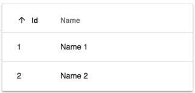

# [DataTableAdapter インターフェース](../../../lib/core/datatable/data/datatable-adapter.ts "Defined in datatable-adapter.ts")

[DataTable](../components/datatable.component.md) および [Tasklist](../../process-services/components/task-list.component.md) コンポーネントにテーブルデータを提供する方法を定義します。

## プロパティ

| 名前 | タイプ | 説明 |
| ---- | ---- | ----------- |
| selectedRow | [`DataRow`](../../../lib/core/datatable/data/data-row.model.ts) | 現在選択されている行のデータ。 |

## イベント

| 名前 | タイプ | 説明 |
| ---- | ---- | ----------- |
| rowsChanged | [`Subject<Array<DataRow>>`](../../../lib/core/datatable/data/data-row.model.ts) | データアダプターが新しい行を取得したときに発生します。 |

## メソッド

[`getRows(): Array<DataRow>;`](../../../lib/core/datatable/data/data-row.model.ts)<br/>
[`setRows(rows: Array<DataRow>): void;`](../../../lib/core/datatable/data/data-row.model.ts)<br/>
行の配列を使用して、テーブルに表示する値を取得/設定します。

[`getColumns(): Array<DataColumn>;`](../../../lib/core/datatable/data/data-column.model.ts)<br/>
[`setColumns(columns: Array<DataColumn>): void;`](../../../lib/core/datatable/data/data-column.model.ts)<br/>
列仕様の配列を取得/設定します。

`getValue(row:`[`DataRow,`](../../../lib/core/datatable/data/data-row.model.ts)`col: DataColumn): any;`<br/>
特定のテーブルセルからデータ値を取得します。

`getSorting():`[`DataSorting`](../../../lib/core/datatable/data/data-sorting.model.ts)`;`<br/>
`setSorting(sorting: DataSorting): void;`<br/>
ソートキーと方向 (昇順または降順) を取得/設定します。

`sort(key?: string, direction?: string): void;`<br/>
指定されたキーと方向 (昇順または降順) でテーブルを並べ替えます。

## 詳細

[`DataTableAdapter`](../../../lib/core/datatable/data/datatable-adapter.ts) を独自のクラスに実装して、[DataTable](../components/datatable.component.md) および [Tasklist](../../process-services/components/task-list.component.md) コンポーネントでデータを表示できます。
このインターフェイスは (列および行データの他のインターフェイスとともに) クラスの詳細を呼び出し元から隠しますので、好きなように内部的にデータを保存できます。
DataTable ライブラリは、Datatable コンポーネントの標準アダプターである [`ObjectDataTableAdapter`](../../../lib/core/datatable/data/object-datatable-adapter.ts) クラスのインターフェイスを実装します。

[`DataTableAdapter`](../../../lib/core/datatable/data/datatable-adapter.ts) の基本的な考え方は、呼び出し側がクラスに列定義オブジェクトの配列を返すように要求できるということです。
これらの各オブジェクトは、単一の列の一意のキー、名前、タイプ、およびその他のプロパティを指定します。

呼び出し元は、行オブジェクトの配列としてテーブルのデータ値を要求することもできます。呼び出し元は、指定された列からデータを返す `getValue` メソッドを使用して行のデータにアクセスします。この列は、列の定義中に設定された一意のキーによって識別されます。

呼び出し側が [`DataTableAdapter`](../../../lib/core/datatable/data/datatable-adapter.ts) クラスにデータを設定する必要がある場合、データの非表示は逆に機能します。
呼び出し側のストレージの内部詳細は、列と行のインターフェースによって隠されます。
アダプタで `setColumns` メソッドと `setRows` メソッドが呼び出されると、受信した列/行オブジェクトにクエリを実行し、データを独自の形式で保存できます。

### 列と行

列は [`DataColumn`](../../../lib/core/datatable/data/data-column.model.ts) インターフェースによって定義されます：

```ts
interface DataColumn {
    key: string;
    type: string;
    format?: string;
    sortable?: boolean;
    title?: string;
    srTitle?: string;
    cssClass?: string;
    template?: TemplateRef<any>;
    formatTooltip?: Function;
    focus?: boolean;
}
```

これらのオブジェクトの配列は、`setColumns` メソッドが呼び出されたときにオブジェクトに渡されます。`key` プロパティは列を識別するために使用されるため、各列のキーは一意でなければなりません。`type` 文字列は 'text'、'image' または 'date' の値を持つことができます。

[`DataRow`](../../../lib/core/datatable/data/data-row.model.ts) オブジェクトの配列は、`setRows` メソッドが呼び出されたときにオブジェクトに渡されます。

```ts
interface DataRow {
    isSelected: boolean;
    isDropTarget?: boolean;
    cssClass?: string;
    hasValue(key: string): boolean;
    getValue(key: string): any;
}
```

各行には値のセットが含まれます。セット内のアイテムは、キー (列の説明で指定) を `getValue` メソッドに渡すことで取得されます。その結果、キーを使用して適切なアイテムを取得できる限り、行は特定の順序または形式でデータアイテムを格納する必要がありません。

### ObjectDataTableAdapter

DataTable ライブラリは、[`ObjectDataTableAdapter`](../../../lib/core/datatable/data/object-datatable-adapter.ts) と呼ばれる [DataTableAdapter,](../../../lib/core/datatable/data/datatable-adapter.ts) の実装を提供します。これは、オブジェクト配列にバインドし、オブジェクトフィールドを列に変換する単純なアダプターです。

```ts
let data = new ObjectDataTableAdapter(
    // 行データ
    [
        { id: 1, name: 'Name 1' },
        { id: 2, name: 'Name 2' }
    ],
    // 列スキーマ
    [
        { 
            type: 'text', 
            key: 'id', 
            title: 'Id', 
            sortable: true 
        },
        {
            type: 'text', 
            key: 'name', 
            title: 'Name', 
            sortable: true
        }
    ]
);
```



列配列を指定しない場合、コンストラクターは行オブジェクトの構造から列のレイアウトを推測します。
フィールド名 (以下の例では'id' と 'name') は、
列の `key` と `title` の両方のプロパティに使用されます。

```ts
let data =  [
    { id: 2, name: 'abs' },
    { id: 1, name: 'xyz' }
];

let schema = ObjectDataTableAdapter.generateSchema(data);

/*自動生成された列のスキーマ:
[
    { 
        type: 'text', 
        key: 'id', 
        title: 'Id', 
        sortable: false 
    },
    {
        type: 'text', 
        key: 'name', 
        title: 'Name', 
        sortable: false
    }
] 
*/
```

## あわせて参照

-   [Datatable コンポーネント](../components/datatable.component.md)
-   [Task list コンポーネント](../../process-services/components/task-list.component.md)
