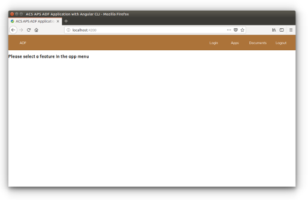

# 基本的なテーマ

このチュートリアルでは、CSS を変更して ADF アプリのテーマを設定する方法を説明します。

[テーマ設定に関するユーザーガイドページ]（../user-guide/theming.md）で詳しく説明されているように、ADF アプリケーションで使用される [Cascading Style Sheets](https://ja.wikipedia.org/wiki/Cascading_Style_Sheets) を簡単にカスタマイズできます。このチュートリアルの焦点は [Yeoman を使用して構築された ADF アプリ](./creating-the-app-using-yeoman.md) ですが、同じ原則を使用して、ADF アプリケーションのテーマをカスタマイズできます。

## `adf-core` テーマについて

[テーマ設定に関するユーザーガイド](../user-guide/theming.md) に記載されているように、*プライマリ*、*アクセント*、*警告*のパレットセットを定義する `src/custom-style.scss` ファイルですべてが行われます。さまざまなタイプのパレットの詳細については、[テーマ設定に関するユーザーガイド](../user-guide/theming.md)を確認してください。

`css` ファイルで直接確認できるように、パレットのセットは、以下で説明するように、ソースコードで使用されるいくつかの定義済み変数を使用して設定されます。

    $primary: mat-palette($alfresco-accent-orange);
    $accent:  mat-palette($alfresco-accent-purple);
    $warn:    mat-palette($alfresco-warn);

`mat-palette` 関数は、色のコレクションから [Material Design](https://material.io/design/introduction/) パレットを定義するために使用されます。`$alfresco-ecm-cyan`、`$alfresco-accent-purple`、および `$alfresco-warn` は、プロジェクト内でローカルに宣言されて、アプリケーションで使用されます。

ご想像のとおり、`mat-palette` 関数のパラメーターを変更すると、アプリケーション全体の色が一緒に変更されます。

アプリケーションのパレットのセットを含む利用可能な変数はすべて、`node_modules/@alfresco/adf-core/_theming.css` ファイルにあります。そのファイルには次のものがあります。

 - `$alfresco-ecm-cyan`
 - `$alfresco-dev-teal`
 - `$alfresco-ecm-blue`
 - `$alfresco-bpm-green`
 - `$alfresco-warn`
 - `$alfresco-accent-purple`
 - `$alfresco-accent-orange`

`_theming.css` ファイルをチェックして、最新の変更と変数の構造化と定義方法を確認してください。

## アプリケーションのパレットを変更する

例として、原色のパレットのセットを変更しましょう。`src/custom-style.scss` ファイルで、`$primary` 定義を次のように変更します。

    $primary: mat-palette($alfresco-ecm-blue);

完了したら、`custom-style.scss` ファイルを保存すると、アプリケーションがさまざまな色で更新されます。これですべてです。

## 独自のパレットを開発する

場合によっては、より「カスタマイズ」したいことがあります。また、アプリケーションに適した色を選択することもできます。この場合、ローカル変数で独自のパレットを開発し、それをプライマリ、アクセント、または警告パレットとして使用するだけです。

例として、`src/custom-style.scss` ファイルを編集して、`$primary` 変数の定義の直前に次のソースコードを追加しましょう。

    $my-own-brown: (
        50: #f9f2ec,
        100: #ecd9c6,
        200: #dfbf9f,
        300: #d2a679,
        400: #c68c53,
        500: #ac7339,
        600: #86592d,
        700: #604020,
        800: #392613,
        900: #130d06,
        A100: #e6ccb3,
        A200: #cc9966,
        A400: #996633,
        A700: #4d3319,
        contrast: (
            50: $black-87-opacity,
            100: $black-87-opacity,
            200: $black-87-opacity,
            300: $black-87-opacity,
            400: $black-87-opacity,
            500: white,
            600: white,
            700: white,
            800: $white-87-opacity,
            900: $white-87-opacity,
            A100: $black-87-opacity,
            A200: white,
            A400: white,
            A700: white,
        )
    );

これが完了したら、次のように `$primary` 定義を置き換え、`custom-style.scss` ファイルを保存します:

    $primary: mat-palette($my-own-brown);

数秒後、上部のメニューに異なる色でアプリケーションが更新されます。 次のスクリーンショットでは、新しいパレットの外観を確認できます。

