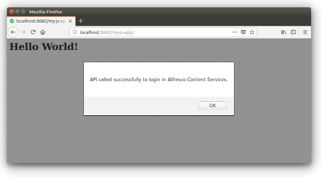

# Alfresco JavaScript アプリケーションの作成

このチュートリアルでは、Alfresco とやり取りするために JavaScript でアプリケーションを最初から作成する方法を学びます。

これは「開始」タスクであり、Alfresco Content Services または Alfresco Process Services の上で独自の JavaScript アプリケーションの開発を開始できるようにする必要があります。

このチュートリアルでは、デモ目的で Alfresco Content Services を使用しますが、
Alfresco Process Services での開発もまったく同じ原則に従います。

**メモ:** Alfresco Content Services と Alfresco Process Services を一緒に開発できますが、
[CORS](https://en.wikipedia.org/wiki/Cross-origin_resource_sharing) によって導入された唯一の制限があります。
両方のサービス用に開発する場合は、
最初にアプリケーションをプロキシする必要があります。

## 前提条件

このチュートリアルの唯一の前提条件は、Docker コンテナ内の Alfresco Content Services のインスタンスが利用可能であることです。
[Docker](https://www.docker.com/) はデプロイメントの唯一のオプションではありませんが、そのシンプルさにより、環境設定の開発により集中できます。

Alfresco Content Services のインスタンスがセットアップおよび実行されていない場合は、
[開発環境の準備](./preparing-environment.md)を参照して、
セットアップ方法を学習してください。

要求された [`Node`](https://github.com/Alfresco/alfresco-js-api/blob/development/src/api/content-rest-api/docs/Node.md) ライブラリをダウンロードするには、
`npm` クライアントが必要になります (開発環境の準備でも説明されています)。

## JavaScript アプリケーションの作成

[`alfresco-js-api`](https://github.com/Alfresco/alfresco-js-api) Alfresco Content Services インスタンスが `http://localhost:8082/alfresco` で稼働していると仮定して、JavaScript アプリケーションをゼロから開発する方法を見てみましょう。
JavaScript アプリケーションは、[`alfresco-js-api`](https://github.com/Alfresco/alfresco-js-api) ライブラリを使用して、Alfresco バックエンドサービスと対話できます。
このライブラリは、「フレームワークに依存しない」ため、
必ずしも Angular アプリケーションで使用する必要はありません。

ソースコードの開発を開始する前に、
JavaScript アプリケーション全体を含む `my-js-app` というローカルフォルダーを作成します。

### `index.html` ファイルの作成

`my-js-app` フォルダー内で、次のコンテンツを含む `index.html` ファイルを作成します。

```html
<html>

    <head>
        <script src="node_modules/alfresco-js-api/dist/alfresco-js-api.js"></script>
        <script >

            this.alfrescoJsApi = new AlfrescoApi({ provider:'ECM', hostEcm: 'http://localhost:8082/' });

            this.alfrescoJsApi.login('admin', 'admin').then(function (data) {
                alert('API called successfully to login into Alfresco Content Services.');
            }, function (error) {
                console.error(error);
            });

        </script>
    </head>

    <body>
        <h1>Hello World!</h1>
    </body>

</html>
```

ご覧のとおり、コンテンツは非常にシンプルで基本的な HTML + JavaScript ページを記述しており、URL `http://localhost:8082/alfresco` で Alfresco Content Services にログインするためのソースコードが含まれています。

すべての魔法は、`alfresco-js-api.js` ライブラリを含める (および使用する) ために発生します。

### `alfresco-js-api` ライブラリの追加

`alfresco-js-api.js` ライブラリをインストールするには、ターミナルを開き、`my-js-app` フォルダーに移動して次のコマンドを実行します。

    npm install --save alfresco-js-api

起動すると、コマンドはライブラリの多数のファイルを `node_modules` フォルダーにダウンロードします。

**メモ:** `npm` は実行中にプロジェクトのルートフォルダーに `package-lock.json` ファイルを作成します。
このファイルは使用されないため、無視しても問題ありません。

信じられないかもしれませんが、Alfresco Content Services の上に (非常に基本的な) JavaScript アプリケーションを開発するために必要なのはこれだけです。

## アプリケーションをデプロイする

JavaScript アプリケーションが作成されたので、次のステップは、使用するために HTTP サーバーにデプロイすることです。
[CORS](https://en.wikipedia.org/wiki/Cross-origin_resource_sharing) の問題を回避するため、
このチュートリアルでは、Alfresco Content Services で使用される [Apache Tomcat](http://tomcat.apache.org/) の同じインスタンスにアプリをデプロイします。
このセットアップは、実稼働での使用には理想的ではありませんが、チュートリアルの結果を表示するための最速の方法です。

`my-js-app` アプリケーションを Alfresco Content Services Docker コンテナにデプロイするには、ターミナルを開き、`my-js-app` フォルダー内から次のコマンドを起動します。

    // アクティブなコンテナーを環境にリストします。
    docker container ls

    // 'alfresco/alfresco-content-repository-community:...' という名前のイメージの CONTAINER_ID をコピーします。

    // コンテナにシェルを開きます。
    docker exec -i -t <CONTAINER_ID> /bin/bash

    // Tomcat の webapps フォルダーに 'my-js-app' フォルダーを作成します。
    mkdir webapps/my-js-app

    // ホストのシェルに戻ります。
    exit

    // 'my-js-app' フォルダーを Tomcat の webapps フォルダーにコピーします。
    docker cp ../my-js-app <CONTAINER_ID>:/usr/local/tomcat/webapps

JavaScript アプリケーションを Alfresco Content Services と同じ Tomcat インスタンスにデプロイするために
必要なことはこれだけです。

## 動作中の JavaScript application

JavaScript アプリケーションの動作を確認するには、`http://localhost:8082/my-js-app` でブラウザーを開きます。
次のスクリーンショットのようなものが表示されるはずです。



もちろん、これは [`alfresco-js-api`](https://github.com/Alfresco/alfresco-js-api) ライブラリを使用して
Alfresco バックエンドサービスとやり取りする JavaScript アプリケーション (必ずしも Angular アプリケーションではない) を開発する方法を示す
非常に基本的な例です。
