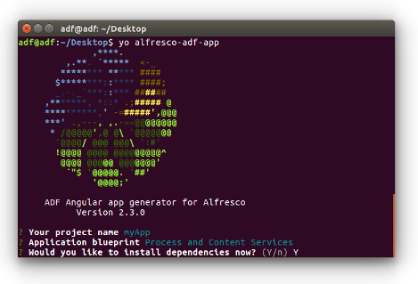
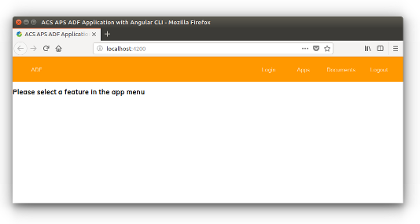

# Yeoman を使用して ADF アプリケーションを作成する

このチュートリアルでは [Yeoman scaffolding tool](http://yeoman.io/) を使用して、ADF アプリケーションをゼロから作成する方法を説明します。

これは、独自の ADF アプリケーションの開発を開始できる「開始」タスクです。

## 前提条件

次のタスクを実行する前に、ADF Yeoman ジェネレーターのインストール専用の[開発環境の準備](./preparing-environment.md) で説明されているオプションのセクションを必ず実行してください。これは、このチュートリアルを正常に完了するために必要な前提条件です。

## ADF アプリケーションの作成

[Yeoman ジェネレーター](http://yeoman.io/)を使用すると、まったく新しいアプリケーションを簡単に作成できます。 ターミナルを開き、次のコマンドを実行します。

    yo alfresco-adf-app

実行後、ジェネレーターはいくつかの質問をします。主にアプリの名前 (この例では `myApp` を使用します) および使用するブループリントです。ウィザードがどのように見えるかは下の画像のようになります。

次の 3 つのブループリントのいずれかを選択できます。

**Process Services**

これにより、Alfresco Process Services 用のアプリケーションが生成されます。主に次のコンポーネントが含まれています: ログイン、アプリリスト、タスクリスト、[`フォーム`](../../lib/process-services/src/lib/task-list/models/form.model.ts) およびスタートプロセスです。

**Content Services**

これにより、Alfresco Content Services のアプリケーションが生成されます。主に次のコンポーネントが含まれています: ログイン、ドキュメントリスト、ビューア。

**Process and Content Services**

これにより、Alfresco Process Services と Content Services の両方のアプリケーションが生成され、上記の 2 つのブループリントの組み合わせになります。

任意のものを選択すると、ジェネレータは依存関係をすぐにインストールするかどうかを尋ねます。`Y` を入力して Enter キーを押します。これには、インターネット接続に応じて1〜2分かかります。最後に次のような警告が表示される場合があります。

    npm notice created a lockfile as package-lock.json. You should commit this file.
    npm WARN @mat-datetimepicker/core@1.0.4 requires a peer of @angular/core@^5.2.3 but none is installed. You must install peer dependencies yourself.
    npm WARN @mat-datetimepicker/core@1.0.4 requires a peer of @angular/material@^5.2.4 but none is installed. You must install peer dependencies yourself.
    npm WARN @mat-datetimepicker/core@1.0.4 requires a peer of @angular/cdk@^5.2.4 but none is installed. You must install peer dependencies yourself.
    npm WARN @mat-datetimepicker/moment@1.0.4 requires a peer of @angular/material@^5.2.4 but none is installed. You must install peer dependencies yourself.
    npm WARN @mat-datetimepicker/moment@1.0.4 requires a peer of @angular/material-moment-adapter@^5.2.4 but none is installed. You must install peer dependencies yourself.
    npm WARN @angular/compiler-cli@5.2.10 requires a peer of @angular/compiler@5.2.10 but none is installed. You must install peer dependencies yourself.
    npm WARN optional SKIPPING OPTIONAL DEPENDENCY: fsevents@1.1.3 (node_modules/fsevents):
    npm WARN notsup SKIPPING OPTIONAL DEPENDENCY: Unsupported platform for fsevents@1.1.3: wanted {"os":"darwin","arch":"any"} (current: {"os":"linux","arch":"x64"})

これらの警告は正常です。残念ながら、ADF が依存する Angular Flex Layout パッケージ内で発生します。それらは安全に無視できます。

完了すると、`myApp` という名前のフォルダーが見つかります。このフォルダーには、すでに作成されて完了したすべての ADF アプリケーションがあります。

## アプリケーションの構成

ADF アプリケーションを設定するには、正しい Alfresco Content Services と Alfresco Process Services をポイントするだけでよく、それに応じて、作成時に使用することにしたブループリントを使用します。

正しいバックエンドサービスをセットアップするには、アプリのディレクトリ (この場合は `myApp`) に移動し、`proxy.conf.json` ファイルを調べます。このファイルは、Angular Webpack にバックエンド (コンテンツまたはプロセスサービス) のプロキシを作成するように指示します。現在実行されている場所を反映するように URL とポートを変更します。`proxy.conf.json` ファイルがどのように見えるかの例を以下に示します。

    {  
        "/alfresco": {
            "target": "http://localhost:8080",  // <-- ここを変更します!
            "secure": false,
            "changeOrigin": true
        },
        "/activiti-app": {
            "target": "http://localhost:9999",  // <-- ここを変更します!
            "secure": false,  
            "changeOrigin": true  
        }
    }

## アプリケーションを使用する

ADF アプリケーションが正しく設定されたので、ターミナルから `npm start` コマンドを実行して起動し、プロジェクトフォルダー (この場合は `myApp`) にいることを再確認します。コマンドの実行には数秒かかり、ブラウザーは自動的に `http://localhost:4200/` で開きます。

ユーザーインターフェイスからわかるように、Alfresco ADF アプリケーションは本当に簡単で基本的なものです。これは、中間/専門家の学習パスの一部となる複雑な機能を含めるのではなく、基本の理解に注意を集中させるため、この例の正確な要件です。ホームページがどのように見えるかは下のスクリーンショットのようになります。

