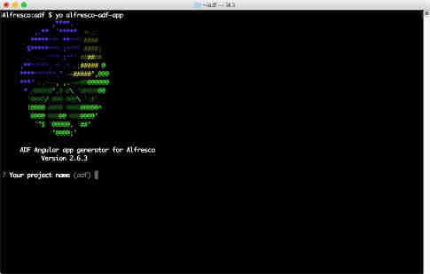
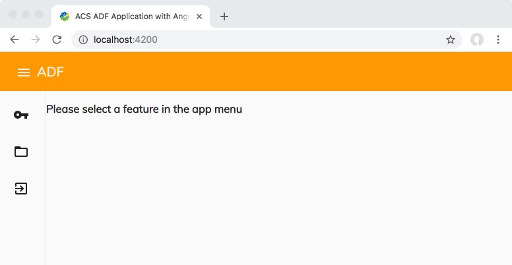

# はじめての ADF アプリケーションを作成する

このチュートリアルでは、開発環境を設定して ADF アプリケーションを作成する方法を示します。

ADF　開発を開始して実行するには、`node.js`、`Yeoman` およびコードエディターのいくつかの前提条件をインストールする必要があります。
前提条件をインストールしたら、ADF Yeoman ジェネレーターを使用してアプリケーションを作成し、Alfresco Content Services リポジトリを指すように ADF アプリケーションを構成する必要があります。

## node.js のインストール

最新の `node.js` リリースが必要です。これは[https://nodejs.org/ja/](https://nodejs.org/ja/) からダウンロードできます。OS のインストーラーを選択し、インストール手順に従います。完了したら、ターミナルを開き、次のコマンドでインストールを確認します。

	node -v
	
*メモ: バージョン `10.x` と `11.x` はどちらも正常に動作するはずです。*

**TIP**: ADF、`node.js`、Angular で大規模な開発を計画している場合は、[n](https://github.com/tj/n) または [nvm](https://github.com/creationix/nvm/) などの `node.js` のバージョンマネージャーをインストールすることを検討してください。このツールを使用すると、複数の `node.js` バージョンを同時にインストールでき、バージョンを簡単に切り替えることができます。

## コードエディターのインストール

すべての Angular の開発は、[Typescript](https://www.typescriptlang.org) を使用して行われます。これを念頭に置いて、開発を少し簡単にするツールを用意することは素晴らしいことですが、実際にはどのテキストエディタでも問題なく動作します。

[Visual Studio Code](http://code.visualstudio.com) をお勧めします。これは Microsoft のフリーで軽量かつ *非常に* 強力なツールで、Angular 開発とうまく機能し、[プラグインの大きなエコシステム](https://marketplace.visualstudio.com/VSCode) を使用して、開発者のエクスペリエンスをさらに向上させます。

他の推奨ツールには、[JetBrains](https://www.jetbrains.com) の IntelliJ IDEA または WebStorm が含まれますが、*コミュニティエディションは [Typescript](https://www.typescriptlang.org) をサポートしていません。*


## ADF Yeoman ジェネレーターのインストール



**Note:** Linux または macOS を使用している場合、これらのコマンドを `sudo` で実行する必要があるかもしれません。

`yo --version` を実行して `Yeoman` がインストールされていることを確認する必要があります。これがシステムにない場合は、次を実行する必要があります。

	npm install -g yo
	
次に、`generator-alfresco-adf-app` の最新バージョンをインストールします。

	npm install -g generator-alfresco-adf-app@latest


## はじめての ADF アプリケーションを作成

すべての前提条件が整いましたので、アプリケーションを生成します。

	yo alfresco-adf-app
	
名前を入力し、アプリケーションブループリントとして `Content Services` を選択し、`Y` を入力して依存関係をインストールします。

`Yeoman` ジェネレーターは、新しいプロジェクトを作成し、アプリケーションに必要なすべての依存関係をインストールします。

*メモ: `Yeoman` ジェネレーターは、プロジェクトの新しいディレクトリを作成します。この新しいディレクトリに必ず変更してください。*

## Alfresco Content Services と連携するようにADFを構成する

次のステップは、コードエディターで新しく作成されたプロジェクトを開き、`proxy.conf.json` ファイルを開くことです。このファイルの `target` プロパティを変更して、Alfresco Content Services の URL とポートを指すようにします。この URL を見つけるには、インストールガイドを参照してください。オンライントライアルを実行している場合は、メールで情報を確認できます。

URL に一致するように `"target": "http://localhost:8080",` を変更し、ファイルを保存します。

target URL の最後に `/alfresco` は必要ないことに注意してください。[Docker Compose](https://docs.alfresco.com/6.0/tasks/deploy-docker-compose.html) を使用して Alfresco Content Services 6.1 を起動してみましょう。Alfresco Content Services リポジトリは、`http://localhost:8082/alfresco` で利用できる場合があります。この場合、`proxy.conf.json` ファイルは次のようになります。

```json
{
	"/alfresco": {
		"target": "http://localhost:8082",
		"secure": false,
		"changeOrigin": true
	}
}
```

[オンライントライアル](https://www.alfresco.com/platform/content-services-ecm/trial/online) を実行している場合は、正しい URL についてメールを参照してください。`proxy.conf.json` は次のようになります。

```json
{
	"/alfresco": {
		"target": "https://xyz.trial.alfresco.com",
		"secure": true,
		"changeOrigin": true
	}
}
```

## アプリケーションを開始する

プロジェクトを実行するには、ターミナルを開いて次のコマンドを実行します

	npm start
	
ブラウザが自動的に `http://localhost:4200` で開きます。



サイドナビゲーションの鍵アイコンをクリックすると、ログインできます！

*メモ:* オンライントライアル版を実行している場合は、ウェルカムメールでログイン資格情報を見つけることができます。

少しアプリケーションを探索してください。リポジトリの閲覧、ドキュメントのアップロードとプレビューの基本的な機能があります。


# 次のステップ

おめでとう！ これで、最初の ADF アプリケーションの開発を開始する準備ができました！

次のチュートリアルでは、ログイン画面をカスタマイズして ADF コンポーネントを拡張、使用、構成する方法を探ります。

* [ADF コンポーネントの拡張、使用および構成](using-components.md)
 