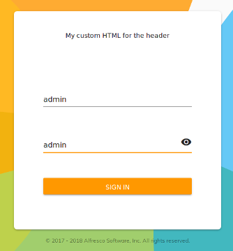

# Login コンポーネントのカスタマイズ

このチュートリアルでは、技術文書に従って [Login コンポーネント](../core/components/login.component.md)をカスタマイズする方法を学びます。

タスクは非常に簡単です。このコンポーネントのカスタマイズの詳細については、例とともにドキュメントを参照してください。

## コンポーネントをアプリケーションに配置する

既存の ADF アプリケーションから開始して、Login コンポーネントは、
他のコンポーネントと同様に、アプリフォルダーのサブフォルダーに格納されます。
[Alfresco Content App](https://github.com/Alfresco/alfresco-content-app) では、`/src/app/components/login` パスに保存されます。
Yeoman で作成された ADF アプリでは、`/src/app/login` パスに保存されます。

アプリケーションの [Login コンポーネント](../core/components/login.component.md)を見つけたら、以下の説明に従ってカスタマイズできます。

## ヘッダーを変更する

すべての通常の [Angular コンポーネント](https://angular.io/guide/architecture-components) と同様に、
CSS、HTML および Typescript を介して
[Login コンポーネント](../core/components/login.component.md)をカスタマイズできます。
この簡単な例では、ヘッダーをカスタマイズします 
([技術文書](../core/components/login.component.md)でも説明されています)。

[`login.component`](../core/components/login.component.md)`.html` ファイルを開き、次のソースコードに一致するようにコンテンツを変更します。

```html
<adf-login ...>
	<adf-login-header><ng-template>My custom HTML for the header</ng-template></adf-login-header>
</adf-login>
```

ファイルを保存すると、ログインフォームは次のようになります。



## その他の例

前述のように、これは非常に基本的な例であり、
[Login コンポーネント](../core/components/login.component.md)はこれよりもはるかに広範囲にカスタマイズできます。
完全な詳細な説明、例が豊富な場合は、[コンポーネントに関する技術文書](../core/components/login.component.md)を確認してください。
これは、[Login コンポーネント](../core/components/login.component.md)で利用可能なすべてのカスタマイズについて説明しています。
