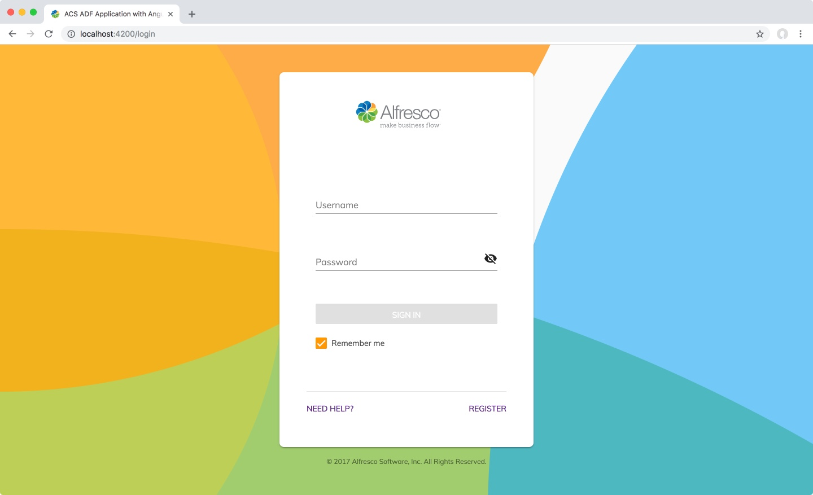
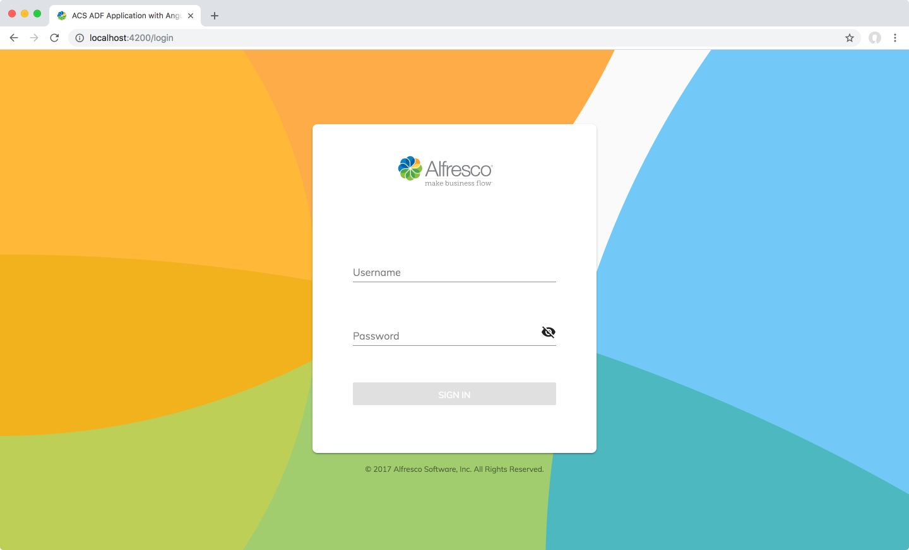

# ADF コンポーネントの使用

このチュートリアルでは、ADF コンポーネントを拡張、使用および構成する方法を学習します。



[Login コンポーネント](../core/components/login.component.md) を例としてカスタマイズし、フッターの `Remember me`、`Need Help?`、`Register` リンクを削除、ログインフォームが送信されたときにアラートを表示するイベントリスナーを設定します。最後に、カスタムフッターを設定します。

最終的には次のようになります。


これら 3 つのカスタマイズは、ADF コンポーネントを使用、拡張、構成するための 3 つの基本的な方法を網羅しているため、慎重に選択しました。

1.  プロパティの設定
2.  イベントリスナ
3.  HTML 拡張 / _コンテンツ投影_

使用するコンポーネントのドキュメントを常に参照する必要があります。
この演習では、 [Login コンポーネント](../core/components/login.component.md) ドキュメントもあわせてブラウザーウィンドウを開くと便利です。

それぞれのアプローチで実用的な例を見てみましょう。

## プロパティの設定

Angular コンポーネントは、HTML テンプレートのプロパティを介して簡単に構成できます。この例では、フッターの `Remember me`、`Need Help?`、`Register` リンクを削除します。

[前のチュートリアル](creating-your-first-adf-application.md) からアプリケーションを実行していることを確認してください。

コードエディターでプロジェクトを開きます。ファイルを簡単に切り替えられるように、フォルダー全体を開くのが最善です。

`src/app/login/login.component.html` ファイルを開きます。内容は次のようになります。

```html
<adf-login
	copyrightText="© 2017 Alfresco Software, Inc. All Rights Reserved."
	successRoute="/documentlist">
</adf-login>
```

ドキュメントを見ると、`<adf-login/>` コンポーネントには多くの異なるプロパティがあることがわかります。私たちが興味を持っているのは `showRememberMe` と `showLoginActions` です。これらはデフォルトで `true` に設定されていますが、次のように簡単に変更できます。

```html
<adf-login
	[showRememberMe]="false"
	[showLoginActions]="false"
	copyrightText="© 2017 Alfresco Software, Inc. All Rights Reserved."
	successRoute="/documentlist">
</adf-login>
```

ファイルを保存します。ファイルが保存されると、ブラウザは自動的にリロードします。結果は次のようになります。



**メモ:** 2つの新しいプロパティは、それらの周りに `[]` で指定されます。コンポーネントプロパティを設定するには、次の 3つの方法があります。

1.  `[property]=""` これは typescript コントローラからの式またはプロパティになります。これをブール式または変数に使用します
2.  `property=""` これは生のテキストとして渡されます
3.  `[(property)]` これは _banana in a box_ と呼ばれ、双方向バインディングに使用されます

## イベントリスナ

`<adf-login/>` コンポーネントのプロパティを正常に設定できたので、次はイベントを確認します。

繰り返しになりますが、[Login コンポーネント](../core/components/login.component.md) のドキュメントを見ると、
3つのイベント (`success`、`error`、`executeSubmit`) が発行されていることがわかります。

これらのイベントをサブスクライブし、これらのイベントが発行されたときにカスタムコードを実行できます。`executeSubmit` にフックして、フォームが送信されたら簡単な `alert()` を実行しましょう。

`src/app/login/login.component.html` を開き、`(executeSubmit)="myExecuteSubmitMethod($event)"` を `<adf-login/>` コンポーネントに追加します。

```html
<adf-login
	[showRememberMe]="false"
	[showLoginActions]="false"
	(executeSubmit)="myExecuteSubmitMethod($event)"
	copyrightText="© 2017 Alfresco Software, Inc. All Rights Reserved."
	successRoute="/documentlist">
</adf-login>
```

次に、typescript に `myExecuteSubmitMethod` を実装する必要があります。`src/app/login/login.component.ts` を開き、新しいメソッドを追加します:

```ts
// これを追加します!
myExecuteSubmitMethod(event: any) {
	alert('Form was submitted!');
	console.log(event);
}
```

完成したファイルは次のようになります。

```ts
import { Component } from '@angular/core';

@Component({
	selector: 'app-login',
	templateUrl: './login.component.html',
	styleUrls: ['./login.component.css']
})
export class LoginComponent {

	// Add this!		
	myExecuteSubmitMethod(event: any) {
		alert('Form was submitted!');
		console.log(event);
	}
}
```

ファイルを保存し、[login コンポーネント,](../core/components/login.component.md) に移動して、有効なユーザー名とパスワードを入力すると、アラートが表示されます。ブラウザのコンソールを見ると、イベントデータが表示されます。ここで、フォームのすべての詳細を取得します。

## コンテンツ投影 / HTMl 拡張

コンポーネントを構成または拡張する最後の方法は、コンテンツ投影と呼ばれるアプローチです。これにより、コンポーネントはテンプレートにプレースホルダーを配置でき、開発者はコンポーネント内の事前定義された場所に独自のコードまたはコンポーネントを「投影」できます。

通常の HTML では、要素をネストできます。たとえば、

```html
<div>
	<p>
		<b>Here we have some bold text</b>
	</p>
</div>
```

ADF コンポーネントで同じアプローチを使用して、カスタムコードまたはコンポーネント全体を ADF コンポーネントに注入できます。

ドキュメントには、どのターゲットが配置されているかに関する情報が記載されています。
コンテンツ投影をサポートするコンポーネントには、
関連するすべての詳細が記載されたドキュメントページに
[トランスクルージョン](../user-guide/transclusion.md)セクションがあります。

`<adf-login/>` コンポーネントは2つのターゲットをサポートしています: `adf-login-header` と `adf-login-footer` です。

フッターに簡単な Hello World メッセージを追加しましょう。テンプレート `src/app/login/login.component.html` を開き、`<adf-login/>` HTML タグ _内に_ 新しいタグを追加します。

```html
<adf-login
	[showRememberMe]="false"
	[showLoginActions]="false"
	(executeSubmit)="myExecuteSubmitMethod($event)"
	copyrightText="© 2017 Alfresco Software, Inc. All Rights Reserved."
	successRoute="/documentlist">
		<adf-login-footer>
			<ng-template>
				Hello World!
			</ng-template>
		</adf-login-footer>
</adf-login>
```

`<adf-login-footer/>` タグを `<adf-login/>` タグ _内に_ 配置するよう注意してください。

`<adf-login-footer/>` または `<adf-login-header/>` タグ内には、`<ng-template/>` タグ内でラップする限り、必要なものを何でも配置できます。また、カスタムまたはサードパーティのコンポーネントをソースにすることもできます。

### ボーナスの目的: カスタムロゴと背景をログイン画面に追加します

挑戦しますか？ [Login コンポーネント](../core/components/login.component.md)のドキュメントを調べて、
ロゴと背景画像を変更する方法を見つけてください！

# 次のステップ

探索するためのチュートリアルが多数あります。次に試すことをお勧めします。

-   [基本的なテーマ](basic-theming.md)
-   [新しいページを作成する](new-view.md)
-   [新しいコンポーネントを追加する](new-component.md)
