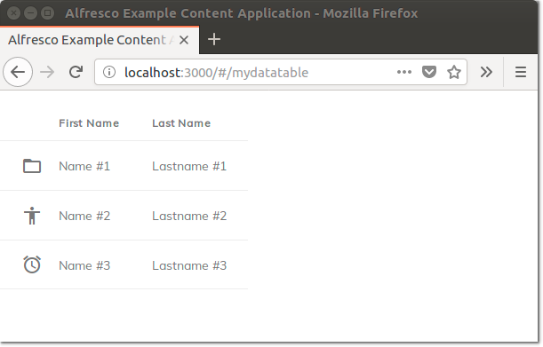
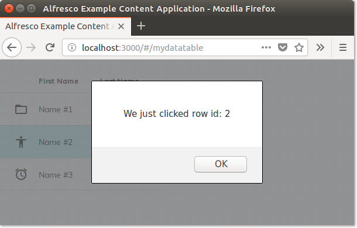
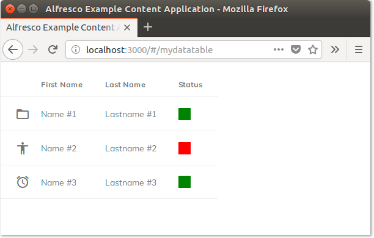
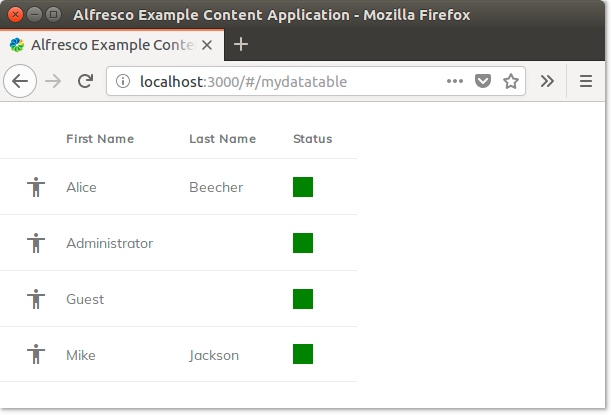
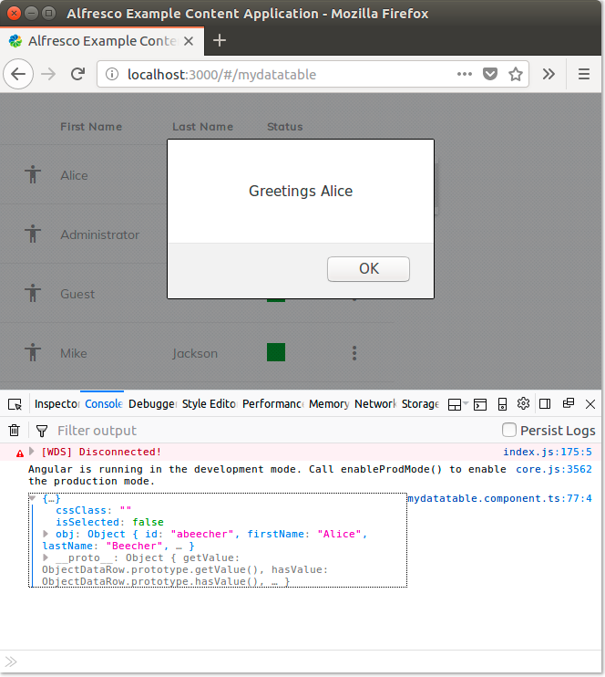
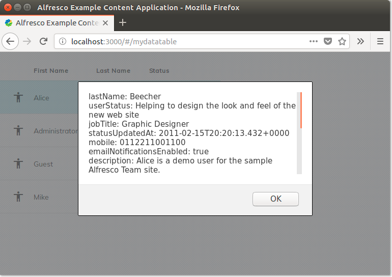

# DataTable の使用

このチュートリアルでは、DataTable コンポーネントを作成する方法を学びます。

通常、テーブルのカスタムデータは、一般的なバックエンドサービスまたはサードパーティ API から取得されます。 例として、Alfresco Content Services で利用可能なサービスの1つからのデータを使用します。ただし、Alfresco Process Services エンドポイントまたはサードパーティ API を使用する場合の手順はほぼ同じです。

## 前提条件とデータソース

[DataTable コンポーネント](../core/components/datatable.component.md)の技術的な説明に入る前に、
開発環境とその前提条件の
説明から始めましょう。

このチュートリアルでは、(少なくとも) Alfresco Content Services をサービスレイヤーとして使用するように設定された
既存の ADF アプリケーションから始めます。
データテーブルの利便性と関連性のために、
[Alfresco Example Content Application](https://github.com/Alfresco/alfresco-content-app) の使用をお勧めします。
このアプリケーションは十分に文書化されており、
[ソースコードからビルドする](https://alfresco.github.io/alfresco-content-app/#/build) か、[Docker コンテナーで実行する](https://alfresco.github.io/alfresco-content-app/#/docker)かを選択できます。
ただし、まったく新しい ADF アプリケーションを最初から作成する場合は、
チュートリアルを簡単に実行できます。

このチュートリアルの場合、[DataTable コンポーネント](../core/components/datatable.component.md) の入力に使用されるエンドポイントは、
Alfresco Content Services インスタンスで使用可能なすべてのユーザーをリストする [`/people` サービス](https://api-explorer.alfresco.com/api-explorer/#!/people/listPeople) です。
`/people` サービスは、Alfresco Content Services REST API でデフォルトで使用できるため、
このチュートリアルの目的に適しています。
フォローアップとして、
Alfresco Process Services エンドポイントまたはサードパーティ API の使用を選択できます。
以下は、[`/people` サービス](https://api-explorer.alfresco.com/api-explorer/#!/people/listPeople) によって返される情報の例です。

```json
{
  "list": {
    "pagination": {
      "count": 46,
      "hasMoreItems": false,
      "totalItems": 46,
      "skipCount": 0,
      "maxItems": 100
    },
    "entries": [
      {
        "entry": {
          "firstName": "Jay",
          "lastName": "Veeru",
          "emailNotificationsEnabled": true,
          "company": {},
          "id": "JayVeeru2",
          "enabled": true,
          "email": "JayVeeru@test.con"
        },
        ...
      }
    ]
  }
}
```

## `DataTable` コンポーネントを使用するページを追加する

ADF アプリケーションから始めて、基本的な `DataTable` コンポーネントを含む新しいページを実装する新しいコンポーネントを追加しましょう。
ターミナルを開き、アプリケーションのルートで `cd` コマンドを実行し、
次のコマンドを実行して新しいページのコンポーネントを追加します。

    ng g c mydatatable -m app.module

`src/app/mydatatable` フォルダーに `html`、`scss`、`spec.ts`、`ts` の拡張子を持つ4つのファイルがあり、
新しいページの実装に使用されます。

新しいページをアプリケーションのルーティングに追加するには、
`app.routes.ts` (Alfresco Example Content Application を使用している場合) 
または `app.module.ts` (標準の Angular CLI を使用してアプリケーションを構築した場合) で `Routes` インスタンスを編集します。

新しいルーティングを定義するには、次のインポートがファイルに含まれていることを確認します。

```ts
import {MydatatableComponent} from './mydatatable/mydatatable.component';
```

次に、以下に説明するように、`Routes` インスタンスに新しいアイテムを追加します。

```ts
export const APP_ROUTES: Routes = [
  ...,
  {
    path: 'mydatatable',
      component: MydatatableComponent
  },
  ...
];
```

このページは、URL `http://localhost:3000/#/mydatatable` で利用できるようになります
(Alfrescoサンプルコンテンツアプリケーションから開始した場合)。

新しいページが配置されたので、`DataTable` コンポーネントを追加しましょう。
これを行うには、`src/app/mydatatable/mydatatable.component.ts` ファイルを開き、次のインポートを追加します。

```ts
import { ObjectDataTableAdapter } from '@alfresco/adf-core';
```

DataTable には、データソースとして設定される [`ObjectDataTableAdapter`](../../lib/core/datatable/data/object-datatable-adapter.ts) のインスタンスが必要です。
コンストラクタの直前に、以下のソースコードを `mydatatable` コンポーネントに追加します。

```ts
data = new ObjectDataTableAdapter(
  [
    {
      id: 1, 
      firstName: 'Name #1', 
      lastName: 'Lastname #1', 
      icon: 'material-icons://folder_open'
    },
    {
      id: 2, 
      firstName: 'Name #2', 
      lastName: 'Lastname #2', 
      icon: 'material-icons://accessibility'
    },
    {
      id: 3, 
      firstName: 'Name #3', 
      lastName: 'Lastname #3', 
      icon: 'material-icons://alarm'
    }
  ]
);
```

次に、テンプレートに `<adf-datatable>` コンポーネントを配置し、列を設定する data プロパティをバインドする必要があります。
`src/app/mydatatable/mydatatable.component.html` ファイルを開き、
コンテンツを以下に置き換えます：

```html
<adf-datatable 
  [data]="data">
  <data-columns>
    <data-column 
      key="icon" 
      type="image" 
        [sortable]="false">
      </data-column>
    <data-column 
      key="firstName" 
      title="First Name">
    </data-column>
    <data-column 
      key="lastName" 
      title="Last Name" 
      class="full-width name-column">
    </data-column>
  </data-columns>
</adf-datatable>
```

ファイルを保存して、ブラウザーに戻ります。
これで、3つの行があり、それぞれに3つの列があるデータテーブルが表示されます。



## DataTable 設定

DataTable はさまざまな方法で構成できるため、
ADF 全体のすべてのリストコンポーネントの基盤として使用できます。
ドキュメントリスト、タスクリスト、およびプロセスリストは DataTable の拡張機能であり、
添付ファイルリスト、コメントリスト、バージョンリスト、コンテンツセレクターなどのさらに小さなコンポーネントもこれに基づいています。

[ドキュメント](../core/components/datatable.component.md)を見ると、
シングル/マルチ選択、クリックイベント、コンテキストメニュー、
アクション、キーボードナビゲーションなど、
さまざまなオプションがあることがわかります。

簡単な例として、行がクリックされたときにアラートを表示するために `click` イベントを追加します。
`src/app/mydatatable/mydatatable.component.html` を開き、以下を追加します：

```html
<adf-datatable 
  (rowClick)="onRowClick($event)"
  [data]="data">
  .......
```

次に、`src/app/mydatatable/mydatatable.component.ts` を開き、以下に説明するようにメソッド `onRowClick` を追加します。

```ts
onRowClick(event: any) {
  alert('We just clicked row id: ' + event.value.obj.id);
}
```

行全体が `event` パラメーターで渡されることに注意してください。これは、必要に応じて、メソッドが行のすべてのデータにアクセスできることを意味します。
行をクリックすると、素敵なアラートが表示されるはずです。



## DataTable の列

DataTable 内の列をレンダリングするためのさまざまなオプションについてもう少し掘り下げてみましょう。
[Data Column コンポーネント](../core/components/data-column.component.md) のドキュメントは非常に詳細であり、多くの例があります。
チェックアウトすることを強くお勧めします。

ドキュメントから、[Data Column コンポーネント](../core/components/data-column.component.md) には非常に多くのプロパティがありますが、
最も重要なプロパティは `key`、`type`、`sortable`、`title` および `class` です。

-   `key` は [`ObjectDataTableAdapter`](../../lib/core/datatable/data/object-datatable-adapter.ts) オブジェクトの対応するプロパティの名前です。
-   `type` はレンダリング方法を示します。
    デフォルトでは、データ内の一致するキーから `text` を取得しますが、他のモードも使用できます。
    - `image` は、マテリアルアイコンの URI または任意の画像の URL を取得して表示します。
    - `date` は日付/日付時刻文字列をフォーマットします。`format` プロパティを使用してそれをオーバーライドし、カスタムの時間形式を定義します。
    - `fileSize` は必要に応じて kb/mb/gb に変換されます。
    - `location` は、値が ACS の nodeId であると想定し、パスを表示します。
-   `sortable` は列をソートできるかどうかを切り替えます。
-   `title` はテーブルヘッダーのカラムタイトルを設定します。
-   `class` を使用すると、列の CSS クラスを設定できます。列に `full-width` を使用して、残りの列のためのスペースを残したまま、できる限り幅を広くします。

## コンテンツの投影

テキスト文字列または画像を単にレンダリングするだけでは不十分な場合があります。
このような場合に対処するために、Data Column はコンテンツ投影をサポートしており、列にレンダリングされるものを制御できます。

上記の例を変更して、ステータスフィールドを紹介しましょう。データでは、値が `green` または `red` になる新しいステータスフィールドを定義します。次に、コンテンツ投影を使用して、テキストではなく色で列をレンダリングできます。

`src/app/mydatatable/mydatatable.component.ts` を開き、データを次のように変更します。

```ts
data = new ObjectDataTableAdapter(
  [
    {
      id: 1, 
      name: 'Name #1', 
      createdBy: 'User #1', 
      status: 'green', 
      icon: 'material-icons://folder_open'
    },
    {
      id: 2, 
      name: 'Name #2', 
      createdBy: 'User #2', 
      status: 'red', 
      icon: 'material-icons://accessibility'
    },
    {
      id: 3, 
      name: 'Name #3', 
      createdBy: 'User #3', 
      status: 'green', 
      icon: 'material-icons://alarm'
    }
  ]
);
```

次に、テンプレートに新しい列を定義し、`<ng-template/>` を使用して独自のコンテンツをその中に投影する必要があります。
テンプレートを開き、次のコードを追加します。

```html
<data-column key="status" title="Status">
  <ng-template let-entry="$implicit">
    <span *ngIf="entry.data.getValue(entry.row, entry.col) == 'red'" style="background-color: red; width: 20px; height: 20px"></span>
    <span *ngIf="entry.data.getValue(entry.row, entry.col) == 'green'" style="background-color: green; width: 20px; height: 20px"></span>
  </ng-template>
</data-column>
```

これは背景を設定するためのベストプラクティスではないかもしれませんが、
テーブルセル内のコンテンツのレンディションを制御する方法を示しています。
以下の図では、ユーザーエクスペリエンスがどのように見えるかを確認できます。



## データソースで遊ぶ

DataTable の制御方法がわかったので、
外部 API (この例では、Alfresco Content Servicesインスタンスで利用可能なすべてのユーザーをリストする [`/people` サービス](https://api-explorer.alfresco.com/api-explorer/#!/people/listPeople))
を統合するようにデータソースを変更して、
別の要素を追加しましょう。

上記で説明したように、
`DataTable` コンポーネントのデータソースとして機能する [`ObjectDataTableAdapter`](../../lib/core/datatable/data/object-datatable-adapter.ts) オブジェクトに入力することでこれを行うことができます。
`src/app/mydatatable/mydatatable.component.ts` ファイルを開き、コンテンツを次のものに置き換えます。

```ts
import { Component, OnInit } from '@angular/core';
import { AlfrescoApiService } from '@alfresco/adf-core';
import { ObjectDataTableAdapter, ObjectDataRow } from '@alfresco/adf-core';

@Component({
  selector: 'app-mydatatable',
  templateUrl: './mydatatable.component.html',
  styleUrls: ['./mydatatable.component.scss']
})
export class MydatatableComponent implements OnInit {

  data = new ObjectDataTableAdapter([],[]);

  constructor(private apiService: AlfrescoApiService) {

    this.apiService.getInstance().webScript.executeWebScript(
      'GET',
      'people',
      [],
      null,
      'api/-default-/public/alfresco/versions/1',
      null
    ).then(
      (response: any) => {
        let results = [];
        for (var entry of response.list.entries) {
          results.push({
            id: entry.entry.id,
            firstName: entry.entry.firstName,
            lastName: entry.entry.lastName,
            status: 'green',
            icon: 'material-icons://accessibility'
          });
        }
        this.data.setRows(results.map(item => { return new ObjectDataRow(item); }));
      }
    );

  }

  onRowClick(event: any) {
    alert('We just clicked row id: ' + event.value.obj.status);
  }

}
```

ご覧のとおり、主な変更点は外部 API が呼び出されるコンストラクターにあり、
`this.data` オブジェクト ID はサービスのレスポンスを動的にテーブルに追加します
(JSON であると想定されますが、形式は任意です)。

ファイルを保存すると、ブラウザに次のようなものが表示されるはずです。



## アクションの追加

DataTable の一般的で簡単なカスタマイズは、
各行または特定の条件を満たす行にアクションを追加することです。

`src/app/mydatatable/mydatatable.component.html` ファイルに以下の変更を加えます:

```html
<adf-datatable
    ...
    [actions]="true"
    (showRowActionsMenu)="onShowRowActionsMenu($event)"
    (executeRowAction)="onExecuteRowAction($event)">
</adf-datatable>
```

また、次のように `src/app/mydatatable/mydatatable.component.ts` を更新します。

```ts
import { DataCellEvent, DataRowActionEvent } from '@alfresco/adf-core';

onShowRowActionsMenu(event: DataCellEvent) {
    event.value.actions = [
        {
            title: 'Greetings'
            // ここにカスタムメタデータを配置します。
        }
    ];
}

onExecuteRowAction(event: DataRowActionEvent) {
    console.log(event.value.row);
    alert('${event.value.action.title} ${event.value.row.obj.firstName}');
}
```

両方のファイルを保存した後、テーブルの3つのドット列をクリックして最初の行の `Greetings` を選択すると、
次のようなものが表示されます。



ブラウザーコンソールには、デバッグのために行オブジェクトがどのように表示されるかを説明するログがあります。

この例をより現実的にするために、外部サービスとの相互作用を追加しましょう。
[`/people/{personId}` サービス](https://api-explorer.alfresco.com/api-explorer/#!/people/getPerson) を使用して、JSON レスポンスとして取得された完全なプロファイルデータを取得します。
簡単にするために、データを文字列として抽出し、通常の `alert` コマンドでユーザーに表示します。
最終的なアプリケーションでは、より洗練されたモーダルウィンドウ (標準の [マテリアルダイアログ](https://material.angular.io/components/dialog/overview) を使用することをお勧めします)。

拡張を開発するには、`src/app/mydatatable/mydatatable.component.html` ファイルを編集し、`onExecuteRowAction` メソッドを次のように置き換えます:

```ts
onExecuteRowAction(event: DataRowActionEvent) {

    if (event.value.action.title = "Greetings") {

        this.apiService.getInstance().webScript.executeWebScript(
          'GET',
          'people/' + event['value']['row']['obj']['id'],
          [],
          null,
          'api/-default-/public/alfresco/versions/1',
          null
        ).then(
          (response: any) => {
              alert(JSON.stringify(response.entry));
          }
        );

    }
}
```

これを保存すると、アプリケーションは自動的に更新され、
行に対して `Greetings` アクションが選択されると、ブラウザに次のようなものが表示されます。


