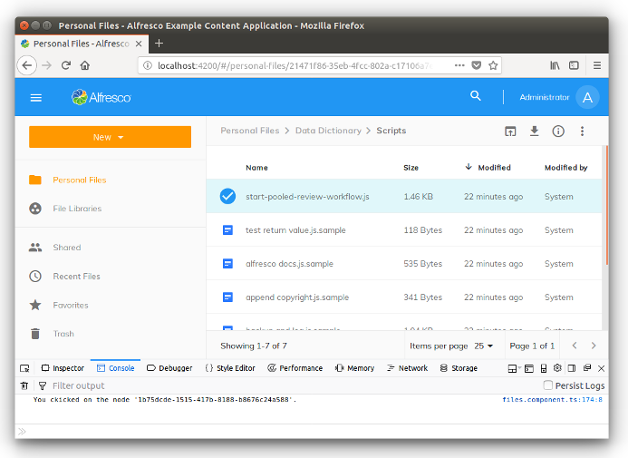
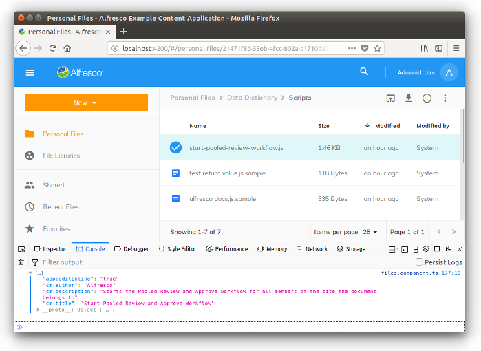
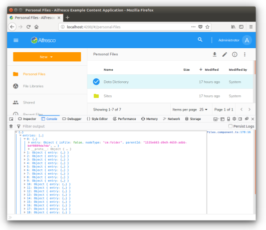
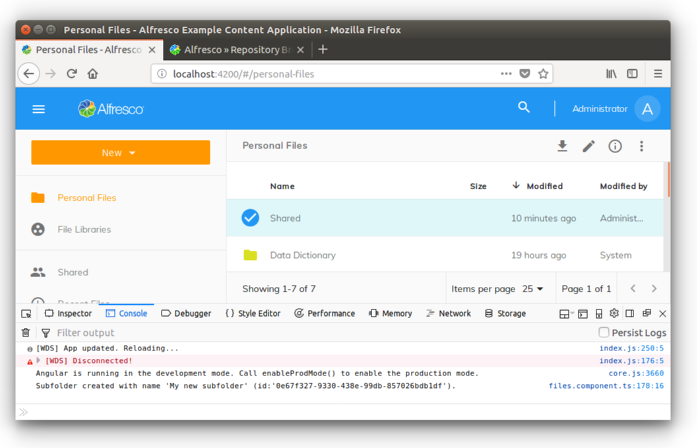
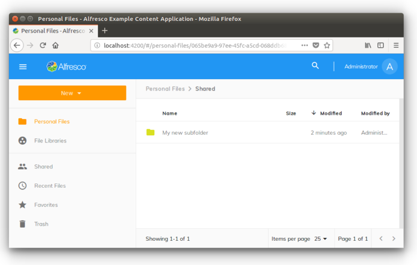
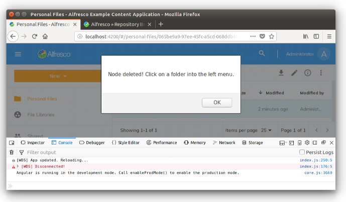

# Nodes API サービスの使用

このチュートリアルでは、[`NodesApiService`](../core/services/nodes-api.service.md) の使用方法を学習します。

REST エンドポイントを直接使用せずに Alfresco Content Services のインスタンスと対話する方法を示すために、いくつかの実用的な例を開発しました。このアプローチでは、[`NodesApiService`](../core/services/nodes-api.service.md) が抽象化レイヤーとして使用され、ADF Core ライブラリーのサービスの1つによって定義されます。

## Contents

-   [開発環境の準備](#preparing-the-development-environment)
-   [基本的な使用例](#basic-examples-of-usage)
-   [NodesApiService について](#about-the-nodesapiservice)
    -   [Observables](#observables)
    -   [MinimalNode](#minimalnode)
    -   [NodePaging](#nodepaging)
-   [ノードから情報とメタデータを取得する](#retrieving-info-and-metadata-from-a-node)
-   [ノードの子を取得する](#retrieving-the-nodes-children)
-   [サブフォルダーの作成と削除](#creating-and-deleting-a-subfolder)
    -   [サブフォルダーを作成する](#creating-a-subfolder)
    -   [フォルダーを削除する](#deleting-a-folder)

## Preparing the development environment

[`NodesApiService`](../core/services/nodes-api.service.md) の説明に焦点を合わせるために、
[Alfresco Example Content Application](https://github.com/Alfresco/alfresco-content-app)
の上に開発します。
開発環境にまだインストールされていない場合は、
開発環境の準備に _関する_ 説明を参照してください。

Alfresco Example Content Application を起動して実行したら、
`src/app/components/files/files.component.ts` で定義されている `FileComponent` を編集します。
以下のソースコードに一致するように `navigateTo` メソッドを変更します。

```ts
if (node.isFile) {
    this.myOnNodeDoubleClick(node.id);
}
```

次に、以下で説明するように `myOnNodeDoubleClick` メソッドを追加し、ファイルを保存します。

```ts
myOnNodeDoubleClick(nodeId) {
    console.log("You ckicked on the node '" + nodeId + "'.");
}
```

これにより、(フォルダーではなく) コンテンツノードをクリックしたときのユーザーエクスペリエンスが変わります。
ブラウザーのコンソールでは、
コンテンツのプレビューではなく、次のスクリーンショットのようなものが表示されます。



Alfresco Example Content app は、[`NodesApiService`](../core/services/nodes-api.service.md) の使用法を示すために設定されました。

## Basic examples of usage

[`NodesApiService`](../core/services/nodes-api.service.md) を初めて見るために、`src/app/components/files/files.component.ts` に保存されている `FileComponent` コンポーネントを確認しましょう。
ソースコードでは、[`FilesComponent`](../../demo-shell/src/app/components/files/files.component.ts) の [`NodesApiService`](../core/services/nodes-api.service.md) を表す `nodesApi` プロパティを確認できます。
非常に基本的な例については、
`fetchNode` および `fetchNodes` メソッドを参照してください。

## About the NodesApiService

先に進む前に、[`NodesApiService`](../core/services/nodes-api.service.md) クラスを紹介しましょう。
ご覧のとおり、利用可能なメソッドは簡単に理解でき、
コンテンツリポジトリのノードを管理するために必要なすべてのメソッドである必要があります。

### Observables

ほとんどすべてのメソッドが [`Observable`](http://reactivex.io/documentation/observable.html) を返します。
Observable は、Angular アプリケーションのパブリッシャーとサブスクライバーの間でメッセージを渡すためのサポートを提供します。
オブザーバブルは、イベント処理、非同期プログラミング、および複数の値を処理するための
他の手法に比べて大きな利点を提供します。

[`NodesApiService`](../core/services/nodes-api.service.md) メソッドの戻り値は、Observables の通常の方法で管理されます。
次の構文を使用して、非同期メッセージングに「サブスクライブ」します。

```ts
this.nodesApi.getNode(nodeId).subscribe(
    (node) => { ... },
    error => { ... }
);
```

### MinimalNode

コンテンツノードを管理するすべてのメソッドは、[`MinimalNode`](https://github.com/Alfresco/alfresco-js-api/blob/master/src/alfresco-core-rest-api/docs/NodeMinimalEntry.md) クラスの [`Observable`](http://reactivex.io/documentation/observable.html) を返します。
[`MinimalNode`](https://github.com/Alfresco/alfresco-js-api/blob/master/src/alfresco-core-rest-api/docs/NodeMinimalEntry.md) は、
ノードのコンテンツを表すために使用されます。
詳細については、[公式ドキュメント](https://github.com/Alfresco/alfresco-js-api/blob/master/src/alfresco-core-rest-api/docs/NodeMinimalEntry.md)を参照してください。

### NodePaging

メソッドが単一のノードではなくノードのリストを返す場合、
通常は [`NodePaging`](https://github.com/Alfresco/alfresco-js-api/blob/development/src/api/content-rest-api/docs/NodePaging.md) クラスの [`Observable`](http://reactivex.io/documentation/observable.html) を返します。
詳細については、[`NodePaging`](https://github.com/Alfresco/alfresco-js-api/blob/development/src/api/content-rest-api/docs/NodePaging.md) のドキュメントを参照してください。

## Retrieving info and metadata from a node

[`NodesApiService`](../core/services/nodes-api.service.md) の最初の使用例として、識別子を使用してコンテンツノードのプロパティを取得しましょう。次に示すように、`src/app/components/files/files.component.ts` の `myOnNodeDoubleClick` メソッドを編集します。

```ts
myOnNodeDoubleClick(nodeId) {
    this.nodesApi.getNode(nodeId)
    .subscribe(
        (node) => {
            console.log(node.properties);
        },
        error => { console.log("Ouch, an error happened!"); }
    );
}
```

これにより、ブラウザのコンソールにコンテンツノードのプロパティがログとして表示されます。
以下のスクリーンショットは、これがどのように見えるかの例を示しています。



もちろん、ユーザーインターフェイスでノードのデータを使用したい場合 (`DataTable` またはその他の視覚的なコンポーネントを使用) でも、
原則は同じです。

## Retrieving the node's children

[`NodesApiService`](../core/services/nodes-api.service.md) のもう1つの一般的な使用法は、フォルダーノードの子のリストを取得することです。
`src/app/components/files/files.component.ts` を再度編集し、
`navigateTo` メソッドを以下のソースコードに一致するように変更します。

```ts
    if (node.isFolder) {
	    this.myOnFolderNodeDoubleClick(node.id);
    }
```

次に、以下に示すように `myOnFolderNodeDoubleClick`メソッドを追加し、ファイルを保存します。

```ts
myOnFolderNodeDoubleClick(nodeId) {
    this.nodesApi.getNodeChildren(nodeId)
    .subscribe(
        (nodePaging) => {
            console.log(nodePaging.list);
        },
        error => { console.log("Ouch, an error happened!"); }
    );
}
```

ブラウザのコンソールで (コンテンツノードではない) フォルダーノードをクリックすると、ユーザーエクスペリエンスが変わります。
次のスクリーンショットのようなものが表示されます。



## Creating and deleting a subfolder

The [`NodesApiService`](../core/services/nodes-api.service.md) class is not just for retrieving data. You can also use it to manage a
real CRUD of nodes (content and folders). In the following examples, you will see how to create
a subfolder of the double clicked folder and also how to delete it.

### Creating a subfolder

サブフォルダーを作成するには、以下の説明に従って `myOnFolderNodeDoubleClick` メソッドを変更し、Typescript ファイルを保存します。

```ts
myOnFolderNodeDoubleClick(nodeId) {
    this.nodesApi.createFolder(nodeId, { "name": "My new subfolder" })
    .subscribe(
        (node) => {
            console.log("Subfolder created with name '" + node.name + "' (id:'" + node.id + "').");
        },
        error => { console.log("Ouch, an error happened!"); }
    );
}
```

(コンテンツノードではない) フォルダノードをクリックすると、ユーザーエクスペリエンスが変更されるようになりました。
それを確認するには、`Shared` フォルダーをダブルクリックすると、
ブラウザーのコンソールに次のスクリーンショットのようなものが表示されます。



`My new subfolder` という名前の新しいサブフォルダーが作成されます。
Alfresco Share クライアントを使用するか、`myOnFolderNodeDoubleClick` メソッドのコンテンツを次のように置き換えることにより、
その存在を確認できます。

```ts
this.navigate(nodeId);`
```

...そして `Shared` フォルダーに保存してナビゲートします。

次のスクリーンショットでは、ブラウザーの外観を確認できます。



フォルダを数回ダブルクリックすると、アクションは最初のクリックでのみ成功することに注意してください。
Alfresco Content Services で許可されていない同じ親フォルダーに同じ名前のフォルダーを作成しようとしていることを念頭に置いておくと、
動作は正しいです。

### Deleting a folder

フォルダを削除するには、以下で説明するように `myOnFolderNodeDoubleClick` メソッドを変更し、Typescript ファイルを保存します。

```ts
myOnFolderNodeDoubleClick(nodeId) {
    this.nodesApi.deleteNode(nodeId)
    .subscribe(
        success => {
            alert("Node deleted! Click on a folder into the left menu.");
        },
        error => { console.log("Ouch, an error happened!"); }
    );
}
```

**メモ:** このタスクは、間違ったフォルダーをダブルクリックすると、Alfresco リポジトリーの全体を削除する可能性があります。
慎重にテストしてください！

ここで、フォルダノードをクリックすると (選択するフォルダに注意してください！)、
ブラウザに次のスクリーンショットのようなものが表示されます。



Alfresco Share クライアントを使用するか、`myOnFolderNodeDoubleClick` メソッドのコンテンツを次のように置き換えることにより、
フォルダーがもう存在しないことを確認できます。

```ts
this.navigate(nodeId);
```

...そしてファイルを保存します。
