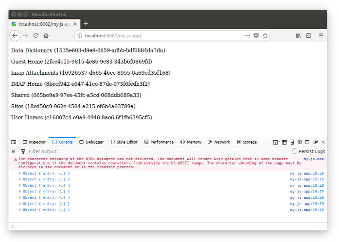
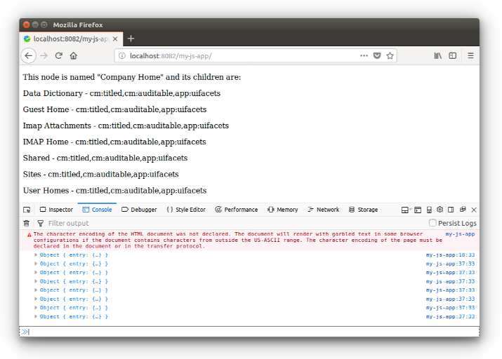

# JS-API を使用してノードを操作する

このチュートリアルでは、[`AlfrescoCoreRestApi`](https://github.com/Alfresco/alfresco-js-api/tree/master/src/alfresco-core-rest-api) の使用方法を学習します。

REST エンドポイントを直接使用せずに Alfresco Content Services のインスタンスと対話する方法を示すために、いくつかの実用的な例を開発しました。このアプローチでは、`AlfrescoCoreRestApi` は抽象化レイヤーとして使用され、[`alfresco-api-js`](https://github.com/Alfresco/alfresco-js-api) ライブラリのコアサービスの1つを定義します。

## 開発環境の準備

`AlfrescoCoreRestApi` の説明に焦点を当てるために、
[Alfresco JavaScript application](./creating-javascript-app-using-alfresco-js-api.md) を使用して開発します。
開発環境でまだ利用できない場合は、
[専用チュートリアル](./creating-javascript-app-using-alfresco-js-api.md)の *how-to* 説明を参照してください。

## `AlfrescoCoreRestApi` について

先に進む前に、`AlfrescoCoreRestApi` クラスを紹介しましょう。
実装の詳細については、[こちら](https://github.com/Alfresco/alfresco-js-api/tree/master/src/alfresco-core-rest-api)のドキュメントをご覧ください。
ご覧のとおり、利用可能なメソッドは、Rest Endpoints および Alfresco Content Services のサービスと1対1の関係にあります。
これにより、開発が簡単になり、開発者は Alfresco Content Services REST API に完全にアクセスできます。

最も基本的な [Alfresco JavaScript application](./creating-javascript-app-using-alfresco-js-api.md) から始めて、
`AlfrescoCoreRestApi` クラスには
次のコマンドでアクセスできます。

    this.alfrescoJsApi.core

## Retrieving the children of a node

`AlfrescoCoreRestApi` クラスの最初の使用例として、`-root-` エイリアスで識別されるルートノードの子を取得しましょう。公式ドキュメントで説明されているように、以下に説明するようにメソッド `getNodeChildren` を使用する必要があります。
以下に示すように `index.html` ファイルを編集し、ログイン呼び出しの JavaScript ソースコードを置き換えます。

```js
...
this.alfrescoJsApi.login('admin', 'admin').then(function (data) {

    this.alfrescoJsApi.core.childAssociationsApi.getNodeChildren('-root-', {}).then(

        function (data) {

            var divElement = document.getElementById("result");

            for (var i = 0; i < data.list.entries.length; i++) {

                console.log(data.list.entries[i]);

                var textElement = document.createTextNode(
                    data.list.entries[i].entry.name +
                    " (" +
                    data.list.entries[i].entry.id +
                    ")"
                );
                var paragraphElement = document.createElement("p");
                paragraphElement.appendChild(textElement);
                divElement.appendChild(paragraphElement);
            }
        },
        function (error) { console.error(error); });

    }, function (error) {
        console.error(error);
    });
...
```

そして、次のように HTML 本文を置き換えます。

```html
<body>
    <div id='result'></div>
</body>
```

完了したら、ターミナルの `my-js-app` フォルダーから次のコマンドを実行して、
[ここ](./creating-javascript-app-using-alfresco-js-api.md)で説明するように
ソースコードを保存してデプロイします。

    docker cp ../my-js-app <CONTAINER_ID>:/usr/local/tomcat/webapps

URL `http://localhost:8082/my-js-app/` でブラウザーを開くと、
次のスクリーンショットのようなものが表示されます。



演習として、ノード間のナビゲーションを実装してみることができます。
これを行うには、`nodeId` パラメーターを受け入れるようにページのソースコードを変更し、`getNodeChildren` メソッドの最初のパラメーターとして使用します。
次に、ダイナミック HTML を変更して、子の名前にリンク要素 (タグ) を作成します。
リンクは同じページを指しますが、
`nodeId` は `data.list.entries[i].entry.id` の値に設定されます。

## Retrieving the node data

ノードの子を表示できるようになったので (ボーナス演習を完了した場合はリポジトリ構造に移動することもできます)、ノードに関連するデータを取得して表示する方法を見てみましょう。

この例をより完全にするために、最終結果を2つの部分に分割します。
1つ目は現在のノードのデータの取得 (および表示) に関するもので、
2つ目は子ノードのデータの取得 (および表示) に関するものです。

どちらの場合も、ノード ID で識別されるノードの情報を取得する
[`getNode`](https://github.com/Alfresco/alfresco-js-api/blob/master/src/alfresco-core-rest-api/docs/NodesApi.md#getNode) メソッドのおかげで
すべてが可能です。

### Retrieving and showing data about the current node

前のセクションで開発した JavaScript アプリケーションから始めて、`function (data)` のソースコードを次のように変更しましょう。

```js
...
function (data) {

    var divElement = document.getElementById('nodeInfo');
    this.alfrescoJsApi.core.nodesApi.getNode(data.list.entries[0].entry.parentId, {}).then(function(nodeData) {

            console.log(nodeData);

            var textElement = document.createTextNode(
                'This node is named "' +
                nodeData.entry.name
                + '" and its children are:'
            );
            var paragraphElement = document.createElement('p');
            paragraphElement.appendChild(textElement);
            divElement.appendChild(paragraphElement);

    },
    function (error) { console.error(error); });

    ...
```

ソースコードのこの部分は、結果の最初のノードの親のノードデータを取得します。
もちろん、ノードに子がない場合、このコードは例外をスローする可能性があります。
演習として、この状況を正しく管理するためにソースコードを変更します。

取得されると、
現在のノードの名前がフォームに表示されます: `This node is named "..." and its children are:...`。
テキストを適切な場所に配置するには、HTML 本体を次のように変更します。

```html
<body>
    <div id='nodeInfo'></div>
    <div id='result'></div>
</body>
```

### Retrieving and showing data about the child nodes

次の JavaScript ソースコードを `function (data)` に追加します。

```js
...
var divElement = document.getElementById('result');
for (var i = 0; i < data.list.entries.length; i++) {

    this.alfrescoJsApi.core.nodesApi.getNode(data.list.entries[i].entry.id, {}).then(function(nodeData) {

        console.log(nodeData);

        var textElement = document.createTextNode(
            nodeData.entry.name +
            ' - ' + 
            nodeData.entry.aspectNames
        );
        var paragraphElement = document.createElement('p');
        paragraphElement.appendChild(textElement);
        divElement.appendChild(paragraphElement);

    }, function(error) { console.error(error); });

} 
```

ご覧のとおり、
このコードでは、各ノードに関する情報が取得され、
`<node name> - <list of aspect names>` という形式で表示されます。

### Showing the results

ターミナルの `my-js-app` フォルダーから次のコマンドを実行して、
ソースコードを再度保存してデプロイします。

    docker cp ../my-js-app <CONTAINER_ID>:/usr/local/tomcat/webapps

URL `http://localhost:8082/my-js-app/` でブラウザーを開くと、
次のスクリーンショットのようなものが表示されます。



