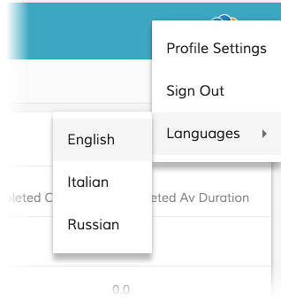

# Language Menu component

Displays all the languages that are present in the "app.config.json" or the defaul one (EN).


<!-- markdown-toc start - Don't edit this section.  npm run toc to generate it-->

<!-- toc -->

- [Basic usage](#basic-usage)
- [Details](#details)
- [Nested menu lanugages](#nested-menu-languages)
- [Nested menu details](#nested-menu-details)
<!-- tocstop -->

<!-- markdown-toc end -->

## Basic usage

How to attach an ADF Language Menu as main menu

```html
<button mat-icon-button [matMenuTriggerFor]="langMenu">
    <mat-icon>language</mat-icon>
</button>
<mat-menu #langMenu="matMenu">
    <adf-language-menu></adf-language-menu>
</mat-menu>
```

## Details

In the previous example we are using the ADF Language Menu as main menu.
The Language Menu component is able to fetch all the languages from the "app.config.json".
This is how the configuration looks like in the the "app.config.json"

```json
"languages": [
        {
            "key": "en",
            "label": "English"
        },
        {
            "key": "fr",
            "label": "French"
        },
        {
            "key": "it",
            "label": "Italian"
        }
    ]
```
In case no setting is provided, the component shows only the English language.

<!-- Don't edit the See also section. Edit seeAlsoGraph.json and run config/generateSeeAlso.js -->
<!-- seealso start -->

## Nested Menu lanugages

How to attach an ADF Language Menu as nested menu

```html
<button md-icon-button class="dw-profile-menu" [mdMenuTriggerFor]="profileMenu">
    <md-icon>more_vert</md-icon>
</button>
<md-menu #profileMenu="mdMenu">
    <button md-menu-item>profile-settings</button>
    <button md-menu-item [matMenuTriggerFor]="langMenu">Languages</button>
    <button md-menu-item>sign-out</button>
</md-menu>
<md-menu #langMenu="mdMenu">
    <adf-language-menu></adf-language-menu>
</md-menu>
```


## Nested menu details

In the previous example we are using the ADF Language Menu as nested menu.
<!-- seealso end -->
