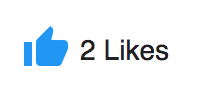

# ADF Like component

Allows a user to add "likes" to an item.



## Basic Usage

```html
<adf-like [nodeId]="nodeId"></adf-like>
```

### Properties

| Name | Type | Description |
| ---- | ---- | ----------- |
| nodeId | `string` | Identifier of a node to apply likes to.  |

### Events

| Name | Type | Description |
| ---- | ---- | ----------- |
| changeVote | `EventEmitter<{}>` | Emitted when the "vote" gets changed. |

## See also

-   [Rating component](rating.component.md)
-   [Rating service](rating.service.md)
