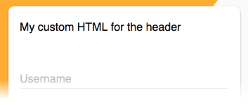
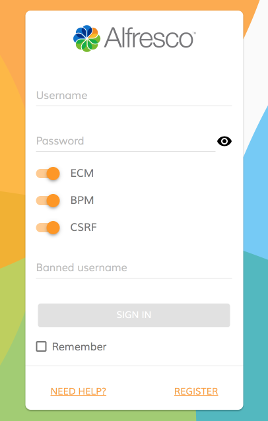
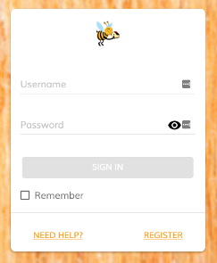

# Login component

Authenticates to Alfresco Content Services and Alfresco Process Services.


<!-- markdown-toc start - Don't edit this section.  npm run toc to generate it-->

<!-- toc -->

- [Basic usage](#basic-usage)
  * [Properties and events](#properties-and-events)
- [Details](#details)
  * [Handling events](#handling-events)
  * [Change footer content](#change-footer-content)
  * [Change header content](#change-header-content)
  * [Extra content](#extra-content)
  * [Custom logo and background](#custom-logo-and-background)
  * [Customize Validation rules](#customize-validation-rules)
  * [Controlling form submit execution behaviour](#controlling-form-submit-execution-behaviour)

<!-- tocstop -->

<!-- markdown-toc end -->

## Basic usage

```html
<adf-login 
    providers="ECM"
    successRoute="/home">
</adf-login>
```

### Properties and events

<!-- propsection start -->
See the documentation comments in the
[source file](../lib/core/login/components/login.component.ts)
for full descriptions of properties and events.
<!-- propsection end -->
## Details

### Handling events

**app.component.html**

```html
<adf-login 
    providers="ALL"
    (success)="mySuccessMethod($event)"
    (error)="myErrorMethod($event)">
</adf-login>
```

**app.component.ts**

```ts
export class AppComponent {

    mySuccessMethod($event) {
        console.log('Success Login EventEmitt called with: ' + $event.value);
    }

    myErrorMethod($event) {
        console.log('Error Login EventEmitt called with: ' + $event.value);
    }
}
```

### Change footer content


You can replace the entire content in the footer of the login component with your custom content.

```html
<adf-login ...>
    <login-footer><ng-template>My custom HTML for the footer</ng-template></login-footer>
</adf-login>`
```

### Change header content



You can replace the entire content in the header of the login component with your custom content.

```html
<adf-login ...>
    <login-header><ng-template>My custom HTML for the header</ng-template></login-header>
</adf-login>`
```

### Extra content

You can put additional html content between `alfresco-login` tags to get it rendered as part of the login dialog.
This becomes handy in case you need to extend it with custom input fields handled by your application or parent component:

```html
<adf-login ...>
    <div>
        <div>Your extra content</div>
    </div>
</adf-login>
```

Here's an example of custom content:



### Custom logo and background

It is possible changing logo and background images to custom values.

```html
<adf-login 
    [backgroundImageUrl]="'http://images.freeimages.com/images/previews/638/wood-wall-for-background-1634466.jpg'"
    [logoImageUrl]="'http://images.freeimages.com/images/previews/eac/honeybee-with-a-house-1633609.jpg'">
</adf-login>
```

Should give you something like the following:



Alternatively you can bind to your component properties and provide values dynamically if needed:

```html
<adf-login
    [backgroundImageUrl]="myCustomBackground"
    [logoImageUrl]="myCustomLogo">
</adf-login>
```

### Customize Validation rules

If needed it is possible to customise the validation rules of the login
form. You can add/modify the default rules of the login form.

**MyCustomLogin.component.html**

```html
<adf-login 
    [fieldsValidation]="customValidation"
    #alfrescologin>
</adf-login>
```

**MyCustomLogin.component.ts**

```ts
export class MyCustomLogin {
    
    @ViewChild('alfrescologin')
    alfrescologin: any;

    customValidation: any;

    constructor(public router: Router) {
        this.customValidation = {
            username: ['', Validators.compose([Validators.required, Validators.minLength(8), Validators.maxLength(10)])],
            password: ['', Validators.required]
        };
    }

    ngOnInit() {
        this.alfrescologin.addCustomValidationError('username', 'minlength', 'Username must be at least 8 characters.');
        this.alfrescologin.addCustomValidationError('username', 'maxlength', 'Username must not be longer than 11 characters.');
    }
}
```

### Controlling form submit execution behaviour

If absolutely needed it is possible taking full control over form 
submit execution by means of `executeSubmit` event. 
This event is fired on form submit.

You can prevent default behaviour by calling `event.preventDefault()`. 
This allows for example having custom form validation scenarios and/or additional validation summary presentation.

Alternatively you may want just running additional code without suppressing default one.

**MyCustomLogin.component.html**

```html
<adf-login 
    (executeSubmit)="validateForm($event)" 
    #alfrescologin>
</adf-login>
```

**MyCustomLogin.component.ts**

```ts
export class MyCustomLogin {

    validateForm(event: any) {
        let values = event.values;
        
        // check if the username is in the blacklist
        if (values.controls['username'].value === 'invalidUsername') {
            this.alfrescologin.addCustomFormError('username', 'the
            username is in blacklist');
            event.preventDefault();
        }
    }
    
}
```

**Please note that if `event.preventDefault()` is not called then default behaviour 
will also be executed after your custom code.**
