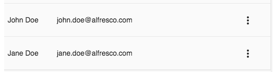

# People list component

Shows a list of users (people).



## Basic Usage

Populate the users in the component class:

```ts
import { UserProcessModel } from 'ng2-alfresco-core';

export class SomeComponent implements OnInit {

    people: UserProcessModel[] = [
        {
          id: 1,
          email: 'john.doe@alfresco.com',
          firstName: 'John',
          lastName: 'Doe'
        },
        {
          id: 2,
          email: 'jane.doe@alfresco.com',
          firstName: 'Jane',
          lastName: 'Doe'
        }
    ];
    
    onClickPeopleRow(user: UserProcessModel) {
        console.log('Clicked row: ', user);
    }
    
    onClickPeopleAction($event: Event) {
        console.log('Clicked action: ', $event);
    }
```

In the component template use the people list component:

```html
<adf-people-list
  [users]="people"
  [actions]="true"
  (clickRow)="onClickPeopleRow($event)"
  (clickAction)="onClickPeopleAction($event)">
  <data-columns>
    <data-column key="firstName" class="people-pic">
      <ng-template let-entry="$implicit">
          {{entry.row.obj.firstName + ' ' + entry.row.obj.lastName}}
      </ng-template>
    </data-column>
    <data-column key="email" class="full-width">
      <ng-template let-entry="$implicit">
        <div class="people-email">{{ entry.row.obj.email }}</div>
      </ng-template>
    </data-column>
  </data-columns>
</adf-people-list>
```
Note that the people list component is based on the `<adf-datatable` component.

### Properties

| Name | Type | Default | Description |
| --- | --- | --- | --- |
| users | UserProcessModel[] |  | The array of user data that should be used to populate the people list |
| actions | boolean | false | true if actions should be visible, i.e. the 'Three-Dots' menu |

### Events

| Name | Description |
| --- | --- |
| clickRow | Emitted when the user clicks a row in the people list. |
| clickAction | Emitted when the user clicks in the 'Three Dots' drop down menu for a row. |

<!-- seealso start -->

<!-- seealso end -->