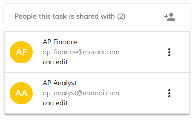
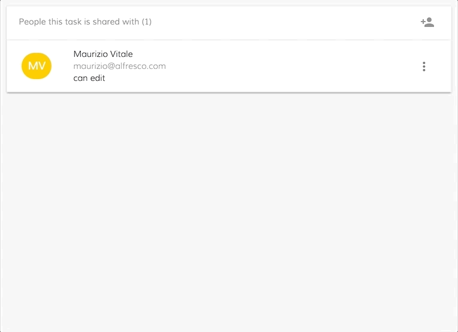
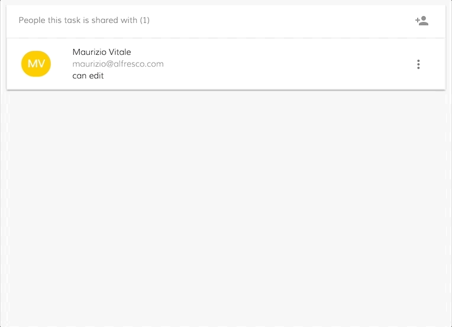

# Task People Component

Displays involved users to a specified task

<!-- markdown-toc start - Don't edit this section.  npm run toc to generate it-->

<!-- toc -->

- [Basic Usage](#basic-usage)
  * [Properties](#properties)
  * [Events](#events)
- [Details](#details)
  * [How to customize the people component behavior](#how-to-customize-the-people-component-behavior)
  * [Involve People single click and close search](#involve-people-single-click-and-close-search)
  * [Involve People single click without close search](#involve-people-single-click-without-close-search)
  * [Involve People double click and close search](#involve-people-double-click-and-close-search)
  * [Involve People double double without close search](#involve-people-double-double-without-close-search)

<!-- tocstop -->

<!-- markdown-toc end -->

## Basic Usage

```html
<adf-people 
    [people]="YOUR_INVOLVED_PEOPLE_LIST" 
    [taskId]="YOUR_TASK_ID"
    [readOnly]="YOUR_READ_ONLY_FLAG">
</adf-people>
```



### Properties

| Name | Type | Description |
| --- | --- | --- |
| people | User[] | The array of User object to display |
| taskId | string | The numeric ID of the task |
| readOnly | boolean | The boolean flag |

### Events

No Events

## Details

### How to customize the people component behavior

The people component provide two methods to customize the behavior:
- involveUserAndCloseSearch: The selected user is going to be added and the search section closed
- involveUserWithoutCloseSearch: The selected user is going to be added without close the search section

In this way will be easy customize the people component to involve the user with the single or double click event:

### Involve People single click and close search

```html
<adf-people #people
    (row-click)="people.involveUserAndCloseSearch()"
    [people]="YOUR_INVOLVED_PEOPLE_LIST"
    [taskId]="YOUR_TASK_ID"
    [readOnly]="YOUR_READ_ONLY_FLAG">
</adf-people>
```


### Involve People single click without close search

```html
<adf-people #people
    (row-click)="people.involveUserWithoutCloseSearch()"
    [people]="YOUR_INVOLVED_PEOPLE_LIST"
    [taskId]="YOUR_TASK_ID"
    [readOnly]="YOUR_READ_ONLY_FLAG">
</adf-people>
```


### Involve People double click and close search

```html
<adf-people #people
    (row-dblclick)="people.involveUserAndCloseSearch()"
    [people]="YOUR_INVOLVED_PEOPLE_LIST"
    [taskId]="YOUR_TASK_ID"
    [readOnly]="YOUR_READ_ONLY_FLAG">
</adf-people>
```



### Involve People double double without close search

```html
<adf-people #people
    (row-dblclick)="people.involveUserWithoutCloseSearch()"
    [people]="YOUR_INVOLVED_PEOPLE_LIST"
    [taskId]="YOUR_TASK_ID"
    [readOnly]="YOUR_READ_ONLY_FLAG">
</adf-people>
```


