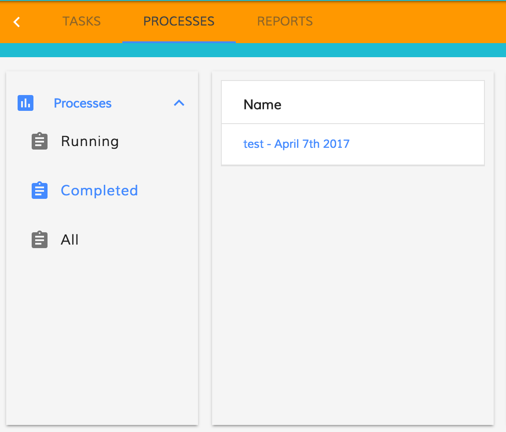

# Process Filters Component

Collection of criteria used to filter process instances, which may be customized by users.

<!-- markdown-toc start - Don't edit this section.  npm run toc to generate it-->

<!-- toc -->

- [Basic Usage](#basic-usage)
  * [Properties](#properties)
  * [Events](#events)
- [Details](#details)
  * [How filter the activiti process filters](#how-filter-the-activiti-process-filters)
  * [FilterParamsModel](#filterparamsmodel)
  * [How to create an accordion menu with the processes filter](#how-to-create-an-accordion-menu-with-the-processes-filter)

<!-- tocstop -->

<!-- markdown-toc end -->

## Basic Usage

```html
<adf-process-instance-filters
    appId="1001">
</adf-process-instance-filters>
```

### Properties

| Name | Type | Description |
| --- | --- | --- |
| filterParam | [FilterParamsModel](#filterparamsmodel) | The params to filter the task filter. If there is no match the default one (first filter of the list) is selected |
| appId | string | Display filters available to the current user for the application with the specified ID. |
| appName | string | Display filters available to the current user for the application with the specified name. |
| hasIcon | boolean | Toggle to show or not the filter's icon. |

If both `appId` and `appName` are specified then `appName` will take precedence and `appId` will be ignored.

### Events

| Name | Description |
| --- | --- |
| onSuccess | Raised when the list of filters has been successfully loaded from the server |
| onError | Raised when an error occurs |
| filterClick | Raised when the user selects a filter from the list |

## Details

This component displays a list of available filters and allows the user to select any given
filter as the active filter.

The most common usage is in driving a process instance list to allow the user to choose which
process instances are displayed in the list.

### How filter the activiti process filters

 ```html
<adf-process-instance-filters 
    [filterParam]="{index: 0}">
</adf-filters>
 ```

You can use inside the filterParam one of the properties defined by [FilterParamsModel](#filterparamsmodel) (see below).

### FilterParamsModel

```json
{
    "id": "number",
    "name": "string",
    "index": "number"
}
```

| Name | Type | Description |
| --- | --- | --- |
| id | string | The id of the task filter. |
| name | string | The name of the task filter, lowercase is checked. |
| index | number | Zero-based position of the filter in the array. |

### How to create an accordion menu with the processes filter

You can create an accordion menu using the AccordionComponent that wrap the activiti task filter.
The AccordionComponent is exposed by the alfresco-core.

```html
<adf-accordion>
    <adf-accordion-group 
        [heading]="'Processes'" 
        [isSelected]="true" 
        [headingIcon]="'assessment'">
        <adf-process-instance-filters
            [appId]="appId"
            (filterClick)="onProcessFilterClick($event)"
            (onSuccess)="onSuccessProcessFilterList($event)">
        </adf-process-instance-filters>
    </adf-accordion-group>
</adf-accordion>
```


