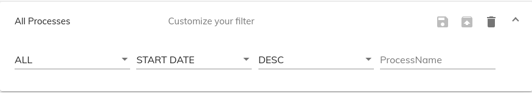

# [Edit Process Filter Cloud component](../../../lib/process-services-cloud/src/lib/process/process-filters/components/edit-process-filter-cloud.component.ts "Defined in edit-process-filter-cloud.component.ts")

Shows/edits process filter details.



## Contents

*   [Basic Usage](#basic-usage)
*   [Class members](#class-members)
    *   [Properties](#properties)
    *   [Events](#events)
*   [Details](#details)
    *   [Editing APS2 process filters](#editing-aps2-process-filters)
    *   [Filter properties](#filter-properties)
    *   [Sort properties](#sort-properties)
    *   [Action properties](#action-properties)
*   [Saving custom filters](#saving-custom-filters)
*   [See also](#see-also)

## Basic Usage

```html
<adf-cloud-edit-process-filter
    [id]="processFilterId"
    [appName]="appName"
    [filterProperties]="filterProperties"
    (filterChange)="onFilterChange($event)"
    (action)="onAction($event)">
</adf-cloud-edit-process-filter>
```

## Class members

### Properties

| Name | Type | Default value | Description |
| --- | --- | --- | --- |
| actions | `string[]` |  | List of sort actions. |
| appName | `string` | "" | The name of the application. |
| filterProperties | `string[]` |  | List of process filter properties to display |
| id | `string` |  | Id of the process instance filter. |
| role | `string` | "" | roles to filter the apps |
| showFilterActions | `boolean` | true | Toggles editing of process filter actions. |
| showProcessFilterName | `boolean` | true | Toggles the appearance of the process filter name . |
| showTitle | `boolean` | true | Toggles editing of the process filter title. |
| sortProperties | `string[]` |  | List of sort properties to display. |

### Events

| Name | Type | Description |
| --- | --- | --- |
| action | [`EventEmitter`](https://angular.io/api/core/EventEmitter)`<`[`ProcessFilterAction`](../../../lib/process-services-cloud/src/lib/process/process-filters/models/process-filter-cloud.model.ts)`>` | Emitted when a filter action occurs i.e Save, SaveAs, Delete. |
| filterChange | `EventEmitter<ProcessFilterCloudModel>` | Emitted when a process instance filter property changes. |

## Details

### Editing APS2 process filters

Use the `appName` and `id` properties to choose which process filter to edit:

```html
<adf-cloud-edit-process-filter
    [id]="processFilterId"
    [appName]="appName">
</adf-cloud-edit-process-filter>
```

### Filter properties

You can supply various *filter properties* to edit. These will determine
which processes are found by a filter. The full set of properties is
given below:

| Name                       | Description                                                                                                                                |
| -------------------------- | ------------------------------------------------------------------------------------------------------------------------------------------ |
| ***appName***              | Name of the app                                                                                                                            |
| ***id***                   | Process instance ID                                                                                                                        |
| ***name***                 | Process name.                                                                                                                              |
| ***initiator***            | ID of the user who initiated the process                                                                                                   |
| ***status***               | Execution status of the process.                                                                                                           |
| ***processDefinitionId***  | Process definition ID                                                                                                                      |
| ***processDefinitionKey*** | Process definition key                                                                                                                     |
| ***lastModified***         | Date the process was last modified. If lastModified defined the component will show the range ***lastModifiedTo***, ***lastModifiedFrom*** |
| ***sort***                 | Field on which the filter results will be sorted. Can be "id", "name", "status", "startDate".                                              |
| ***order***                | Sort ordering of the filter results (this doesn't participate in the filtering itself)                                                     |

By default, the ***status***, ***sort*** and ***order*** properties are
displayed in the editor. However, you can also choose which properties
to show using the `filterProperties` array.
For example, the code below initializes the editor with the ***appName***,
***id***, ***name*** and ***lastModified*** properties:

```ts
export class SomeComponent implements OnInit {

    filterProperties: string[] = [
        "appName",
        "id",
        "name",
        "lastModified"
    ];

    onFilterChange(filter: ProcessFilterCloudModel) {
        console.log('On filter change: ', filter);
    }

    onAction($event: ProcessFilterAction) {
        console.log('Clicked action: ', $event);
    }
```

```html
<adf-cloud-edit-process-filter
    [id]="processFilterId"
    [appName]="applicationName"
    [filterProperties]="filterProperties">
</adf-cloud-edit-process-filter>
```

With this configuration, only the four listed properties will be shown.

### Sort properties

You can supply a list of *sort properties* to sort the processes. You can use
any of the [filter properties](#filter-properties) listed above as
sort properties and you can also use the process's ***startDate***.

By default, the ***id***, ***name***, ***status*** and ***startDate*** properties are
displayed in the editor. However, you can also choose which sort properties
to show using the `sortProperties` array.
For example, the code below initializes the editor with the ***startDate*** and ***lastModified*** properties:

```ts
export class SomeComponent implements OnInit {

    sortProperties: string[] = [
        "startDate",
        "lastModified"];

    onFilterChange(filter: ProcessFilterCloudModel) {
        console.log('On filter change: ', filter);
    }

    onAction($event: ProcessFilterAction) {
        console.log('Clicked action: ', $event);
    }
```

```html
<adf-cloud-edit-process-filter
    [id]="processFilterId"
    [appName]="applicationName"
    [sortProperties]="sortProperties">
</adf-cloud-edit-process-filter>
```

With this configuration, only the two listed sort properties will be shown.

### Action properties

You can supply various *actions* to apply on process filter.

| Name         | Description                   |
| ------------ | ----------------------------- |
| ***save***   | Save process filter.          |
| ***saveAs*** | Creates a new process filter. |
| ***delete*** | Delete process filter.        |

By default, the ***save***, ***saveAs*** and ***delete*** actions are
displayed in the editor. However, you can also choose which actions to
show using the `actions` array.
For example, the code below initializes the editor with the ***save*** and ***delete*** actions:

```ts
export class SomeComponent implements OnInit {

    actions: string[] = ['save', 'delete'];

    onFilterChange(filter: ProcessFilterCloudModel) {
        console.log('On filter change: ', filter);
    }

    onAction($event: ProcessFilterAction) {
        console.log('Clicked action: ', $event);
    }
```

```html
<adf-cloud-edit-process-filter
    [id]="processFilterId"
    [appName]="applicationName"
    [actions]="actions">
</adf-cloud-edit-process-filter>
```

With this configuration, only the two actions will be shown.

## Saving custom filters

Users can save a filter if they make any changes to it in an application using the **Save** icon. How it is saved is dictated by the Activiti version used:

*   An Activiti 7 community version stores saved filters in the local browser storage. This restricts a user's custom filters to that single session.

*   An Activiti Enterprise version uses the preference service to store saved filters. This allows for user's custom filters to be available between sessions and between devices.

## See also

*   [Edit task filter cloud component](edit-task-filter-cloud.component.md)
*   [Process Filter Cloud Service](../services/process-filter-cloud.service.md)
*   [Local preference Cloud Service](../services/local-preference-cloud.service.md)
*   [User preference Cloud Service](../services/user-preference-cloud.service.md)
