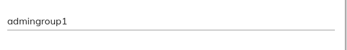

# [Group Cloud component](../../../lib/process-services-cloud/src/lib/group/components/group-cloud.component.ts "Defined in group-cloud.component.ts")

Searches Groups.

## Basic Usage

```html
<adf-cloud-group
    [appName]="'simple-app'"
    [mode]="'multiple'">
</adf-cloud-group>
```


## Class members

### Properties

| Name | Type | Default value | Description |
| ---- | ---- | ------------- | ----------- |
| appName | `string` |  | Name of the application. If specified this shows the groups who have access to the app. |
| readOnly | `boolean` | false | readOnly mode (true/false). |
| mode | `string` |  | User selection mode (single/multiple). |
| preSelectGroups | [`IdentityGroupModel`](../../../lib/core/models/identity-group.model.ts)`[]` | \[] | Array of groups to be pre-selected. This pre-selects all groups in multi selection mode and only the first group of the array in single selection mode. |
| roles | `string[]` | \[] | Role names of the groups to be listed. |
| searchGroupsControl | `FormControl` | new FormControl() | FormControl to search the group |
| title | `string` |  | Title of the field |

### Events

| Name | Type | Description |
| ---- | ---- | ----------- |
| removeGroup | [`EventEmitter`](https://angular.io/api/core/EventEmitter)`<`[`IdentityGroupModel`](../../../lib/core/models/identity-group.model.ts)`>` | Emitted when a group is removed. |
| selectGroup | [`EventEmitter`](https://angular.io/api/core/EventEmitter)`<`[`IdentityGroupModel`](../../../lib/core/models/identity-group.model.ts)`>` | Emitted when a group is selected. |

## Details

### Selection Mode

You can specify either single selection or multiple selection (single
is the default):

#### Single selection

```html
<adf-cloud-group></adf-cloud-group>
```



#### Multiple selection

```html
<adf-cloud-group
    [mode]="'multiple'">
</adf-cloud-group>
```


### Pre-selection

Usage example:

```ts
import { ObjectDataTableAdapter }  from '@alfresco/adf-core';

@Component({...})
export class MyComponent {
    groups: any;

    constructor() {
        this.groups =
            [
                {id: 1, name: 'Group 1'},
                {id: 2, name: 'Group 2'}
            ];
    }
}
```

```html
<adf-cloud-group
    [mode]="'multiple'"
    [preSelectGroups]="groups">
</adf-cloud-group>
```

### Read-only

You can use `readonly` property to set the component in `readonly` mode. Readonly mode will disable any interaction with the component.

```html
<adf-cloud-group
    [appName]="'simple-app'"
    [mode]="'multiple'"
    [preSelectGroups]="groups"
    [readOnly]="true">
</adf-cloud-group>
```

If you want to manage each group seperately you can set their readonly property at your preference.
You need to have component's readonly property set to false. Component's readonly mode overwrites groups level.

You can use `readonly` property to make preselected groups read-only in `multiple` mode.

Usage example:

```ts
import { ObjectDataTableAdapter }  from '@alfresco/adf-core';

@Component({...})
export class MyComponent {
    groups: any;

    constructor() {
        this.groups =
            [
                {id: 1, name: 'Group 1', readonly: true},
                {id: 2, name: 'Group 2', readonly: false}
            ];
    }
}
```

```html
<adf-cloud-group
    [mode]="'multiple'"
    [preSelectGroups]="groups">
</adf-cloud-group>
```

from above `preSelectGroups`, `Group 2` is removable from the `preSelectGroups` whereas `Group 1` is readonly you can not remove them.
