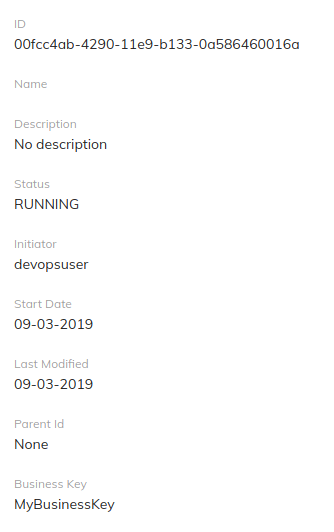

# [Process Header Cloud Component](../../../lib/process-services-cloud/src/lib/process/process-header/components/process-header-cloud.component.ts "Defined in process-header-cloud.component.ts")

Shows all the information related to a process instance.



## Basic Usage

```html
<adf-cloud-process-header
    [appName]="appName"
    [processInstanceId]="processInstanceId">
</adf-cloud-process-header>
```

## Class members

### Properties

| Name | Type | Default value | Description |
| ---- | ---- | ------------- | ----------- |
| appName | `string` | "" | (Required) The name of the application. |
| processInstanceId | `string` |  | (Required) The id of the process instance. |

## Details

The component populates an internal array of
[`CardViewModel`](../../core/components/card-view.component.md) with the information to display.

By default all properties are displayed:

**_id_**, **_name_**, **_status_**, **_initiator_**, **_startDate_**, **_lastModified_**, **_parentId_**, **_businessKey_**.

However, you can also choose which properties to show using a configuration in `app.config.json`:

```json
    "adf-cloud-process-header": {
        "presets": {
            "properties" : [ "name", "status", "initiator", "parentId"]
        }
    }
```

With this configuration, only the four listed properties will be shown.

You can also define the date format of the date properties using a configuration in `app.config.json`:

```json
    "adf-cloud-process-header": {
      "defaultDateFormat": "full"
    }
```

## See also

-   [Process header cloud service](../../process-services-cloud/services/process-header-cloud.service.md)
