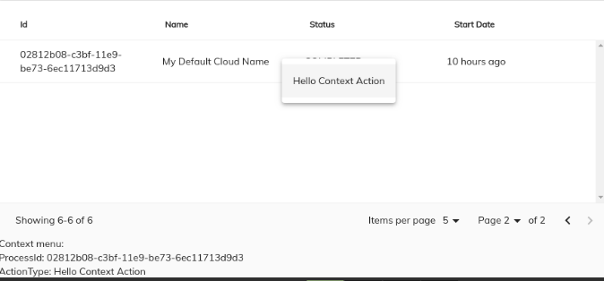
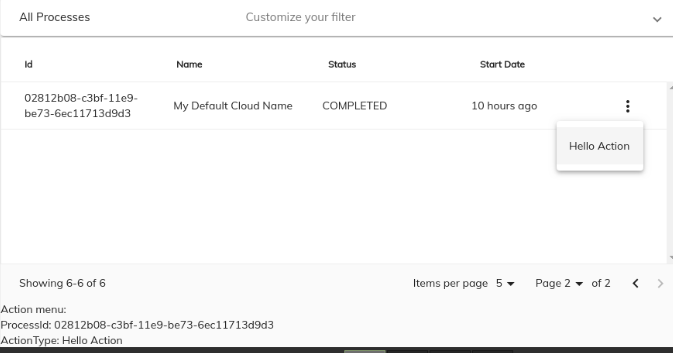

# [Process Instance List Cloud component](../../../lib/process-services-cloud/src/lib/process/process-list/components/process-list-cloud.component.ts "Defined in process-list-cloud.component.ts")

Renders a list containing all the process instances matched by the parameters specified.

## Contents

-   [Basic Usage](#basic-usage)
    -   [Transclusions](#transclusions)
-   [Class members](#class-members)
    -   [Properties](#properties)
    -   [Events](#events)
-   [Details](#details)
    -   [Setting Sorting Order for the list](#setting-sorting-order-for-the-list)
    -   [Pagination strategy](#pagination-strategy)
-   [See also](#see-also)

## Basic Usage

**app.component.html**

```html
<adf-cloud-process-list
    [appName]="'app-name'">
</adf-cloud-process-list>
```

### [Transclusions](../../user-guide/transclusion.md)

Any content inside an `<adf-custom-empty-content>` sub-component will be shown
when the process list is empty:

```html
<adf-cloud-process-list>
    <adf-custom-empty-content>
        Your Content
    </adf-custom-empty-content>
<adf-cloud-process-list>
```

## Class members

### Properties

| Name | Type | Default value | Description |
| ---- | ---- | ------------- | ----------- |
| actionsPosition | `string` | "right" | Position of the actions dropdown menu. Can be "left" or "right". |
| appName | `string` | "" | The name of the application. |
| appVersion | `number \| number[]` |  | The version of the application. |
| businessKey | `string` | "" | Filter the processes to display only the ones with this businessKey value. |
| completedDate | `string` | "" | Filter the processes. Display only process with completedDate equal to the supplied date. |
| completedFrom | `string` | "" | Filter the processes. Display only process with completedFrom equal to the supplied date. |
| completedTo | `string` | "" | Filter the processes. Display only process with completedTo equal to the supplied date. |
| environmentId | `string` |  | Filter the processes to display only the ones with this environment ID. |
| id | `string` | "" | Filter the processes to display only the ones with this ID. |
| initiator | `string` | "" | Name of the initiator of the process. |
| isResizingEnabled | `boolean` | false | Toggles main datatable column resizing feature. |
| lastModifiedFrom | `Date` |  | Filter the processes. Display only process with lastModifiedTo equal to the supplied date. |
| lastModifiedTo | `Date` |  | Filter the processes. Display only process with lastModifiedTo equal to the supplied date. |
| multiselect | `boolean` | false | Toggles multiple row selection and renders checkboxes at the beginning of each row |
| name | `string` | "" | Filter the processes to display only the ones with this name. |
| presetColumn | `string` |  | Custom preset column schema in JSON format. |
| processDefinitionId | `string` | "" | Filter the processes to display only the ones with this process definition ID. |
| processDefinitionKey | `string` | "" | Filter the processes to display only the ones with this process definition key. |
| processDefinitionName | `string` | "" | Filter the processes to display only the ones with this process definition name. |
| selectionMode | `string` | "single" | Row selection mode. Can be "none", "single" or "multiple". For multiple mode, you can use Cmd (macOS) or Ctrl (Win) modifier key to toggle selection for multiple rows. |
| showActions | `boolean` | false | Toggles the data actions column. |
| showContextMenu | `boolean` | false | Toggles custom context menu for the component. |
| showMainDatatableActions | `boolean` | false | Toggle main datatable actions. |
| sorting | [`ProcessListCloudSortingModel`](../../../lib/process-services-cloud/src/lib/process/process-list/models/process-list-sorting.model.ts)`[]` |  | Array of objects specifying the sort order and direction for the list. The sort parameters are for BE sorting. |
| startFrom | `string` | "" | Filter the processes. Display only process with startedDate greater then the supplied date. |
| startTo | `string` | "" | Filter the processes. Display only process with startedDate less than the supplied date. |
| status | `string` | "" | Filter the processes to display only the ones with this status. |
| stickyHeader | `boolean` | false | Toggles the sticky header mode. |
| suspendedFrom | `string` | "" | Filter the processes. Display only process with suspendedFrom equal to the supplied date. |
| suspendedTo | `string` | "" | Filter the processes. Display only process with suspendedTo equal to the supplied date. |

### Events

| Name | Type | Description |
| ---- | ---- | ----------- |
| error | [`EventEmitter`](https://angular.io/api/core/EventEmitter)`<any>` | Emitted when an error occurs while loading the list of process instances from the server. |
| executeRowAction | [`EventEmitter`](https://angular.io/api/core/EventEmitter)`<`[`DataRowActionEvent`](../../../lib/core/src/lib/datatable/components/data-row-action.event.ts)`>` | Emitted when the user executes a row action. |
| rowClick | [`EventEmitter`](https://angular.io/api/core/EventEmitter)`<string>` | Emitted when a row in the process list is clicked. |
| rowsSelected | [`EventEmitter`](https://angular.io/api/core/EventEmitter)`<any[]>` | Emitted when rows are selected/unselected. |
| showRowActionsMenu | [`EventEmitter`](https://angular.io/api/core/EventEmitter)`<`[`DataCellEvent`](../../../lib/core/src/lib/datatable/components/data-cell.event.ts)`>` | Emitted before the actions menu is displayed for a row. |
| showRowContextMenu | [`EventEmitter`](https://angular.io/api/core/EventEmitter)`<`[`DataCellEvent`](../../../lib/core/src/lib/datatable/components/data-cell.event.ts)`>` | Emitted before the context menu is displayed for a row. |
| success | [`EventEmitter`](https://angular.io/api/core/EventEmitter)`<any>` | Emitted when the list of process instances has been loaded successfully from the server. |

## Details

You can define a custom schema for the list in the `app.config.json` file and access it with the
`presetColumn` property as shown below:

```json
"`adf-cloud-process-list`": {
        "presets": {
            "customSchema": [
            {
                    "key": "name",
                    "type": "text",
                    "title": "name",
                    "sortable": true
            }],
            "default": [
                {
                    "key": "name",
                    "type": "text",
                    "title": "name",
                    "sortable": true
            }],
        }
}
```

```html
<adf-cloud-process-list
    [appName]="'appName'">
</adf-cloud-process-list>
```

You can also define the schema in the HTML using the
[Data column component](../../core/components/data-column.component.md). You can combine this with schema
information defined in `app.config.json` as in the example below:

```json
"adf-cloud-process-list": {
        "presets": {
            "customSchema": [
            {
                    "key": "id",
                    "type": "text",
                    "title": "Id",
                    "sortable": true
            }],
            "default": [
                {
                    "key": "name",
                    "type": "text",
                    "title": "name",
                    "sortable": true
            }],
        }
}
```

<!--  -->

```html
<adf-cloud-process-list
    [appName]="'appName'" >
    <data-columns>
        <data-column key="key" title="title" class="full-width name-column">
            <ng-template let-entry="$implicit">
                    <div>{{getFullName(entry.row.obj.assignee)}}</div>
            </ng-template>
        </data-column>
    </data-columns>
</adf-cloud-process-list>
```

These are all the available columns that can be displayed in this component:
**_appName_**, **_businessKey_**, **_description_**, **_id_**, **_initiator_**, **_lastModified_**, **_processName_**, **_parentId_**, **_processDefinitionId_**, **_processDefinitionKey_**, and **_status_**.

### Setting Sorting Order for the list

You can specify a sorting order as shown in the example below:

```ts
let sorting = [{ orderBy: 'status', direction: 'desc' }];
```

```html
<adf-cloud-process-list
    [appName]="'appName'"
    [sort]="sorting">
</adf-cloud-process-list>
```

<!--  -->

### Pagination strategy

The Process Instance List also supports pagination:

```html
<adf-cloud-process-list
    [appName]="'myApp'"
    #processList>
</adf-cloud-process-list>
<adf-pagination
    *ngIf="processList"
    [target]="processList"
    [supportedPageSizes]="supportedPages"
    #processListPagination>
</adf-pagination>
```

The configuration related to the pagination can be changed from the `app.config.json`, as described in the example below:

```json
"pagination": {
        "size": 20, 
        "supportedPageSizes": [ 5, 10, 15, 20 ] 
},
```

#### showRowContextMenu event

Emitted before the context menu is displayed for a row.

Note that the ProcessListCloud itself does not populate the context menu with items.
You can provide all necessary content via the handler.

```html
<adf-cloud-process-list
    [contextMenu]="true"
    (showRowContextMenu)="onShowRowContextMenu($event)">
</adf-cloud-process-list>
```

Event properties:

```ts
value: {
    row: DataRow,
    col: DataColumn,
    actions: []
}
```

Handler example:

```ts
onShowRowContextMenu(event: DataCellEvent) {
    event.value.actions = [
        {  title: 'Hello Context Action' },
        { ... }
    ]
}
```



This event is cancellable. You can use `event.preventDefault()` to prevent the default behavior.

The ProcessListCloud will automatically render the supplied menu items.

See the [ContextMenu](https://www.npmjs.com/package/ng2-alfresco-core)
documentation for more details on the format and behavior of context actions.

#### showRowActionsMenu event

Emitted before the actions menu is displayed for a row.
Requires the `actions` property to be set to `true`.

Event properties:

```ts
value: {
    row: DataRow,
    action: any
}
```

Note that the ProcessListCloud itself does not populate the action menu with items.
You can provide all necessary content via the handler.

This event is cancellable. You can use `event.preventDefault()` to prevent the default behavior.

#### executeRowAction event

Emitted when the user executes a row action.

This usually accompanies a `showRowActionsMenu` event.
The ProcessListCloud itself does not execute actions but provides support for external
integration. If actions are provided using the `showRowActionsMenu` event
then `executeRowAction` will be automatically executed when the user clicks a
corresponding menu item.

```html
<adf-cloud-process-list
    [actions]="true"
    (showRowActionsMenu)="onShowRowActionsMenu($event)"
    (executeRowAction)="onExecuteRowAction($event)">
</adf-cloud-process-list>
```

```ts
import { DataCellEvent, DataRowActionEvent } from '@alfresco/adf-core';

onShowRowActionsMenu(event: DataCellEvent) {
    let myAction = {
        title: 'Hello Action'
        // your custom metadata needed for onExecuteRowAction
    };
    event.value.actions = [
        myAction
    ];
}

onExecuteRowAction(event: DataRowActionEvent) {
    let args = event.value;
    console.log(args.row);
    console.log(args.action);
    window.alert(`My custom action: ${args.action.title}`);
}
```



You can use any payloads for row actions. The only requirement for the objects is that they
must have a `title` property.

When an action is selected in the dropdown menu, the ProcessListCloud invokes the `executeRowAction` event.
Use this to handle the response, inspect the action payload (and all custom properties defined
earlier), and perform the corresponding actions.

## See also

-   [Data column component](../../core/components/data-column.component.md)
-   [Data Table Adapter interface](../../core/interfaces/datatable-adapter.interface.md)
-   [Pagination component](../../core/components/pagination.component.md)
