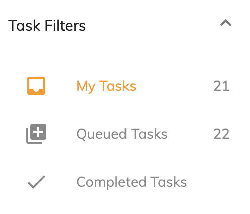
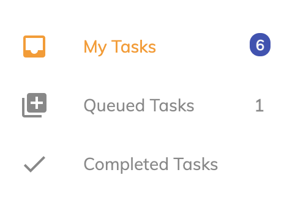

# [Task Filters Cloud component](../../../lib/process-services-cloud/src/lib/task/task-filters/components/task-filters-cloud.component.ts "Defined in task-filters-cloud.component.ts")

Shows all available filters.

## Contents

-   [Basic Usage](#basic-usage)
-   [Class members](#class-members)
    -   [Properties](#properties)
    -   [Events](#events)
-   [Details](#details)
    -   [Filtering APS2 task filters](#filtering-aps2-task-filters)
    -   [Showing Filter Counters](#showing-filter-counters)
    -   [Updating Filter Counters](#updating-filter-counters)
-   [See also](#see-also)

## Basic Usage

```html
<adf-cloud-task-filters></adf-cloud-task-filters>
```

## Class members

### Properties

| Name | Type | Default value | Description |
| ---- | ---- | ------------- | ----------- |
| appName | `string` | "" | Display filters available to the current user for the application with the specified name. |
| filterParam | [`FilterParamsModel`](../../../lib/process-services/src/lib/task-list/models/filter.model.ts) |  | Parameters to use for the task filter cloud. If there is no match then the default filter (the first one in the list) is selected. |
| showIcons | `boolean` | false | Toggles display of the filter's icons. |

### Events

| Name | Type | Description |
| ---- | ---- | ----------- |
| error | [`EventEmitter`](https://angular.io/api/core/EventEmitter)`<any>` | Emitted when an error occurs during loading. |
| filterClicked | [`EventEmitter`](https://angular.io/api/core/EventEmitter)`<`[`TaskFilterCloudModel`](../../../lib/process-services-cloud/src/lib/task/task-filters/models/filter-cloud.model.ts)`>` | Emitted when a filter is being clicked from the UI. |
| filterCounterUpdated | [`EventEmitter`](https://angular.io/api/core/EventEmitter)`<`[`TaskCloudEngineEvent`](../../../lib/process-services-cloud/src/lib/models/engine-event-cloud.model.ts)`[]>` | Emitted when filter counters are updated. |
| filterSelected | [`EventEmitter`](https://angular.io/api/core/EventEmitter)`<`[`TaskFilterCloudModel`](../../../lib/process-services-cloud/src/lib/task/task-filters/models/filter-cloud.model.ts)`>` | Emitted when a filter is being selected based on the filterParam input. |
| success | [`EventEmitter`](https://angular.io/api/core/EventEmitter)`<any>` | Emitted when the list is loaded. |

## Details

### Filtering APS2 task filters

Use the `filterParam` property to restrict the range of filters that are shown:

```html
<adf-cloud-task-filters
   [filterParam]="{name:'My tasks'}">
</adf-cloud-task-filters>
```

You can use properties from [`FilterParamsModel`](../../../lib/process-services/src/lib/task-list/models/filter.model.ts)
as the value of `filterParam` as shown in the table below:

| Name | Type | Description |
| ---- | ---- | ----------- |
| id | string | The id of the task filter |
| name | string | The name of the task filter, lowercase is checked |
| key | string | The key of the task filter |
| index | string | The zero-based position of the filter in the array |

### Showing Filter Counters

By default, filter counters are hidden. If you want to display filter counters you will need to add the `showCounter` property set to `true` in your [`TaskFilterCloudModel`](../../../lib/process-services-cloud/src/lib/task/task-filters/models/filter-cloud.model.ts). 



### Updating Filter Counters

If you want to disable notification bubbles as task filters change you can change it directly  from the app.config.json.

```json
{
    ...
    "notifications": true
    ...
}
```



## See also

-   [Task filter Cloud Service](../services/task-filter-cloud.service.md)
-   [Local preference Cloud Service](../services/local-preference-cloud.service.md)
-   [User preference Cloud Service](../services/user-preference-cloud.service.md)
