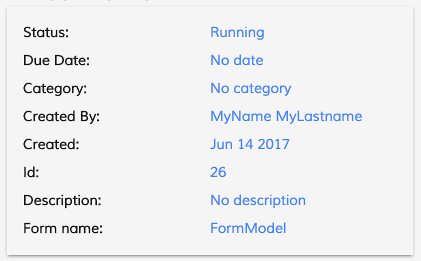

# [Task Header Cloud Component](../../../lib/process-services-cloud/src/lib/task/task-header/components/task-header-cloud.component.ts "Defined in task-header-cloud.component.ts")

Shows all the information related to a task.



## Basic Usage

```html
<adf-cloud-task-header
    [appName]="appName"
    [taskId]="taskId">
</adf-cloud-task-header>
```

## Class members

### Properties

| Name | Type | Default value | Description |
| --- | --- | --- | --- |
| appName | `string` | "" | (Required) The name of the application. |
| showTitle | `boolean` | true | Show/Hide the task title |
| taskId | `string` |  | (Required) The id of the task. |

### Events

| Name | Type | Description |
| --- | --- | --- |
| claim | [`EventEmitter`](https://angular.io/api/core/EventEmitter)`<any>` | Emitted when the task is claimed. |
| error | [`EventEmitter`](https://angular.io/api/core/EventEmitter)`<any>` | Emitted when the given task has errors. |
| unclaim | `EventEmitter<any>` | Emitted when the task is unclaimed (ie, requeued). |

## Details

The component populates an internal array of
[CardViewModel](../../core/components/card-view.component.md) with the information that we want to display.

By default all properties are displayed:

***assignee***, ***status***, ***priority***, ***dueDate***, ***category***, ***parentName***, ***created***, ***id***, ***description***, ***formName***, ***candidateUsers***, ***candidateGroups***.

However, you can also choose which properties to show using a configuration in `app.config.json`:

```json
    "adf-cloud-task-header": {
        "presets": {
            "properties" : [ "assignee", "status", "priority", "parentName"]
        }
    }
```

With this configuration, only the four listed properties will be shown.
