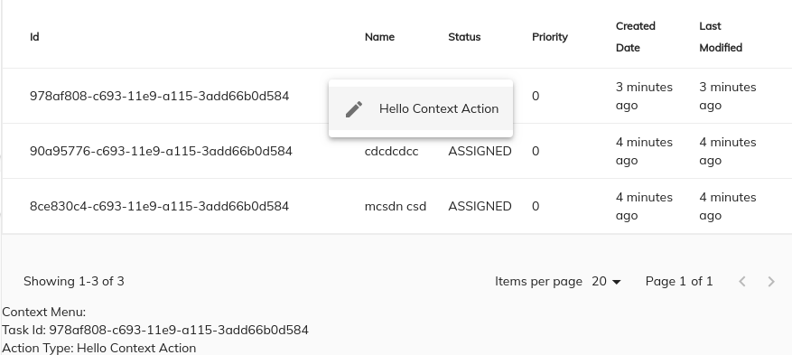
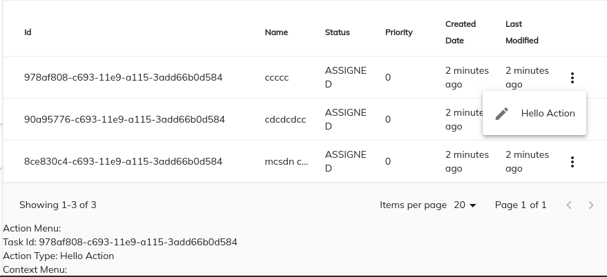

# [Task List Cloud component](../../../lib/process-services-cloud/src/lib/task/task-list/components/task-list-cloud.component.ts "Defined in task-list-cloud.component.ts")

Renders a list containing all the tasks matched by the parameters specified.

## Contents

-   [Basic Usage](#basic-usage)
    -   [Transclusions](#transclusions)
-   [Class members](#class-members)
    -   [Properties](#properties)
    -   [Events](#events)
-   [Details](#details)
    -   [Setting the column schema](#setting-the-column-schema)
    -   [Setting Sorting Order for the list](#setting-sorting-order-for-the-list)
    -   [Pagination strategy](#pagination-strategy)
    -   [DataTableAdapter example](#datatableadapter-example)
    -   [DataColumn Features](#datacolumn-features)
-   [See also](#see-also)

## Basic Usage

```html
<adf-cloud-task-list
    [appName]="'APPLICATION-NAME'" >
</adf-cloud-task-list>
```

### [Transclusions](../../user-guide/transclusion.md)

Any content inside an `<adf-custom-empty-content>` sub-component will be shown
when the task list is empty:

```html
<adf-cloud-task-list>
    <adf-custom-empty-content>
        Your Content
    </adf-custom-empty-content>
<adf-cloud-task-list>
```

## Class members

### Properties

| Name | Type | Default value | Description |
| ---- | ---- | ------------- | ----------- |
| actionsPosition | `string` | "right" | Position of the actions dropdown menu. Can be "left" or "right". |
| appName | `string` | "" | The name of the application. |
| assignee | `string` | "" | The assignee of the process. Possible values are: "assignee" (the current user is the assignee), "candidate" (the current user is a task candidate", "group_x" (the task is assigned to a group where the current user is a member, no value (the current user is involved). |
| candidateGroupId | `string` | "" | Filter the tasks. Display only tasks with candidateGroups equal to the supplied value. |
| completedBy | `number` |  | Filter the tasks. Display only tasks with createdBy equal to the supplied value. |
| completedDate | `string` | "" | Filter the tasks. Display only tasks with completedDate equal to the supplied date. |
| completedFrom | `string` | "" | Filter the tasks. Display only tasks with completedFrom equal to the supplied date. |
| completedTo | `string` | "" | Filter the tasks. Display only tasks with completedTo equal to the supplied date. |
| createdDate | `Date` |  | Filter the tasks. Display only tasks created on the supplied date. |
| createdFrom | `string` | "" | Filter the tasks. Display only tasks with createdFrom equal to the supplied date. |
| createdTo | `string` | "" | Filter the tasks. Display only tasks with createdTo equal to the supplied date. |
| dueDate | `Date` |  | Filter the tasks. Display only tasks with dueDate equal to the supplied date. |
| dueDateFrom | `string` | "" | Filter the tasks. Display only tasks with dueDate greater or equal than the supplied date. |
| dueDateTo | `string` | "" | Filter the tasks. Display only tasks with dueDate less or equal to the supplied date. |
| environmentId | `string` |  | Filter the tasks to display only the ones with this environment ID. |
| id | `string` | "" | Filter the tasks. Display only tasks with id equal to the supplied value. |
| isResizingEnabled | `boolean` | false | Toggles main datatable column resizing feature. |
| lastModifiedFrom | `string` | "" | Filter the tasks. Display only tasks with lastModifiedFrom equal to the supplied date. |
| lastModifiedTo | `string` | "" | Filter the tasks. Display only tasks with lastModifiedTo equal to the supplied date. |
| multiselect | `boolean` | false | Toggles multiple row selection, rendering a checkbox at the beginning of each row. |
| name | `string` | "" | Filter the tasks. Display only tasks with the supplied name. |
| owner | `string` | "" | Filter the tasks. Display only tasks with owner equal to the supplied value. |
| parentTaskId | `string` | "" | Filter the tasks. Display only tasks with parentTaskId equal to the supplied value. |
| presetColumn | `string` |  | Custom preset column schema in JSON format. |
| priority | `number` |  | Filter the tasks. Display only tasks with priority equal to the supplied value. |
| processDefinitionId | `string` | "" | Filter the tasks. Display only tasks with processDefinitionId equal to the supplied value. |
| processDefinitionName | `string` | "" | Filter the tasks. Display only tasks with processDefinitionName equal to the supplied value. |
| processInstanceId | `string` | "" | Filter the tasks. Display only tasks with processInstanceId equal to the supplied value. |
| selectionMode | `string` | "single" | Row selection mode. Can be none, `single` or `multiple`. For `multiple` mode, you can use the Cmd (macOS) or Ctrl (Win) modifier key to toggle selection for multiple rows. |
| showActions | `boolean` | false | Toggles the data actions column. |
| showContextMenu | `boolean` | false | Toggles custom context menu for the component. |
| showMainDatatableActions | `boolean` | false | Toggles main datatable actions. |
| sorting | [`TaskListCloudSortingModel`](../../../lib/process-services-cloud/src/lib/models/task-list-sorting.model.ts)`[]` |  | Specifies how the table should be sorted. The parameters are for BE sorting. |
| standalone | `boolean` | false | Filter the tasks. Display only the tasks that belong to a process in case is false or tasks that doesn't belong to a process in case of true. |
| status | `string` | "" | Filter the tasks. Display only tasks with status equal to the supplied value. |
| stickyHeader | `boolean` | false | Toggles the sticky header mode. |

### Events

| Name | Type | Description |
| ---- | ---- | ----------- |
| error | [`EventEmitter`](https://angular.io/api/core/EventEmitter)`<any>` | Emitted when an error occurs. |
| executeRowAction | [`EventEmitter`](https://angular.io/api/core/EventEmitter)`<`[`DataRowActionEvent`](../../../lib/core/src/lib/datatable/components/data-row-action.event.ts)`>` | Emitted when the user executes a row action. |
| rowClick | [`EventEmitter`](https://angular.io/api/core/EventEmitter)`<string>` | Emitted when a task in the list is clicked |
| rowsSelected | [`EventEmitter`](https://angular.io/api/core/EventEmitter)`<any[]>` | Emitted when rows are selected/unselected |
| showRowActionsMenu | [`EventEmitter`](https://angular.io/api/core/EventEmitter)`<`[`DataCellEvent`](../../../lib/core/src/lib/datatable/components/data-cell.event.ts)`>` | Emitted before the actions menu is displayed for a row. |
| showRowContextMenu | [`EventEmitter`](https://angular.io/api/core/EventEmitter)`<`[`DataCellEvent`](../../../lib/core/src/lib/datatable/components/data-cell.event.ts)`>` | Emitted before the context menu is displayed for a row. |
| success | [`EventEmitter`](https://angular.io/api/core/EventEmitter)`<any>` | Emitted when the task list is loaded |

## Details

This component displays lists of tasks related to the application name insterted. Extra filtering can be provided by applying extra input parameters.

### Setting the column schema

You can use an HTML-based schema declaration to set a column schema for the tasklist as shown below:

```html
<adf-cloud-task-list ...>
    <data-columns>
        <data-column key="name" title="NAME" class="full-width name-column"></data-column>
        <data-column key="created" title="Created" class="hidden"></data-column>
    </data-columns>
</adf-cloud-task-list>
```

You can also set a static custom schema declaration in `app.config.json` as shown below:

```json
"adf-cloud-task-list": {
        "presets": {
            "customSchema": [
            {
                    "key": "name",
                    "type": "text",
                    "title": "name",
                    "sortable": true
            }],
            "default": [
                {
                    "key": "name",
                    "type": "text",
                    "title": "name",
                    "sortable": true
            }],
        }
}
```

```html
<adf-cloud-task-list
    [appId]="'1'"
    [presetColumn]="'customSchema'">
</adf-cloud-task-list>
```

You can use an HTML-based schema and an `app.config.json` custom schema declaration at the same time:

```json
"adf-cloud-task-list": {
        "presets": {
            "customSchema": [
            {
                    "key": "id",
                    "type": "text",
                    "title": "Id",
                    "sortable": true
            }],
            "default": [
                {
                    "key": "name",
                    "type": "text",
                    "title": "name",
                    "sortable": true
            }],
        }
}
```

<!--  -->

```html
<adf-cloud-task-list
    [appName]="'appName'">
    <data-columns>
        <data-column key="assignee" title="Assignee" class="full-width name-column">
            <ng-template let-entry="$implicit">
                    <div>{{getFullName(entry.row.obj.assignee)}}</div>
            </ng-template>
        </data-column>
    </data-columns>
</adf-cloud-task-list>
```

<!--  -->

### Setting Sorting Order for the list

You can specify a sorting order as shown in the example below:

```ts
let sorting = { orderBy: 'created', direction: 'desc' };
```

```html
<adf-cloud-task-list
    [appId]="'1'"
    [sorting]="[sorting]">
</adf-cloud-task-list>
```

### Pagination strategy

The Tasklist also supports pagination as shown in the example below:

```html
<adf-cloud-task-list #taskCloud
                        [appName]="'APPLICATION-NAME'">
</adf-cloud-task-list>
<adf-pagination [target]="taskCloud"
                (changePageSize)="onChangePageSize($event)">
</adf-pagination>
```

### DataTableAdapter example

See the [`DataTableAdapter`](../../../lib/core/src/lib/datatable/data/datatable-adapter.ts) page for full details of the interface and its standard
implementation, [`ObjectDataTableAdapter`](../../../lib/core/src/lib/datatable/data/object-datatable-adapter.ts). Below is an example of how you can set up the adapter for a
typical tasklist.

```json
[
 {"type": "text", "key": "id", "title": "Id"},
 {"type": "text", "key": "name", "title": "Name", "cssClass": "full-width name-column", "sortable": true},
 {"type": "text", "key": "formKey", "title": "Form Key", "sortable": true},
 {"type": "text", "key": "created", "title": "Created", "sortable": true}
]
```

### DataColumn Features

You can customize the styling of a column and also add features like tooltips and automatic translation of column titles. See the [`DataColumn`](../../../lib/core/src/lib/datatable/data/data-column.model.ts) page for more information about these features.

#### showRowContextMenu event

Emitted before the context menu is displayed for a row.

Note that the [`TaskListCloudComponent`](../../process-services-cloud/components/task-list-cloud.component.md) itself does not populate the context menu with items.
You can provide all necessary content via the handler.

```html
<adf-cloud-task-list
    [contextMenu]="true"
    (showRowContextMenu)="onShowRowContextMenu($event)">
</adf-cloud-task-list>
```

Event properties:

```ts
value: {
    row: DataRow,
    col: DataColumn,
    actions: []
}
```

Handler example:

```ts
onShowRowContextMenu(event: DataCellEvent) {
    event.value.actions = [
        {  title: 'Hello Context Action' },
        { ... }
    ]
}
```



This event is cancellable. You can use `event.preventDefault()` to prevent the default behavior.

The [`TaskListCloudComponent`](../../process-services-cloud/components/task-list-cloud.component.md) will automatically render the supplied menu items.

See the [ContextMenu](https://www.npmjs.com/package/ng2-alfresco-core)
documentation for more details on the format and behavior of context actions.

#### showRowActionsMenu event

Emitted before the actions menu is displayed for a row.
Requires the `actions` property to be set to `true`.

Event properties:

```ts
value: {
    row: DataRow,
    action: any
}
```

Note that the [`TaskListCloudComponent`](../../process-services-cloud/components/task-list-cloud.component.md) itself does not populate the action menu with items.
You can provide all necessary content via the handler.

This event is cancellable. You can use `event.preventDefault()` to prevent the default behavior.

#### executeRowAction event

Emitted when the user executes a row action.

This usually accompanies a `showRowActionsMenu` event.
The [`TaskListCloudComponent`](../../process-services-cloud/components/task-list-cloud.component.md) itself does not execute actions but provides support for external
integration. If actions are provided using the `showRowActionsMenu` event
then `executeRowAction` will be automatically executed when the user clicks a
corresponding menu item.

```html
<adf-cloud-task-list
    [actions]="true"
    (showRowActionsMenu)="onShowRowActionsMenu($event)"
    (executeRowAction)="onExecuteRowAction($event)">
</adf-cloud-task-list>
```

```ts
import { DataCellEvent, DataRowActionEvent } from '@alfresco/adf-core';

onShowRowActionsMenu(event: DataCellEvent) {
    let myAction = {
        title: 'Hello Action'
        // your custom metadata needed for onExecuteRowAction
    };
    event.value.actions = [
        myAction
    ];
}

onExecuteRowAction(event: DataRowActionEvent) {
    let args = event.value;
    console.log(args.row);
    console.log(args.action);
    window.alert(`My custom action: ${args.action.title}`);
}
```



You can use any payloads for row actions. The only requirement for the objects is that they
must have a `title` property.

When an action is selected in the dropdown menu, the [`TaskListCloudComponent`](../../process-services-cloud/components/task-list-cloud.component.md) invokes the `executeRowAction` event.
Use this to handle the response, inspect the action payload (and all custom properties defined
earlier), and perform the corresponding actions.

## See also

-   [Data column component](../../core/components/data-column.component.md)
-   [Data Table Adapter interface](../../core/interfaces/datatable-adapter.interface.md)
-   [Pagination component](../../core/components/pagination.component.md)
