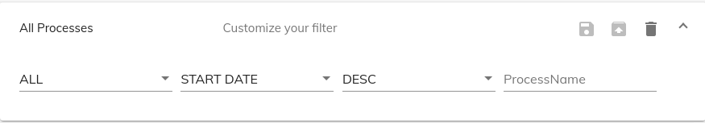

# [Edit Process Filter Cloud component](../../lib/process-services-cloud/src/lib/process/process-filters/components/edit-process-filter-cloud.component.ts "Defined in edit-process-filter-cloud.component.ts")

Shows Process Filter Details.



## Contents

-   [Basic Usage](#basic-usage)
-   [Class members](#class-members)
    -   [Properties](#properties)
    -   [Events](#events)
-   [Details](#details)
    -   [Editing APS2 process filters](#editing-aps2-process-filters)
    -   [Filter properties](#filter-properties)
-   [See also](#see-also)

## Basic Usage

```html
<adf-cloud-edit-process-filter
    [id]="processFilterId"
    [appName]="appName"
    [filterProperties]="filterProperties"s
    (filterChange)="onFilterChange($event)"
    (action)="onAction($event)">
</adf-cloud-edit-process-filter>
```

## Class members

### Properties

| Name | Type | Default value | Description |
| ---- | ---- | ------------- | ----------- |
| appName | `string` |  | The name of the application. |
| filterProperties | `string[]` |  | List of process filter properties to display |
| id | `string` |  | Id of the process instance filter. |
| showFilterActions | `boolean` | true | Toggles editing of process filter actions. |
| showTitle | `boolean` | true | Toggles editing of the process filter title. |

### Events

| Name | Type | Description |
| ---- | ---- | ----------- |
| action | [`EventEmitter`](https://angular.io/api/core/EventEmitter)`<`[`ProcessFilterActionType`](../../lib/process-services-cloud/src/lib/process/process-filters/models/process-filter-cloud.model.ts)`>` | Emitted when a filter action occurs i.e Save, SaveAs, Delete. |
| filterChange | [`EventEmitter`](https://angular.io/api/core/EventEmitter)`<`[`ProcessFilterCloudModel`](../../lib/process-services-cloud/src/lib/process/process-filters/models/process-filter-cloud.model.ts)`>` | Emitted when a process instance filter property changes. |

## Details

### Editing APS2 process filters

Use the `appName` and `id` properties to choose which process filter to edit:

```html
<adf-cloud-edit-process-filter
    [id]="processFilterId"
    [appName]="appName">
</adf-cloud-edit-process-filter>
```

### Filter properties

You can supply various _filter properties_ to edit that will determine
which processes are found by a filter. The full set of properties is
given below:

| Name | Description |
| ---- | ----------- |
| **_appName_** | Name of the app |
| **_processInstanceId_** | Process instance ID |
| **_processName_** | Process name. |
| **_initiator_** | ID of the user who initiated the process |
| **_state_** | Execution state of the process. |
| **_processDefinitionId_** | Process definition ID |
| **_processDefinitionKey_** | Process definition key |
| **_lastModifiedFrom_** | Finds processes modified _after_ this date |
| **_lastModifiedTo_** | Finds processes modified _before_ this date |
| **_sort_** | Field on which the filter results will be sorted (doesn't participate in the filtering itself). Can be "id", "name", "status" or "startDate". |
| **_order_** | Sort ordering of the filter results (this doesn't participate in the filtering itself) |

By default, the **_state_**, **_sort_** and **_order_** properties are
displayed in the editor. However, you can also choose which properties
to show using the `filterProperties` array.
For example, the code below initializes the editor with the **_appName_**,
**_processInstanceId_**, **_startDate_** and **_lastModified_** properties:

```ts
import { UserProcessModel } from '@alfresco/adf-core';

export class SomeComponent implements OnInit {

    filterProperties: string[] = [
        "appName",
        "processInstanceId",
        "startDate",
        "lastModified"];

    onFilterChange(filter: ProcessFilterCloudModel) {
        console.log('On filter change: ', filter);
    }

    onAction($event: ProcessFilterActionType) {
        console.log('Clicked action: ', $event);
    }
```

With this configuration, only the four listed properties will be shown.

**Note:** Currently, the `sort` property has a limited set of properties
to choose from: **_id_**, **_name_**, **_status_** and **_startDate_**.

## See also

-   [Edit task filter cloud component](edit-task-filter-cloud.component.md)
