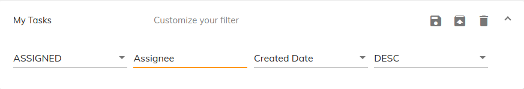

# [Edit Task Filter Cloud component](../../lib/process-services-cloud/src/lib/task/task-filters/components/edit-task-filter-cloud.component.ts "Defined in edit-task-filter-cloud.component.ts")

Edits Task Filter Details.

## Basic Usage

```html
<adf-cloud-edit-task-filter 
    [id]="taskFilterId"
    [appName]="applicationName">
</adf-cloud-edit-task-filter>
```

## Class members

### Properties

| Name | Type | Default value | Description |
| ---- | ---- | ------------- | ----------- |
| appName | `string` |  | (required) Name of the app. |
| id | `string` | "" | (required) The id of the Task filter. |
| filterProperties | `string []` | `['state', 'assignment', 'sort', 'order']` | List of task filter properties to display. |
| toggleFilterActions | `boolean` | `true` | Toggles edit task filter actions. |
| showTitle | `boolean` | `true` | Toggles edit task filter title. |

### Events

| Name | Type | Description |
| ---- | ---- | ----------- |
| action | [`EventEmitter`](https://angular.io/api/core/EventEmitter)`<`[`FilterActionType`](../../lib/process-services-cloud/src/lib/task/task-filters/models/filter-cloud.model.ts)`>` | Emitted when a filter action occurs (i.e Save, Save As, Delete). |
| filterChange | [`EventEmitter`](https://angular.io/api/core/EventEmitter)`<`[`TaskFilterCloudModel`](../../lib/process-services-cloud/src/lib/task/task-filters/models/filter-cloud.model.ts)`>` | Emitted when a task filter property changes. |

## Details

### Editing APS2 task filter

Use the application name and task filter id property to edit task filter properties:

```html
<adf-cloud-edit-task-filter
    [id]="taskFilterId"
    [appName]="applicationName">
</adf-cloud-edit-task-filter>
```

By default these below properties are displayed:

**_state_**, **_assignment_**, **_sort_**, **_order_**.

However, you can also choose which properties to show using a input property
`filterProperties`:

Populate the filterProperties in the component class:

```ts
import { UserProcessModel } from '@alfresco/adf-core';

export class SomeComponent implements OnInit {

    filterProperties: string[] = [
        "appName",
        "processInstanceId",
        "createdDateTo",
        "lastModifiedTo"];

    onFilterChange(filter: TaskFilterCloudModel) {
        console.log('On filter change: ', filter);
    }

    onAction($event: FilterActionType) {
        console.log('Clicked action: ', $event);
    }
```

With this configuration, only the four listed properties will be shown.

```html
<adf-cloud-edit-task-filter
    [id]="taskFilterId"
    [appName]="applicationName"
    [filterProperties]="filterProperties"
    (filterChange)="onFilterChange($event)"
    (action)="onAction($event)">
</adf-cloud-edit-task-filter>
```


All Available properties are:

**_appName_**, **_state_**, **_assignment_**, **_sort_**, **_order_**, **_processDefinitionId_**, **_processInstanceId_**, **_dueAfter_**, **_dueBefore_**, **_claimedDateFrom_**, **_claimedDateTo_**, **_createdDateFrom_**, **_createdDateTo_**, **_taskName_**, **_parentTaskId_**, **_priority_**, **_standAlone_**, **_lastModifiedFrom_**, **_lastModifiedTo_**, **_owner_**, **_dueDateFrom_**, **_dueDateTo_**.


