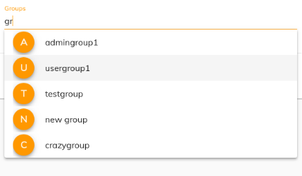

# [Group Cloud component](../../process-services-cloud/src/lib/group/components/group-cloud.component.ts "Defined in group-cloud.component.ts")

Searches Groups.

## Basic Usage

```html
<adf-cloud-group
    [applicationName]="'simple-app'"
    [mode]="'multiple'">
</adf-cloud-group>
```



## Class members

### Properties

| Name | Type | Default value | Description |
| ---- | ---- | ------------- | ----------- |
| applicationName | `string` |  | Name of the application. If specified this shows the users who have access to the app. |
| mode | `string` |  | User selection mode (single/multiple). |
| preSelectGroups | [`GroupModel`](../../process-services-cloud/src/lib/group/models/group.model.ts)`[]` | \[] | Array of users to be pre-selected. This pre-selects all users in multi selection mode and only the first user of the array in single selection mode. |

### Events

| Name | Type | Description |
| ---- | ---- | ----------- |
| removeGroup | [`EventEmitter`](https://angular.io/api/core/EventEmitter)`<`[`GroupModel`](../../process-services-cloud/src/lib/group/models/group.model.ts)`>` | Emitted when a group is removed. |
| selectGroup | [`EventEmitter`](https://angular.io/api/core/EventEmitter)`<`[`GroupModel`](../../process-services-cloud/src/lib/group/models/group.model.ts)`>` | Emitted when a group is selected. |

## Details

### Selection Mode

You can specify either single selection or multiple selection (single
is the default):

#### Single selection

```html
<adf-cloud-group></adf-cloud-group>
```


#### Multiple selection

```html
<adf-cloud-group
    [mode]="'multiple'">
</adf-cloud-group>
```


### Pre-selection

Usage example:

```ts
import { ObjectDataTableAdapter }  from '@alfresco/adf-core';

@Component({...})
export class MyComponent {
    groups: any;

    constructor() {
        this.groups =
            [
                {id: 1, name: 'Group 1'},
                {id: 2, name: 'Group 2'}
            ];
    }
}
```

```html
<adf-cloud-group
    [mode]="'multiple'"
    [preSelectGroups]="groups">
</adf-cloud-group>
```
