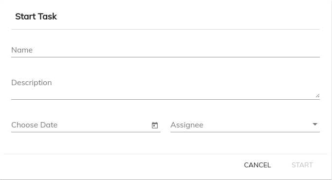

# [Start Task Cloud Component](../../lib/process-services-cloud/src/lib/start-task-cloud/components/start-task-cloud.component.ts "Defined in start-task-cloud.component.ts")

Creates/Starts new task for the specified app



## Basic Usage

```html
<adf-cloud-start-task
    [appName]="YOUR_APP_NAME">
</adf-cloud-start-task>
```

## Class members

### Properties

| Name | Type | Default value | Description |
| ---- | ---- | ------------- | ----------- |
| appName | `string` |  | (required) Name of the app. |
| maxNameLength | `number` |  | Maximum length of the task name. |
| name | `string` | "" | Name of the task. |

### Events

| Name | Type | Description |
| ---- | ---- | ----------- |
| cancel | [`EventEmitter`](https://angular.io/api/core/EventEmitter)`<void>` | Emitted when the cancel button is clicked by the user. |
| error | [`EventEmitter`](https://angular.io/api/core/EventEmitter)`<any>` | Emitted when an error occurs. |
| success | [`EventEmitter`](https://angular.io/api/core/EventEmitter)`<any>` | Emitted when the task is successfully created. |
