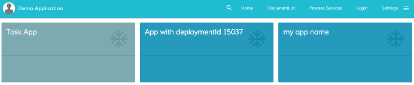

# [Apps List Component](../../../lib/process-services/src/lib/app-list/apps-list.component.ts "Defined in apps-list.component.ts")

Shows all available apps.



## Basic Usage

```html
<adf-apps 
    [layoutType]="'GRID'">
</adf-apps>
```

### [Transclusions](../../user-guide/transclusion.md)

You can show custom content when there are no apps available by supplying an
`<adf-custom-empty-content>` section:

```html
<adf-apps
    [layoutType]="'GRID'">
        <adf-custom-empty-content>
            No Apps present
        </adf-custom-empty-content>
</adf-apps>
```

## Class members

### Properties

| Name | Type | Default value | Description |
| --- | --- | --- | --- |
| filtersAppId | `any[]` |  | Provides a way to filter the apps to show. |
| layoutType | `string` |  | (**required**) Defines the layout of the apps. There are two possible values, "GRID" and "LIST". |

### Events

| Name | Type | Description |
| --- | --- | --- |
| appClick | [`EventEmitter`](https://angular.io/api/core/EventEmitter)`<`[`AppDefinitionRepresentationModel`](../../../lib/process-services/src/lib/task-list/models/filter.model.ts)`>` | Emitted when an app entry is clicked. |
| error | `EventEmitter<any>` | Emitted when an error occurs. |

## Details

You can specify a restricted list of apps using the `filtersAppId` property. This array
contains a list of objects containing the property values you are interested in. You can
use any of the following properties as filters:

```json
{ 
    "defaultAppId": "string", 
    "deploymentId": "string", 
    "name": "string", 
    "id": "number", 
    "modelId": "number",
    "tenantId": "number"
}
```

For example, if you set `filtersAppId` as follows:

```html
<adf-apps 
    [filtersAppId]="[
        {defaultAppId: 'tasks'}, 
        {deploymentId: '15037'}, 
        {name : 'my app name'}]">
</adf-apps>
```

...then only the Tasks app, the app with `deploymentId` 15037 and the app with "my app name" will be shown.


