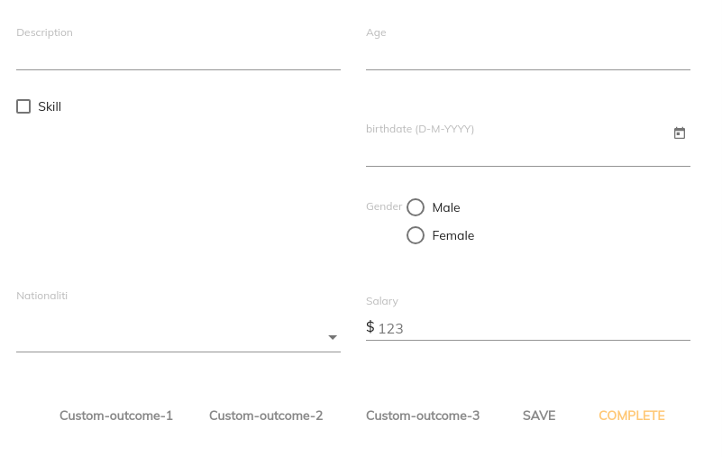

# [Form custom outcomes component](../../../lib/process-services/src/lib/form/form-custom-outcomes.component.ts "Defined in form-custom-outcomes.component.ts")

Supplies custom outcome buttons to be included in [Form component](form.component.md).



## Basic Usage

```html
<adf-form>
    <adf-form-custom-outcomes>
        <button mat-button (click)="onCustomOutcome1()">
            Custom-outcome-1
        </button>
        <button mat-button (click)="onCustomOutcome2()">
            Custom-outcome-2
        </button>
        <button mat-button (click)="onCustomOutcome3()">
            Custom-outcome-3
        </button>
    </adf-form-custom-outcomes>
</adf-form>
```

## See Also

-   [Form component](form.component.md)
