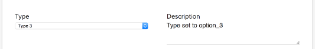
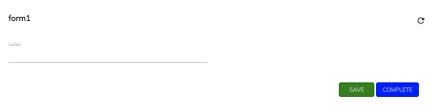

# [Form component](../../../lib/process-services/src/lib/form/form.component.ts "Defined in form.component.ts")

Shows a [`Form`](../../../lib/process-services/src/lib/task-list/models/form.model.ts) from APS

(See it live: [Form Quickstart](https://embed.plnkr.co/YSLXTqb3DtMhVJSqXKkE/))

## Contents

*   [Basic Usage](#basic-usage)
    *   [Transclusions](#transclusions)
*   [Class members](#class-members)
    *   [Properties](#properties)
    *   [Events](#events)
*   [Details](#details)
    *   [Displaying a form](#displaying-a-form)
    *   [Controlling outcome execution behaviour](#controlling-outcome-execution-behaviour)
    *   [Field Validators](#field-validators)
    *   [Common scenarios](#common-scenarios)
    *   [Alfresco Repositories APS configuration](#alfresco-repositories-aps-configuration)
*   [See also](#see-also)

## Basic Usage

```html
<adf-form 
    [taskId]="taskId">
</adf-form>
```

### [Transclusions](../../user-guide/transclusion.md)

Any content in the body of `<adf-form>` will be shown when no form definition is found:

```html
<adf-form .... >

    <div empty-form >
        <h2>Empty form</h2>
    </div>

</adf-form>
```

## Class members

### Properties

| Name | Type | Default value | Description |
| --- | --- | --- | --- |
| data | [`FormValues`](../../../lib/core/form/components/widgets/core/form-values.ts) |  | Custom form values map to be used with the rendered form. |
| disableCompleteButton | `boolean` | false | If true then the `Complete` outcome button is shown but it will be disabled. |
| disableSaveButton | `boolean` | false | If true then the `Save` outcome button is shown but will be disabled. |
| disableStartProcessButton | `boolean` | false | If true then the `Start Process` outcome button is shown but it will be disabled. |
| enableFixedSpacedForm | `boolean` | true | The form will set a prefixed space for invisible fields. |
| fieldValidators | [`FormFieldValidator`](../../../lib/core/form/components/widgets/core/form-field-validator.ts)`[]` |  | Contains a list of form field validator instances. |
| form | [`FormModel`](../../../lib/core/form/components/widgets/core/form.model.ts) |  | Underlying [form model](../../../lib/core/form/components/widgets/core/form.model.ts) instance. |
| formId | `number` |  | The id of the form definition to load and display with custom values. |
| formName | `string` |  | Name of the form definition to load and display with custom values. |
| nameNode | `string` |  | Name to assign to the new node where the metadata are stored. |
| nodeId | `string` |  | Content Services node ID for the form metadata. |
| path | `string` |  | Path of the folder where the metadata will be stored. |
| readOnly | `boolean` | false | Toggle readonly state of the form. Forces all form widgets to render as readonly if enabled. |
| saveMetadata | `boolean` | false | Toggle saving of form metadata. |
| showCompleteButton | `boolean` | true | Toggle rendering of the `Complete` outcome button. |
| showRefreshButton | `boolean` | true | Toggle rendering of the `Refresh` button. |
| showSaveButton | `boolean` | true | Toggle rendering of the `Save` outcome button. |
| showTitle | `boolean` | true | Toggle rendering of the form title. |
| showValidationIcon | `boolean` | true | Toggle rendering of the validation icon next to the form title. |
| taskId | `string` |  | Task id to fetch corresponding form and values. |

### Events

| Name | Type | Description |
| --- | --- | --- |
| error | [`EventEmitter`](https://angular.io/api/core/EventEmitter)`<any>` | Emitted when any error occurs. |
| executeOutcome | [`EventEmitter`](https://angular.io/api/core/EventEmitter)`<`[`FormOutcomeEvent`](../../../lib/core/form/components/widgets/core/form-outcome-event.model.ts)`>` | Emitted when any outcome is executed. Default behaviour can be prevented via `event.preventDefault()`. |
| formCompleted | [`EventEmitter`](https://angular.io/api/core/EventEmitter)`<`[`FormModel`](../../../lib/core/form/components/widgets/core/form.model.ts)`>` | Emitted when the form is submitted with the `Complete` outcome. |
| formContentClicked | [`EventEmitter`](https://angular.io/api/core/EventEmitter)`<`[`ContentLinkModel`](../../../lib/core/form/components/widgets/core/content-link.model.ts)`>` | Emitted when form content is clicked. |
| formDataRefreshed | `EventEmitter<FormModel>` | Emitted when form values are refreshed due to a data property change. |
| formError | `EventEmitter<FormFieldModel[]>` | Emitted when the supplied form values have a validation error. |
| formLoaded | `EventEmitter<FormModel>` | Emitted when the form is loaded or reloaded. |
| formSaved | `EventEmitter<FormModel>` | Emitted when the form is submitted with the `Save` or custom outcomes. |

## Details

All `formXXX` events receive a [`FormModel`](../../../lib/core/form/components/widgets/core/form.model.ts) instance as their argument:

**MyView.component.html**

```html
<adf-form
    [taskId]="selectedTask?.id"
    (formSaved)="onFormSaved($event)">
</adf-form>
```

**MyView.component.ts**

```ts
onFormSaved(form: FormModel) {
    console.log(form);
}
```

### Displaying a form

There are various ways to display a form. The common scenarios are detailed below.

#### Displaying a form instance by task id

```html
<adf-form 
    [taskId]="selectedTask?.id">
</adf-form>
```

For an existing Task both the form and its values will be fetched and displayed.

#### Displaying a form definition by form id

```html
<adf-form 
    [formId]="selectedFormDefinition?.id"
    [data]="customData">
</adf-form>
```

In this case, only the form definition will be fetched.

#### Displaying a form definition by form name

```html
<adf-form 
    [formName]="selectedFormDefinition?.name"
    [data]="customData">
</adf-form>
```

#### Displaying a form definition by ACS nodeId

```html
<adf-form 
    [nodeId]="'e280be3a-6584-45a1-8bb5-89bfe070262e'">
</adf-form>
```

Here, the node metadata is shown in an APS form.
If there is no form defined in APS for the type of node being used then
APS will automatically create a new form.

#### Displaying a form definition by form name, storing the form fields as metadata

```html
<adf-form 
    [formName]="'activitiForms:patientFolder'"
    [saveMetadata]="true"
    [path]="'/Sites/swsdp/documentLibrary'"
    [nameNode]="'test'">
</adf-form>
```

The `nameNode` parameter is optional.

#### Displaying a form definition by ECM nodeId

```html
<adf-form 
    [nodeId]="'e280be3a-6584-45a1-8bb5-89bfe070262e'"
    [saveMetadata]="true"
    [path]="'/Sites/swsdp/documentLibrary'"
    [nameNode]="'test'">
</adf-form>
```

Here, the node metadata is shown in an APS [`Form`](../../../lib/process-services/src/lib/task-list/models/form.model.ts)
with the form fields themselves saved as metadata. The `nameNode` parameter is optional.

### Controlling outcome execution behaviour

In unusual circumstances, you may need to take complete control of form outcome execution.
You can do this by implementing the `executeOutcome` event, which is emitted for both system
outcomes and custom ones.

Note that by default, the code in your `executeOutcome` handler is executed *before* the default
behavior but you can switch the default behavior off using `event.preventDefault()`.
You might want to do this, for example, to provide custom form validation or to show a summary
of the form validation before it is submitted.

**MyView.component.html**

```html
<adf-form
    [taskId]="selectedTask?.id"
    executeOutcome="validateForm($event)">
</adf-form>
```

**MyView.component.ts**

```ts
import { FormOutcomeEvent } from '@alfresco/adf-core';

export class MyView {

    validateForm(event: FormOutcomeEvent) {
        let outcome = event.outcome;

        // you can also get additional properties of outcomes
        // if you defined them within outcome definition

        if (outcome) {
            let form = outcome.form;
            if (form) {
                // check/update the form here
                event.preventDefault();
            }
        }
    }

}
```

There are two other functions that can be very useful when you need to control form outcomes:

*   `saveTaskForm()` - Saves the current form
*   `completeTaskForm(outcome?: string)` Saves and completes the form with a given outcome name

### Field Validators

You can supply a set of validator objects to the form using the `fieldValidators`
property. Each validator implements a check for a particular type of data (eg, a
date validator might check that the date in the field falls between 1980 and 2017).
ADF supplies a standard set of validators that handle most common cases but you can
also implement your own custom validators to replace or extend the set. See the
[Form Field Validator](../interfaces/form-field-validator.interface.md) interface for full details and examples.

### Common scenarios

#### Rendering a form using form definition JSON

See the [demo-form](../../docassets/demo-form.json) file for an example of form definition JSON.

The component below (with the JSON assigned to the `formDefinitionJSON` property), shows how a
form definition is rendered:

```ts
@Component({
    selector: 'sample-form',
    template: `<div class="form-container">
                    <adf-form
                        [form]="form">
                    </adf-form>
                </div>`
})
export class SampleFormComponent implements OnInit {

    form: FormModel;
    formDefinitionJSON: any;

    constructor(private formService: FormService) {
    }

    ngOnInit() {        
        this.form = this.formService.parseForm(this.formDefinitionJSON);
    }
}
```

#### Changing a field value based on another field

A common scenario is to set the contents of one form field based on the value of another. You
could use this, say, to provide two alternative ways of entering the same information or to set
up default values that can be edited.

You can implement this in ADF using the `formFieldValueChanged` event of the
[Form service](../../core/services/form.service.md). For example, if you had a form with a [dropdown widget](../../../lib/testing/src/lib/core/pages/form/widgets/dropdown-widget.page.ts) (id: `type`)
and a multiline text (id:`description`), you could synchronize their values as follows:

```ts
formService.formFieldValueChanged.subscribe((e: FormFieldEvent) => {
    if (e.field.id === 'type') {
        const fields: FormFieldModel[] = e.form.getFormFields();
        const description = fields.find(f => f.id === 'description');
        if (description != null) {
            console.log(description);
            description.value = 'Type set to ' + e.field.value;
        }
    }
});
```

The code shown above subscribes to the `formFieldValueChanged` event to check whether an event
is emitted for the `type` [widget](../../../lib/testing/src/lib/core/pages/form/widgets/widget.ts). Then it finds the `description` [widget](../../../lib/testing/src/lib/core/pages/form/widgets/widget.ts) and assigns some text
to its `value` property.

The result should look like the following:



#### Responding to all form events

Subscribe to the `formEvents` event of the [Form service](../../core/services/form.service.md) to get notification
of all form events:

```ts
formService.formEvents.subscribe((event: Event) => {
  console.log('Event fired:' + event.type);
  console.log('Event Target:' + event.target);
});
```

#### Customizing the styles of form outcome buttons

You can use normal CSS selectors to style the outcome buttons of your form.
Every outcome has an CSS id value following a simple pattern:

      adf-form-OUTCOME_NAME

In the CSS, you can target any outcome ID and change the style as in this example:

```css
#adf-form-complete {
    background-color: blue !important;
    color: white;
}


#adf-form-save {
    background-color: green !important;
    color: white;
}

#adf-form-customoutcome {
    background-color: yellow !important;
    color: white;
}
```



### Alfresco Repositories APS configuration

APS allows you to configure where to store files and folders in your on-site Alfresco repositories.

If you have your repositories configured like this, you can use the attach file/folder
form [widget](../../../lib/testing/src/lib/core/pages/form/widgets/widget.ts) to get a file from those repositories and attach it to the [`Form`](../../../lib/process-services/src/lib/task-list/models/form.model.ts).

**Note:** your repositories could be configured to be on different servers from the one
where your front-end is deployed.  Make sure you are using the right Proxy or configuration,
otherwise you will get a cross-origin resource sharing (CORS) error.

Also, don't forget to set the `providers` property to `ALL` in the `app.config.json` login configuration:

    "providers": "ALL",

## See also

*   [Form Field Validator interface](../../core/interfaces/form-field-validator.interface.md)
*   [Extensibility](../../user-guide/extensibility.md)
*   [Form rendering service](../../core/services/form-rendering.service.md)
*   [Form field model](../../core/models/form-field.model.md)
*   [Form service](../../core/services/form.service.md)
