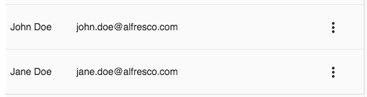

# [People list component](../../../lib/process-services/src/lib/people/components/people-list/people-list.component.ts "Defined in people-list.component.ts")

Shows a list of users (people).



## Basic Usage

Populate the users in the component class:

```ts
import { UserProcessModel } from '@alfresco/adf-core';

export class SomeComponent implements OnInit {

    people: UserProcessModel[] = [
        {
          id: 1,
          email: 'john.doe@alfresco.com',
          firstName: 'John',
          lastName: 'Doe'
        },
        {
          id: 2,
          email: 'jane.doe@alfresco.com',
          firstName: 'Jane',
          lastName: 'Doe'
        }
    ];
    
    onClickPeopleRow(user: UserProcessModel) {
        console.log('Clicked row: ', user);
    }
    
    onClickPeopleAction($event: Event) {
        console.log('Clicked action: ', $event);
    }
```

You can use column templates with the [people list component](people-list.component.md), since it is based on the
[Datatable component](../../core/components/datatable.component.md):

<!--  -->

```html
<adf-people-list
  [users]="people"
  [actions]="true"
  (clickRow)="onClickPeopleRow($event)"
  (clickAction)="onClickPeopleAction($event)">
  <data-columns>
    <data-column key="firstName" class="people-pic">
      <ng-template let-entry="$implicit">
          {{entry.row.obj.firstName + ' ' + entry.row.obj.lastName}}
      </ng-template>
    </data-column>
    <data-column key="email" class="full-width">
      <ng-template let-entry="$implicit">
        <div class="adf-people-email">{{ entry.row.obj.email }}</div>
      </ng-template>
    </data-column>
  </data-columns>
</adf-people-list>
```

<!--  -->

## Class members

### Properties

| Name | Type | Default value | Description |
| ---- | ---- | ------------- | ----------- |
| actions | `boolean` | false | Toggles whether or not actions should be visible, i.e. the 'Three-Dots' menu. |
| users | [`UserProcessModel`](../../core/models/user-process.model.md)`[]` |  | The array of user data used to populate the people list. |

### Events

| Name | Type | Description |
| ---- | ---- | ----------- |
| clickAction | [`EventEmitter`](https://angular.io/api/core/EventEmitter)`<`[`UserEventModel`](../../../lib/process-services/src/lib/task-list/models/user-event.model.ts)`>` | Emitted when the user clicks in the 'Three Dots' drop down menu for a row. |
| clickRow | [`EventEmitter`](https://angular.io/api/core/EventEmitter)`<`[`UserProcessModel`](../../core/models/user-process.model.md)`>` | Emitted when the user clicks a row in the people list. |
