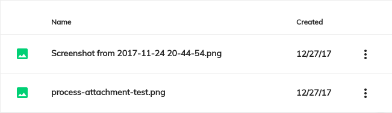
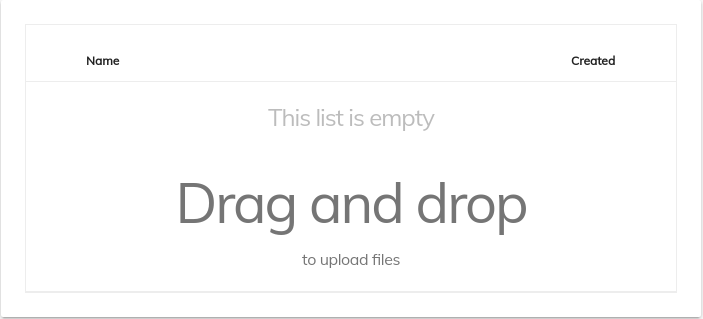
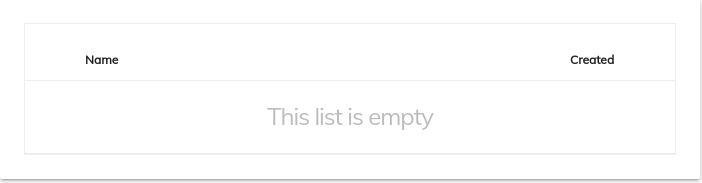

# [Process Attachment List component](../../../lib/process-services/src/lib/attachment/process-attachment-list.component.ts "Defined in process-attachment-list.component.ts")

Displays documents attached to a specified process instance.



## Basic Usage

```html
<adf-process-attachment-list
    [processInstanceId]="YOUR_PROCESS_INSTANCE_ID"
    (attachmentClick)="YOUR_ATTACHMENT_CLICK_EMITTER_HANDLER">
</adf-process-attachment-list>
```

Make sure to override the [`UploadService`](../../core/services/upload.service.md) with the [`ProcessUploadService`](../../../lib/process-services/src/lib/task-list/services/process-upload.service.ts)

```ts
import { UploadService } from '@alfresco/adf-core';
import { ProcessUploadService } from '@alfresco/adf-process-services';

@Component({
    selector: 'my-custom-process-attachment',
    providers: [
        { provide: UploadService, useClass: ProcessUploadService }
    ]
})
export class MyCustomProcessAttachmentComponent {
    constructor() {}
}
```

### [Transclusions](../../user-guide/transclusion.md)

Any content inside the `<adf-process-attachment-list>` element will be shown when
the list is empty:

```html
<adf-process-attachment-list ...>
    <div><!-- Custom empty list message goes here --></div>
</adf-process-attachment-list>
```



A default template will be used if you don't supply a custom one to override it:



## Class members

### Properties

| Name | Type | Default value | Description |
| --- | --- | --- | --- |
| disabled | `boolean` | false | Disable/Enable read-only mode for attachment list. |
| processInstanceId | `string` |  | (**required**) The ID of the process instance to display. |

### Events

| Name | Type | Description |
| --- | --- | --- |
| attachmentClick | [`EventEmitter`](https://angular.io/api/core/EventEmitter)`<any>` | Emitted when the attachment is double-clicked or the view option is selected from the context menu by the user from within the component. Returns a [`Blob`](https://developer.mozilla.org/en-US/docs/Web/API/Blob) representing the object that was clicked. |
| error | [`EventEmitter`](https://angular.io/api/core/EventEmitter)`<any>` | Emitted when the attachment list is not able to fetch the attachments (eg, following a network error). |
| success | `EventEmitter<any>` | Emitted when the attachment list has fetched all the attachments. Returns a list of attachments. |

## Details

### How to Add Drag and Drop Functionality

You can wrap the attachment list with an
[Upload Drag Area component](../../content-services/components/upload-drag-area.component.md)
to let the user upload attachments to empty lists. When you do this, you can also supply
a custom *no content template* (using \<adf-empty-list>) to invite the user to add their attachments:

<!--  -->

```html
<adf-upload-drag-area
    [rootFolderId]="YOUR_PROCESS_ID"
    [showNotificationBar]="BOOLEAN">
    <adf-process-attachment-list  
        [processId]="YOUR_PROCESS_ID"
        (attachmentClick)="YOUR_HANDLER">
            <div adf-empty-list> //no content template
                <adf-empty-list>
                    <div adf-empty-list-header>{{This List is empty}}</div>
                    <div adf-empty-list-body>{{Drag and drop to upload}}</div>
                    <div adf-empty-list-footer>
                        </div> 
                </adf-empty-list>
            </div>
    </adf-process-attachment-list>
</adf-upload-drag-area>
```

<!--  -->
