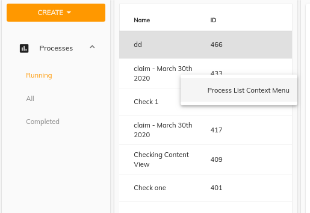

# [Process Instance List](../../../lib/process-services/src/lib/process-list/components/process-list.component.ts "Defined in process-list.component.ts")

Renders a list containing all the process instances matched by the parameters specified.

## Contents

*   [Basic Usage](#basic-usage)
    *   [Transclusions](#transclusions)
*   [Class members](#class-members)
    *   [Properties](#properties)
    *   [Events](#events)
*   [Details](#details)
    *   [Setting Sorting Order for the list](#setting-sorting-order-for-the-list)
    *   [Pagination strategy](#pagination-strategy)
*   [See also](#see-also)

## Basic Usage

**app.component.html**

```html
<adf-process-instance-list
    [appId]="'1'"
    [state]="'all'">
</adf-process-instance-list>
```

### [Transclusions](../../user-guide/transclusion.md)

Any content inside an `<adf-custom-empty-content>` sub-component will be shown
when the process list is empty:

```html
<adf-process-instance-list>
    <adf-custom-empty-content>
        Your Content
    </adf-custom-empty-content>
</adf-process-instance-list>
```

## Class members

### Properties

| Name | Type | Default value | Description |
| --- | --- | --- | --- |
| appId | `number` |  | The id of the app. |
| data | [`DataTableAdapter`](../../../lib/core/datatable/data/datatable-adapter.ts) |  | Data source to define the datatable. |
| multiselect | `boolean` | false | Toggles multiple row selection, which renders checkboxes at the beginning of each row |
| page | `number` | 0 | The page number of the processes to fetch. |
| presetColumn | `string` |  | Custom preset column schema in JSON format. |
| processDefinitionId | `string` |  | The [`Definition`](../../../lib/cli/node_modules/@alfresco/js-api/src/api/content-rest-api/model/definition.ts) Id of the process. |
| processInstanceId | `number \| string` |  | The id of the process instance. |
| resolverFn | `Function` | null | Resolver function is used to show dynamic complex column objects see the docs to learn how to configure a resolverFn. |
| selectFirstRow | `boolean` | true | Toggles default selection of the first row |
| selectionMode | `string` | "single" | Row selection mode. Can be none, `single` or `multiple`. For `multiple` mode, you can use Cmd (macOS) or Ctrl (Win) modifier key to toggle selection for multiple rows. |
| showContextMenu | `boolean` | false | Toggles custom context menu for the component. |
| size | `number` |  | The number of processes to fetch in each page. |
| sort | `string` |  | Defines the sort ordering of the list. Possible values are `created-desc`, `created-asc`, `ended-desc`, `ended-asc`. |
| state | `string` |  | Defines the state of the processes. Possible values are `running`, `completed` and `all` |
| stickyHeader | `boolean` | false | Toggles the sticky header mode. |

### Events

| Name | Type | Description |
| --- | --- | --- |
| error | [`EventEmitter`](https://angular.io/api/core/EventEmitter)`<any>` | Emitted when an error occurs while loading the list of process instances from the server. |
| rowClick | [`EventEmitter`](https://angular.io/api/core/EventEmitter)`<string>` | Emitted when a row in the process list is clicked. |
| showRowContextMenu | [`EventEmitter`](https://angular.io/api/core/EventEmitter)`<`[`DataCellEvent`](../../../lib/core/datatable/components/data-cell.event.ts)`>` | Emitted before the context menu is displayed for a row. |
| success | `EventEmitter<ProcessListModel>` | Emitted when the list of process instances has been loaded successfully from the server. |

## Details

The list can show any of the properties of the
[`ProcessInstance`](../../../lib/process-services/src/lib/process-list/models/process-instance.model.ts)
class. The example below shows how to define a custom schema for the list in the `app.config.json` file and access it with the `presetColumn` property:

```json
"adf-process-list": {
        "presets": {
            "customSchema": [
            {
                    "key": "name",
                    "type": "text",
                    "title": "name",
                    "sortable": true         
            }],
            "default": [
                {
                    "key": "name",
                    "type": "text",
                    "title": "name",
                    "sortable": true
            }],
        }
}
```

```html
<adf-process-instance-list
    [appId]="'1'"
    [state]="'all'"
    [presetColumn]="'customSchema'">
</adf-process-instance-list>
```

You can also define the schema in the HTML using the
[Data column component](../../core/components/data-column.component.md). You can combine this with schema
information defined in `app.config.json` as in the example below:

```json
"adf-process-list": {
        "presets": {
            "customSchema": [
            {
                    "key": "id",
                    "type": "text",
                    "title": "Id",
                    "sortable": true
            }],
            "default": [
                {
                    "key": "name",
                    "type": "text",
                    "title": "name",
                    "sortable": true
            }],
        }
}
```

<!--  -->

```html
<adf-process-instance-list
    [appId]="'1'" 
    [presetColumn]="'customSchema'">
    <data-columns>
        <data-column key="key" title="title" class="full-width name-column">
            <ng-template let-entry="$implicit">
                    <div>{{entry.row.obj.assignee | fullName}}</div>
            </ng-template>
        </data-column>
    </data-columns>
</adf-process-instance-list>
```

### Setting Sorting Order for the list

you can pass sorting order as shown in the example below:

```ts
// Possible values are : `created-desc`, `created-asc`, `ended-desc`, `ended-asc` |
let sortParam = 'created-desc'; 
```

```html
<adf-process-instance-list
    [appId]="'1'"
    [sort]="sortParam">
</adf-process-instance-list>
```

<!--  -->

### Pagination strategy

The Process Instance List also supports pagination:

```html
<adf-process-instance-list
    [appId]="'1'"
    [page]="page"
    [size]="size"
    #processList>
</adf-process-instance-list>
<adf-pagination
    *ngIf="processList"
    [target]="processList"
    [supportedPageSizes]="supportedPages"
    #processListPagination>
</adf-pagination>
```

#### showRowContextMenu event

Emitted before the context menu is displayed for a row.

Note that the [`ProcessInstanceListComponent`](../../../lib/process-services/src/lib/process-list/components/process-list.component.ts) itself does not populate the context menu with items. You can provide all necessary content via the handler.

```html
<adf-process-instance-list
    [contextMenu]="true"
    (showRowContextMenu)="onShowRowContextMenu($event)">
</adf-process-instance-list>
```

Event properties:

```ts
value: {
    row: DataRow,
    col: DataColumn,
    actions: []
}
```

Handler example:

```ts
onShowRowContextMenu(event: DataCellEvent) {
    event.value.actions = [
        {  title: 'Process List Context Menu' },
        { ... }
    ]
}
```



This event is cancellable. You can use `event.preventDefault()` to prevent the default behavior.

The ProcessInstanceList will automatically render the supplied menu items.

See the [ContextMenu](https://www.npmjs.com/package/ng2-alfresco-core)
documentation for more details on the format and behavior of context actions.

## See also

*   [Data column component](../../core/components/data-column.component.md)
*   [Data Table Adapter interface](../../core/interfaces/datatable-adapter.interface.md)
*   [Pagination component](../../core/components/pagination.component.md)
