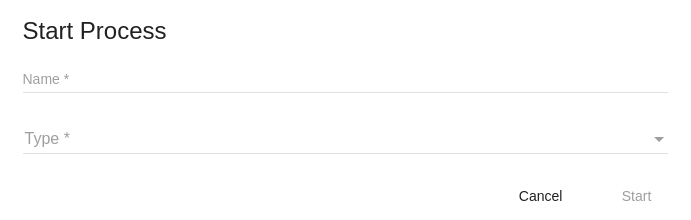
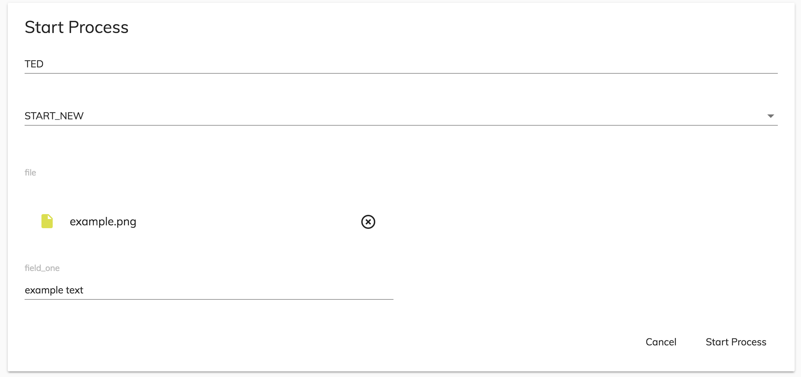
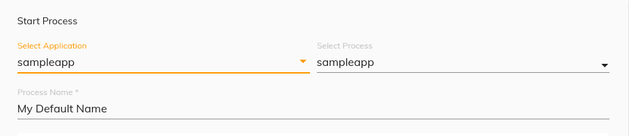

# [Start Process component](../../../lib/process-services/src/lib/process-list/components/start-process.component.ts "Defined in start-process.component.ts")

Starts a process.



## Contents

*   [Basic Usage](#basic-usage)
*   [Class members](#class-members)
    *   [Properties](#properties)
    *   [Events](#events)
*   [Details](#details)
    *   [Starting a process with a default name and pre-selected process definition name](#starting-a-process-with-a-default-name-and-pre-selected-process-definition-name)
    *   [Starting a process not included in an app](#starting-a-process-not-included-in-an-app)
    *   [Custom data example](#custom-data-example)
    *   [Attaching a File to the start form of the process](#attaching-a-file-to-the-start-form-of-the-process)
    *   [Starting a process with a selected application](#starting-a-process-with-a-selected-application)
    *   [Error handling](#error-handling)
*   [See also](#see-also)

## Basic Usage

```html
<adf-start-process 
   [appId]="YOUR_APP_ID">
</adf-start-process>
```

## Class members

### Properties

| Name | Type | Default value | Description |
| --- | --- | --- | --- |
| appId | `number` |  | (optional) Limit the list of processes that can be started to those contained in the specified app. |
| name | `string` | "" | (optional) Name to assign to the current process. |
| processDefinitionName | `string` |  | (optional) [`Definition`](../../../lib/cli/node_modules/@alfresco/js-api/src/api/content-rest-api/model/definition.ts) name of the process to start. |
| processFilterSelector | `boolean` | true | (optional) Parameter to enable selection of process when filtering. |
| showSelectApplicationDropdown | `boolean` | false | (optional) Hide or show application selection dropdown. |
| showSelectProcessDropdown | `boolean` | true | Hide or show the process selection dropdown. |
| title | `string` |  | (optional) Define the header of the component. |
| values | [`FormValues`](../../../lib/core/form/components/widgets/core/form-values.ts) |  | Parameter to pass form field values in the start form if one is associated. |
| variables | [`ProcessInstanceVariable`](../../../lib/process-services/src/lib/process-list/models/process-instance-variable.model.ts)`[]` |  | Variables in the input to the process [RestVariable](https://github.com/Alfresco/alfresco-js-api/tree/master/src/alfresco-activiti-rest-api/docs/RestVariable.md). |

### Events

| Name | Type | Description |
| --- | --- | --- |
| applicationSelection | [`EventEmitter`](https://angular.io/api/core/EventEmitter)`<`[`AppDefinitionRepresentationModel`](../../../lib/process-services/src/lib/task-list/models/filter.model.ts)`>` | Emitted when application selection changes. |
| cancel | [`EventEmitter`](https://angular.io/api/core/EventEmitter)`<void>` | Emitted when the process is canceled. |
| error | [`EventEmitter`](https://angular.io/api/core/EventEmitter)`<any>` | Emitted when an error occurs. |
| processDefinitionSelection | `EventEmitter<ProcessDefinitionRepresentation>` | Emitted when process definition selection changes. |
| start | `EventEmitter<ProcessInstance>` | Emitted when the process starts. |

## Details

### Starting a process with a default name and pre-selected process definition name

```html
 <adf-start-process 
      [appId]="YOUR_APP_ID"
      [title]="'ADF_PROCESS_LIST.START_PROCESS.FORM.TITLE'"
      [name]="PROCESS_NAME"
      [processDefinitionName]="PROCESS_DEFINITION_NAME">
 </adf-start-process>		 
```

You can use the `processDefinitionName` property to select which process will be selected by
default on the dropdown (when there is more than one process to choose from). Use the `name`
property to set the name shown on the dropdown item.

### Starting a process not included in an app

```html
 <adf-start-process 
      [processDefinitionName]="PROCESS_DEFINITION_NAME">
 </adf-start-process>		 
```

Use `processDefinitionName` to set the dropdown item as in the example above.

### Custom data example

The following example shows how to pass in form field values to initialize the
start form for the process:

```ts
const formValues: FormValues  = {
    'test_1': 'value_1',
    'test_2': 'value_2',
    'test_3': 'value_1',
    'test_4': 'dropdown_id',
    'test_5': 'dropdown_label',
    'dropdown': {'id': 'dropdown_id', 'name': 'dropdown_label'}
};
```

```html
<adf-start-process 
    [values]="formValues"
    [appId]="YOUR_APP_ID" >
</adf-start-process>
```

### Attaching a File to the start form of the process

You can see a repository in the Alfresco Repositories list once it is created in APS.
If the repository is set up with an ID value of anything other than 1 then you will need
to declare it in `app.config.json`. For example, if the repository's ID is 1002 and its
name is *alfresco* then you would set the `alfrescoRepositoryName` property in`app.config.json`
to *alfresco-1002* as follows:

```json
{
    "application": {
        "name": "Alfresco ADF Application"
    },
    "ecmHost": "http://{hostname}{:port}/ecm",
    "bpmHost": "http://{hostname}{:port}/bpm",
    "logLevel": "silent",
    "alfrescoRepositoryName": "alfresco-1002"
}       
```

You then need to pass the node as the input `values` object with the other properties:

```ts
let node: MinimalNode = null;

 this.nodesApiService.getNode(NODE_ID).subscribe((minimalNode) => this.node = minimalNode);

const formValues: FormValues  = {
    'file' : node
    'field_one': 'example text'
};
```

You could pass multiple nodes too:

```ts
const nodes: string[] = [NODE_ID_1, NODE_ID_2];

const values: FormValues = {
        'files': []
      };

      Observable.from(nodes)
        .flatMap((nodeId) => this.nodesApiService.getNode(nodeId))
        .subscribe(
              (node) => {
                values.files.push(node);
              },
              (error) => console.log(error) ,
              () => {
                this.formValues = values;
              });
    });
```

Note that in the object above, the key `file` is the name of the attach file field in the start form of the process. The value of the `file` property must be a
[`MinimalNode`](https://github.com/Alfresco/alfresco-js-api/blob/master/src/alfresco-core-rest-api/docs/NodeMinimalEntry.md):

```html
<adf-start-process 
    [values]="formValues"
    [appId]="YOUR_APP_ID" >
</adf-start-process>
```

The result will be the start form prefilled with the file data:



### Starting a process with a selected application

Now you can start process based on selected application from the dropdown. The process definition dropdown will display based on the selected application. The application dropdown will be selected application based on the given `appId` otherwise first application will be selected as default.

```html
 <adf-start-process 
      [appId]="YOUR_APP_ID"
      [title]="'ADF_PROCESS_LIST.START_PROCESS.FORM.TITLE'"
      [name]="PROCESS_NAME"
      [showSelectApplicationDropdown]="true"
      [processDefinitionName]="PROCESS_DEFINITION_NAME">
 </adf-start-process>		 
```

You can use the `showSelectApplicationDropdown` property to Hide or show application drop down.



### Error handling

When an error occurs, the component will emit an error event that can be used to handle errors. Example:

```html
 <adf-start-process 
      [appId]="YOUR_APP_ID"
      [title]="'ADF_PROCESS_LIST.START_PROCESS.FORM.TITLE'"
      [name]="PROCESS_NAME"
      (error)="onError($event)">
 </adf-start-process>		 
```

```ts
    onError(error) {
        this.notificationService.showError(event.response.body.message);
    }
```

## See also

*   [Select Apps Dialog component](select-apps-dialog.component.md)
