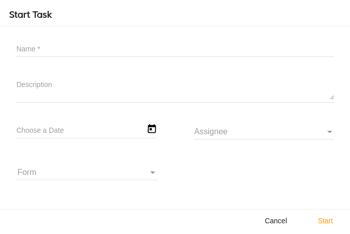

# [Start Task Component](../../../lib/process-services/src/lib/task-list/components/start-task.component.ts "Defined in start-task.component.ts")

Creates/Starts a new task for the specified app.



## Basic Usage

```html
<adf-start-task
    [appId]="YOUR_APP_ID"
    [name]="My Task Name">
</adf-start-task>
```

## Class members

### Properties

| Name | Type | Default value | Description |
| ---- | ---- | ------------- | ----------- |
| appId | `number` |  | (required) The id of the app. |
| name | `string` | "" | Default Task Name. |

### Events

| Name | Type | Description |
| ---- | ---- | ----------- |
| cancel | [`EventEmitter`](https://angular.io/api/core/EventEmitter)`<void>` | Emitted when the cancel button is clicked by the user. |
| error | [`EventEmitter`](https://angular.io/api/core/EventEmitter)`<any>` | Emitted when an error occurs. |
| success | [`EventEmitter`](https://angular.io/api/core/EventEmitter)`<any>` | Emitted when the task is successfully created. |
