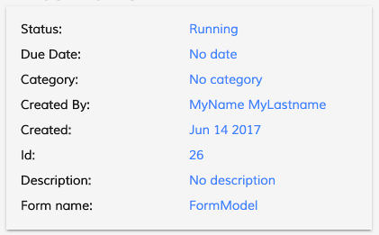

# [Task Header component](../../../lib/process-services/src/lib/task-list/components/task-header.component.ts "Defined in task-header.component.ts")

Shows all the information related to a task.



## Basic Usage

```html
<adf-task-header
    [taskDetails]="taskDetails">
</adf-task-header>
```

## Class members

### Properties

| Name | Type | Default value | Description |
| ---- | ---- | ------------- | ----------- |
| formName | `string` | null | The name of the form. |
| showClaimRelease | `boolean` | true | Toggles display of the claim/release button. |
| taskDetails | [`TaskDetailsModel`](../../../lib/process-services/src/lib/task-list/models/task-details.model.ts) |  | (required) Details related to the task. |

### Events

| Name | Type | Description |
| ---- | ---- | ----------- |
| claim | [`EventEmitter`](https://angular.io/api/core/EventEmitter)`<any>` | Emitted when the task is claimed. |
| unclaim | [`EventEmitter`](https://angular.io/api/core/EventEmitter)`<any>` | Emitted when the task is unclaimed (ie, requeue). |

## Details

The component populates an internal array of
[CardViewModel](../../core/components/card-view.component.md) with the information that we want to display.

By default all properties are displayed:

**_assignee_**, **_status_**, **_priority_**, **_dueDate_**, **_category_**, **_parentName_**, **_created_**, **_id_**, **_description_**, **_formName_**.

However, you can also choose which properties to show using a configuration in `app.config.json`:

```json
    "adf-task-header": {
      "presets": {
          "properties" : [ "assignee", "status", "priority", "parentName"]
      }
    },
```

With this configuration, only the four listed properties will be shown.
