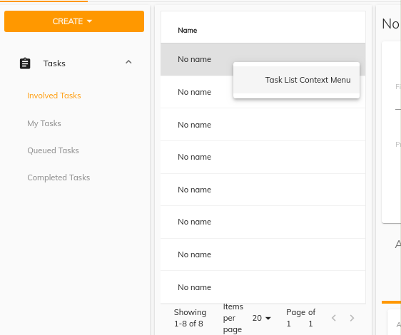

# [Task List component](../../../lib/process-services/src/lib/task-list/components/task-list.component.ts "Defined in task-list.component.ts")

Renders a list containing all the tasks matched by the parameters specified.

## Contents

*   [Basic Usage](#basic-usage)
    *   [Transclusions](#transclusions)
*   [Class members](#class-members)
    *   [Properties](#properties)
    *   [Events](#events)
*   [Details](#details)
    *   [Setting the column schema](#setting-the-column-schema)
    *   [Setting Sorting Order for the list](#setting-sorting-order-for-the-list)
    *   [Pagination strategy](#pagination-strategy)
    *   [DataTableAdapter example](#datatableadapter-example)
    *   [DataColumn Features](#datacolumn-features)
*   [See also](#see-also)

## Basic Usage

```html
<adf-tasklist 
    [appId]="'1'" 
    [state]="'open'" 
    [assignment]="'assignee'">
</adf-tasklist>
```

### [Transclusions](../../user-guide/transclusion.md)

Any content inside an `<adf-custom-empty-content>` sub-component will be shown
when the task list is empty:

```html
<adf-tasklist>
    <adf-custom-empty-content>
        Your Content
    </adf-custom-empty-content>
<adf-tasklist>
```

## Class members

### Properties

| Name | Type | Default value | Description |
| --- | --- | --- | --- |
| appId | `number` |  | The id of the app. |
| assignment | `string` |  | The assignment of the process. Possible values are: "assignee" (the current user is the assignee), "candidate" (the current user is a task candidate, "group_x" (the task is assigned to a group where the current user is a member, no value (the current user is involved). |
| data | [`DataTableAdapter`](../../../lib/core/datatable/data/datatable-adapter.ts) |  | Data source object that represents the number and the type of the columns that you want to show. |
| dueAfter | `string` |  | Filter the tasks. Display only tasks with `created_date` after `dueAfter`. |
| dueBefore | `string` |  | Filter the tasks. Display only tasks with `created_date` before `dueBefore`. |
| includeProcessInstance | `boolean` |  | Toggles inclusion of Process Instances |
| landingTaskId | `string` |  | Define which task id should be selected after reloading. If the task id doesn't exist or nothing is passed then the first task will be selected. |
| multiselect | `boolean` | false | Toggles multiple row selection, renders checkboxes at the beginning of each row |
| name | `string` |  | Name of the tasklist. |
| page | `number` | 0 | The page number of the tasks to fetch. |
| presetColumn | `string` |  | Custom preset column schema in JSON format. |
| processDefinitionId | `string` |  | The [`Definition`](../../../lib/cli/node_modules/@alfresco/js-api/src/api/content-rest-api/model/definition.ts) Id of the process. |
| processInstanceId | `string` |  | The Instance Id of the process. |
| selectFirstRow | `boolean` | true | Toggles default selection of the first row |
| selectionMode | `string` | "single" | Row selection mode. Can be none, `single` or `multiple`. For `multiple` mode, you can use Cmd (macOS) or Ctrl (Win) modifier key to toggle selection for multiple rows. |
| showContextMenu | `boolean` | false | Toggles custom context menu for the component. |
| size | `number` |  | The number of tasks to fetch. Default value: 25. |
| sort | `string` |  | Define the sort order of the tasks. Possible values are : `created-desc`, `created-asc`, `due-desc`, `due-asc` |
| start | `number` |  | Starting point of the list within the full set of tasks. |
| state | `string` |  | Current state of the process. Possible values are: `completed`, `active`. |
| stickyHeader | `boolean` | false | Toggles the sticky header mode. |
| taskId | `string` |  | The id of a task |

### Events

| Name | Type | Description |
| --- | --- | --- |
| error | [`EventEmitter`](https://angular.io/api/core/EventEmitter)`<any>` | Emitted when an error occurs. |
| rowClick | [`EventEmitter`](https://angular.io/api/core/EventEmitter)`<string>` | Emitted when a task in the list is clicked |
| rowsSelected | [`EventEmitter`](https://angular.io/api/core/EventEmitter)`<any[]>` | Emitted when rows are selected/unselected |
| showRowContextMenu | [`EventEmitter`](https://angular.io/api/core/EventEmitter)`<`[`DataCellEvent`](../../../lib/core/datatable/components/data-cell.event.ts)`>` | Emitted before the context menu is displayed for a row. |
| success | `EventEmitter<any>` | Emitted when the task list is loaded |

## Details

This component displays lists of process instances both active and completed, using any defined process filter, and
renders details of any chosen instance.

### Setting the column schema

You can configure the list to show any of the properties of the
[`TaskDetailsModel`](../../../lib/process-services/src/lib/task-list/models/task-details.model.ts)
class. The example below shows how to set up the column schema from HTML:

```html
<adf-tasklist ...>
    <data-columns>
        <data-column key="name" title="NAME" class="full-width name-column"></data-column>
        <data-column key="created" title="Created" class="hidden"></data-column>
    </data-columns>
</adf-tasklist>
```

You can also set a static custom schema declaration in `app.config.json` as shown below:

```json
"adf-task-list": {
        "presets": {
            "customSchema": [
            {
                    "key": "name",
                    "type": "text",
                    "title": "name",
                    "sortable": true         
            }],
            "default": [
                {
                    "key": "name",
                    "type": "text",
                    "title": "name",
                    "sortable": true
            }],
        }
}
```

```html
<adf-tasklist 
    [appId]="'1'" 
    [presetColumn]="'customSchema'">
</adf-tasklist>
```

You can use an HTML-based schema and an `app.config.json` custom schema declaration at the same time:

```json
"adf-task-list": {
        "presets": {
            "customSchema": [
            {
                    "key": "id",
                    "type": "text",
                    "title": "Id",
                    "sortable": true         
            }],
            "default": [
                {
                    "key": "name",
                    "type": "text",
                    "title": "name",
                    "sortable": true
            }],
        }
}
```

<!--  -->

```html
<adf-tasklist
    [appId]="'1'" 
    [presetColumn]="'customSchema'">
    <data-columns>
        <data-column key="assignee" title="Assignee" class="full-width name-column">
            <ng-template let-entry="$implicit">
                    <div>{{entry.row.obj.assignee | fullName}}</div>
            </ng-template>
        </data-column>
    </data-columns>
</adf-tasklist>
```

### Setting Sorting Order for the list

You can pass a sorting order as shown in the example below:

```ts
// Possible values are : `created-desc`, `created-asc`, `due-desc`, `due-asc`
let sortParam = 'created-desc'; 
```

```html
<adf-tasklist
    [appId]="'1'"
    [sort]="sortParam">
</adf-tasklist>
```

<!--  -->

### Pagination strategy

The Tasklist also supports pagination as shown in the example below:

```html
<adf-tasklist
    [appId]="'1'"
    [page]="page"
    [size]="size"
    #taskList>
</adf-tasklist>
<adf-pagination
    *ngIf="taskList"
    [target]="taskList"
    [supportedPageSizes]="supportedPages"
    #taskListPagination>
</adf-pagination>
```

### DataTableAdapter example

See the [Data Table Adapter interface](../../core/interfaces/datatable-adapter.interface.md) page for full details of the interface and its standard
implementation, [`ObjectDataTableAdapter`](../../../lib/core/datatable/data/object-datatable-adapter.ts). Below is an example of how you can set up the adapter for a
typical tasklist:

```json
[
 {"type": "text", "key": "id", "title": "Id"},
 {"type": "text", "key": "name", "title": "Name", "cssClass": "full-width name-column", "sortable": true},
 {"type": "text", "key": "formKey", "title": "Form Key", "sortable": true},
 {"type": "text", "key": "created", "title": "Created", "sortable": true}
]
```

### DataColumn Features

You can customize the styling of a column and also add features like tooltips and automatic translation of column titles. See the [Data Column component](../../core/components/data-column.component.md) page for more information about these features.

#### showRowContextMenu event

Emitted before the context menu is displayed for a row.

Note that the [`TaskListComponent`](../../process-services/components/task-list.component.md) itself does not populate the context menu with items.
You can provide all necessary content via the handler.

```html
<adf-tasklist
    [contextMenu]="true"
    (showRowContextMenu)="onShowRowContextMenu($event)">
</adf-tasklist>
```

Event properties:

```ts
value: {
    row: DataRow,
    col: DataColumn,
    actions: []
}
```

Handler example:

```ts
onShowRowContextMenu(event: DataCellEvent) {
    event.value.actions = [
        {  title: 'Task List Context Menu' },
        { ... }
    ]
}
```



This event is cancellable. You can use `event.preventDefault()` to prevent the default behavior.

The [`TaskListComponent`](../../process-services/components/task-list.component.md) will automatically render the supplied menu items.

See the [ContextMenu](https://www.npmjs.com/package/ng2-alfresco-core)
documentation for more details on the format and behavior of context actions.

## See also

*   [Data column component](../../core/components/data-column.component.md)
*   [Data Table Adapter interface](../../core/interfaces/datatable-adapter.interface.md)
*   [Pagination component](../../core/components/pagination.component.md)
