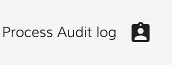

# [Process Audit Directive](../../../lib/process-services/src/lib/process-list/components/process-audit.directive.ts "Defined in process-audit.directive.ts")

Fetches the Process Audit information in PDF or JSON format.



## Basic Usage

```html
<button
    adf-process-audit
    [process-id]="processId"
    [format]="'pdf'"
    [download]="true"
    mat-icon-button (clicked)="onAuditClick($event)" (error)="onAuditError($event)" >
    <mat-icon>assignment_ind</mat-icon>
</button>
```

## Class members

### Properties

| Name | Type | Default value | Description |
| --- | --- | --- | --- |
| download | `boolean` | true | Enables downloading of the audit file on clicking. |
| fileName | `string` | "Audit" | Name of the file to download (for PDF downloads). |
| format | `string` | "pdf" | Format for the audit information (can be "pdf" or "json"). |
| processId | `string` |  | ID of the process. |

### Events

| Name | Type | Description |
| --- | --- | --- |
| clicked | [`EventEmitter`](https://angular.io/api/core/EventEmitter)`<any>` | Emitted when the decorated element is clicked. |
| error | [`EventEmitter`](https://angular.io/api/core/EventEmitter)`<any>` | Emitted when an error occurs. |
