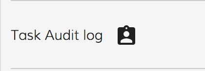

# [Task Audit Directive](../../../lib/process-services/src/lib/task-list/components/task-audit.directive.ts "Defined in task-audit.directive.ts")

Fetches the Task Audit information in PDF or JSON format.



## Basic Usage

```html
<button
    adf-task-audit
    [task-id]="taskId"
    [download]="download"
    mat-icon-button (clicked)="onAuditClick($event)" (error)="onAuditError($event)" >
    <mat-icon>assignment_ind</mat-icon>
</button>
```

## Class members

### Properties

| Name | Type | Default value | Description |
| ---- | ---- | ------------- | ----------- |
| download | `boolean` | true | Enables downloading of the audit when the decorated element is clicked. |
| fileName | `string` | "Audit" | Name of the downloaded file (for PDF downloads). |
| format | `string` | "pdf" | Format of the audit information. Can be "pdf" or "json". |
| taskId | `string` |  | (**required**) The id of the task. |

### Events

| Name | Type | Description |
| ---- | ---- | ----------- |
| clicked | [`EventEmitter`](https://angular.io/api/core/EventEmitter)`<any>` | Emitted when the decorated element is clicked. |
| error | [`EventEmitter`](https://angular.io/api/core/EventEmitter)`<any>` | Emitted when an error occurs. |
