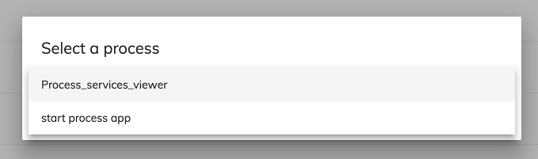

# Select app Component

Show all available apps and return the selected app.



## Basic Usage

```ts
import { SelectAppsDialogComponent } from '@alfresco/adf-process-services';

constructor(private dialog: MatDialog) {
}
   
startSelectDialog(){
   const dialogRef = this.dialog.open(SelectAppsDialogComponent, {
       width: '630px',
       panelClass: 'adf-version-manager-dialog'
   });
   
   dialogRef.afterClosed().subscribe(selectedProcess => {
       this.processId = selectedProcess.id;
   });
}
```

## See Also

-   [Start process component](start-process.component.md)
