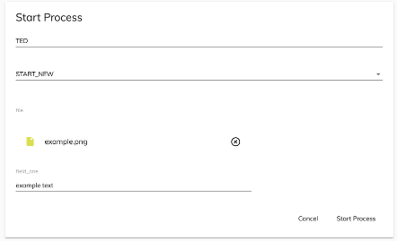

# Start Process component

Starts a process.


## Basic Usage

```html
<adf-start-process 
   [appId]="YOUR_APP_ID">
</adf-start-process>
```

### Properties

| Name | Type | Description |
| ---- | ---- | ----------- |
| appId | `number` | (optional): Limit the list of processes which can be started to those contained in the specified app |
| name | `string` | (optional) name to assign to the current process |
| processDefinitionName | `string` | (optional) definition name of the process to start |
| variables | `ProcessInstanceVariable[]` | Variables in input to the process [RestVariable](https://github.com/Alfresco/alfresco-js-api/tree/master/src/alfresco-activiti-rest-api/docs/RestVariable.md) |
| values | `FormValues` | Parameter to pass form field values in the start form if is associated |
| showSelectProcessDropdown | `boolean` | hide or show the process selection drodown, true by default |

### Events

| Name | Type | Description |
| ---- | ---- | ----------- |
| start | `EventEmitter<ProcessInstance>` | Emitted when the process starts |
| cancel | `EventEmitter<ProcessInstance>` | Emitted when the process is canceled |
| error | `EventEmitter<ProcessInstance>` | Emitted when the start process operation fails |

## Details

### Starting a process with a default name and pre-selected process definition name

```html
 <adf-start-process 
      [appId]="YOUR_APP_ID"
      [name]="PROCESS_NAME"
      [processDefinitionName]="PROCESS_DEFINITION_NAME">
 </adf-start-process>		 
```

You can use the `processDefinitionName` property to select which process will be selected by
default on the dropdown (when there is more than one process to choose from). Use the `name`
property to set the name shown on the dropdown item.

### Starting a process not included in an app

```html
 <adf-start-process 
      [processDefinitionName]="PROCESS_DEFINITION_NAME">
 </adf-start-process>		 
```

Use `processDefinitionName` to set the dropdown item as in the example above. 

### Custom data example

The following example shows how to pass in form field values to initialize the
start form for the process:

```ts
const formValues: FormValues  = {
    'test_1': 'value_1',
    'test_2': 'value_2',
    'test_3': 'value_1',
    'test_4': 'dropdown_id',
    'test_5': 'dropdown_label',
    'dropdown': {'id': 'dropdown_id', 'name': 'dropdown_label'}
};
```

```html
<adf-start-process 
    [values]="formValues"
    [appId]="YOUR_APP_ID" >
</adf-start-process>
```

### Attaching a File to the start form of the process

You can see a repository in the Alfresco Repositories list once it is created in APS.
If the repository is set up with an ID value of anything other than 1 then you will need
to declare it in `app.config.json`. For example, if the repository's ID is 1002 and its
name is _alfresco_ then you would set the `alfrescoRepositoryName` property in`app.config.json`
to _alfresco-1002_ as follows:

```json
{
    application: {
        name: 'Alfresco ADF Application'
    },
    ecmHost: 'http://{hostname}{:port}/ecm',
    bpmHost: 'http://{hostname}{:port}/bpm',
    logLevel: 'silent',
    alfrescoRepositoryName : 'alfresco-1002'
}       
```

You then need to pass the node as the input `values` object with the other properties:

```ts
let node: MinimalNodeEntryEntity = this.nodesApiService.getNode(NODE_ID);

const formValues: FormValues  = {
    'file' : node
    'field_one': 'example text'
};
```

Note that in the object above, the key `file` is the name of the attach file field in the start form of the process. The value of the `file` property must be a
[MinimalNodeEntryEntity](../content-services/document-library.model.md):

```html
<adf-start-process 
    [values]="formValues"
    [appId]="YOUR_APP_ID" >
</adf-start-process>
```

The result will be the start form prefilled with the file data:



## See also

-   [Select Apps Dialog component](select-apps-dialog.component.md)
