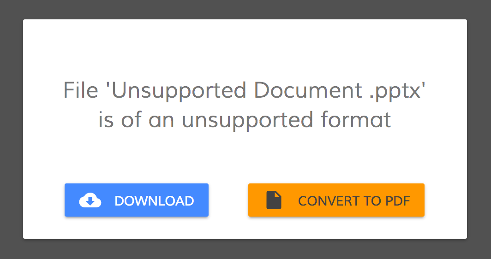
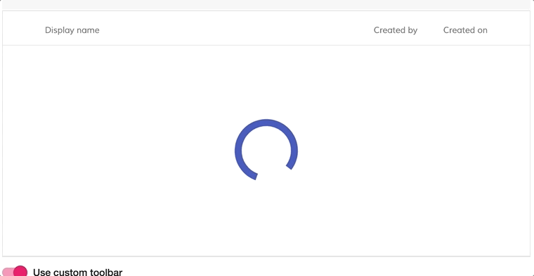
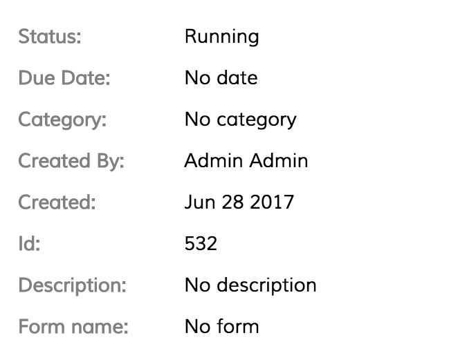
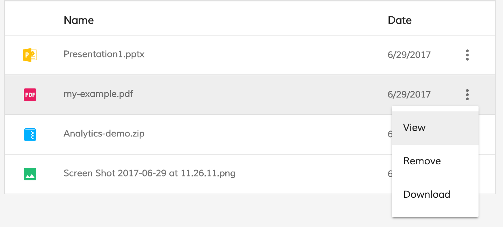
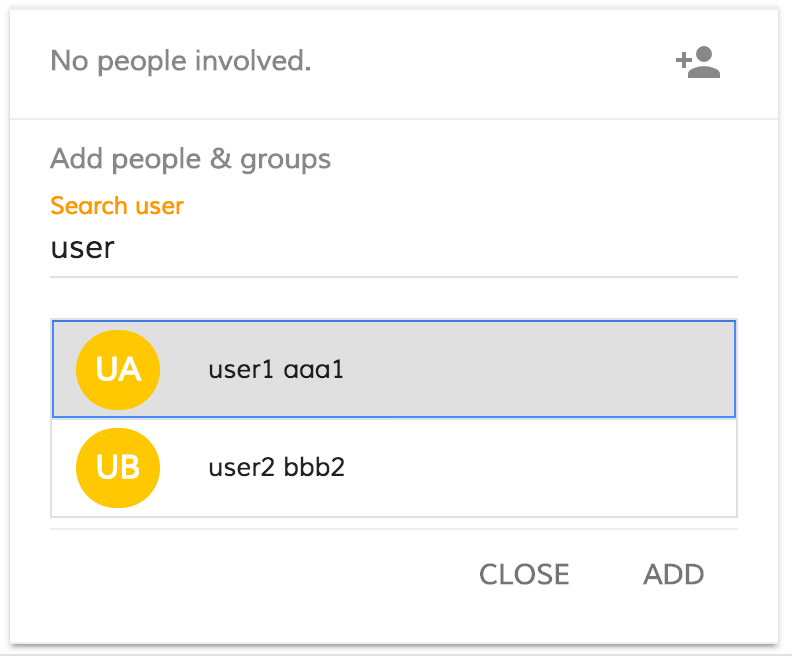
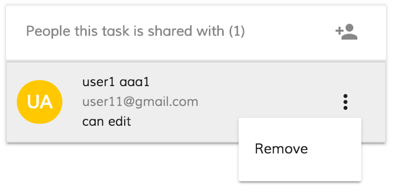
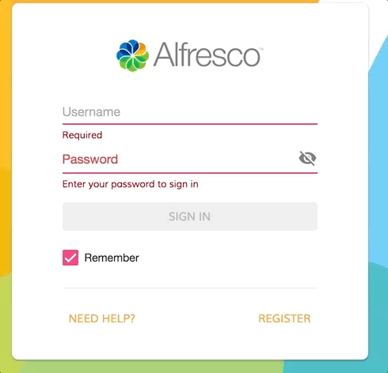

# Alfresco Application Development Framework, version 1.6.1 Release Note

These release notes provide information for the **1.6.1 release** of Alfresco Application Development Framework.
This is the next **Limited Available** release of Application Development Framework, containing the Angular components to build a Web Application on top of the Alfresco Services.
The release can be found on GitHub at [this link.](https://github.com/Alfresco/alfresco-ng2-components/releases/tag/1.6.1)

## Contents

-   [Goals for this release](#goals-for-this-release)
-   [Notable new features](#notable-new-features)
    -   [1. Ability to convert in PDF the unsupported document](#1-ability-to-convert-in-pdf-the-unsupported-document)
    -   [2. Datatable loading state](#2-datatable-loading-state)
    -   [3. New extension support in viewer](#3-new-extension-support-in-viewer)
    -   [4. Extend TypeScript definitions for JS-API](#4-extend-typescript-definitions-for-js-api)
    -   [5. ADF Card View](#5-adf-card-view)
    -   [6. Task Header Component](#6-task-header-component)
    -   [7. Process and Task attachment list component](#7-process-and-task-attachment-list-component)
    -   [8. Add people Component](#8-add-people-component)
    -   [9. Breadcrumb root path personalisation](#9-breadcrumb-root-path-personalisation)
    -   [10. Form events bus](#10-form-events-bus)
    -   [11. Form render independent from APS](#11-form-render-independent-from-aps)
    -   [12. Application settings (server-side)](#12-application-settings-server-side)
    -   [13. Proxy settings and CORS](#13-proxy-settings-and-cors)
    -   [14. Login restyling](#14-login-restyling)
-   [References](#references)
-   [Issues addressed](#issues-addressed)
-   [Feature](#feature)
-   [Story](#story)
-   [Bug](#bug)
-   [Task](#task)
-   [Documentation](#documentation)

## Goals for this release

The roadmap for ADF is taking form, and we have a high focus on bringing in engaging design and UX, as well as add more and more content capabilities into ADF.

Our focus while developing ADF 1.6.1 has been improving the Document List, Improved Preview, Finalize the design of the [Login component,](../core/components/login.component.md) External configuration, Performance enhancements for development, improvements in forms as well as paving the way for editing metadata and using forms for content.

This release builds on last month's contains bug fixes and new feature. See the list below for major details.

Please report issues with this release in the [issue tracker](https://github.com/Alfresco/alfresco-ng2-components/issues). You can collaborate on this release or share feedback by using the discussion tools on [gitter](https://gitter.im/Alfresco/alfresco-ng2-components).

## Notable new features

Below the most relevant features of this release.

-   Ability to convert in PDF the unsupported document
-   Datatable loading state
-   New extension support in viewer
-   Extend TypeScript definitions for JS-API
-   ADF Card View
-   [Task Header Component](../process-services/components/task-header.component.md)
-   Process and [Task attachment list component](../process-services/components/task-attachment-list.component.md)
-   Add [people Component](../process-services/components/people.component.md)
-   Breadcrumb root path personalisation
-   [`Form`](../../lib/process-services/src/lib/task-list/models/form.model.ts) events bus
-   [`Form`](../../lib/process-services/src/lib/task-list/models/form.model.ts) render independent from APS
-   Application settings (server-side)
-   Proxy settings and CORS
-   Login restyling

### 1. Ability to convert in PDF the unsupported document

_The ng2-alfresco-viewer if the [renditions service](../core/services/renditions.service.md) can convert the unsupported document in PDF will show a pop up with the double possibility to Download the file or convert it to PDF._

### 2. Datatable loading state

Is now possible define your custom loading template that will be shown during the loading of your data in the datatable:

    <alfresco-datatable
        [data]="data"
        [loading]=isLoading()">

            <loading-content-template>
                <ng-template>
                   <!--Add your custom loading template here-->
                    <md-progress-spinner
                        class="adf-document-list-loading-margin"
                        [color]="'primary'"
                        [mode]="'indeterminate'">
                    </md-progress-spinner>
                </ng-template>
            </loading-content-template>

    </alfresco-datatable>

Refer to the [datable documentation](https://github.com/Alfresco/alfresco-ng2-components/tree/master/ng2-components/ng2-alfresco-datatable#loading-content-template) for further details. With this modify also the n2-alfresco-documentlist has gained a loading state.

### 3. New extension support in viewer

The ng2-alfresco-viewer is now able to show files with txt extension natively and play wav and Mp3 files.

### 4. Extend TypeScript definitions for JS-API

We have added more methods in the type definition file of the alfresco-js-api to help you with the autocomplete of your IDE.

### 5. ADF Card View

The ADF Card is a generic component, which shows the properties received in input as a material design card.  The main idea was to create a component that can be shared among different components.

    <adf-card-view
        [properties]="[{label: 'My Label', value: 'My value'}]">
    </adf-card-view>

The properties are an array of CardViewModel

    export class CardViewModel {
        label: string;
        value: any;
        key: any;
        format: string;
        default: string;

        constructor(obj?: any) {
            this.label = obj.label || '';
            this.value = obj.value;
            this.key = obj.key;
            this.format = obj.format;
            this.default = obj.default;
        }
    }

As properties you can set the label, the value and other optional fields, such as the format and the default values.
Specifically, the **format** propriety is useful to show a value in a custom format, for example, the date in DD/MM/YYYY or MM/DD/YYYY
The **default** values allow initializing some properties as defined, in case the value provided is empty.

### 6. Task Header Component

This component was already present in the previous ADF versions but we changed the design and the code using the ADF Card Component.
The Task Header shows all the information related to the task.

    

        

            <adf-card-view [properties]="properties"></adf-card-view>
        

    

Result:

### 7. Process and Task attachment list component

This component shows all the attachments added to a task/process as a list. The component is using the [data table component](lib/core/src/lib/datatable/components/datatable/datatable.component.ts) to show the list and the context menu with the actions. At the moment, you can open the attachment doing the double click on the row or select the action view from the menu actions. There is also the ability to download the attachment or remove it.

    <alfresco-datatable *ngIf="!isEmpty()"
        [rows]="attachments"
        [actions]="true"
        (rowDblClick)="openContent($event)"
        (showRowActionsMenu)="onShowRowActionsMenu($event)"
        (executeRowAction)="onExecuteRowAction($event)">
        <data-columns>
            <data-column key="icon" type="icon" srTitle="Thumbnail" [sortable]="false"></data-column>
            <data-column key="name" type="text" title="Name" class="full-width ellipsis-cell" [sortable]="true"></data-column>
            <data-column key="created" type="date" format="shortDate" title="Date"></data-column>
        </data-columns>
    </alfresco-datatable>

Result:

### 8. Add people Component

This component was already present in the previous ADF versions but we changed the design and improve the code.

With this component, you can easily involve a person into a task. The component itself is composed of two different component, the [search component,](../content-services/components/search.component.md) the [people list component](../process-services/components/people-list.component.md).

The [search component](../content-services/components/search.component.md) has the goal to find a person not involved and show the results in a list. The list is always a [data table component](lib/core/src/lib/datatable/components/datatable/datatable.component.ts) with the action menu disabled.

The [people list component](../process-services/components/people-list.component.md) shows all the people involved in a task in a list.

The component is a wrapper of the data-table component with a custom action i.e. Remove the person from the list.

    

        <activiti-people-search
            (searchPeople)="searchUser($event)"
            (success)="involveUser($event)"
            (closeSearch)="onCloseSearch()"
            [results]="peopleSearch$">
            </activiti-people-search>
    

    

       <adf-people-list [users]="people">
          <data-columns>
            <data-column key="firstName">
              <ng-template let-entry="$implicit">
                
{{getInitialUserName(entry.row.obj.firstName, entry.row.obj.lastName)}}

              </ng-template>
            </data-column>
            <data-column key="email" class="full-width">
              <ng-template let-entry="$implicit">
                
{{ getDisplayUser(entry.row.obj.firstName, entry.row.obj.lastName, ' ') }}

                
{{ entry.row.obj.email }}

                
can edit

              </ng-template>
            </data-column>
          </data-columns>
       </adf-people-list>
    

Add people search person result:

Add people involved person result:

### 9. Breadcrumb root path personalisation

The Breadcrumbs has received a little cosmetic upgrade plus we have added also a new property.

The new property is **root**. You can specify in the root property the name of the folder where you want to tart the breadcrumb. Note: The root will always be shown as first element and it will continue to be displayed until you are not in a subfolder of it.

Example:

    <adf-breadcrumb
         [target]="documentList"
         [root]="'New-Root'"
         [folderNode]="newRootId">
    </adf-breadcrumb>

Result:

Note: The root will always be showed as first element and it will continue to be displayed until you are not in a subfolder of it.

Refer to the [document list documentation](https://github.com/Alfresco/alfresco-ng2-components/tree/master/ng2-components/ng2-alfresco-documentlist#properties-1) for further details.

### 10. Form events bus

If you want to listen to all the events fired from the form you can subscribe to this [`Subject`](http://reactivex.io/documentation/subject.html):

    formService.formEvents.subscribe((event: Event) => {
      console.log('Event fired:' + event.type);
      console.log('Event Target:' + event.target);
    });

Refer to the [form documentation](https://github.com/Alfresco/alfresco-ng2-components/tree/master/ng2-components/ng2-activiti-form#listen-all-form-events)
for further details.

### 11. Form render independent from APS

The 1.6.1 release lays a foundation for making a [`Form`](../../lib/process-services/src/lib/task-list/models/form.model.ts) renderer independent from the backend and APS services to allow more granular control of how it works and where takes/stores its data.

#### Binding "form" definition

With this release, it is now possible to bind a form definition via the "form" property.

    <activiti-form [form]="form">
    </activiti-form>

And the underlying component controller code can be as follows:

    export class FormDemoComponent implements OnInit {

      form: FormModel;

      ngOnInit() {
        let formDefinitionJSON: any = DemoForm.getDefinition();
        let form = this.formService.parseForm(formDefinitionJSON);
        this.form = form;
      }
    }

#### Parsing form definitions

The [`FormService`](../core/services/form.service.md) got a new API to parse form definitions from JSON into the [`FormModel`](lib/core/src/lib/form/components/widgets/core/form.model.ts) instances without using [`Form`](../../lib/process-services/src/lib/task-list/models/form.model.ts) Component like it was previously.

    formService.parseForm(formDefinitionJSON)

#### Controlling outcome actions

It is now possible to control what happens when end users click the form outcome buttons, like Save, Complete, etc. The [`FormService`](../core/services/form.service.md) gets a new cancellable event called "executeOutcome" for that purpose.

    export class FormDemoComponent implements OnInit {

      constructor(private formService: FormService) {
        formService.executeOutcome.subscribe(e => {
          e.preventDefault();
          console.log(e.outcome);
        });
      }

    }

### 12. Application settings (server-side)

It is now possible to have global (server-side) settings that enable or disable certain features in your web application.

By default, all application settings are stored in the "app.config.json" file in the root of your web application and have the following defaults:

    {
        "ecmHost": "http://localhost:3000/ecm",
        "bpmHost": "http://localhost:3000/bpm",
        "application": {
            "name": "Alfresco"
        }
    }

You can get more details on application configuration in the following articles:

-   [Demo App Readme](../..//demo-shell/README.md#application-settings-server-side)
-   [AppConfigService Readme](../core/services/app-config.service.md)

### 13. Proxy settings and CORS

To greatly simplify development process the demo and generated applications now feature Proxy settings for webpack development server. That allows using ACS/APS services without any CORS configurations.

You get the following settings by default (also applied to the Application settings)

-   <http://localhost:3000/ecm> is mapped to <http://localhost:8080>
-   <http://localhost:3000/bpm> is mapped to <http://localhost:9999>

### 14. Login restyling

The settings above address most common scenarios for running ACS on port 8080 and APS on port 9999 and allow you to skip the CORS configuration.

If you would like to change default proxy settings, please edit the "**config/webpack.common.js**" file.

## References

Below you can find a brief list of references to help you starting to use the new release.

[Official GitHub Project - alfresco-ng2-components](https://github.com/Alfresco/alfresco-ng2-components)

[Getting started guides with Alfresco Application Development Framework](https://community.alfresco.com/community/application-development-framework/pages/get-started)

[Component catalog](http://devproducts.alfresco.com/)

[Gitter chat supporting Alfresco ADF](https://gitter.im/Alfresco/alfresco-ng2-components)

[ADF examples](https://github.com/Alfresco/adf-examples)

[List of all components](https://github.com/Alfresco/alfresco-ng2-components/tree/master/ng2-components)

[Alfresco-JS-API](https://github.com/Alfresco/alfresco-js-api)

[ADF App Generator ](https://github.com/Alfresco/generator-ng2-alfresco-app)

Please refer to the [official documentation](http://docs.alfresco.com/) for further details and suggestions.

## Issues addressed

Below you can find a detailed list of tickets addressed in the new release. For a better understanding, the list is grouped by topic.

## Feature

-   \[[ADF-510](https://issues.alfresco.com/jira/browse/ADF-510)] - Drag and Drop should detect if user has permission to upload
-   \[[ADF-524](https://issues.alfresco.com/jira/browse/ADF-524)] - Datatable loading state
-   \[[ADF-573](https://issues.alfresco.com/jira/browse/ADF-573)] - Allow disabling drag and drop upload based on condition
-   \[[ADF-613](https://issues.alfresco.com/jira/browse/ADF-613)] - Support for Plain Text files in Viewer
-   \[[ADF-622](https://issues.alfresco.com/jira/browse/ADF-622)] - Extend TypeScript definitions for JS-API
-   \[[ADF-631](https://issues.alfresco.com/jira/browse/ADF-631)] - Viewer - Should play also the mp3 file
-   \[[ADF-667](https://issues.alfresco.com/jira/browse/ADF-667)] - It should be possible to disable row selection in Document List
-   \[[ADF-710](https://issues.alfresco.com/jira/browse/ADF-710)] - Create a [Process Attachment List component](../process-services/components/process-attachment-list.component.md)
-   \[[ADF-712](https://issues.alfresco.com/jira/browse/ADF-712)] - Task Attachment - Provide a way to attach a new content
-   \[[ADF-713](https://issues.alfresco.com/jira/browse/ADF-713)] - Process Attachment - Provide a way to attach a new content
-   \[[ADF-793](https://issues.alfresco.com/jira/browse/ADF-793)] - Convert to PDF the document that the [renditions service](../core/services/renditions.service.md) provide
-   \[[ADF-804](https://issues.alfresco.com/jira/browse/ADF-804)] - Add proxy configuration in demo shell
-   \[[ADF-843](https://issues.alfresco.com/jira/browse/ADF-843)] - [`Form`](../../lib/process-services/src/lib/task-list/models/form.model.ts) events bus
-   \[[ADF-845](https://issues.alfresco.com/jira/browse/ADF-845)] - Breadcrumb path personalisation
-   \[[ADF-847](https://issues.alfresco.com/jira/browse/ADF-847)] - Use application settings file instead of local storage for server URLs

## Story

-   \[[ADF-850](https://issues.alfresco.com/jira/browse/ADF-850)] - Provide ability to use Forms Renderer without APS
-   \[[ADF-851](https://issues.alfresco.com/jira/browse/ADF-851)] - Provide ability to intercept form outcome button clicks

## Bug

-   \[[ADF-242](https://issues.alfresco.com/jira/browse/ADF-242)] - When deleting a report the content remains on screen. - 1616 Github
-   \[[ADF-247](https://issues.alfresco.com/jira/browse/ADF-247)] - 'Process definition overview' displays wrong number of 'Total number of process instances' when choosing 'Active' or 'Complete' - 1621 Github
-   \[[ADF-525](https://issues.alfresco.com/jira/browse/ADF-525)] - Analytics report - Delete report
-   \[[ADF-571](https://issues.alfresco.com/jira/browse/ADF-571)] - File upload that is in progress is not stopped with the Cancel button
-   \[[ADF-603](https://issues.alfresco.com/jira/browse/ADF-603)] - Blank page after running the demo of a component - 1870 Github
-   \[[ADF-610](https://issues.alfresco.com/jira/browse/ADF-610)] - Upload button and DnD area should not upload hidden files and folders
-   \[[ADF-621](https://issues.alfresco.com/jira/browse/ADF-621)] - Document List draws drop areas on Files
-   \[[ADF-640](https://issues.alfresco.com/jira/browse/ADF-640)] - After uploading folder with DnD document list does not reload
-   \[[ADF-643](https://issues.alfresco.com/jira/browse/ADF-643)] - Upload has performance problems
-   \[[ADF-680](https://issues.alfresco.com/jira/browse/ADF-680)] - DocumentList is displayed as empty if you delete all files and folders in the last page available.
-   \[[ADF-684](https://issues.alfresco.com/jira/browse/ADF-684)] - Cannot delete an attachment
-   \[[ADF-686](https://issues.alfresco.com/jira/browse/ADF-686)] - Cannot download a file
-   \[[ADF-687](https://issues.alfresco.com/jira/browse/ADF-687)] - 'Attachments' header remains after completing a task
-   \[[ADF-690](https://issues.alfresco.com/jira/browse/ADF-690)] - Upload drag area aborts all files after snackbar expires
-   \[[ADF-696](https://issues.alfresco.com/jira/browse/ADF-696)] - Entire accordion group header should be clickable
-   \[[ADF-702](https://issues.alfresco.com/jira/browse/ADF-702)] - Task/Process Filter - Provide a way to change the default filter
-   \[[ADF-706](https://issues.alfresco.com/jira/browse/ADF-706)] - Cannot tab into a checkbox on a form
-   \[[ADF-707](https://issues.alfresco.com/jira/browse/ADF-707)] - Cannot tab into a dynamic table row
-   \[[ADF-709](https://issues.alfresco.com/jira/browse/ADF-709)] - After creating a dynamic table row tab index starts from top of page
-   \[[ADF-717](https://issues.alfresco.com/jira/browse/ADF-717)] - Multiple NPM errors during the build
-   \[[ADF-721](https://issues.alfresco.com/jira/browse/ADF-721)] - Translation problem - dev enviroment
-   \[[ADF-723](https://issues.alfresco.com/jira/browse/ADF-723)] - 'Upload File' isn't working.
-   \[[ADF-725](https://issues.alfresco.com/jira/browse/ADF-725)] - Upload dialog does not indicate aborted/rejected files
-   \[[ADF-737](https://issues.alfresco.com/jira/browse/ADF-737)] - Analytics report - Should expose the Models
-   \[[ADF-739](https://issues.alfresco.com/jira/browse/ADF-739)] - Viewer within tasks and processes does not display all supported file extensions.
-   \[[ADF-759](https://issues.alfresco.com/jira/browse/ADF-759)] - Cannot use script.sh with node 8.0.0 and npm 5.0. 
-   \[[ADF-765](https://issues.alfresco.com/jira/browse/ADF-765)] - [Rating Component](../content-services/components/rating.component.md) is not working.
-   \[[ADF-766](https://issues.alfresco.com/jira/browse/ADF-766)] - "Remove" file option within the Attachment list is not working.
-   \[[ADF-779](https://issues.alfresco.com/jira/browse/ADF-779)] - Broken thumbnails are displayed in Processes Attachment list.
-   \[[ADF-781](https://issues.alfresco.com/jira/browse/ADF-781)] - Folder content is not uploaded if a folder with the same name already exists
-   \[[ADF-782](https://issues.alfresco.com/jira/browse/ADF-782)] - It is not possible to upload a Folder by dropping on another Folder in Document List
-   \[[ADF-794](https://issues.alfresco.com/jira/browse/ADF-794)] - Add people assignment component
-   \[[ADF-797](https://issues.alfresco.com/jira/browse/ADF-797)] - Published components have wrong content
-   \[[ADF-802](https://issues.alfresco.com/jira/browse/ADF-802)] - 'Attach Document' and DnD in Attachment List are not working
-   \[[ADF-810](https://issues.alfresco.com/jira/browse/ADF-810)] - Radio button list is selecting the first value behind the scenes when nothing is selected - 1963 Github
-   \[[ADF-833](https://issues.alfresco.com/jira/browse/ADF-833)] - Data table - single and double click
-   \[[ADF-842](https://issues.alfresco.com/jira/browse/ADF-842)] - Error is received in console log when a form is completed
-   \[[ADF-883](https://issues.alfresco.com/jira/browse/ADF-883)] - [`UserInfo`](https://github.com/Alfresco/alfresco-js-api/blob/develop/src/api/content-rest-api/docs/UserInfo.md) - Build errors
-   \[[ADF-884](https://issues.alfresco.com/jira/browse/ADF-884)] - [`FormComponent`](../process-services/components/form.component.md) - Compilation error
-   \[[ADF-893](https://issues.alfresco.com/jira/browse/ADF-893)] - Create Attachment Task/Process - Compilation error
-   \[[ADF-897](https://issues.alfresco.com/jira/browse/ADF-897)] - ActivitiPeopleList - use the prexif adf
-   \[[ADF-906](https://issues.alfresco.com/jira/browse/ADF-906)] - data property on activiti-form component do not react on changes - 2007 Github
-   \[[ADF-930](https://issues.alfresco.com/jira/browse/ADF-930)] - Not able to attach a file into Attachment List.

## Task

-   \[[ADF-39](https://issues.alfresco.com/jira/browse/ADF-39)] - Migrate demo components to webpack and update documentation - 1399 Github
-   \[[ADF-604](https://issues.alfresco.com/jira/browse/ADF-604)] - Upgrade to @angular/material to latest version
-   \[[ADF-685](https://issues.alfresco.com/jira/browse/ADF-685)] - Create test case in test rail around attachment list component
-   \[[ADF-881](https://issues.alfresco.com/jira/browse/ADF-881)] - Restore setting PS and CS address setting in demo shell

## Documentation

-   \[[ADF-78](https://issues.alfresco.com/jira/browse/ADF-78)] - Update Activiti CORS setup guide - 1438 Github
-   \[[ADF-602](https://issues.alfresco.com/jira/browse/ADF-602)] - Accordion Component - Documentation
-   \[[ADF-776](https://issues.alfresco.com/jira/browse/ADF-776)] - Update ADF project from 1.4.0 to 1.5. 

Please refer to [the Alfresco issue tracker](https://issues.alfresco.com/jira/projects/ADF/issues/ADF-581?filter=allopenissues) for other known issues in this release. If you have more questions, please reply here or contact us using [gitter](https://gitter.im/Alfresco/alfresco-ng2-components).
