# Alfresco Application Development Framework, version 1.7.0 Release Note

These release notes provide information for the **1.7.0 release** of Alfresco Application Development Framework.

This is the next **Limited Available** release of Application Development Framework, containing the Angular components to build a Web Application on top of the Alfresco Services.
The release can be found on GitHub at [this link.](https://github.com/Alfresco/alfresco-ng2-components/releases/tag/1.7.0)

## Contents

-   [Goals for this release](#goals-for-this-release)
-   [Notable new features](#notable-new-features)
    -   [1. ADF Prefix](#1-adf-prefix)
    -   [2. Copy and Move component](#2-copy-and-move-component)
    -   [3. Dropdown Sites/Favorites Component](#3-dropdown-sitesfavorites-component)
    -   [4. Toolbar Component](#4-toolbar-component)
    -   [5. Upload Component New design](#5-upload-component-new-design)
    -   [6. Upload ignore list configuration service](#6-upload-ignore-list-configuration-service)
    -   [7. Process Service Start Task New design](#7-process-service-start-task-new-design)
    -   [8. Process Header Component](#8-process-header-component)
    -   [9. Search list Component new delete file feature](#9-search-list-component-new-delete-file-feature)
    -   [10. Login new property](#10-login-new-property)
    -   [11. TaskDetails - DueDate and Description editable](#11-taskdetails---duedate-and-description-editable)
    -   [12. Configuration back end service hostname feature](#12-configuration-back-end-service-hostname-feature)
    -   [13. User Preferences Service](#13-user-preferences-service)
    -   [14. Search results highlighting properties](#14-search-results-highlighting-properties)
    -   [15. Change document list style rows based on permissions](#15-change-document-list-style-rows-based-on-permissions)
    -   [16. APS Audit REST API in the JS API](#16-aps-audit-rest-api-in-the-js-api)
    -   [17. New services in ng2-alfresco-core](#17-new-services-in-ng2-alfresco-core)
    -   [18. Code Contribution Guide and CLA](#18-code-contribution-guide-and-cla)
-   [References](#references)
-   [Issues addressed](#issues-addressed)
    -   [Documentation](#documentation)
    -   [Feature](#feature)
    -   [Epic](#epic)
    -   [Bug](#bug)
    -   [New Feature](#new-feature)
    -   [Task](#task)

## Goals for this release

In the ADF 1.7 release we've had a big focus on Content capabilities. We brought in a new design for the Document List and the Uploader. Quite a few changes has made its way in to the release, breadcrumbs now has multiple modes (drop down and normal) and has been separated from the document list. The [pagination component](../core/components/pagination.component.md) is now separated from the document list and has a new design too, and we've added toolbars to the document list. We will continue this effort to split up into more granular components and improve the design.

We have introduced a "Copy and Move" component that integrates into the document list. The idea is to use the same picker for both forms and document list, i.e use it to select content in a form, or select the destination to copy or move items into. This is still work in progress as some of the features in the picker, such as search highlight didn't make it in time for code freeze. We will continue to improve this in the next release.

This release builds on last month's contains bug fixes and new feature. See the list below for major details.

Please report issues with this release in the [issue tracker](https://github.com/Alfresco/alfresco-ng2-components/issues). You can collaborate on this release or share feedback by using the discussion tools on [gitter](https://gitter.im/Alfresco/alfresco-ng2-components).

## Notable new features

Below the most relevant features of this release:

-   ADF prefix
-   Copy and Move Component
-   Dropdown sites/favorites Component
-   [Toolbar Component](../core/components/toolbar.component.md)
-   Upload Component New design
-   Upload ignore list configuration service
-   Start Task New design
-   Process Header Component
-   Search list Component new delete file feature
-   Login new property
-   TaskDetails - DueDate and Description editable
-   Configuration back end service hostname feature
-   [User Preferences Service](../core/services/user-preferences.service.md)
-   Search results highlighting properties
-   Change document list style rows based on permissions
-   APS Audit REST API in the JS API
-   New services in ng2-alfresco-core
-   Code Contribution Guide and CLA

### 1. ADF Prefix

In the previous release, there was a mixing usage of TAG prefix for all the components ("alfresco-", "activiti-", "adf-" ) . We find out that this approach was quite cumbersome. Now all the component using only the  TAG adf- prefix.
The good news is that you don't need to rename your old component because the old name also if are not suggested anymore to use will be still supported. If you want see the complete list of all our components please follow [this link.](https://github.com/Alfresco/alfresco-ng2-components/tree/master/ng2-components)

### 2. Copy and Move component

Two new content actions have been added, the "copy" and the "move" for both folders and files. You can define them the same way as you can do it for the existing content actions.

    <content-action
        icon="content_copy"
        target="folder"
        title="{{'DOCUMENT_LIST.ACTIONS.FOLDER.COPY' | translate}}"
        permission="update"
        [disableWithNoPermission]="true"
        handler="copy">
    </content-action>
    <content-action
        icon="redo"
        target="folder"
        title="{{'DOCUMENT_LIST.ACTIONS.FOLDER.MOVE' | translate}}"
        permission="update"
        [disableWithNoPermission]="true"
        handler="move">
    </content-action>

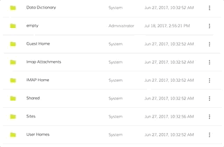

### 3. Dropdown Sites/Favorites Component

DocumentList now provides a site dropdown component to show and interact with the sites of the current user.

     <adf-sites-dropdown
      (change)="getSiteContent($event)">
     </adf-sites-dropdown>

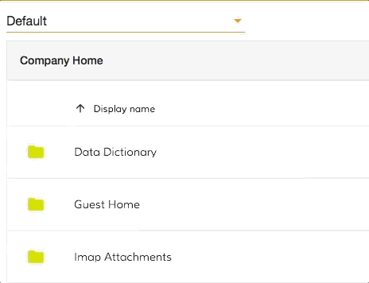

### 4. Toolbar Component

adf-toolbar is an easy container for headers, titles, actions, breadcrumbs.

    <adf-toolbar title="Toolbar">
        <adf-toolbar-title>
            <adf-breadcrumb ...></adf-breadcrumb>
        </adf-toolbar-title>
        <button md-icon-button>
            <md-icon>create_new_folder</md-icon>
        </button>
        <button md-icon-button>
            <md-icon>delete</md-icon>
        </button>
    </adf-toolbar>

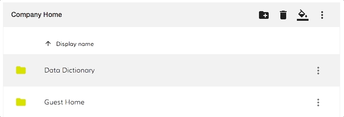

### 5. Upload Component New design

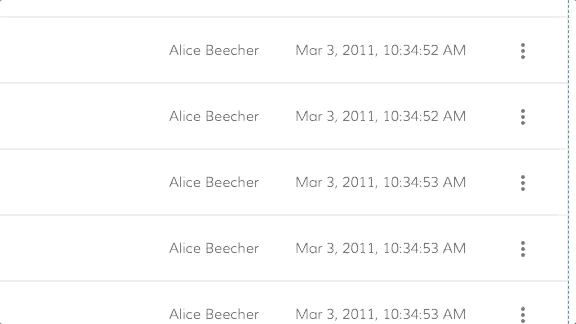

### 6. Upload ignore list configuration service

Is now possible add an ignore list for files that you don't want to allow upload on your CS. The configuration of this service is made through the [config service](https://github.com/Alfresco/alfresco-ng2-components/tree/master/ng2-components/ng2-alfresco-core#appconfigservice)
In the example below, you can see how filtered out the: '.git', '.DS_Store' and 'desktop.ini'.

```json
{
    "ecmHost": "[http://localhost:3000/ecm](http://localhost:3000/ecm)",
    "bpmHost": "[http://localhost:3000/bpm](http://localhost:3000/bpm)",
    "application": {
        "name": "Alfresco"
    },
    "files": {
          "excluded": [".DS_Store", "desktop.ini", ".git"]
    }
}
```

-   Standard glob patterns work.
-   You can end patterns with a forward slash / to specify a directory.

### 7. Process Service Start Task New design

Start Process task form has been redesigned:

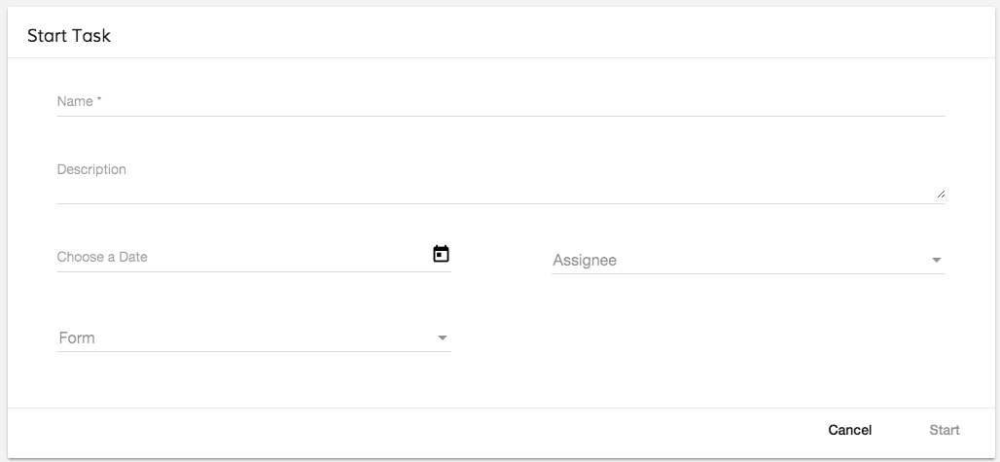

### 8. Process Header Component

This component shows all the basic information of a process.

    <adf-process-instance-header
        processInstance="localProcessDetails">
    </adf-process-instance-details>

The component is using the **adf-card-view** component to render all the information like a card.

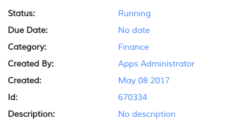

### 9. Search list Component new delete file feature

From now, it is possible to delete files (if you have permission) from within the search results.
This action will do delete the particular file from your contents and NOT just from the search results.

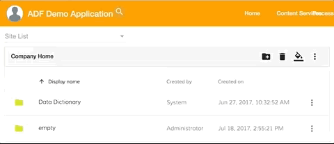

### 10. Login new property

You can now customize the copyright text in the adf-login component using the copyrightText property:


### 11. TaskDetails - DueDate and Description editable

The due date and the description of the task details are now editable and integrate into the adf-task-header component

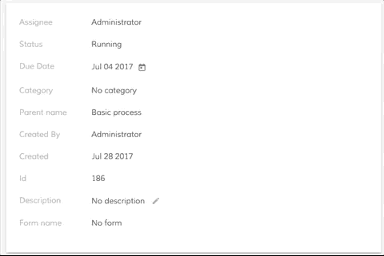

### 12. Configuration back end service hostname feature

[Application Configuration Service](https://github.com/Alfresco/alfresco-ng2-components/tree/develop/ng2-components/ng2-alfresco-core#appconfigservice) (AppConfigService) gets support for dynamic variable substitution for APS and ACS endpoint settings.
It is now possible having a configuration like given below:

    {
        "ecmHost": "http://{hostname}:{port}/ecm",
        "bpmHost": "http://{hostname}:{port}/bpm",
        "application": {
            "name": "Alfresco"
        }
    }

At runtime, the "hostname" and "port" variables will be automatically replaced with the actual values taken from the client machine. This helps reducing overhead with having multiple CI and E2E environments, all environments can use the same config file.

You can see more details on this feature in the following article: [Variable substitution in configuration strings](https://github.com/Alfresco/alfresco-ng2-components/tree/develop/ng2-components/ng2-alfresco-core#variable-substitution-in-configuration-strings)

### 13. User Preferences Service

Developers have now a possibility storing and retrieving user preferences for either ADF or custom components.

    @Component({...})
    class AppComponent {
        constructor(userPreferences: UserPreferencesService) {

            userPreferences.set('myProperty1', 'value1');
            userPreferences.set('myProperty2', 'value2');

            console.log(
                userPreferences.get('myProperty1')
            );
        }
    }

The [`UserPreferencesService`](../core/services/user-preferences.service.md) provides an API needed to store preferences based on different profiles. You can now have multiple users on the same machine with different set of preferences (like pagination size, authentication type, etc).

### 14. Search results highlighting properties

With the current ADF version, we got a Pipe that has the goal to highlight a specific term found in the text. Basically, when the term has been found, a CSS class is added to the HTML code. By doing so it will be easy to customise the colour just overriding the CSS class.
Note that the Pipe can be used in all the template where this behaviour is needed, but at the moment we are using that only inside the search result.

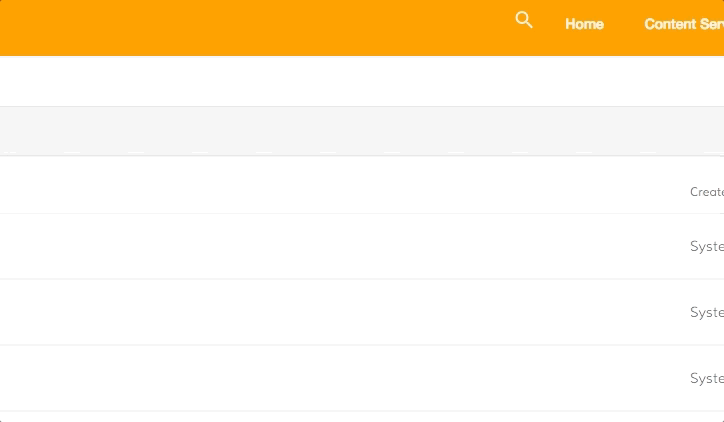

### 15. Change document list style rows based on permissions

You can now customize the document list style row based on the permissions of the node. For more information about this feature please follow this [link](https://github.com/Alfresco/alfresco-ng2-components/tree/master/ng2-components/ng2-alfresco-documentlist#custom-row-permissions-style).

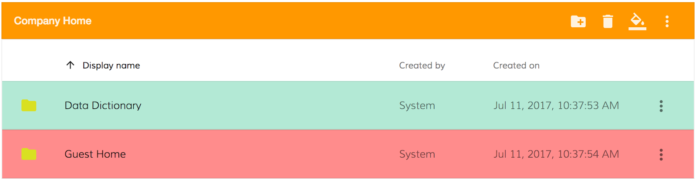

### 16. APS Audit REST API in the JS API

Two new methods has been added into the alfresco-js-api to support retrieve the audit informations inside the [process service](../process-services/services/process.service.md):

| API | Name | HTTP method | URL | Description |
| --- | ---- | ----------- | --- | ----------- |
| _ActivitiPublicRestApi.[`TaskApi`](https://github.com/Alfresco/alfresco-js-api/blob/develop/src/api-legacy/activiti-rest-api/docs/TaskApi.md)_ | [**getTaskAuditJson**](https://github.com/Alfresco/alfresco-js-api/blob/a82ce3bbe56cb0944f8771d14193704b571adf96/src/alfresco-activiti-rest-api/docs/TaskApi.md#getTaskAuditJson) | **GET** | /api/enterprise/tasks/{taskId}/audit | Retrieve audit infromation in json format |
| _ActivitiPublicRestApi.[`TaskApi`](https://github.com/Alfresco/alfresco-js-api/blob/develop/src/api-legacy/activiti-rest-api/docs/TaskApi.md)_ | [**getTaskAuditPdf**](https://github.com/Alfresco/alfresco-js-api/blob/a82ce3bbe56cb0944f8771d14193704b571adf96/src/alfresco-activiti-rest-api/docs/TaskApi.md#getTaskAuditPdf) | **GET** | /app/rest/tasks/{taskId}/audit | Retrieve the task audit infromation in pdf format |

For further details about those endepoints please refer to the [official documentation](https://github.com/Alfresco/alfresco-js-api/blob/master/src/alfresco-activiti-rest-api/docs/TaskApi.md) 

### 17. New services in ng2-alfresco-core

In the ng2-alfresco-core component, there are a lot of services that you can use out of the box outside our component and you can find the complete list [here](https://github.com/Alfresco/alfresco-ng2-components/tree/master/ng2-components#services)
The list below is the list of the new services added in 1.7.0:

-   [`DeletedNodesApiService`](../core/services/deleted-nodes-api.service.md)
-   [`FavoritesApiService`](../core/services/favorites-api.service.md)
-   [`NodesApiService`](../core/services/nodes-api.service.md)
-   PeopleApiService
-   SearchApiService
-   [`SharedLinksApiService`](../core/services/shared-links-api.service.md)
-   SitesApiService
-   [`ThumbnailService`](../core/services/thumbnail.service.md)
-   [`SearchService`](../core/services/search.service.md)

### 18. Code Contribution Guide and CLA

With the goal to make even easy contribute to our project, we have created a new [Contribution guide](https://github.com/Alfresco/alfresco-ng2-components/blob/master/CONTRIBUTING.md) to help all the people the community to contribute to the ADF code.
To make the contribution process smooth we have also added an automatic CLA (Contributor License Agreement) in our GitHub CI.

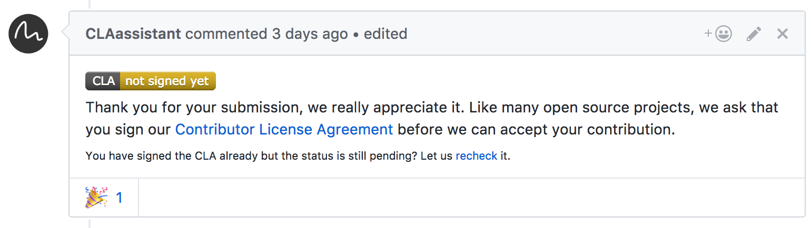

## References

Below you can find a brief list of references to help you starting to use the new release.

[Official GitHub Project - alfresco-ng2-components](https://github.com/Alfresco/alfresco-ng2-components)

[Getting started guides with Alfresco Application Development Framework](https://community.alfresco.com/community/application-development-framework/pages/get-started)

[Component catalog](http://devproducts.alfresco.com/)

[Gitter chat supporting Alfresco ADF](https://gitter.im/Alfresco/alfresco-ng2-components)

[ADF examples](https://github.com/Alfresco/adf-examples)

[List of all components](https://github.com/Alfresco/alfresco-ng2-components/tree/master/ng2-components)

[Alfresco-JS-API](https://github.com/Alfresco/alfresco-js-api)

[ADF App Generator ](https://github.com/Alfresco/generator-ng2-alfresco-app)

Please refer to the [official documentation](http://docs.alfresco.com/) for further details and suggestions.

## Issues addressed

Below you can find a detailed list of tickets addressed in the new release. For a better understanding, the list is grouped by topic.

Release Notes - Apps Development Framework - Version 1.7. 

### Documentation

-   \[[ADF-537](https://issues.alfresco.com/jira/browse/ADF-537)] - Code contribution guide
-   \[[ADF-892](https://issues.alfresco.com/jira/browse/ADF-892)] - Blog post on replacing ADF services in apps
-   \[[ADF-951](https://issues.alfresco.com/jira/browse/ADF-951)] - Article on how to update from 1.5.0 to 1.6. 
-   \[[ADF-961](https://issues.alfresco.com/jira/browse/ADF-961)] - Article integration APS and ACS and cognitive analysis metadata
-   \[[ADF-987](https://issues.alfresco.com/jira/browse/ADF-987)] - Add information about SaSS in the contribution guidelines
-   \[[ADF-1007](https://issues.alfresco.com/jira/browse/ADF-1007)] - Add Markdown linter in the build process
-   \[[ADF-1042](https://issues.alfresco.com/jira/browse/ADF-1042)] - Add documentation on how to search only folder
-   \[[ADF-1107](https://issues.alfresco.com/jira/browse/ADF-1107)] - Create example: Viewer + adf-card and blog post
-   \[[ADF-1110](https://issues.alfresco.com/jira/browse/ADF-1110)] - Toolbar documentation
-   \[[ADF-1136](https://issues.alfresco.com/jira/browse/ADF-1136)] - Provide details on configuring Viewer to display PDF
-   \[[ADF-1146](https://issues.alfresco.com/jira/browse/ADF-1146)] - Upgrade Angular CLI article to the newest version of CLI/ADF

### Feature

-   \[[ADF-914](https://issues.alfresco.com/jira/browse/ADF-914)] - [`Form`](../../lib/process-services/src/lib/task-list/models/form.model.ts) section in the demo shell
-   \[[ADF-918](https://issues.alfresco.com/jira/browse/ADF-918)] - Activiti Start Task - Refactoring
-   \[[ADF-920](https://issues.alfresco.com/jira/browse/ADF-920)] - Process Header Component - Use the CardView component
-   \[[ADF-970](https://issues.alfresco.com/jira/browse/ADF-970)] - Attachment Task/process list - add template for empty list
-   \[[ADF-971](https://issues.alfresco.com/jira/browse/ADF-971)] - Create Task/process attachment - Improve the functionality
-   \[[ADF-1032](https://issues.alfresco.com/jira/browse/ADF-1032)] - CLA - External PR automate task
-   \[[ADF-1108](https://issues.alfresco.com/jira/browse/ADF-1108)] - Task header - Show the parent name clickable
-   \[[ADF-1114](https://issues.alfresco.com/jira/browse/ADF-1114)] - Process comments - Share the same comment between Task and Process

### Epic

-   \[[ADF-697](https://issues.alfresco.com/jira/browse/ADF-697)] - Provide support for Codelizer
-   \[[ADF-868](https://issues.alfresco.com/jira/browse/ADF-868)] - Add the adf prefix across all the components

### Bug

-   \[[ADF-195](https://issues.alfresco.com/jira/browse/ADF-195)] - fix 'change detection crash' when using router multiple times - 1550 Github
-   \[[ADF-334](https://issues.alfresco.com/jira/browse/ADF-334)] - "$" symbol on a currency/amount field is shown against the label - 1707 Github
-   \[[ADF-523](https://issues.alfresco.com/jira/browse/ADF-523)] - [Search Component](../content-services/components/search.component.md) - Unable to delete a file
-   \[[ADF-733](https://issues.alfresco.com/jira/browse/ADF-733)] - Activiti start process - AppId should not be mandatory
-   \[[ADF-770](https://issues.alfresco.com/jira/browse/ADF-770)] - Wrong highlight is displayed around options within DocumentList.
-   \[[ADF-778](https://issues.alfresco.com/jira/browse/ADF-778)] - "Upload Dialog" displays files that were previously uploaded on a different account.
-   \[[ADF-790](https://issues.alfresco.com/jira/browse/ADF-790)] - Attachment List displays the attached files within a user task.
-   \[[ADF-819](https://issues.alfresco.com/jira/browse/ADF-819)] - Snackbar does not appear when uploading files via DnD
-   \[[ADF-923](https://issues.alfresco.com/jira/browse/ADF-923)] - Involved user should not be able to see 'Complete' button as active in a task.
-   \[[ADF-939](https://issues.alfresco.com/jira/browse/ADF-939)] - [Login] Sign in button does not stay at the bottom
-   \[[ADF-943](https://issues.alfresco.com/jira/browse/ADF-943)] - APS [`ContentApi`](https://github.com/Alfresco/alfresco-js-api/blob/develop/src/api/content-rest-api/api/content.api.ts) is not present on index.d.ts and [`SitesApi`](https://github.com/Alfresco/alfresco-js-api/blob/develop/src/api/content-rest-api/api/sites.api.ts) is not complete
-   \[[ADF-945](https://issues.alfresco.com/jira/browse/ADF-945)] - 'Undefined' is displayed in 'attach file' widget after restore.
-   \[[ADF-950](https://issues.alfresco.com/jira/browse/ADF-950)] - when the [`Form`](../../lib/process-services/src/lib/task-list/models/form.model.ts) in readonly mode you can edit the date
-   \[[ADF-957](https://issues.alfresco.com/jira/browse/ADF-957)] - Duplicate Rest calls are made for fields where Rest end points are given
-   \[[ADF-966](https://issues.alfresco.com/jira/browse/ADF-966)] - Data table doesn't update on async loading
-   \[[ADF-978](https://issues.alfresco.com/jira/browse/ADF-978)] - No warning message is displayed to the user when minor changes are made on Settings.
-   \[[ADF-1001](https://issues.alfresco.com/jira/browse/ADF-1001)] - [Process Diagram Widget] - Long process details are not rendered correctly.
-   \[[ADF-1003](https://issues.alfresco.com/jira/browse/ADF-1003)] - An unsupported file can't be convert to pdf
-   \[[ADF-1013](https://issues.alfresco.com/jira/browse/ADF-1013)] - [Login Page] - 'Login footer' cannot be switched off.
-   \[[ADF-1015](https://issues.alfresco.com/jira/browse/ADF-1015)] - Document List is missing @Input decorator for loading state
-   \[[ADF-1026](https://issues.alfresco.com/jira/browse/ADF-1026)] - Default "empty" document list view should be translatable.
-   \[[ADF-1047](https://issues.alfresco.com/jira/browse/ADF-1047)] - AlfrescoSettingsService defaults to 'ALL' on page reload
-   \[[ADF-1048](https://issues.alfresco.com/jira/browse/ADF-1048)] - Multiple files attached to a task within a form are not displayed
-   \[[ADF-1056](https://issues.alfresco.com/jira/browse/ADF-1056)] - [`Form`](../../lib/process-services/src/lib/task-list/models/form.model.ts) List Component does not display the forms of the user
-   \[[ADF-1068](https://issues.alfresco.com/jira/browse/ADF-1068)] - Files can be uploaded using drag and drop when 'enable file' is unchecked
-   \[[ADF-1070](https://issues.alfresco.com/jira/browse/ADF-1070)] - [User preferences service](../core/services/user-preferences.service.md) does not restore prefix on page reload.
-   \[[ADF-1072](https://issues.alfresco.com/jira/browse/ADF-1072)] - Unsupported type of file attached to a task or process can not be converted to pdf
-   \[[ADF-1078](https://issues.alfresco.com/jira/browse/ADF-1078)] - [Tasks] - Task Details are displayed inside Task Filters list.
-   \[[ADF-1079](https://issues.alfresco.com/jira/browse/ADF-1079)] - [Process Services] - Not able to start a process.
-   \[[ADF-1081](https://issues.alfresco.com/jira/browse/ADF-1081)] - Scroll bar is missing in [comments component](../core/components/comments.component.md)
-   \[[ADF-1097](https://issues.alfresco.com/jira/browse/ADF-1097)] - File with unaccepted extension is uploaded when 'Format' is set to 'All files'
-   \[[ADF-1134](https://issues.alfresco.com/jira/browse/ADF-1134)] - [Document List] Selection events not raised for certain scenarios
-   \[[ADF-1138](https://issues.alfresco.com/jira/browse/ADF-1138)] - Start Task [`Form`](../../lib/process-services/src/lib/task-list/models/form.model.ts) Assignee dropdown show null value inside
-   \[[ADF-1140](https://issues.alfresco.com/jira/browse/ADF-1140)] - Task header - Wrong parent name key
-   \[[ADF-1142](https://issues.alfresco.com/jira/browse/ADF-1142)] - Cannot add comment into a process.
-   \[[ADF-1143](https://issues.alfresco.com/jira/browse/ADF-1143)] - [TaskList] - Not able to start a task when changing the assignee from the 'Start Task' form.
-   \[[ADF-1147](https://issues.alfresco.com/jira/browse/ADF-1147)] - [Processes] - [`Form`](../../lib/process-services/src/lib/task-list/models/form.model.ts) is not rendered properly when starting a new process.
-   \[[ADF-1148](https://issues.alfresco.com/jira/browse/ADF-1148)] - [TaskList] - 'Description' is not rendered.
-   \[[ADF-1149](https://issues.alfresco.com/jira/browse/ADF-1149)] - 'Remove' involved people of a task button is displayed behind the dialog
-   \[[ADF-1151](https://issues.alfresco.com/jira/browse/ADF-1151)] - [Processes] - 'Show Diagram' option is not displayed.
-   \[[ADF-1155](https://issues.alfresco.com/jira/browse/ADF-1155)] - The Process and Task filters are not displayed properly in ADF for applications created in APS
-   \[[ADF-1162](https://issues.alfresco.com/jira/browse/ADF-1162)] - List with forms is not displayed inside [`Form`](../../lib/process-services/src/lib/task-list/models/form.model.ts) List.
-   \[[ADF-1168](https://issues.alfresco.com/jira/browse/ADF-1168)] - Tasks header component and Processes header component have different margins
-   \[[ADF-1169](https://issues.alfresco.com/jira/browse/ADF-1169)] - [Start Task] - Missing date validation
-   \[[ADF-1175](https://issues.alfresco.com/jira/browse/ADF-1175)] - Start Process and Start Task Forms don't close when Cancel button is clicked
-   \[[ADF-1190](https://issues.alfresco.com/jira/browse/ADF-1190)] - Task form - Unable to view task form when the process does not have variables
-   \[[ADF-1199](https://issues.alfresco.com/jira/browse/ADF-1199)] - `MinimalNodeEntryEntity` is missing the "allowableOperations" property
-   \[[ADF-1200](https://issues.alfresco.com/jira/browse/ADF-1200)] - The URL validation error message is still displayed after changing the invalid url with a valid one
-   \[[ADF-1201](https://issues.alfresco.com/jira/browse/ADF-1201)] - 508 Compliance Resolution for the App tiles. - 2131 Github
-   \[[ADF-1216](https://issues.alfresco.com/jira/browse/ADF-1216)] - The included packages are not displayed in [About Component](../core/components/about.component.md) if the user is logged only on Content Services
-   \[[ADF-1228](https://issues.alfresco.com/jira/browse/ADF-1228)] - Task Details - The People and Involve component are not aligned
-   \[[ADF-1229](https://issues.alfresco.com/jira/browse/ADF-1229)] - Task Filter - Wrong task filter is selected when a new task is created

### New Feature

-   \[[ADF-112](https://issues.alfresco.com/jira/browse/ADF-112)] - Task Header in TaskDetails component shows DueDate but is not editable
-   \[[ADF-402](https://issues.alfresco.com/jira/browse/ADF-402)] - Process Diagram Widget - Show the current process state
-   \[[ADF-487](https://issues.alfresco.com/jira/browse/ADF-487)] - Info tab should show [Content Service](../core/services/content.service.md) and [Process service](../process-services/services/process.service.md) information
-   \[[ADF-858](https://issues.alfresco.com/jira/browse/ADF-858)] - Provide ability to attach multiple files on process Form- 1988 Github
-   \[[ADF-917](https://issues.alfresco.com/jira/browse/ADF-917)] - Upload ignore list files configuration
-   \[[ADF-955](https://issues.alfresco.com/jira/browse/ADF-955)] - Custom icons for selected rows
-   \[[ADF-960](https://issues.alfresco.com/jira/browse/ADF-960)] - Allow changing copyright section for [Login component](../core/components/login.component.md)
-   \[[ADF-967](https://issues.alfresco.com/jira/browse/ADF-967)] - Evaluate "hostname" and "port" in the [app config service](../core/services/app-config.service.md)
-   \[[ADF-968](https://issues.alfresco.com/jira/browse/ADF-968)] - Dropdown sites and favorites
-   \[[ADF-983](https://issues.alfresco.com/jira/browse/ADF-983)] - [User Preferences Service](../core/services/user-preferences.service.md)
-   \[[ADF-1038](https://issues.alfresco.com/jira/browse/ADF-1038)] - Dropdown breadcrumbs
-   \[[ADF-1039](https://issues.alfresco.com/jira/browse/ADF-1039)] - Search results highlighting
-   \[[ADF-1040](https://issues.alfresco.com/jira/browse/ADF-1040)] - Change document list style rows based on permissions
-   \[[ADF-1041](https://issues.alfresco.com/jira/browse/ADF-1041)] - Copy and Move Component
-   \[[ADF-1086](https://issues.alfresco.com/jira/browse/ADF-1086)] - Allow providing "attachment" option value when generating content links
-   \[[ADF-1109](https://issues.alfresco.com/jira/browse/ADF-1109)] - APS Audit REST API in the JS API
-   \[[ADF-1115](https://issues.alfresco.com/jira/browse/ADF-1115)] - Improve Document List selection management

### Task

-   \[[ADF-497](https://issues.alfresco.com/jira/browse/ADF-497)] - Improvement to task comment (activiti-comments) component - 1829 Github
-   \[[ADF-506](https://issues.alfresco.com/jira/browse/ADF-506)] - Unify [thumbnail service](../core/services/thumbnail.service.md) across search and document list
-   \[[ADF-861](https://issues.alfresco.com/jira/browse/ADF-861)] - Add codelizer in ng2-alfresco-viewer ng2-alfresco-webscript
-   \[[ADF-862](https://issues.alfresco.com/jira/browse/ADF-862)] - Add codelizer in ng2-alfresco-login ng2-alfresco-search
-   \[[ADF-867](https://issues.alfresco.com/jira/browse/ADF-867)] - Add codelizer in demo-shell and genral build
-   \[[ADF-869](https://issues.alfresco.com/jira/browse/ADF-869)] - Add ADF prefix on ng2-alfresco-core ng2-alfresco-datatatable
-   \[[ADF-870](https://issues.alfresco.com/jira/browse/ADF-870)] - Add ADF prefix ng2-alfresco-tag ng2-alfresco-social
-   \[[ADF-871](https://issues.alfresco.com/jira/browse/ADF-871)] - Add ADF prefix ng2-alfresco-login ng2-alfresco-userinfo
-   \[[ADF-872](https://issues.alfresco.com/jira/browse/ADF-872)] - Add ADF prefix ng2-alfresco-documentlist ng2-alfresco-search
-   \[[ADF-873](https://issues.alfresco.com/jira/browse/ADF-873)] - Add ADF prefix ng2-alfresco-webscript ng2-alfresco-viewer
-   \[[ADF-874](https://issues.alfresco.com/jira/browse/ADF-874)] - Add ADF prefix ng2-activiti-diagrams ng2-alfresco-analytics
-   \[[ADF-875](https://issues.alfresco.com/jira/browse/ADF-875)] - Add ADF prefix ng2-activiti-tasklist ng2-activiti-processlist
-   \[[ADF-876](https://issues.alfresco.com/jira/browse/ADF-876)] - Add ADF prefix ng2-activiti-form
-   \[[ADF-924](https://issues.alfresco.com/jira/browse/ADF-924)] - Upload Component - Import the logic/design from EFSS
-   \[[ADF-973](https://issues.alfresco.com/jira/browse/ADF-973)] - Remove demo projects from components folder
-   \[[ADF-992](https://issues.alfresco.com/jira/browse/ADF-992)] - Integrate SFS enhancements to Document List
-   \[[ADF-993](https://issues.alfresco.com/jira/browse/ADF-993)] - Integrate SFS enhancements for [Toolbar component](../core/components/toolbar.component.md)
-   \[[ADF-1002](https://issues.alfresco.com/jira/browse/ADF-1002)] - Attachment Task list - Add Drag and drop functionality
-   \[[ADF-1030](https://issues.alfresco.com/jira/browse/ADF-1030)] - Datatable - enable isLoading to show the spinner in all the components
-   \[[ADF-1044](https://issues.alfresco.com/jira/browse/ADF-1044)] - Activiti Comment - use the new design inside the demoshell
-   \[[ADF-1045](https://issues.alfresco.com/jira/browse/ADF-1045)] - Attachment Process list - Improve the functionality
-   \[[ADF-1092](https://issues.alfresco.com/jira/browse/ADF-1092)] - Remove DataTable dependency on MDL
-   \[[ADF-1103](https://issues.alfresco.com/jira/browse/ADF-1103)] - Add custom tslint rules to avoid unwanted Class and File name prefix
-   \[[ADF-1112](https://issues.alfresco.com/jira/browse/ADF-1112)] - Move JS-API related services to ADF core
-   \[[ADF-1117](https://issues.alfresco.com/jira/browse/ADF-1117)] - Activiti Start Process - Migrate to MD
-   \[[ADF-1120](https://issues.alfresco.com/jira/browse/ADF-1120)] - Remove MDL button wrapper from ADF core
-   \[[ADF-1144](https://issues.alfresco.com/jira/browse/ADF-1144)] - Deprecate MDL sidebar in demo shell

Please refer to [the Alfresco issue tracker](https://issues.alfresco.com/jira/projects/ADF/issues/ADF-581?filter=allopenissues) for other known issues in this release. If you have more questions, please reply here or contact us using [gitter](https://gitter.im/Alfresco/alfresco-ng2-components).
