# Alfresco Application Development Framework, version 1.8.0 Release Note

These release notes provide information for the **1.8.0 release** of Alfresco Application Development Framework.

This is the next **Limited Available** release of Application Development Framework, containing the Angular components to build a Web Application on top of the Alfresco Services.
The release can be found on GitHub at [this link.](https://github.com/Alfresco/alfresco-ng2-components/releases/tag/1.7.0)

## Contents

-   [Goals for this release](#goals-for-this-release)
-   [Notable new features](#notable-new-features)
    -   [1. Theming ADF component](#1-theming-adf-component)
    -   [2. Info Drawer component](#2-info-drawer-component)
    -   [3. Form style component enhancements](#3-form-style-component-enhancements)
    -   [4. Empty form template](#4-empty-form-template)
    -   [5. Form Validation Enhancements](#5-form-validation-enhancements)
    -   [6. FormFieldModel/FormModel improvements](#6-formfieldmodelformmodel-improvements)
    -   [7. DataTable Accessibility Improvements](#7-datatable-accessibility-improvements)
    -   [8. Copy and move component enhancements](#8-copy-and-move-component-enhancements)
    -   [9. Download as a ZIP functionality](#9-download-as-a-zip-functionality)
    -   [10. Tooltips for DataTable/DocumentList cells](#10-tooltips-for-datatabledocumentlist-cells)
    -   [11. Profile picture in Comments and Involved people](#11-profile-picture-in-comments-and-involved-people)
    -   [12. Support for additional data sources in Document List](#12-support-for-additional-data-sources-in-document-list)
    -   [13. Directive to disable element or component based on node permission](#13-directive-to-disable-element-or-component-based-on-node-permission)
    -   [14. Task/Process Audit Log Directive](#14-taskprocess-audit-log-directive)
    -   [15. Task List Pagination](#15-task-list-pagination)
    -   [16. Migrate to @angular/material date picker component](#16-migrate-to-angularmaterial-date-picker-component)
    -   [17. File Viewer design update and new features](#17-file-viewer-design-update-and-new-features)
-   [References](#references)
-   [Issues addressed](#issues-addressed)
-   [Documentation](#documentation)
-   [Bug](#bug)
-   [New Feature](#new-feature)
-   [Task](#task)

## Goals for this release

In the ADF 1.8 release we've introduced a number of new generic features, such as Info Drawer, theming capabilities and lots of form customizations and accessibility. The task list now works with the [pagination component](../core/components/pagination.component.md) and we have started the work to completely redesign the [viewer component](../core/components/viewer.component.md).
We continue the effort to migrate to @angular/material, it will be a few more releases before we wrap up that work. The data table and document list continue to get new features and enhancements, with the new data sources and layout presets we open up possibilities for externalizing the layout and sources for the document list.

This release builds on last month's contains bug fixes and new feature. See the list below for major details.

Please report issues with this release in the [issue tracker](https://github.com/Alfresco/alfresco-ng2-components/issues). You can collaborate on this release or share feedback by using the discussion tools on [gitter](https://gitter.im/Alfresco/alfresco-ng2-components).

## Notable new features

Below the most relevant features of this release:

-   Theming ADF component
-   [Info Drawer component](../core/components/info-drawer.component.md)
-   [`Form`](../../lib/process-services/src/lib/task-list/models/form.model.ts) style component enhancements
-   Empty form template
-   Additional data sources input for Document List
-   [`Form`](../../lib/process-services/src/lib/task-list/models/form.model.ts) validation enhancements
-   FormFieldModel/FormModelimprovements
-   DataTable\*\* \*\*Accessibility Improvements
-   Copy and move component enhancements
-   Download as a ZIP functionality
-   Tooltips for DataTable/DocumentList cells
-   Profile picture in Comments and Involved people
-   Support for additional data sources in Document List
-   Directive to disable element or component based on node permission
-   Task/Process Audit Log Directive
-   Task List [`Pagination`](../../lib/content-services/document-list/models/document-library.model.ts)
-   Migrate to @angular/material date picker component
-   File Viewer design update and new features

### 1. Theming ADF component

We have added in ADF several pre-built theme css files. These theme files also include all of the styles for core (styles common to all components), so you only have to include a single css file for Angular Material in your app.
When you want more customization than a pre-built theme offers, you can create your own theme file. You need to include the packages only what you really use in your application. For more information about theming please refer to the [offiicial documentation.](../user-guide/theming.md)

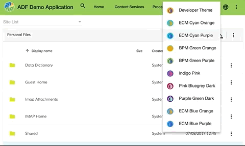

### 2. Info Drawer component

It is now possible to use the [Info Drawer component,](../core/components/info-drawer.component.md) which gives you a sidebar like look with tabbing support. For more information about the usage, check the documentation in the core package.

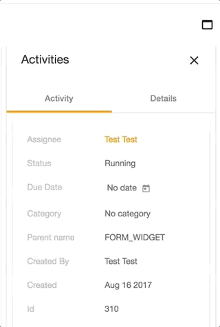

### 3. Form style component enhancements

We have completed the transition from mdl to material2 for the form components. In addition we have also improved the style of some form components.

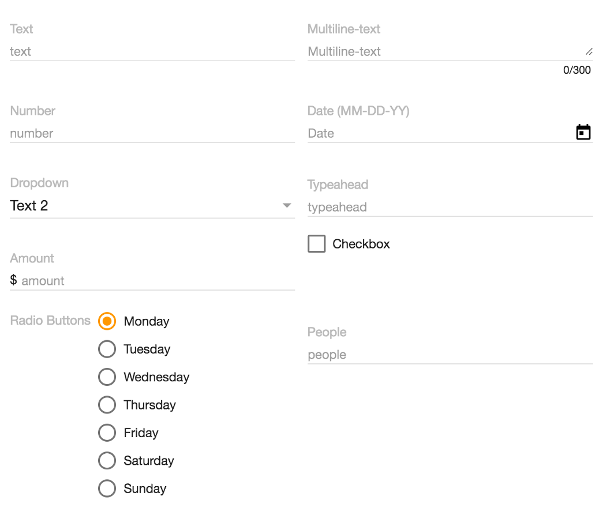

### 4. Empty form template

You can now add an empty template that will be shown if no form definition are present

    <adf-form .... >
       

           <h2>Empty form</h2>
        

    </adf-form>

### 5. Form Validation Enhancements

New events that allow taking control over the [`Form`](../../lib/process-services/src/lib/task-list/models/form.model.ts) and Field validation:

    validateForm: Subject<ValidateFormEvent>
    validateFormField: Subject<ValidateFormFieldEvent>()

The [validateForm](../core/services/form.service.md) event is raised every time the entire [`Form`](../../lib/process-services/src/lib/task-list/models/form.model.ts) is re-validated. This happens also every time a field value or some of the properties is changed (for example the "required" property). The [validateFormField](../core/services/form.service.md) event is raised every time a single [`Form`](../../lib/process-services/src/lib/task-list/models/form.model.ts) Field is re-validated.

Both events are "cancellable", that means you can apply your own validation rules, change corresponding field validation state, or even prevent the default behaviour if needed.

Example:

    this.formService.validateFormField.subscribe(
      (event: ValidateFormFieldEvent) => {
        const field = event.field;
        const form = event.form;
        // do some custom validation based on field or form

        // set validation as "failed" and prevent any further checks
        event.isValid = false;
        event.preventDefault();
      }
    );

### 6. FormFieldModel/FormModel improvements

#### FormFieldModel

The "required" property now re-validates the corresponding Field and entire [`Form`](../../lib/process-services/src/lib/task-list/models/form.model.ts) upon every change. That enables scenarios when the "required" constraint is changed dynamically for a field based on some external factors.

#### FormModel

New "getFieldById" method to simplify certain scenarios when accessing multiple fields by id

    getFieldById(fieldId: string): FormFieldModel

The [`Form`](../../lib/process-services/src/lib/task-list/models/form.model.ts) now controls all Field validators. It becomes possible managing existing validator instances, replacing them, or extending form validation with custom rules and error messages. The "adf-form" component now also supports binding custom validator sets to the underlying [FormModel,](lib/core/src/lib/form/components/widgets/core/form.model.ts) that allows defining validation sets in your code and binding via HTML.

You can read more details on the new Validation layer in the [`Form`](../../lib/process-services/src/lib/task-list/models/form.model.ts) readme: [Form Field Validators](../core/interfaces/form-field-validator.interface.md). The "demo shell" application has been also extended to demonstrate custom validators in action. You can check the code here: [Demo Field Validator](../core/interfaces/form-field-validator.interface.md).

### 7. DataTable Accessibility Improvements

The "**DataTable**" component has got multiple accessibility improvements. That means all derived components (Document List, Tas/Process List, etc) get the same set of features automatically.

The major features are:

-   tabbing through the column headers (including Shift-Tab to tab backwards)
-   tabbing through the individual row cells (including Shift-Tab to tab backwards)
-   focus rings for row cells and column headers
-   keyboard (Enter key) support for column headers: sorting order change
-   keyboard (Enter key) support for rows: navigate to a folder or initiate a file preview

### 8. Copy and move component enhancements

Further enhancements were implemented for the Copy & move dialog. From now, you can see the path of a selected item, navigate back with the breadcrumbs and select the folder you entered.

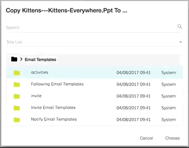

### 9. Download as a ZIP functionality

The ADF framework provides support for downloading nodes (Files and Folders) as "ZIP" archives. The **alfresco-js-api** library features new support for the [Downloads](https://api-explorer.alfresco.com/api-explorer/#/downloads) API. In addition, the Core library (ng2-alfresco-core) provides a ["DownloadZipDialogComponent"](../core/services/download-zip.service.md) that allows invoking "Download as Zip" dialogues from any place in your code.

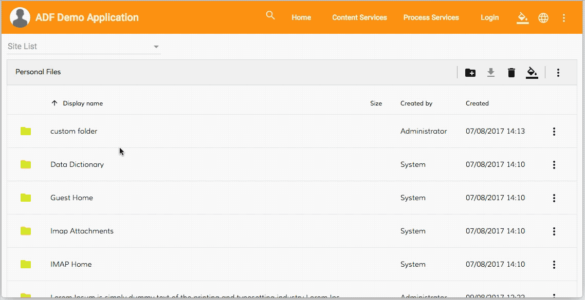

You can see a working button handler code in the following [resource](../../demo-shell/src/app/components/files/files.component.ts).

### 10. Tooltips for DataTable/DocumentList cells

It is now possible to provide a custom tooltip for every column in the DataTable and derived components.

    <data-column
        title="Name"
        key="name"
        [formatTooltip]="getNodeNameTooltip"
        class="full-width ellipsis-cell">
    </data-column>

And the code behind in this case can be as follows:

    import { DataColumn, DataRow } from 'ng2-alfresco-datatable';

    @Component({...})
    export class MyComponent {
        ...

        getNodeNameTooltip(row: DataRow, col: DataColumn): string {
            if (row) {
                return row.getValue('name');
            }
            return null;
        }
    }

### 11. Profile picture in Comments and Involved people

With the new ADF release, if the user has a profile picture, it will be shown inside the Comment/Involved [People component](../process-services/components/people.component.md):

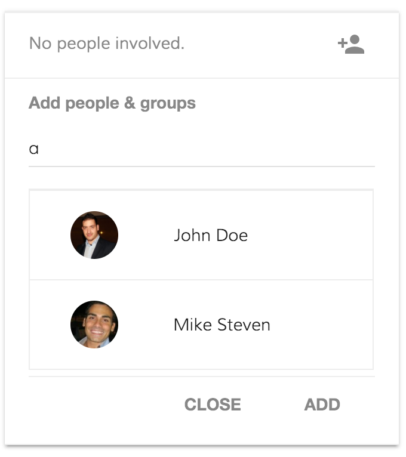

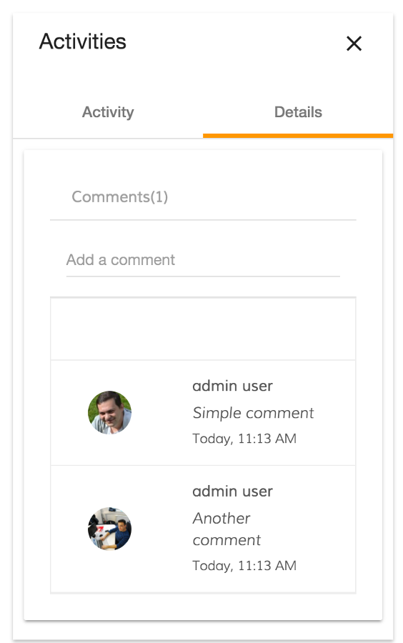

### 12. Support for additional data sources in Document List

#### Column Types

DocumentList component now provides various enhancements for existing, and support for additional column types:

-   **date**: additional "timeAgo" format value for dates, automatically switches to full date for periods longer than a week
-   **fileSize**: displays the size of the File node, including conversion to KB, MB, etc.
-   **location**: renders a hyperlink to the node's parent folder, allows navigating to a particular route based on the "format" value settings

You can get more details on the column types in the "[Column Types](https://github.com/Alfresco/alfresco-ng2-components/tree/develop/ng2-components/ng2-alfresco-documentlist#column-types)" section of the documentation.

#### Data Sources and Layout Presets

DocumentList now also supports extra data sources. You can now set the "**currentFolderId**" property to one of the following values:

-   \-trashcan-
-   \-sharedlinks-
-   \-sites-
-   \-favorites-
-   \-recent-

The component provides reasonable column defaults for each custom source, so you can use an empty **adf-document-list** tag in HTML templates, and the layout will be automatically adopted.

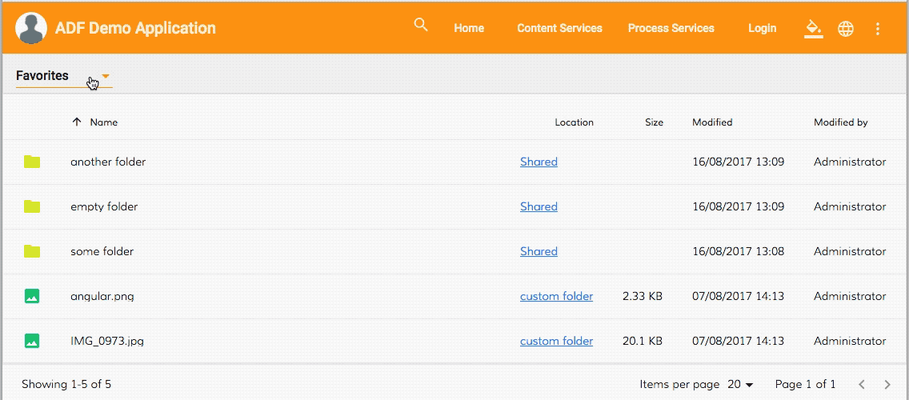

You can get more details on the data sources and default presets in the [Data Sources](https://github.com/Alfresco/alfresco-ng2-components/tree/develop/ng2-components/ng2-alfresco-documentlist#data-sources) section.

### 13. Directive to disable element or component based on node permission

The Core ADF library (ng2-alfresco-core) features a new **adf-node-permission** directive that allows you to selectively disable or enable an HTML element or an Angular component based on the node permissions. You can bind one or multiple nodes by means of the **adf-nodes** property that becomes available for each element.

For example toggling the state of the toolbar button based on the DocumentList selection state (selected nodes):

    <adf-toolbar title="toolbar example">
        <button md-icon-button
                adf-node-permission="delete"
                [adf-nodes]="documentList.selection">
            <md-icon>delete</md-icon>
        </button>
    </adf-toolbar>

    <adf-document-list #documentList ...>
     ...
    </adf-document-list>

You can find all the details and usage examples in the directive documentation: [Node Permission Directive](https://github.com/Alfresco/alfresco-ng2-components/tree/develop/ng2-components/ng2-alfresco-core#node-permission-directive).

### 14. Task/Process Audit Log Directive

With the latest ADF release, we got two new directives **adf-process-audit** and **adf-task-audit**. Using these directives is very easily create a button to download the Task Audit or the Process Audit pdf.
In the case you are using the **adf-process-audit**  the only parameters that are needed are:

-   process-id
-   fileName
-   format (pdf or json)

    <button
       md-icon-button
       adf-process-audit
       [process-id]="processInstanceDetails.id"
       [fileName]="'Process Audit - ' + processInstanceDetails.id"
       (error)="onAuditError($event)">
    <md-icon mdTooltip="Process Audit">assignment_ind</md-icon>
    </button>

You can see how it looks like the button after the bind:

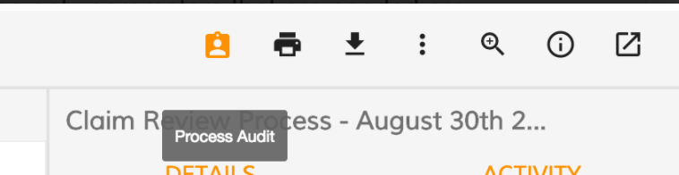

On the click process audit pdf will be downloaded:

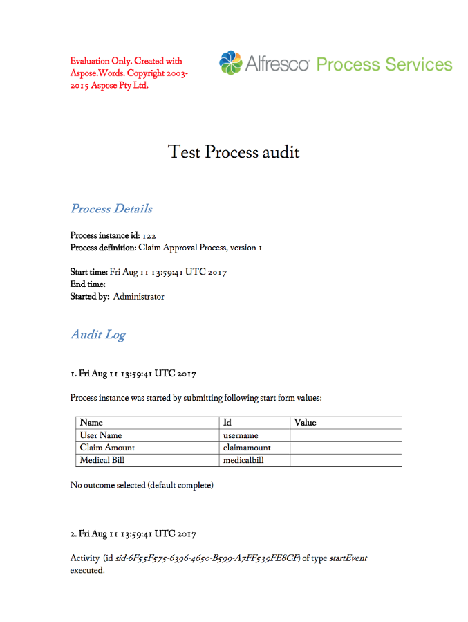

In the case you are using the **adf-task-audit**  the only parameters that are needed are:

-   task-id
-   fileName
-   format (pdf or json)

    <button
       md-icon-button
       adf-task-audit
       [task-id]="taskId"
       [fileName]="'Task Audit - ' + taskId"
       (error)="onAuditError($event)">
    <md-icon mdTooltip="Task Audit">assignment_ind</md-icon>
    </button>

You can see how it looks like the button after the bind:

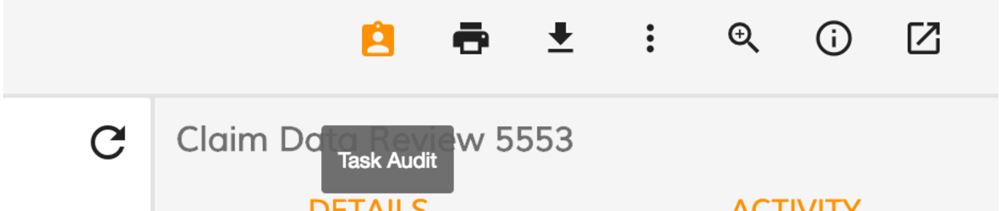

On the click the task audit pdf will be downloaded:

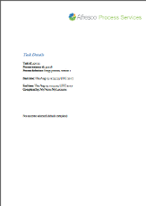

### 15. Task List Pagination

With the latest ADF release, the adf-tasklist is fully compatible with the adf-pagination component. Although ADF doesn't provide a  single component that includes the adf-tasklist and the adf-pagination in a single component, is not so difficult create your custom component that binds the adf-tasklist and the adf-pagination.

This is how the pagination looks like:

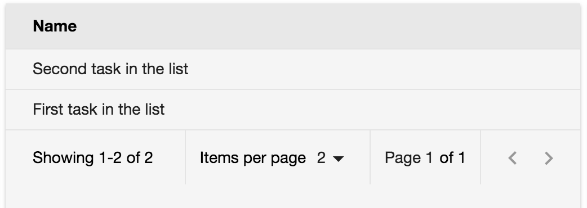

tasklist-pagination.html

    <activiti-tasklist
        [appId]="'2002'"
        [assignment]="'assignee'"
        [state]="'open'"
        [sort]="'created-desc'"
        [page]="page"
        [size]="pagination.maxItems"
        #activititasklist>
    </activiti-tasklist>

    <adf-pagination
        [pagination]="pagination"
        [supportedPageSizes]="[5, 10, 15, 20]"
        (changePageNumber)="onChangePageNumber($event)"
        (changePageSize)="onChangePageSize($event)"
        (nextPage)="onNextPage($event)"
        (prevPage)="onPrevPage($event)">
    </adf-pagination>

tasklist-pagination.ts

    import { Component, OnInit } from '@angular/core';
    import { Pagination } from 'alfresco-js-api';
    import { TaskListService } from 'ng2-activiti-tasklist';

    @Component({
        selector: 'tasklist-paginator',
        templateUrl: './activiti-tasklist-paginator.component.html'
    })
    export class TasklistPaginatorComponent implements OnInit {

        pagination: Pagination = {
            skipCount: 0,
            maxItems: 5,
            totalItems:  
        };

        page: number = 0;

        constructor(private taskListService: TaskListService) {
        }

        ngOnInit() {
            this.taskListService.tasksList$.subscribe(
                (tasks) => {
                    this.pagination = {count: tasks.data.length, maxItems: this.pagination.maxItems, skipCount: this.pagination.skipCount, totalItems: tasks.total};
                }, (err) => {
                console.log('err');
            });

        }

        onPrevPage(pagination: Pagination): void {
            this.pagination.skipCount = pagination.skipCount;
            this.page--;
        }

        onNextPage(pagination: Pagination): void {
            this.pagination.skipCount = pagination.skipCount;
            this.page++;
        }

        onChangePageSize(pagination: Pagination): void {
            const { maxItems, skipCount } = pagination;
            this.page = (skipCount && maxItems) ? Math.floor(skipCount / maxItems) : 0;
            this.pagination.maxItems = maxItems;
            this.pagination.skipCount = skipCount;
        }

        onChangePageNumber(pagination: Pagination): void {
            this.pagination.skipCount = pagination.skipCount;
            this.page = Math.floor(pagination.skipCount / pagination.maxItems);
        }

    }

You can still tune the styles for the focus rings from within your application, or switch them off if needed via custom css.

### 16. Migrate to @angular/material date picker component

From 1.8.0 we moved all the date picker present in the ng2-activiti-form and ng2-activiti-diagrams to the standard @angular/material date picker

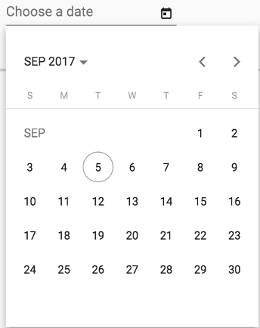

### 17. File Viewer design update and new features

With 1.8.0 release ADF starts building a foundation for a new Viewer Dialog and Viewer Service implementations to back the improved file viewing experience.
In the current release, you can test a basic implementation of the Viewer Dialog component used to view image/text/video/music/pdf files.

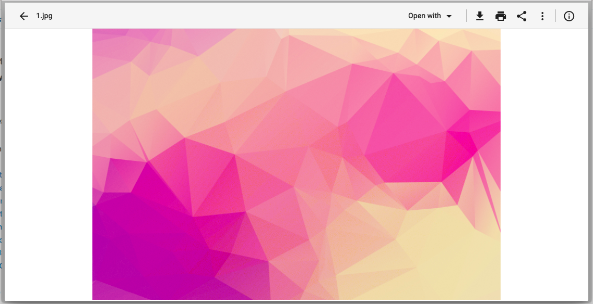

This dialogue does not require extra HTML elements in your templates and can be opened from any place in your code using Viewer Service:

    if (node.isFile) {
      this.viewerService.showViewerForNode(node);
    }

Note that the dialog component and the underlying service are in the early preview and APIs are subject to change in the future releases.

## References

Below you can find a brief list of references to help you start to use the new release.

[Official GitHub Project - alfresco-ng2-components](https://github.com/Alfresco/alfresco-ng2-components)

[Getting started guides with Alfresco Application Development Framework](https://community.alfresco.com/community/application-development-framework/pages/get-started)

[Component catalog](http://devproducts.alfresco.com/)

[Gitter chat supporting Alfresco ADF](https://gitter.im/Alfresco/alfresco-ng2-components)

[ADF examples](https://github.com/Alfresco/adf-examples)

[List of all components](https://github.com/Alfresco/alfresco-ng2-components/tree/master/ng2-components)

[Alfresco-JS-API](https://github.com/Alfresco/alfresco-js-api)

[ADF App Generator ](https://github.com/Alfresco/generator-ng2-alfresco-app)

Please refer to the [official documentation](http://docs.alfresco.com/) for further details and suggestions.

## Issues addressed

Below you can find a detailed list of tickets addressed in the new release. For a better understanding, the list is grouped by topic.

Release Notes - Apps Development Framework - Version 1.8. 

## Documentation

-   \[[ADF-1281](https://issues.alfresco.com/jira/browse/ADF-1281)] - Test naming convention in the contribution guide

## Bug

-   \[[ADF-129](https://issues.alfresco.com/jira/browse/ADF-129)] - Erratic Data Picker - GitHub 1223
-   \[[ADF-224](https://issues.alfresco.com/jira/browse/ADF-224)] - Custom stencil components not getting rendered on a completed task/start form - 1597 Github
-   \[[ADF-662](https://issues.alfresco.com/jira/browse/ADF-662)] - Cannot preview document on completed start event
-   \[[ADF-1048](https://issues.alfresco.com/jira/browse/ADF-1048)] - [Form] Multiple files attached to a task within a form are not displayed
-   \[[ADF-1052](https://issues.alfresco.com/jira/browse/ADF-1052)] - [Process Services] - Left and right menu arrows are not active.
-   \[[ADF-1095](https://issues.alfresco.com/jira/browse/ADF-1095)] - Date Range picker remains on screen.
-   \[[ADF-1096](https://issues.alfresco.com/jira/browse/ADF-1096)] - Process details are not fully displayed on Process Definition Heat Map.
-   \[[ADF-1143](https://issues.alfresco.com/jira/browse/ADF-1143)] - [TaskList] - Not able to start a task when changing the assignee from the 'Start Task' form.
-   \[[ADF-1197](https://issues.alfresco.com/jira/browse/ADF-1197)] - Cannot upload more than one files on a form.
-   \[[ADF-1208](https://issues.alfresco.com/jira/browse/ADF-1208)] - [Safari][favorites api service](../core/favorites-api.service.md) returns invalid dates for "createdAt" and "modifiedAt" fields.
-   \[[ADF-1219](https://issues.alfresco.com/jira/browse/ADF-1219)] - Folder contents are not displayed when double clicking an empty folder in Search Page component
-   \[[ADF-1252](https://issues.alfresco.com/jira/browse/ADF-1252)] - When closing the Process Diagram the Tasks page is displayed
-   \[[ADF-1259](https://issues.alfresco.com/jira/browse/ADF-1259)] - Process Filter - Wrong process filter is selected when a new process is created
-   \[[ADF-1262](https://issues.alfresco.com/jira/browse/ADF-1262)] - Breadcrumb does not shrink when part of the Toolbar header
-   \[[ADF-1265](https://issues.alfresco.com/jira/browse/ADF-1265)] - Task Header - Datapicker is not showed in the middle
-   \[[ADF-1267](https://issues.alfresco.com/jira/browse/ADF-1267)] - [Datatable] csra 508 add tabbing datatable - 2157 Github
-   \[[ADF-1286](https://issues.alfresco.com/jira/browse/ADF-1286)] - getProfilePicture in userApi on alfresco-js-api doesn't return nothing.
-   \[[ADF-1307](https://issues.alfresco.com/jira/browse/ADF-1307)] - Header Bar colour should always be orange.
-   \[[ADF-1313](https://issues.alfresco.com/jira/browse/ADF-1313)] - isLoggedIn method of EcmAuth client is returning "true" when ticket expires - 2178 Github
-   \[[ADF-1316](https://issues.alfresco.com/jira/browse/ADF-1316)] - Can not assign a task to a user without an actual email address
-   \[[ADF-1327](https://issues.alfresco.com/jira/browse/ADF-1327)] - Attach File widget is not displayed.
-   \[[ADF-1328](https://issues.alfresco.com/jira/browse/ADF-1328)] - Multi-line text widget is not displaying a value after completing a form.
-   \[[ADF-1329](https://issues.alfresco.com/jira/browse/ADF-1329)] - "Multi-line text" widget is not rendered properly.
-   \[[ADF-1346](https://issues.alfresco.com/jira/browse/ADF-1346)] - Attachment list component is shown for completed tasks/processes
-   \[[ADF-1348](https://issues.alfresco.com/jira/browse/ADF-1348)] - Upload Dialog - 'Cancel All' button does not render
-   \[[ADF-1360](https://issues.alfresco.com/jira/browse/ADF-1360)] - An error appears in console when clicking on Content Services in Demo Shell
-   \[[ADF-1368](https://issues.alfresco.com/jira/browse/ADF-1368)] - A file deleted from Document List is still displayed as uploaded in Uploader
-   \[[ADF-1370](https://issues.alfresco.com/jira/browse/ADF-1370)] - PDF viewer not using web worker
-   \[[ADF-1384](https://issues.alfresco.com/jira/browse/ADF-1384)] - ADF [`Form`](../../lib/process-services/src/lib/task-list/models/form.model.ts) - The placeholder is overlapping the label
-   \[[ADF-1386](https://issues.alfresco.com/jira/browse/ADF-1386)] - if pagination attribute is undefined shows inconsistent range
-   \[[ADF-1394](https://issues.alfresco.com/jira/browse/ADF-1394)] - Favorites Api not passing the "include" settings to server
-   \[[ADF-1395](https://issues.alfresco.com/jira/browse/ADF-1395)] - The title of the reports is not aligned.
-   \[[ADF-1407](https://issues.alfresco.com/jira/browse/ADF-1407)] - Editing a Report title should be aligned.
-   \[[ADF-1419](https://issues.alfresco.com/jira/browse/ADF-1419)] - Document List does not show node icon for certain nodes
-   \[[ADF-1420](https://issues.alfresco.com/jira/browse/ADF-1420)] - [Copy/Move] A folder selected in 'Destination chooser' dialog does not get deselected when selecting it's parent folder
-   \[[ADF-1425](https://issues.alfresco.com/jira/browse/ADF-1425)] - [Copy/Move]The list of folders is not changed when selecting a site in the 'Destination chooser' dialog
-   \[[ADF-1426](https://issues.alfresco.com/jira/browse/ADF-1426)] - [Copy/Move]The list of folders is not changed when deleting the 'Search' field input in the 'Destination chooser' dialog
-   \[[ADF-1428](https://issues.alfresco.com/jira/browse/ADF-1428)] - User is not able to copy/move a file/folder to the root folder.
-   \[[ADF-1432](https://issues.alfresco.com/jira/browse/ADF-1432)] - Can not create a task
-   \[[ADF-1442](https://issues.alfresco.com/jira/browse/ADF-1442)] - No able to navigate to a task from within a process.
-   \[[ADF-1454](https://issues.alfresco.com/jira/browse/ADF-1454)] - [Login Demo] - Switches on Login Page have wrong behaviour.
-   \[[ADF-1456](https://issues.alfresco.com/jira/browse/ADF-1456)] - timeAgo Pipe - Return invalid date when the input is empty
-   \[[ADF-1458](https://issues.alfresco.com/jira/browse/ADF-1458)] - 'Enable upload' button is not working.
-   \[[ADF-1459](https://issues.alfresco.com/jira/browse/ADF-1459)] - Filter selection is not displayed.
-   \[[ADF-1466](https://issues.alfresco.com/jira/browse/ADF-1466)] - Ng2-activiti-tasklist module uses NO_ERRORS_SCHEMA schema, which hides underlying error
-   \[[ADF-1476](https://issues.alfresco.com/jira/browse/ADF-1476)] - Row borders (top and bottom) overlap each other for DataTable
-   \[[ADF-1478](https://issues.alfresco.com/jira/browse/ADF-1478)] - [`Pagination`](../../lib/content-services/document-list/models/document-library.model.ts) is not properly displayed when resizing the browser window.
-   \[[ADF-1479](https://issues.alfresco.com/jira/browse/ADF-1479)] - [`Pagination`](../../lib/content-services/document-list/models/document-library.model.ts) is not working properly on Document List.
-   \[[ADF-1480](https://issues.alfresco.com/jira/browse/ADF-1480)] - Padding is missing from Task List.
-   \[[ADF-1484](https://issues.alfresco.com/jira/browse/ADF-1484)] - Switching to custom data source won't change default column layout in DL
-   \[[ADF-1485](https://issues.alfresco.com/jira/browse/ADF-1485)] - 'Sorting' options are not visible on the Document List.
-   \[[ADF-1486](https://issues.alfresco.com/jira/browse/ADF-1486)] - [`Pagination`](../../lib/content-services/document-list/models/document-library.model.ts) arrows are not visible on search results.
-   \[[ADF-1487](https://issues.alfresco.com/jira/browse/ADF-1487)] - Checklist placeholder remains on screen.
-   \[[ADF-1489](https://issues.alfresco.com/jira/browse/ADF-1489)] - Cannot rate a file
-   \[[ADF-1490](https://issues.alfresco.com/jira/browse/ADF-1490)] - 'Sorting' options are not visible on the 'About'.
-   \[[ADF-1491](https://issues.alfresco.com/jira/browse/ADF-1491)] - 'Sorting' options are not visible on ['Form](../../lib/process-services/task-list/models/form.model.ts) List'.
-   \[[ADF-1494](https://issues.alfresco.com/jira/browse/ADF-1494)] - Padding and highlighting missing on process list
-   \[[ADF-1495](https://issues.alfresco.com/jira/browse/ADF-1495)] - Task List is not loading.
-   \[[ADF-1497](https://issues.alfresco.com/jira/browse/ADF-1497)] - Image not displayed when folder is empty
-   \[[ADF-1498](https://issues.alfresco.com/jira/browse/ADF-1498)] - [`Pagination`](../../lib/content-services/document-list/models/document-library.model.ts) on Task List is not aligned when having two tasks or more.
-   \[[ADF-1499](https://issues.alfresco.com/jira/browse/ADF-1499)] - Advanced "Date Widget" properties do not apply on Demo Shell.
-   \[[ADF-1500](https://issues.alfresco.com/jira/browse/ADF-1500)] - Dynamic table does not display column names.
-   \[[ADF-1501](https://issues.alfresco.com/jira/browse/ADF-1501)] - Date widget value is not updated when is cleared.
-   \[[ADF-1502](https://issues.alfresco.com/jira/browse/ADF-1502)] - AoT problems when using ADF with Angular CLI
-   \[[ADF-1509](https://issues.alfresco.com/jira/browse/ADF-1509)] - ['Form](../../lib/process-services/task-list/models/form.model.ts) Name' displays 'No form' after editing 'Due Date' or 'Description'.
-   \[[ADF-1510](https://issues.alfresco.com/jira/browse/ADF-1510)] - Report button tooltips are missing translation.
-   \[[ADF-1512](https://issues.alfresco.com/jira/browse/ADF-1512)] - [`Form`](../../lib/process-services/src/lib/task-list/models/form.model.ts) is expanding when required label is displayed.
-   \[[ADF-1513](https://issues.alfresco.com/jira/browse/ADF-1513)] - [`Form`](../../lib/process-services/src/lib/task-list/models/form.model.ts) List doesn't display form Tabs.

## New Feature

-   \[[ADF-365](https://issues.alfresco.com/jira/browse/ADF-365)] - Add support for 'empty form' template - 1736 Github
-   \[[ADF-459](https://issues.alfresco.com/jira/browse/ADF-459)] - [Document List] Ability to copy and move documents and folders
-   \[[ADF-832](https://issues.alfresco.com/jira/browse/ADF-832)] - Migrate to @angular/material date picker component
-   \[[ADF-1021](https://issues.alfresco.com/jira/browse/ADF-1021)] - Provide ability defining tooltips for DataTable/DocumentList cells
-   \[[ADF-1041](https://issues.alfresco.com/jira/browse/ADF-1041)] - Copy and Move Component
-   \[[ADF-1051](https://issues.alfresco.com/jira/browse/ADF-1051)] - DT/DL components should apply i18n pipes for the title content out of the box
-   \[[ADF-1083](https://issues.alfresco.com/jira/browse/ADF-1083)] - The profile picture is not displayed at 'Comments' and 'Involved people' in a task
-   \[[ADF-1213](https://issues.alfresco.com/jira/browse/ADF-1213)] - Provide ability to rename root element name in Breadcrumb
-   \[[ADF-1220](https://issues.alfresco.com/jira/browse/ADF-1220)] - Provide support for additional data sources in Document List
-   \[[ADF-1227](https://issues.alfresco.com/jira/browse/ADF-1227)] - Directive to disable element or component based on node permission
-   \[[ADF-1234](https://issues.alfresco.com/jira/browse/ADF-1234)] - DataTable and DocumentList should not unselect on double-click
-   \[[ADF-1261](https://issues.alfresco.com/jira/browse/ADF-1261)] - Task Audit Log Directive
-   \[[ADF-1287](https://issues.alfresco.com/jira/browse/ADF-1287)] - Fix issues related to noUnusedLocals rule in TypeScript
-   \[[ADF-1300](https://issues.alfresco.com/jira/browse/ADF-1300)] - Download as a ZIP functionality demo (5.2.1 repo)
-   \[[ADF-1318](https://issues.alfresco.com/jira/browse/ADF-1318)] - Create 'time ago' date converter
-   \[[ADF-1356](https://issues.alfresco.com/jira/browse/ADF-1356)] - Single configuration of i18n service per project
-   \[[ADF-1372](https://issues.alfresco.com/jira/browse/ADF-1372)] - Provide support for custom tooltips for [Upload Button component](../content-services/components/upload-button.component.md)
-   \[[ADF-1404](https://issues.alfresco.com/jira/browse/ADF-1404)] - Data Column enhancements for Document List
-   \[[ADF-1421](https://issues.alfresco.com/jira/browse/ADF-1421)] - Provide default column layout for Document List
-   \[[ADF-1427](https://issues.alfresco.com/jira/browse/ADF-1427)] - Show custom root in the breadcrumb even if node is not loaded
-   \[[ADF-1434](https://issues.alfresco.com/jira/browse/ADF-1434)] - Theming ADF component
-   \[[ADF-1435](https://issues.alfresco.com/jira/browse/ADF-1435)] - Info Drawer

## Task

-   \[[ADF-1188](https://issues.alfresco.com/jira/browse/ADF-1188)] - Upload drag drop component - Add a property to disable the component
-   \[[ADF-1306](https://issues.alfresco.com/jira/browse/ADF-1306)] - Process [Task Audit Directive](../process-services/directives/task-audit.directive.md)
-   \[[ADF-1309](https://issues.alfresco.com/jira/browse/ADF-1309)] - [`Pagination`](../../lib/content-services/document-list/models/document-library.model.ts) of task list
-   \[[ADF-714](https://issues.alfresco.com/jira/browse/ADF-714)] - Unify pagination across all components
-   \[[ADF-1116](https://issues.alfresco.com/jira/browse/ADF-1116)] - Task list without any status filter
-   \[[ADF-1139](https://issues.alfresco.com/jira/browse/ADF-1139)] - People Search - Provide a way to reset the search field when a user is selected
-   \[[ADF-852](https://issues.alfresco.com/jira/browse/ADF-852)] - [Form] Update [`Form`](../../lib/process-services/src/lib/task-list/models/form.model.ts) widget to Material library
-   \[[ADF-520](https://issues.alfresco.com/jira/browse/ADF-520)] - remove the debug button from [Analytics Component](../insights/components/analytics.component.md)
-   \[[ADF-157](https://issues.alfresco.com/jira/browse/ADF-157)] - upload dialog Wrong number on File Upload Count - 1511 Github
-   \[[ADF-569](https://issues.alfresco.com/jira/browse/ADF-569)] - Provide support to Undo uploaded files in the Upload component
-   \[[ADF-720](https://issues.alfresco.com/jira/browse/ADF-720)] - Review all the template use
-   \[[ADF-994](https://issues.alfresco.com/jira/browse/ADF-994)] - [Pagination] Integrate SFS enhancements for [`Pagination`](../../lib/content-services/document-list/models/document-library.model.ts) component
-   \[[ADF-1180](https://issues.alfresco.com/jira/browse/ADF-1180)] - Add test cases to cover process list component
-   \[[ADF-1236](https://issues.alfresco.com/jira/browse/ADF-1236)] - Remove mdl from ng2-alfresco-login
-   \[[ADF-1237](https://issues.alfresco.com/jira/browse/ADF-1237)] - Remove mdl from ng2-alfresco-userinfo
-   \[[ADF-1239](https://issues.alfresco.com/jira/browse/ADF-1239)] - Remove mdl from ng2-alfresco-social
-   \[[ADF-1240](https://issues.alfresco.com/jira/browse/ADF-1240)] - Remove mdl from ng2-alfresco-tag
-   \[[ADF-1241](https://issues.alfresco.com/jira/browse/ADF-1241)] - Remove mdl from ng2-alfresco-upload
-   \[[ADF-1242](https://issues.alfresco.com/jira/browse/ADF-1242)] - Remove mdl from ng2-alfresco-viewer
-   \[[ADF-1243](https://issues.alfresco.com/jira/browse/ADF-1243)] - Remove mdl from ng2-alfresco-documentlist
-   \[[ADF-1244](https://issues.alfresco.com/jira/browse/ADF-1244)] - Remove mdl from ng2-alfresco-datatable
-   \[[ADF-1270](https://issues.alfresco.com/jira/browse/ADF-1270)] - Upgrade ACS to 5.2.1
-   \[[ADF-1340](https://issues.alfresco.com/jira/browse/ADF-1340)] - File Viewer dialog preparation
-   \[[ADF-1374](https://issues.alfresco.com/jira/browse/ADF-1374)] - Move Download Zip dialog to the ADF
-   \[[ADF-1378](https://issues.alfresco.com/jira/browse/ADF-1378)] - Remove old MDL toolbar from the Document List
-   \[[ADF-1381](https://issues.alfresco.com/jira/browse/ADF-1381)] - Implement form control UX
-   \[[ADF-1388](https://issues.alfresco.com/jira/browse/ADF-1388)] - Add a toggle button for the allowDropFiles property to Demo Shell
-   \[[ADF-1403](https://issues.alfresco.com/jira/browse/ADF-1403)] - Upload Dialog - Trigger event for deleted files
-   \[[ADF-1437](https://issues.alfresco.com/jira/browse/ADF-1437)] - Update project generator 1.8. 
-   \[[ADF-1453](https://issues.alfresco.com/jira/browse/ADF-1453)] - Restructure README.md files
-   \[[ADF-1457](https://issues.alfresco.com/jira/browse/ADF-1457)] - Upload Dialog - Cancel all confirmation dialog
-   \[[ADF-1468](https://issues.alfresco.com/jira/browse/ADF-1468)] - Upload Dialog - Remove color import

Please refer to [the Alfresco issue tracker](https://issues.alfresco.com/jira/projects/ADF/issues/ADF-581?filter=allopenissues) for other known issues in this release. If you have more questions, please reply here or contact us using [gitter](https://gitter.im/Alfresco/alfresco-ng2-components).
