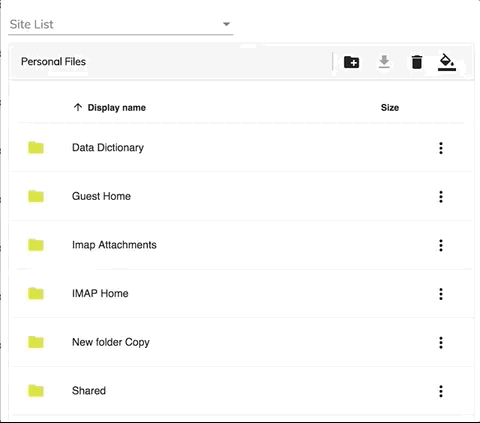
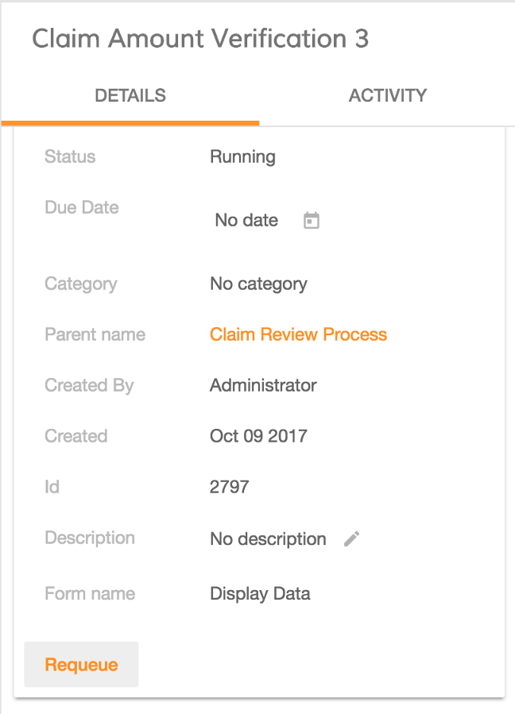
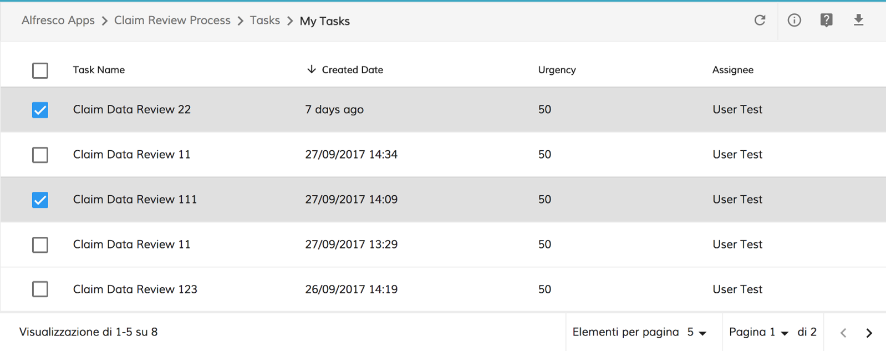
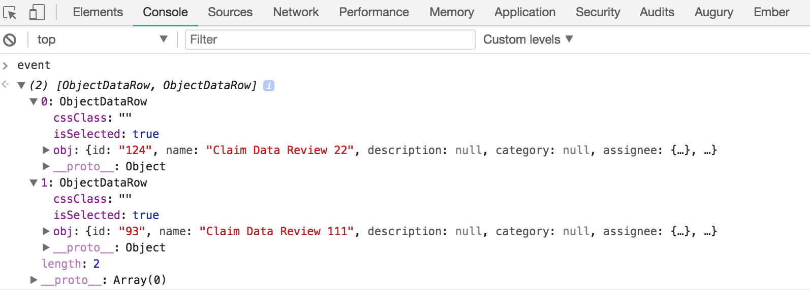

# Alfresco Application Development Framework, version 1.9.0 Release Note

These release notes provide information for the **1.9.0 release** of Alfresco Application Development Framework.

This is the next **Limited Available** release of Application Development Framework, containing the Angular components to build a Web Application on top of the Alfresco Services.
The release can be found on GitHub at [this link.](https://github.com/Alfresco/alfresco-ng2-components/releases/tag/1.7.0)

## Contents

-   [Goals for this release](#goals-for-this-release)
-   [Notable new features](#notable-new-features)
    -   [1.Infinite scrolling](#1infinite-scrolling)
    -   [2.Requeue option added to adf-task-header](#2requeue-option-added-to-adf-task-header)
    -   [3.Tasklist multi-selection support](#3tasklist-multi-selection-support)
    -   [4.Page Title Service](#4page-title-service)
    -   [5.Viewer Enhancements](#5viewer-enhancements)
    -   [6.Document List Presets](#6document-list-presets)
    -   [7.Login redirect options](#7login-redirect-options)
    -   [8.Logout directive](#8logout-directive)
    -   [9.Breadcrumb enhancements](#9breadcrumb-enhancements)
    -   [10.Documentation](#10documentation)
-   [References](#references)
-   [Issues addressed](#issues-addressed)
    -   [Documentation](#documentation)
-   [Feature](#feature)
-   [Bug](#bug)
-   [New Feature](#new-feature)
-   [Task](#task)
-   [Feature (Task)](#feature-task)

## Goals for this release

In the ADF 1.9 release we've enhanced a number of components, such as Document List, Viewer and Breadcrumbs. We continue the effort to migrate to @angular/material, only a few more components remain until we are fully switched to Angular Material Design. Again in this release we have enhanced the accessibility and we have started to consolidate, streamline and enhance our documentation. Before everything was inside the individual README.md files, this has now been pulled out into a [separate directory](https://github.com/Alfresco/alfresco-ng2-components/tree/master/docs), and a new [Doc Index](https://github.com/Alfresco/alfresco-ng2-components/blob/master/docs/README.md) to help navigate it.

This is the last LA release, we are targeting ADF 2.0 by the end of November at which point it will become **General Available** and **fully supported** by Alfresco. As part of this effort we have increased the efforts on resolving bugs and stabilisation.

This release builds on last month's contains bug fixes and the new features. See the list below for major details.

Please report issues with this release in the [issue tracker](https://github.com/Alfresco/alfresco-ng2-components/issues). You can collaborate on this release or share feedback by using the discussion tools on [gitter](https://gitter.im/Alfresco/alfresco-ng2-components).

## Notable new features

Below the most relevant features of this release:

-   Infinite scrolling
-   Requeue option added to adf-task-header
-   Tasklist now support multi-select
-   [Page title service](../core/services/page-title.service.md)
-   Viewer enhancements
-   Document List presets
-   Login redirect options
-   [Logout directive](../core/directives/logout.directive.md)
-   Breadcrumb enhancements
-   Documentation

### 1.Infinite scrolling

The document list now provides two different way to paginate the results the normal pagination or the infinite scrolling.
In order to enable this feature, you need to specify the paginationStrategy properties 'Infinite'. The infinite scrolling is also now used as default in the object picker component

### 2.Requeue option added to adf-task-header

The requeue feature has been added into the ADF 1.9.0. This means that after a task has been claimed by the user, the user will see a button Requeue to un-claim the task.

### 3.Tasklist multi-selection support

With the latest code, the tasklist component exposes the **multiselect** property. If the value is true a checkbox is rendered at the beginning of each row. In this way, the user can select more than one row.

    <adf-tasklist
        [multiselect]="true"
        [appId]="'1'"
        [state]="'open'"
        [assignment]="'assignee'">
    </adf-tasklist>

### 

This is the result:

The component also provides a new event **rowSelected** that contains all the selected rows:

    <adf-tasklist
        [appId]="'1'"
        [state]="'open'"
        [assignment]="'assignee'"
        (rowsSelected)="console.log($event)">
    </adf-tasklist>

### 4.Page Title Service

The 1.9.0 version features a new service ["PageTitleService"](../core/services/page-title.service.md) in the "ng2-alfresco-core" package. This service allows changing the title of the page (browser tab) on demand from the code. The format of the title is always "&lt;Application Name> - &lt;Title>" where "&lt;Application Name>" is taken from the application configuration file:

    {
      "application": {
        "name": "Alfresco ADF Appplication"
      }
    }

### 5.Viewer Enhancements

[Viewer component](../core/components/viewer.component.md) has been updated with improved UI and support for integration with Angular Router.
The major features and improvements are:

-   New [toolbar component](../core/components/toolbar.component.md) for all Viewer types
-   Automatic PDF rendition fetching for various content types (".docx", ".pptx", etc.)
-   Floating action toolbar for the PDF viewer

### 6.Document List Presets

It is now possible to store layouts for Document List in the global application configuration file ("app.config.json") for default mode or special aliases like "-trashcan-", "-favorites-", etc. The DocumentList component automatically falls back to the defaults if no customizations are present.

    {
        ...,

        "document-list": {
            "supportedPageSizes": [5, 10, 15, 20],
            "presets": {
                "-trashcan-": [
                    {
                        "key": "$thumbnail",
                        "type": "image",
                        "srTitle": "ADF-DOCUMENT-LIST.LAYOUT.THUMBNAIL",
                        "sortable": false
                    },
                    {
                        "key": "name",
                        "type": "text",
                        "title": "ADF-DOCUMENT-LIST.LAYOUT.NAME",
                        "cssClass": "full-width ellipsis-cell",
                        "sortable": true
                    },
                    {
                        "key": "path",
                        "type": "location",
                        "title": "ADF-DOCUMENT-LIST.LAYOUT.LOCATION",
                        "format": "/files",
                        "sortable": true
                    },
                    {
                        "key": "content.sizeInBytes",
                        "type": "fileSize",
                        "title": "ADF-DOCUMENT-LIST.LAYOUT.SIZE",
                        "sortable": true
                    },
                    {
                        "key": "archivedAt",
                        "type": "date",
                        "title": "ADF-DOCUMENT-LIST.LAYOUT.DELETED_ON",
                        "format": "timeAgo",
                        "sortable": true
                    },
                    {
                        "key": "archivedByUser.displayName",
                        "type": "text",
                        "title": "ADF-DOCUMENT-LIST.LAYOUT.DELETED_BY",
                        "sortable": true
                    }
                ],

                "default": [
                    ...
                ]
            }
        }
    }

### 7.Login redirect options

The [Login component](../core/components/login.component.md) provides a new **successRoute** property as a way to automatically redirect the user to the particular application route upon successful sign in.

    <adf-login successRoute="/dashboard" ...></adf-login>

### 8.Logout directive

You can turn any clickable HTML element or other Angular Component into a Logout feature. ADF provides a new **adf-logout** directive to help you building application menus or toolbar buttons that sign the user out:

    <button adf-logout>Log out</button>

### 9.Breadcrumb enhancements

The [Breadcrumb component](../content-services/components/breadcrumb.component.md) exposes a new **rootId** property to allow you restricting the root element to a particular node. Component automatically trims the elements if full node path needs to be cut. You can use this together with the **root** property that allows renaming the root (first) element of the path.

    <adf-breadcrumb root="Personal Files" rootId="<GUID>" ...></adf-breadcrumb>

### 10.Documentation

All the documentation was inside the individual README.md files of any components, this has now been pulled out into a separate directory, and a new [Doc Index](https://github.com/Alfresco/alfresco-ng2-components/blob/master/docs/README.md) to help navigate it.

## References

Below you can find a brief list of references to help you start to use the new release.

[Official GitHub Project - alfresco-ng2-components](https://github.com/Alfresco/alfresco-ng2-components)

[Getting started guides with Alfresco Application Development Framework](https://community.alfresco.com/community/application-development-framework/pages/get-started)

[Component catalog](http://devproducts.alfresco.com/)

[Gitter chat supporting Alfresco ADF](https://gitter.im/Alfresco/alfresco-ng2-components)

[ADF examples](https://github.com/Alfresco/adf-examples)

[List of all components](https://github.com/Alfresco/alfresco-ng2-components/tree/master/ng2-components)

[Alfresco-JS-API](https://github.com/Alfresco/alfresco-js-api)

[ADF App Generator ](https://github.com/Alfresco/generator-ng2-alfresco-app)

Please refer to the [official documentation](http://docs.alfresco.com/) for further details and suggestions.

## Issues addressed

Below you can find a detailed list of tickets addressed in the new release. For a better understanding, the list is grouped by topic.

Release Notes - Apps Development Framework - Version 1.9. 

### Documentation

-   \[[ADF-1603](https://issues.alfresco.com/jira/browse/ADF-1603)] - remove all the reference to deprecated `<template>` from the documentation

## Feature

-   \[[ADF-226](https://issues.alfresco.com/jira/browse/ADF-226)] - No 'Requeue' option after claiming a task. - 1599 Github
-   \[[ADF-1531](https://issues.alfresco.com/jira/browse/ADF-1531)] - Enhance document list breadcrumb with an input option to provide custom root id.
-   \[[ADF-1574](https://issues.alfresco.com/jira/browse/ADF-1574)] - Info Drawer - Add a mechanism to know the current active tab
-   \[[ADF-1609](https://issues.alfresco.com/jira/browse/ADF-1609)] - Tasklist - Provide a Multi selection property
-   \[[ADF-1622](https://issues.alfresco.com/jira/browse/ADF-1622)] - Provide ability for components to change browser page title.
-   \[[ADF-1623](https://issues.alfresco.com/jira/browse/ADF-1623)] - Integration of Viewer with Router
-   \[[ADF-1632](https://issues.alfresco.com/jira/browse/ADF-1632)] - Task Header - Parent name default value should be None

## Bug

-   \[[ADF-1012](https://issues.alfresco.com/jira/browse/ADF-1012)] - The checklist delete button of a completed task is displayed
-   \[[ADF-1259](https://issues.alfresco.com/jira/browse/ADF-1259)] - Process Filter - Wrong process filter is selected when a new process is created
-   \[[ADF-1291](https://issues.alfresco.com/jira/browse/ADF-1291)] - [Attachment list] after upload list is not instantly refreshed
-   \[[ADF-1338](https://issues.alfresco.com/jira/browse/ADF-1338)] - Document list should automatically be refreshed after undoing/cancelling a file upload.
-   \[[ADF-1364](https://issues.alfresco.com/jira/browse/ADF-1364)] - The pagination is not properly displayed when moving a file or folder
-   \[[ADF-1444](https://issues.alfresco.com/jira/browse/ADF-1444)] - File name is not fully displayed.
-   \[[ADF-1455](https://issues.alfresco.com/jira/browse/ADF-1455)] - When an app has a long name, is displayed under the logo.
-   \[[ADF-1467](https://issues.alfresco.com/jira/browse/ADF-1467)] - ADF components custom theming
-   \[[ADF-1478](https://issues.alfresco.com/jira/browse/ADF-1478)] - [`Pagination`](../../lib/content-services/document-list/models/document-library.model.ts) is not properly displayed when resizing the browser window.
-   \[[ADF-1479](https://issues.alfresco.com/jira/browse/ADF-1479)] - [`Pagination`](../../lib/content-services/document-list/models/document-library.model.ts) is not working properly on Document List.
-   \[[ADF-1488](https://issues.alfresco.com/jira/browse/ADF-1488)] - Document List does not reset selection on "node" change
-   \[[ADF-1493](https://issues.alfresco.com/jira/browse/ADF-1493)] - Cannot tab in menu option within file/folder
-   \[[ADF-1503](https://issues.alfresco.com/jira/browse/ADF-1503)] - Completed process and task displays, can still upload content
-   \[[ADF-1506](https://issues.alfresco.com/jira/browse/ADF-1506)] - Upon node deletion the toast message shows guid
-   \[[ADF-1516](https://issues.alfresco.com/jira/browse/ADF-1516)] - Date widget is swapping days with months.
-   \[[ADF-1520](https://issues.alfresco.com/jira/browse/ADF-1520)] - Advanced date widget doesn't display the correct date.
-   \[[ADF-1521](https://issues.alfresco.com/jira/browse/ADF-1521)] - Display value fields configured with process variables are not rendered in ADF 1.8. 
-   \[[ADF-1523](https://issues.alfresco.com/jira/browse/ADF-1523)] - APS task form remains disabled when no custom outcome is provided in ADF 1.8. 
-   \[[ADF-1525](https://issues.alfresco.com/jira/browse/ADF-1525)] - In APS forms, hyperlink fields are not rendered when configured with process variables
-   \[[ADF-1526](https://issues.alfresco.com/jira/browse/ADF-1526)] - The [form component](../core/components/form.component.md) is not responsive in ADF 1.8. 
-   \[[ADF-1528](https://issues.alfresco.com/jira/browse/ADF-1528)] - [`Form`](../../lib/process-services/src/lib/task-list/models/form.model.ts) renderer does not display generated documents - github 2303
-   \[[ADF-1529](https://issues.alfresco.com/jira/browse/ADF-1529)] - Broken styles for toolbar buttons.
-   \[[ADF-1530](https://issues.alfresco.com/jira/browse/ADF-1530)] - [Viewer] Extension viewer doens't work anymore
-   \[[ADF-1533](https://issues.alfresco.com/jira/browse/ADF-1533)] - Multi-line form field contains a bug where red required warnings are shown incorrectly
-   \[[ADF-1535](https://issues.alfresco.com/jira/browse/ADF-1535)] - Wrong StatusEnum implementation for Rendition
-   \[[ADF-1537](https://issues.alfresco.com/jira/browse/ADF-1537)] - People widget needs to check null for native element onAfterViewInit
-   \[[ADF-1538](https://issues.alfresco.com/jira/browse/ADF-1538)] - PDF viewer causes memory/cpu issues with scroll events
-   \[[ADF-1545](https://issues.alfresco.com/jira/browse/ADF-1545)] - Supported page sizes are hardcoded for Document List pagination
-   \[[ADF-1547](https://issues.alfresco.com/jira/browse/ADF-1547)] - Column tooltips are not translated for DataTable/DocumentList
-   \[[ADF-1553](https://issues.alfresco.com/jira/browse/ADF-1553)] - [Demo shell] Scroll present in small and x-small devices
-   \[[ADF-1554](https://issues.alfresco.com/jira/browse/ADF-1554)] - People widget with visibility conditions is not displayed on a complete start event.
-   \[[ADF-1555](https://issues.alfresco.com/jira/browse/ADF-1555)] - Search popup always stays on the screen
-   \[[ADF-1557](https://issues.alfresco.com/jira/browse/ADF-1557)] - Search does not collapse if its input is focused
-   \[[ADF-1559](https://issues.alfresco.com/jira/browse/ADF-1559)] - People control is referencing the rest api instead of enterprise for pictures
-   \[[ADF-1560](https://issues.alfresco.com/jira/browse/ADF-1560)] - Process fields are not translated when starting a process and on process page
-   \[[ADF-1561](https://issues.alfresco.com/jira/browse/ADF-1561)] - When clicking on 'Active Tasks' on Process it redirects always to the first task from 'My Tasks' list
-   \[[ADF-1562](https://issues.alfresco.com/jira/browse/ADF-1562)] - Report list is not aligned.
-   \[[ADF-1565](https://issues.alfresco.com/jira/browse/ADF-1565)] - Not able to delete/copy/move a file or a folder in Document List
-   \[[ADF-1568](https://issues.alfresco.com/jira/browse/ADF-1568)] - IE 11 problems with upload and downloading
-   \[[ADF-1569](https://issues.alfresco.com/jira/browse/ADF-1569)] - [Activiti Form] People widget doesn't' render all the users image
-   \[[ADF-1570](https://issues.alfresco.com/jira/browse/ADF-1570)] - [Start task] Date component is not aligned
-   \[[ADF-1573](https://issues.alfresco.com/jira/browse/ADF-1573)] - Not able to remove a user from the "Involved People".
-   \[[ADF-1577](https://issues.alfresco.com/jira/browse/ADF-1577)] - 'No process details found.' message is displayed after cancelling a process
-   \[[ADF-1580](https://issues.alfresco.com/jira/browse/ADF-1580)] - Widgets do not display values on a start event.
-   \[[ADF-1581](https://issues.alfresco.com/jira/browse/ADF-1581)] - Settings login are update also when press the back button
-   \[[ADF-1582](https://issues.alfresco.com/jira/browse/ADF-1582)] - Error/Required widget tooltips are not aligned.
-   \[[ADF-1583](https://issues.alfresco.com/jira/browse/ADF-1583)] - Expression has changed after it was checked
-   \[[ADF-1585](https://issues.alfresco.com/jira/browse/ADF-1585)] - [Document list/Data table] hover color style is not theme compatible
-   \[[ADF-1590](https://issues.alfresco.com/jira/browse/ADF-1590)] - Cursor pointer is not displayed on expand/collapse Task and Process Filters.
-   \[[ADF-1594](https://issues.alfresco.com/jira/browse/ADF-1594)] - Date widget does not display value on a complete start event.
-   \[[ADF-1595](https://issues.alfresco.com/jira/browse/ADF-1595)] - Typeahead does not display value on a complete start event.
-   \[[ADF-1597](https://issues.alfresco.com/jira/browse/ADF-1597)] - Dropdown does not display the value in readonly mode
-   \[[ADF-1598](https://issues.alfresco.com/jira/browse/ADF-1598)] - 508 Fixes comments
-   \[[ADF-1610](https://issues.alfresco.com/jira/browse/ADF-1610)] - [Task List] doesn't allow keyboard enter to select a task- 508 Issue
-   \[[ADF-1611](https://issues.alfresco.com/jira/browse/ADF-1611)] - Toolbar doesn't react to the resizing
-   \[[ADF-1615](https://issues.alfresco.com/jira/browse/ADF-1615)] - Datatable - The ellipsis class doesn't work for a custom template
-   \[[ADF-1617](https://issues.alfresco.com/jira/browse/ADF-1617)] - The bottom part of any input box text is cut off
-   \[[ADF-1618](https://issues.alfresco.com/jira/browse/ADF-1618)] - Default login dialog has problem displaying validation message
-   \[[ADF-1621](https://issues.alfresco.com/jira/browse/ADF-1621)] - ECM Auth Guard does not always redirect to login
-   \[[ADF-1624](https://issues.alfresco.com/jira/browse/ADF-1624)] - Typeahead displays the list number of the name.
-   \[[ADF-1625](https://issues.alfresco.com/jira/browse/ADF-1625)] - Typeahead widget is not aligned
-   \[[ADF-1626](https://issues.alfresco.com/jira/browse/ADF-1626)] - [Task List] User should press TAB twice to navigate through the tasks
-   \[[ADF-1627](https://issues.alfresco.com/jira/browse/ADF-1627)] - [Process List] doesn't allow keyboard enter to select a process
-   \[[ADF-1628](https://issues.alfresco.com/jira/browse/ADF-1628)] - Content from a page is still selected when navigating to a different page when 'Multiple' Selection Mode is selected
-   \[[ADF-1629](https://issues.alfresco.com/jira/browse/ADF-1629)] - Console throws error if visibility conditions refer to a following widget.
-   \[[ADF-1630](https://issues.alfresco.com/jira/browse/ADF-1630)] - Folder name should be abbreviated in the breadcrumb when path is too long
-   \[[ADF-1631](https://issues.alfresco.com/jira/browse/ADF-1631)] - The bottom part of Search Bar text is cut off
-   \[[ADF-1636](https://issues.alfresco.com/jira/browse/ADF-1636)] - Translation override file is not overriding translation labels
-   \[[ADF-1637](https://issues.alfresco.com/jira/browse/ADF-1637)] - [Pagination] Select Page Dropdown is not working
-   \[[ADF-1638](https://issues.alfresco.com/jira/browse/ADF-1638)] - Console displays error after completing a task.
-   \[[ADF-1640](https://issues.alfresco.com/jira/browse/ADF-1640)] - Start form is blank after a complete process.
-   \[[ADF-1642](https://issues.alfresco.com/jira/browse/ADF-1642)] - [Login component] error message change the size of the component
-   \[[ADF-1643](https://issues.alfresco.com/jira/browse/ADF-1643)] - [Checklist] add checklist produce a consolo error
-   \[[ADF-1644](https://issues.alfresco.com/jira/browse/ADF-1644)] - Search Icon is not properly displayed
-   \[[ADF-1646](https://issues.alfresco.com/jira/browse/ADF-1646)] - [Settings] prefix icon is not aligned
-   \[[ADF-1651](https://issues.alfresco.com/jira/browse/ADF-1651)] - Site List drop down from [Document List component](../content-services/components/document-list.component.md) does not display all sites
-   \[[ADF-1653](https://issues.alfresco.com/jira/browse/ADF-1653)] - Suggestion list on people widget is still displayed after deleting all letters inside the input
-   \[[ADF-1654](https://issues.alfresco.com/jira/browse/ADF-1654)] - Cannot add a checklist within a task.
-   \[[ADF-1662](https://issues.alfresco.com/jira/browse/ADF-1662)] - [User info] name is not centered
-   \[[ADF-1664](https://issues.alfresco.com/jira/browse/ADF-1664)] - [Login component] icon show password dark theme
-   \[[ADF-1666](https://issues.alfresco.com/jira/browse/ADF-1666)] - Comments can not be added to completed tasks and processes
-   \[[ADF-1667](https://issues.alfresco.com/jira/browse/ADF-1667)] - [`Form`](../../lib/process-services/src/lib/task-list/models/form.model.ts) component displays 'Nameless Task'
-   \[[ADF-1668](https://issues.alfresco.com/jira/browse/ADF-1668)] - The task or process details are not loaded when double clicked
-   \[[ADF-1669](https://issues.alfresco.com/jira/browse/ADF-1669)] - Attach File widget doesn't display file after complete.
-   \[[ADF-1671](https://issues.alfresco.com/jira/browse/ADF-1671)] - Widgets don't display value if they have visibility conditions related to multiline text widget.
-   \[[ADF-1674](https://issues.alfresco.com/jira/browse/ADF-1674)] - [Form Component] Ammount prefix should be aligned
-   \[[ADF-1675](https://issues.alfresco.com/jira/browse/ADF-1675)] - Cannot view a file on a complete start event.
-   \[[ADF-1677](https://issues.alfresco.com/jira/browse/ADF-1677)] - [`Pagination`](../../lib/content-services/document-list/models/document-library.model.ts) is not working properly on 'Sites' Custom Sources page
-   \[[ADF-1685](https://issues.alfresco.com/jira/browse/ADF-1685)] - Sometimes the task list is not loading after logout
-   \[[ADF-1687](https://issues.alfresco.com/jira/browse/ADF-1687)] - Profile picture icon is not displayed anymore on process comments after refreshing the page

## New Feature

-   \[[ADF-1090](https://issues.alfresco.com/jira/browse/ADF-1090)] - Expand access to validation of the DynamicTableWidget - 2082 Github
-   \[[ADF-1477](https://issues.alfresco.com/jira/browse/ADF-1477)] - Automatic i18n support for breadcrumb root element
-   \[[ADF-1522](https://issues.alfresco.com/jira/browse/ADF-1522)] - Load Document List presets from the app.config file
-   \[[ADF-1524](https://issues.alfresco.com/jira/browse/ADF-1524)] - Provide support for route to redirect on successful Login
-   \[[ADF-1613](https://issues.alfresco.com/jira/browse/ADF-1613)] - [Logout directive](../core/directives/logout.directive.md)

## Task

-   \[[ADF-160](https://issues.alfresco.com/jira/browse/ADF-160)] - Change actual dialog with the Angular/Material 2 - 1514 Github
-   \[[ADF-1238](https://issues.alfresco.com/jira/browse/ADF-1238)] - Remove mdl from ng2-alfresco-search
-   \[[ADF-1246](https://issues.alfresco.com/jira/browse/ADF-1246)] - Remove mdl from ng2-activiti-tasklist
-   \[[ADF-1247](https://issues.alfresco.com/jira/browse/ADF-1247)] - Remove mdl from ng2-activiti-processlist
-   \[[ADF-1249](https://issues.alfresco.com/jira/browse/ADF-1249)] - Remove mdl from ng2-activiti-diagrams
-   \[[ADF-1250](https://issues.alfresco.com/jira/browse/ADF-1250)] - Remove mdl from ng2-activiti-analytics
-   \[[ADF-1251](https://issues.alfresco.com/jira/browse/ADF-1251)] - Remove mdl from demo shell
-   \[[ADF-1492](https://issues.alfresco.com/jira/browse/ADF-1492)] - Document List - Export [`ContentNodeSelectorComponent`](../content-services/components/content-node-selector.component.md) and [`ContentNodeSelectorComponentData`](../../lib/content-services/content-node-selector/content-node-selector.component-data.interface.ts)
-   \[[ADF-1496](https://issues.alfresco.com/jira/browse/ADF-1496)] - Remove "Disable upload button when user has no permissions" switch.
-   \[[ADF-1504](https://issues.alfresco.com/jira/browse/ADF-1504)] - Rename UserInfoComponentModule to [`UserInfoModule`](lib/core/src/lib/userinfo/userinfo.module.ts)
-   \[[ADF-1515](https://issues.alfresco.com/jira/browse/ADF-1515)] - Internationalization - ADF strings review
-   \[[ADF-1517](https://issues.alfresco.com/jira/browse/ADF-1517)] - Prebuilt theme
-   \[[ADF-1518](https://issues.alfresco.com/jira/browse/ADF-1518)] - Update material 2 to beta 10
-   \[[ADF-1539](https://issues.alfresco.com/jira/browse/ADF-1539)] - DW should use adf-info-draw component
-   \[[ADF-1543](https://issues.alfresco.com/jira/browse/ADF-1543)] - Use Muli font embedded in the "index.html" page
-   \[[ADF-1548](https://issues.alfresco.com/jira/browse/ADF-1548)] - Remove "forRoot" functions from all the component modules
-   \[[ADF-1584](https://issues.alfresco.com/jira/browse/ADF-1584)] - Userinfo component change text color
-   \[[ADF-1608](https://issues.alfresco.com/jira/browse/ADF-1608)] - Start [`Form`](../../lib/process-services/src/lib/task-list/models/form.model.ts) - Improve the unit test cases
-   \[[ADF-1634](https://issues.alfresco.com/jira/browse/ADF-1634)] - Action toolbar for PDF viewer
-   \[[ADF-1676](https://issues.alfresco.com/jira/browse/ADF-1676)] - Switch off all fake buttons in the Viewer

## Feature (Task)

-   \[[ADF-1534](https://issues.alfresco.com/jira/browse/ADF-1534)] - Automatic PDF rendition loading for Viewer Dialog
-   \[[ADF-1542](https://issues.alfresco.com/jira/browse/ADF-1542)] - Toggle all toolbar elements in the Viewer Dialog from code

Please refer to [the Alfresco issue tracker](https://issues.alfresco.com/jira/projects/ADF/issues/ADF-581?filter=allopenissues) for other known issues in this release. If you have more questions, please reply here or contact us using [gitter](https://gitter.im/Alfresco/alfresco-ng2-components).
